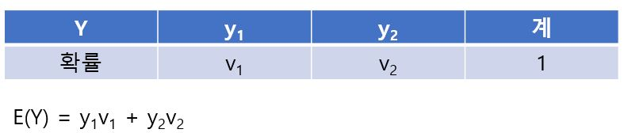
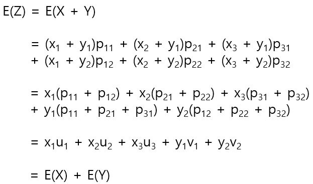

# 합의 기댓값

복수의 확률 변수가 있을때 그것의 합의 기댓값(평균)은 다음과 같이 계산할 수 있다. 예를 들어서 x1, x2, x3라는 값을 갖는 확률변수 X와 y1, y2라는 값을 갖는 확률 변수 Y가 있다고 가정한다. 이 X, Y에 대해서 Z = X+Y라고 정의되는 새로운 확률변수 Z를 정의할 때 확률 분포는 다음과 같다. 

여러 확률 분포를 하나의 표로 정리한 것을 확률 변수 X와 Y의 동시분포라고 한다. X = x1이 되는 것은 X = x1, Y = y1인 경우와 X = x1, Y = y2인 경우가 있다. 이 두 경우는 상호배반이라고 생각할 수 있으므로 X = x1이 되는 확률을 u1이라고 하면 u1 = p11 + p12이다. 마찬가지로 Y = y1이 되는 확률 v1이라고 하면 v1 = p11 + p21 + p31이다. 이상을 일반화 하면 다음과 같다.

X와 Y의 확률 분포를 각각 따로 나타내면 다음과 같다.

확률 변수 Z의 기댓값을 구하면 다음과 같다. 

이상을 일반화 하면 다음과 같다.

