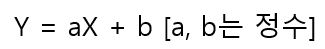
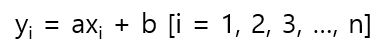
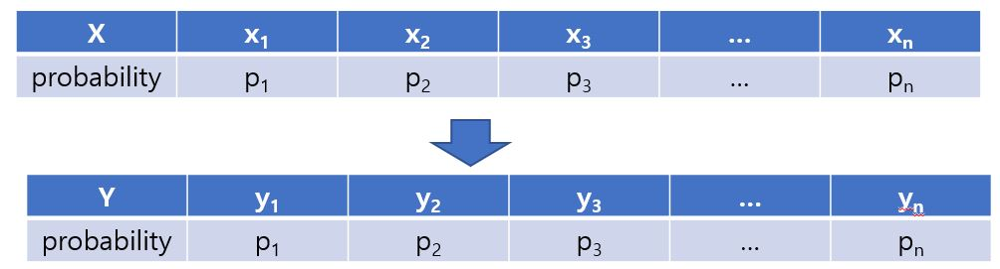
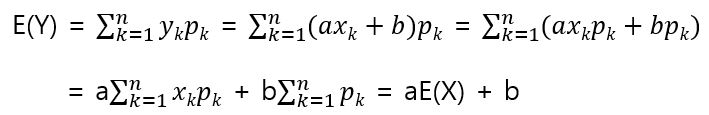
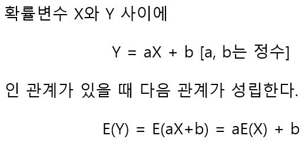
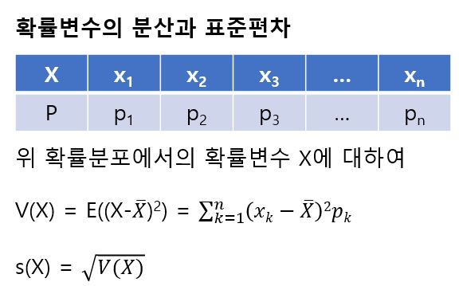
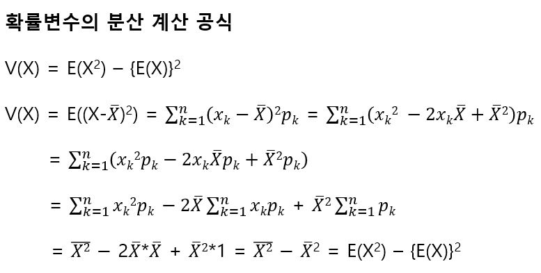

# aX + b의 기댓값

확률변수 X에 대해 X를 a배(정수배)하고 거기에 b(정수)를 더한 새로운 확률변수 Y를 가정한다.

이 새로운 확률변수의 값은 아래와 같이 X = xi일때, Y = yi의 값을 가진다.

X가 xi를 가질 확률이 p1이므로 Y가 y1의 값을 가질 확률도 p1이다. 즉 확률변수 Y의 확률분포는 다음과 같다. 

이와 같이 분포하는 확률변수 Y의 기댓값을 구해보면 다음과 같다.

확률변수 X의 분산과 표준편차는 다음과 같다.

쉬운 계산을 위한 공식은 다음과 같다.

확률변수의 분산이나 표준편차는 확률변수가 갖는 값의 불규칙함을 나타내는 것인데 확률변수가 갖는 값의 불규칙함이 무슨 의미인지 생각해볼 수 있다. 왜냐하면 관측될 값을 알고 있는 데이터와 달리 확률 변수는 값이 확정되어 있지 않기 때문이다. 확률변수의 표준편차나 분산이 크다는 것은 불규칙함이 크다는 것이고 이것은 기댓값에서 벗어난 값이 나올 가능성이 있다는 의미이다. 