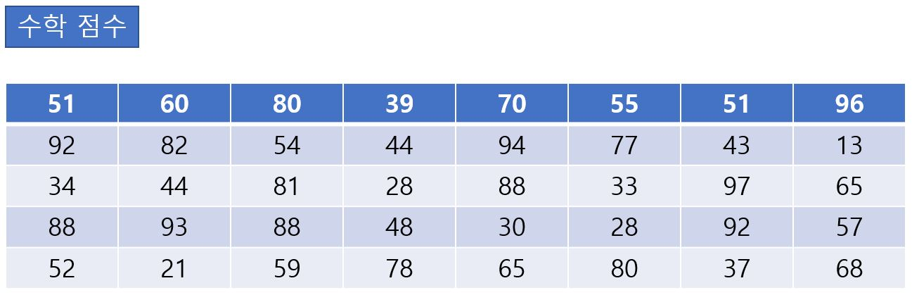
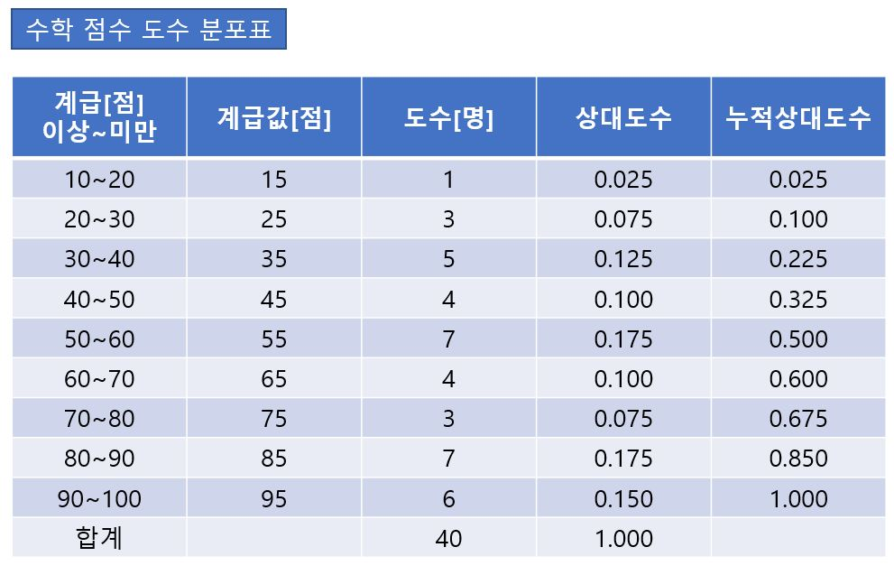
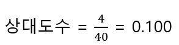

# 도수분포표

- **계급** : 데이터를 몇 개의 동등한 폭으로 나눈 구간
- **계급값** : 각 계급의 중앙값
- **도수** : 각각의 계급에 들어가는 데이터의 수
- **상대도수** : 도수의 합계에 대한 각 계급 도수의 비율
- **누적상대도수** : 그 계급 이하의 상대도수의 합계

도수 분포표란 **각 계급마다 도수, 상대도수, 누적상대도수 등을 정리한 표** 이다. 

예를 들어 다음과 같은 어떤 집단의 수학 점수를 모은 표가 있다고 한다.

이 표를 도수분포표로 만들기 위해서 가장 먼저 해야할 일은 계급의 폭을 정하는 것이다. 계급의 폭이 너무 좁으면 표가 복잡해지고 반대로 너무 넓으면 데이터의 경향을 알기 힘드므로 주의해야 한다.

[계급폭의 결정(JIS: Z9041-1)] (JIS - 일본 산업 규격)

최솟값과 최댓값을 포함해 5-20에서 똑같은 간격으로 나눠지도록 구간의 폭을 정한다. 즉 계급폭은 R(범위)을 1, 2, 5(또는 10, 20, 50; 0.1, 0.2, 05 등) 등으로 나눴을 때 그 값이 5-20 사이에 있는 것을 선택하면 된다. 만일 둘 이상이라면 샘플 크기가 100 이상인 경우에는 폭이 작은 것을, 99 이하인 경우에는 폭이 큰 것을 이용한다.

- 계급의 폭은 1, 2, 5, 10, 20, 50 등에서 자르기 좋은 값 선택.
- 계급 수가 5~20 의 범위 내에 있게 함.
- 계급의 종류가 너무 많거나 너무 적거나 하지 않게 함.

수학 점수의 예에서는 R(범위): 97-13 = 84이며, 84/1 = 84, 84/2 = 42, 84/5 = 16.8, 84/10 = 8.4, 84/20 = 4.2이므로 몫이 5~20이 되는 것은 5나 10으로 나누었을 때이다. 샘플의 크기는 40이므로 이것은 99이하에서 계급의 폭이 큰 쪽인 10을 선택하는 것이 JIS 규격에 적합하다.

도수분포표를 볼 때 주의점

1. **도수분포표에서는 각 데이터의 구체적인 값은 알 수 없다.** 예를 들어 40이상 ~ 50미만인 데이터는 43, 44, 44, 48의 4개인데 도수분포표상에서는 이들 모두를 계급값 45로 생각하낟. 계급값이 그 계급을 대표한다.

2. 상대도수는 도수의 합계에 대한 각 계급 도수의 비율이다.

   

   40이상~50미만의 경우, 다음과 같다.

   

3. **주목하는 계급 이하(이상)가 전체의 몇 % 이하(이상)가 되는지를 알고 싶을 때는 누적 도수를 본다.** 

   10 이상~60 미만인 누적도수는 0.025 + 0.075 + 0.125 + 0.100 + 0.175 = 0.500, 50%이다. 
