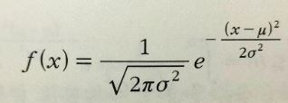
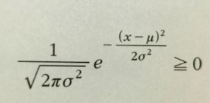
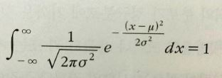
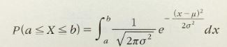
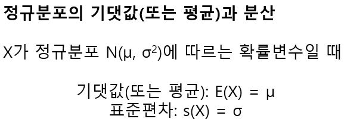
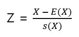
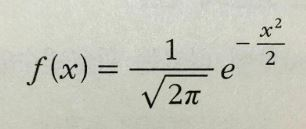
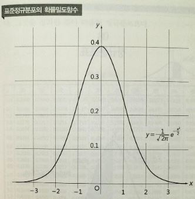

# 정규분포

확률밀도함수 중에서 가장 많이 등장하고 중요한 것이 정규분포(Normal distribution)의 확률 밀도함수다.  오차를 수반하는 현상에 관한 데이터는 정규분포로 잘 표현할 수 있는 경우가 많기 때문이다. 정규분포의 확률밀도함수를 나타내는 수식은 다음과 같다.

위의 식이 확률밀도함수가 될 수 있는지를  판단하기 위해서는 다음의 두 가지 성질을 만족해야 한다.

| 언제나 f(x) >= 0                                     | f(x)와 x축으로 둘러싸인 면적의 합이 1                |
| ---------------------------------------------------- | ---------------------------------------------------- |
|  |  |

위의 두 성질을 증명하는 부분은 어려우므로 생략한다. 

일반적으로 확률변수 X가 정규분포의 확률밀도함수로 확률밀도함수를 가질 때,

X의 평균은 μ, 분산은 σ^2가 된다. 이때 X는 평균이 μ, 분산이 σ^2인 정규분포에 따른다고 한다. 

확률변수 X에서 평균을 빼고 표준편차로 나누면 평균은 반드시 0, 표준편차는 반드시 1이 된다. 

평균이 0, 표준편차가 1인 정규분포 N(0, 1)을 표준정규분포라고 한다.

표준정규분포 N(0, 1)의 확률밀도함수는 평균이 0, 표준편차가 1이므로 확률밀도함수가 다음과 같다.

그래프로 그리면 다음과 같다.

