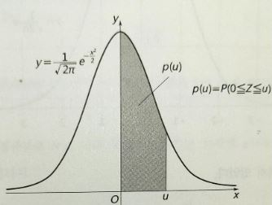
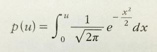
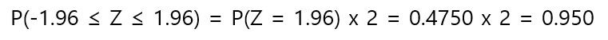
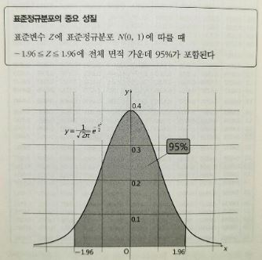

# 정규분포표

표준정규분포에 있어서 위의 회색 면적 부분을 P(u)라고 하면 P(u)를 구하기 위해서저는 원칙적으로 다음과 같은 적분 계산을 해야만 한다.

번거로움을 피하기 위해서 다양한 u에 대해서 정적분의 결과가 이미 계산되어 있는데 그것을 정리한 것이 정규분포표이다.

[정규분포표](https://blog.naver.com/ekdldhrtlsda/221766546299)

정규분포표 결과 가운데 중요한 점은 표준정규분포가 y축에 대칭임을 이용하여 얻어지는 다음과 같은 결과이다.

이것은 다음과 같이 말할 수 있다.

