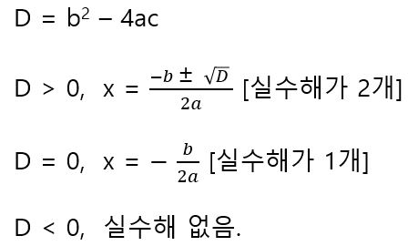
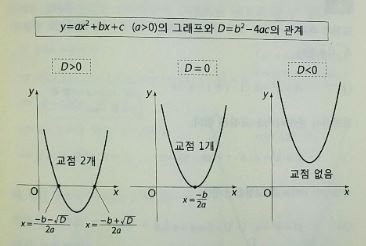

# 그래프와 판별식의 관계

y = ax^2+bx+c(a>0)에 있어서 y_min > 0이라는 것은 y = ax^2+bx+c의 그래프가 항상 x축 위쪽에 있다는 것이다. 즉 b^2 - 4ac < 0는 그래프가 x축과 교점을 갖지 않기 위한 조건이기도 하다. 한편 근의 공식에서 b^2 - 4ac는 √ 안에 들어가는 내용이다. √의 정의에 의하면 √안의 식이 0보다 작다는 것은 제곱해서 음수가 된다는 뜻인데 그런 수는 실수(Real number)의 범위에는 없다. 즉, 근의 공식에 의해 b^2 - 4ac < 0의 해는 실수에는 존재하지 않는다. 이는 곧 ax^2+bx+c = 0이 실수해를 갖지 않기 위한 조건임을 알 수 있다.  ax^2+bx+c = 0이 실수해를 갖지 않는다는것은 y = ax^2 + bx + c이 x축과 교점을 갖지 않는다는 것과 같은 뜻이 된다. D = b^2 - 4ac라고 하면 다음과 같은 것을 알 수 있다.

2차 방정식 실수해의 개수(2차 함수의 그래프와 x축과의 교점의 개수)를 판별할 수 있으므로 D를 판별식(Discriminant)라고 부른다. 그래프와 판별식의 관계는 다음과 같다.

