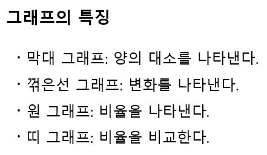
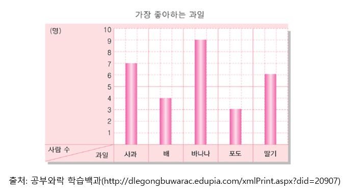
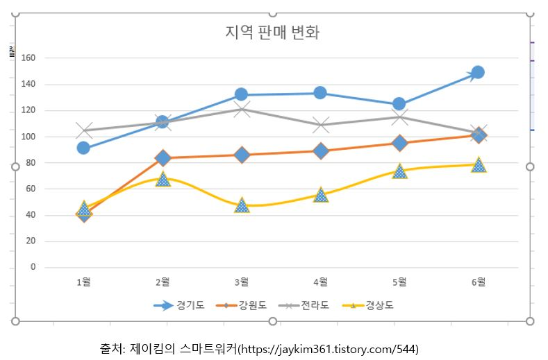
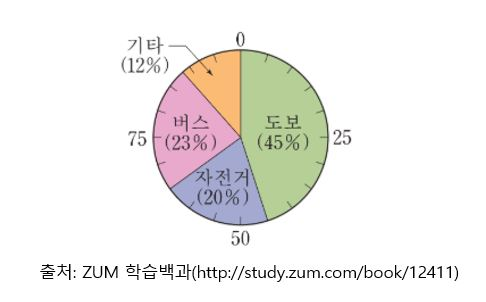
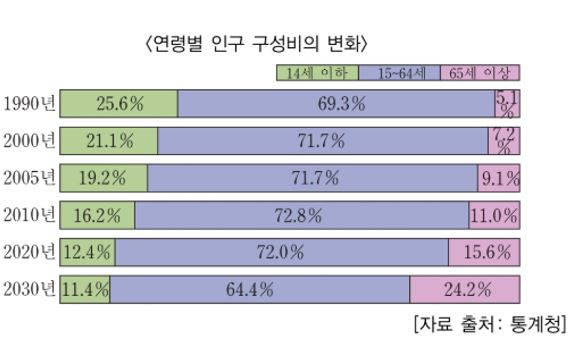

# 여러 가지 그래프

(A) 막대 그래프 - 대소를 나타낸다

막대 그래프는 **양의 대소를 비교하는 데 적합하다.**

위 그래프를 보면 어떤 집단의 구성원이 제일 선호하는 과일은 바나나임을 알 수 있다. 

(B) 꺾은선 그래프 - 변화를 나타낸다.

꺾은선 그래프는 **변화를 나타내는 데 적합하다.**

위 그래프를 보면 경기도의 지역 판매량이 5월에서 6월 상대적으로 크게 상승 했음을 알 수 있다. 꺾은 선 그래프를 볼 때 주의해야 할 점은 **변화의 정도에 대한 이미지를 그래프 작성자가 (어느 정도) 조작이 가능하다는 점이다.** 같은 그래프를 세로축 값의 폭을 크게 하면 변화의 정도가 작게 느껴진다. 반대로 작게 하면 변화의 정도가 크게 느껴진다.

(C) 원 그래프 - 비율을 나타낸다. 

원 그래프는 전체 중에서 **각각의 항목이 어느 정도 비율을 차지하는지 나타내기에 적합하다.**

위 그래프를 보면 어느 집단의 통학 수단으로 도보의 비율이 제일 큼을 알 수 있다. 원 그래프는 보통 **비율의 크기를 순서대로 배열하는 경우와 비슷한 내용을 연달아 놓는 경우가 있다.**

(D) 띠 그래프 - 비율을 비교한다.

띠 그래프는 연도나 조건에 의해 같은 항목의 **비율이 어떻게 변화했는 지를 비교하는 데 적합하다.**

위 그래프를 보면 연도가 지날수록 14세 이하 인구의 비율은 줄어들고 65세 이상의 인구의 비율을 점점 늘어남을 확인할 수 있다. 단, 띠 그래프로 비율이 감소(또는 증가)하고 있다고 해서 반드시 절대수 자체가 감소(또는 증가)하고 있지는 않다는 점에 주의한다. **비율의 증감만으로 절대수의 증감을 판단할 수 없다.**
