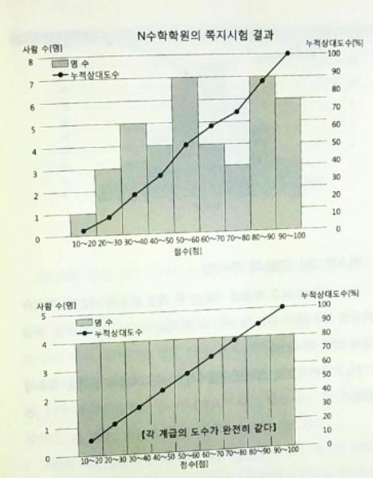
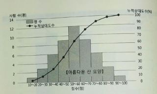

# 히스토그램

데이터 전체를 보다 직감적으로 나타내기 위해 **히스토그램**이라는 그래프를 사용한다. 히스토그램은 도수 분포표의 **계급을 가로축으로, 도수를 세로축으로 한 막대 그래프(기둥 모양 그래프)** 를 말한다.

위에서 **꺾은선 그래프는 누적상대도수** 를 나타낸다.  위쪽 그래프에서 50이상-60미만과 80이상-90미만이 많이 튀어나와 있음을 확인할 수 있다. 아래쪽 그래프와 같이 **도수가 완전히 같은 경우는 꺾은선 그래프는 직선** 이 된다. 

히스토그램이 **정규 분포와 비슷한 모양을 따를 때는 꺾은선 그래프가 S자형** 이 된다. 

히스토그램을 그릴 때 주의 점은 처음과 마지막 계급의 이웃은 한 계급 분만큼 띄어서 계급의 최솟값과 최댓값을 확실하게 한다는 것이 있고 일반적으로 세로 막대의 간격을 띄우지 않는다는 점이 있다. 
