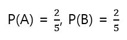

# 독립시행

5개의 제비뽑기 중에 2개의 당첨제비가 있다고 가정한다. 두 사람이 순서대로 제비를 한 장씩 뽑을 때 다음과 같이 2가지 경우가 있을 수 있다.

첫 번쨰 경우처럼 시행 S와 T에서 한 쪽의 시행 결과가 다른 쪽의 시행 결과와 관계가 없을 때 S와 T는 독립 시행이라고 한다. 일반적으로 시행 S, T가 독립일 때 S로 사건 A가 일어나거나 T로 사건 B가 일어날 확률 A와 B의 합집합의 확률은 다음과 같다. 

앞의 제비뽑기 예에서 시행 S에서 먼저 사람이 당첨된다는 사건을 A, 시행 T에서 뒤의 사람이 당첨된다는 사건을 B라고 하면 5개 중 당첨제비는 2개이므로 다음이 성립한다.

A와 B 사건이 동시에 일어나는 사건의 확률은 다음과 같다. 먼저 사람이 제비를 뽑는 경우와 뒤의 사람이 제비를 뽑는 경우를 행렬로 나타내어 그 중에서 두 사람 모두 당첨 제비를 뽑는 사건의 영역은 전체 5 x 5 = 25 중에서 4칸이 되므로 4/25가 된다. 이는 확실하게 P(A) * P(B)와 일치 한다. 

