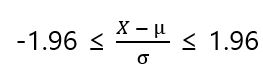

# 추론통계

추론통계는 표본을 조사하여 모집단의 특성을 확률론적으로 예상하는 추정과 얻어진 데이터의 차가 오차인지 또는 어떤 의미가 있는 차인지를 검증하는 검정을 2개의 축으로 한다.

보통 어떤 실험에 사용되는 측정 기구에는 측정 오차가 있다. 그래서 측정 기구에는 정밀도를 나타내는 의미로 평균값(진짜 값)의 주변에 측정값이 어느 정도나 흩어져 있는지를 나타내는 표준편차가 적혀 있다.

예를 들어서 표준편차=100g이라고 적힌 체중계에서 72.0kg의 몸무게 값이 나왔을 때 진짜 체중을 95% 신뢰할 수 있는 정밀도(신뢰수준 95%)로 추정해볼 수 있다. 72.0kg라고 몸무게 값이 나온 사람이 여러 번 체중계에 올라가 샘플(표본)을 모은다고 하면 그 샘플 데이터는 진짜 체중의 주변에 거의 정규분포를 하는 것으로 알려져 있다. 즉, 진짜 체중은 여러 번 관측을 되풀이해 얻어지는 정규분포의 평균과 대개 일치한다. 

진짜체중 ≒ 여러번 관측을 되풀이 했을 때의 평균값은 하나이며, 정수이고 이를 μ라고 한다. X = 72.0kg이라는 측정값이 μ에서 얼마나 떨어져 있는가, 즉 X에서 얼머나 떨어진 곳에 μ가 있는지를 추정하는 것이 목표이다. 먼저 데이터를 다음과 같이 표준정규분포하는 데이터로 변형한다(표준편차=100g=0.1kg).  

일반적으로 표준정규분포에 따르는 Z는 95%의 확률로 -19.6-1.96 사이의 값을 갖는다. 

즉 표준편차가 100g인 체중계에서 72.0kg이라고 표시된 경우 진짜 체중(진짜 값)은 신뢰수준 95%에 71.804kg 이상 72.196kg 이하 범위의 어떤 값이다. 

위에서 구한 71.804이상 72.196이하의 범위를 통계에서는 95% 신뢰구간(Confidence interval)이라고 한다.   

위의 문장의 뜻은 모집단으로부터 매회 같은 수의 데이터를 랜덤하게 관측하고 동일한 방식으로 신뢰구간 만드는 일을 반복한다면, 100회 중 95회 정도는 a 이상 b 이하의 범위에 μ가 들어갈 수 있다는 뜻이다. 

통계의 응용에서는 보통 95%의 확률로 일어나는 범위에 있는 사건은 충분히 일어날 수 있는 일, 그 이외의 것은 이상이라고 보는 일이 많다.

95%의 확률로 일어날 수 있는 범위의 사건을 충분히 일어날 수 있는 일로 판단하는 검정은 유의수준 5%의 검정이라고 한다. 모집단이 표준편차 σ의 정규분포인 것을 아록 있을 때 모집단에 대해 진짜 평균은 μ다라는 가설을 세우고 유의수준 5%의 검정을 행하기로 하면 관측된 데이터 X에 대해

의 부등식이 성립하므로 가설은 기각되지 않는다라고 하며, 반대로 이 부등식이 성립하지 않을 때에는 가설은 기각된다라고 한다. 