# 적분

적분(Integration)은 잘게 나눈 것을 정리하여 쌓는다(합친다)란 뜻이다. 

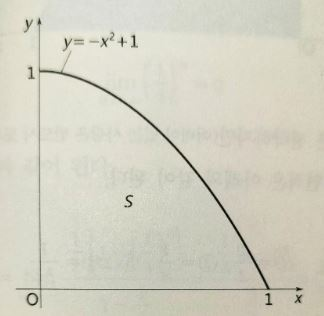

아르키메데스는 위 그림과 같은 포물선과 직선으로 둘러싸인 도형의 면적을 구하기 위해 포물선의 내부를 삼각형으로 메꿔가는 것을 생각한다(이런 생각법을 토막내기-실진법, Method of Exhaustion라고 한다).

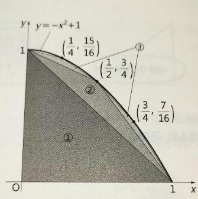

이때 삼각형의 넓이는 첫 항이 1/2, 공비가 1/4인 무한한 등비수열의 합이다. 

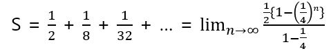

이때 다음이 성립하므로 

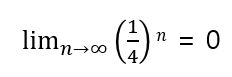

다음과 같이 된다.

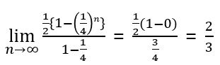

포물선이라는 곡선으로 둘러싸인 도형의 면적을 작은 삼각형의 면적을 무한히 더해감으로써 구하는 것이다.

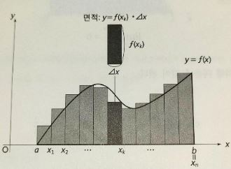

위와 같은 y = f(x)[a <= x <= b]의 그래프가 있다고 가정한다. 이 함수의 면적을 구하는 방법은 x = a에서 x = b까지를 n개의 직사각형으로 모두 메꾸는 것이다. 직사각형의 가로축은 모두 Δx라고 한다(Δ(델타)는 차이의 difference의 머리글자 d에 해당하는 그리스 문자다. 수학이나 물리에서는 유한의 차를 나타낼 때도 사용된다). 왼쪽에서 k번째 직사각형의 면적을 구하면 이 직사각형의 길이는 f(x_k)가 된다. 따라서 k번째 직사각형의 면적은 다음과 같다. 

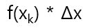

구하고자 하는 면적은 n개의 직사각형 면적의 합과 거의 같으므로 다음과 같이 쓸 수 있다.

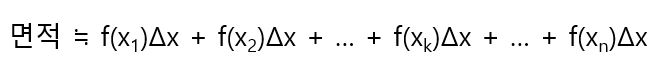

이는 시그마 기호를 사용하여 다음과 같이 정리할 수 있다.

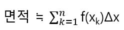

단 이것으로 아직 오차가 있다. 오차를 가능한 작게 하려면 n을 크게 해야 한다.

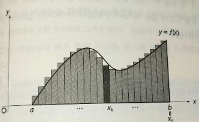

n을 한없이 크게 하면 직사각형 면적의 합은 정확한 토지의 면적에 한없이 가까워진다.

매번 위의 식을 쓰는 것이 번거롭기 때문에 아래와 같은 ∫(Integral) 기호를 쓴다.

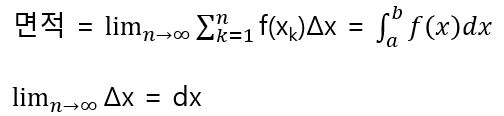

위에서 a는 첫번째 직사각형의 왼쪽 아래의 값, 즉 면적을 구하고 싶은 도형의 왼쪽 끝의 값을 나타내고 b는 n번째 직사각형의 오른쪽 아래의 값, 즉 면적을 구하고 싶은 도형의 오른쪽 끝의 값을 나타낸다. 위 기호를 발명한 것은 미적분의 아버지라고 불리는 라이프니츠(G. W. Leibnize, 1646-1716)이다. 

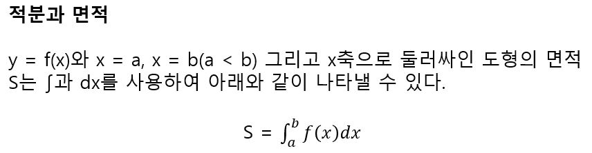