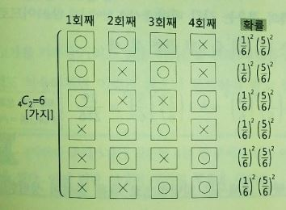
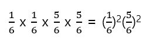
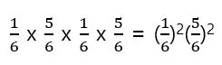
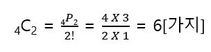
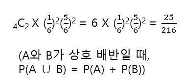
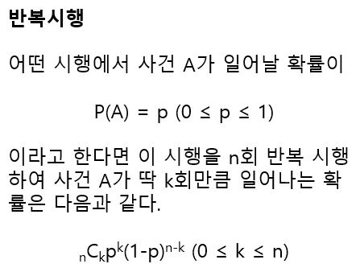
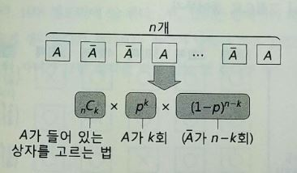

# 반복시행

주사위를 4번 연속 던지는 경우를 가정했을 때, 1의 눈이 두 번 나올 확률은 얼마나 될지를 생각해볼 수 있다. 주사위를 여러 번 던지는 경우, 각 시행은 다른 시행에 영향을 주지 않으므로 독립이다. 이와 같이 독립된 시행의 반복을 반복시행 또는 독립중복시행이라고 한다. 다음은 주사위를 4번 던졌을 때 1의 눈이 두 번 나오는 경우이다.

예를 들어서 1회째와 2회째가 o이고 나머지가 x인 경우의 확률을 구하면 다음과 같다(각각은 독립시행). 

반대로 2회째와 4회째가 o인 경우는 다음과 같다. 

결국 똑같은 결과가 나온다. 다른 경우도 마찬가지이다. 4회 가운데 o가 2회인 경우는 4개의 네모에서 o가 들어가는 네모를 선택하는 경우의 수라고 생각해볼 수 있다. 

6개의 경우는 각각 배반(동시에 일어나지 않음)이므로 구해야 할 확률은 (1/6)^2(5/6)^2을 6번 곱한 것과 같다.

반복 시행에 대해서는 일반적으로 다음 공식이 성립한다.

이를 그림으로 나타내면 다음과 같다. 여기서 A_hat은 사건 A가일어나지 않는 것을 나타낸다.

