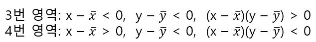
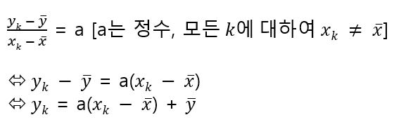

# 상관계수의 직관적 이해

상관 계수 r이 1이나 -1에 가까울 때 강한 상관관계가 있다고 말할 수 있는 이유는 직관적으로 이해한다.

위 그림에서 점 A는 x, y 값 모두 평균을 웃돌고 있으므로 

가 성립하게 되어 양수끼리의 곱셉으로 양수 값이 된다. A-C의 세 점에 대해서는 동일하다. D는 x값은 평균을 밑돌고 y 값은 평균을 웃돌고 있으므로 

가 성립하게 되어 음수와 양수의 곱셉으로 음수값이 된다. 위 그림에서 3번과 4번 영역은 각각 아래와 같다.

이들 합계 8개의 점에 대해서 (x-x_hat)(y-y_hat)의 합을 생각하면 양수 포인트가 많으므로 합도 양수 값이 될 것으로 예상할 수 있다. 이때 공분산 C_xy는 1번이나 3번 영역에 데이터가 많이 분포하면(양의 상관 관계가 있는) 양수 값이 되고 2번이나 4번 영역에 데이터가 많이 분포하면(음의 상관 관계가 있는) 음수 값이 된다. 1번-4번 영역에 골고루 분포할 경우 양수 값과 음수 값이 서로 상쇄되어 0에 가까운 값이 된다.  

공분산은 평균과 각 데이터의 점이 만드는 직사각형의 부호가 붙은 면적의 평균이라고 생각할 수 있다. 예를 들어 (x, y)가 1의 영역에 있을 때 (x - x_hat)(y - y_hat)은 다음 그림의 직사각형 면적이다. 

(x, y)가 2의 영역에 있을 때는 (x - x_hat)(y - y_hat)는 음수 값이 되는데 음수인 면적이라는 것을 인정한다면  (x - x_hat)(y - y_hat)는 직사각형 면적의 음수 값을 나타낸다고 해석할 수 있다. 결국 n개 (x, y)에 대해 (x - x_hat)(y - y_hat)를 더해서 그것을 n으로 나눈 수인 공분산 C_xy는 부호가 붙은 면적의 평균이라고 생각할 수 있다. 상관계수 r의 정의식은 다음과 같은데 

표준편차 S_x, S_y는 (x - x_hat)^2이나 (y - y_hat)^2을 순차적으로 더한 것을 n으로 나누어 루트를 씌운 것이므로 음수가 될일이 없는 수이다. 한편 공분산 C_xy도 (x - x_hat)과 (y_hat)의 곱을 더한 것을 n으로 나눈수이므로 음수 또는 양수가 될 수 있다. r의 분모는 항상 양수이므로 분자의 공분산 C_xy의 절대값이 커지면 r의 절대값도 커질 것임을 예상할 수 있다. 

이 3가지 산포도에서는 모두 각 점에서 x축이나 y축으로 내린 수선의 발의 위치가 달라지지 않는다. 즉, 이들 3개의 산포도에서 x와 y의 분포 사아태는 같다(S_x, S_y 일정). 하지만 산포도는 전혀 다르다. 이것으로 S_x, S_y 일정하더라도 공분산 C_xy만이 커지거나 작아질수 있음을 확인할 수 있다. 

상관 계수 r은 -1 ≤ r ≤ 1를 만족한다. 산포도에서 강한 양의 상관관계가 있을 경우 1번과 3번 영역에 데이터가 집중적으로 분포되어 있고 C_xy의 양수 값이 커져 r은 최댓값인 1에 가까워진다. 산포도에서 강한 음의 상관관계가 있을 경우 2번과 4번 영역에 데이터가 집중적으로 분포되어 있고 C_xy의 음수 값이 커져 r은 최솟값인 -1에 가까워진다. 상관 관계가 거의 없는 경우 데이터가 1번-4번에 골고루 분포되어 있고 C_xy가 0에 가까운 값이 되어 r도 0에 가까운 값이 된다. 

상관계수 부등식  -1 ≤ r ≤ 1에서 등호(=)가 성립하는 때는 다음을 만족할 때이다. 

이를 문자 k(k = 1, 2, 3, ..., n)으로 나타내면 다음과 같다. 

이는 다음의 n개의 점이 모두 위의 함수로 나타내여진 그래프 상에 있음을 나타낸다.

위에서 도출된 함수를 그래프로 나타내면 기울기가 a에서 점(x_hat, y_hat)을 통과하는 직선이다. 즉 상관계수 r이 최댓값인 1이나 최솟값인 -1이 되는 것은 산포도에서 모든 데이터가 점 (x_hat, y_hat)을 통과하는 직선상에 있을 때라는 것을 알 수 있다. 

