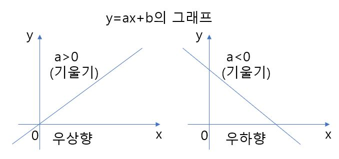

# 1차함수

y가 x의 1차함수일 때 일반적으로 다음과 같이 나타낸다.

아래쪽 함수를 보면 y가 x에 비례할 때의 관계식이고 그래프를 그렸을 때, 원점을 통과하는 직선일 것임은 자명하다.

일반적으로 y=ax일 떄 그래프가 원점을 통과하는 직선이 되는 것은 다음과 같이 나타낼 수 있다.

y1/x1의 값이 일정하다는 것은 와 y=ax의 임의의 점(x1, y1)과 원점을 연결한 직선의 기울기가 일정하다는 의미와 같다. 이것은 y=ax위의 임의의 점 (x, y)는 우너점을 통과하는 하나의 직선상에 있다는 것이다. 

y=ax+b의 그래프는 y=ax의 그래프에 b를 덧붙인 것이므로 그래프도 y=ax의 그래프를 y방향으로 +b만큼 평행이동한 것이 된다.

일반적으로 1차함수의 양의 기울기와 음의 기울기, 그래프에 대해 다음과 같이 정리할 수 있다.

1차함수의 기울기와 통과하는 한 점을 알고 있는 경우의 그래프 식을 구하는 법은 다음과 같다.

