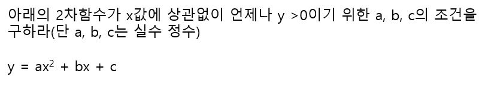
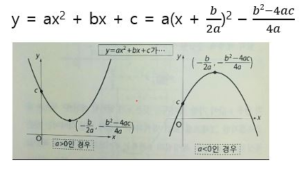
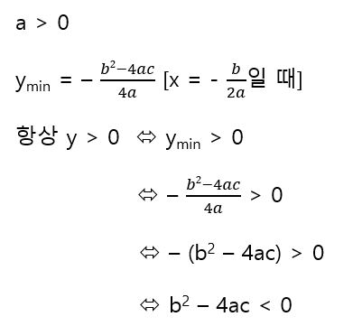

# 2차함수의 최댓값과 최솟값

x값에 상관없이 항상 y > 0이란 함수의 최솟값이 양수라는 말과 같다. 최솟값을 알기 위해 그래프를 그리려면 먼저 완전 제곱을 해야한다. 이떄 그래프는 a가 양수냐 음수냐에 따라 방향이 달라진다.

a < 0인 경우는 항상 y > 0가 불가능하므로 적어도 a > 0일 때 최솟값은 그래프에 의해 다음과 같다.

이상에서 구하는 조건은 b^2-4ac < 0이다. 최댓값은 a < 0인 경우에서 유도한다.

