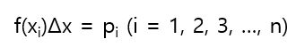

# 연속형 확률변수의 평균과 분산

얻을 수 있는 값의 범위가 α ≤ X ≤ β인 확률변수 X의 확률밀도함수 f(x)의 그래프는 다음 그림과 같다.

다음으로 y=f(x)와 x=α, x=β 그리고 x축으로 둘러싸인 면적을 다음과 같이 n개의 직사각형으로 자르는 것을 생각한다. 직사각형 윗변의 중점이 y = f(x)상에 있다고 가정한다. 그리고 왼쪽부터 k번째 직사각형의 왼쪽 아래가 a에, 오른쪽 아래가 b에 일치했다고 가정한다. 여기서 Δx는 충분히 작다. 즉 a, b는 충분히 가깝다.

이렇게 하면 다음이 성립한다.

즉, f(xi)Δx는 확률 P(a ≤ X ≤ b)의 근사값을 나타낸다고 생각할 수 있다. 그 근사값을 pi라고 쓰기로 한다면

따라서 다음과 같이 나타낼 수 있다.

이는 바꿔 말하면 pi는 y = f(x)의 그래프가 계단 모양 그래프와 근사한 경우, X가 a 이상 b 이하의 값을 가질 확률이라는 뜻이다.

다음으로 Δx가 충분히 작으므로 a ≤ X ≤ b를 만족하는 X의 값을 xi로 나타내기로 하고 새롭게 다음 표와 같은 이산형 확률변수 X'를 만들기로 한다.

X'는 이산형 확률변수이므로 기댓값(평균)은 다음과 같다.

X'는 연속형 확률변수 X가 이산형에 근사한 것이라는 해석을 허용하면 E(X')를 연속형 확률변수 X의 기댓값E(X)의 근사값이라고 생각할 수 있다. Δx가 작아지면 작아질수록 위에서의 계단형 그래프는 y=f(x)의 그래프에 가까워지므로 E(X')와 E(X)의 오차는 작아진다. 즉, Δx가 끝없이 0에 가까워질 때 E(X'), V(X')는 연속형 확률 변수 X의 E(X), V(X)에 한없이 가까워진다.

