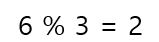
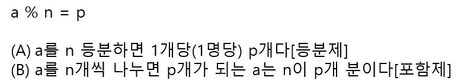

# 나눗셈의 2가지 의미

다음을 그림으로 나타내면 보통 두 가지 답을 떠올리게 된다.

(A) 나눗셈의 의미1: 전체를 똑같이 나눈다.

이 계산의 의미는 6개의 물건을 3등분하면 1명당 2개가 된다는 뜻이다. 이렇게 전체를 똑같이 나누는 나눗셈을 **등분제(等分除)** 라고 한다. 나눗셈을 곱셉의 역계산으로 취급한다면 (A)의 생각은 (1명당) x 3 = 6에서 (1명당)을 구하는 계산이라고 할 수 있다.

(B) 나눗셈의 의미2: 전체를 같은 수만큼씩 나눈다.

이때의 의미는 6개인 것을 3개씩 나누면 2개가 된다 혹은 6개는 3개씩의 2개 분이다라는 뜻이다. 이처럼 전체를 똑같은 수만큼씩으로 나누는 나눗셈을 **포함제(包含除)** 라고 한다. 이때 나눗셈을 곱셈의 역으로 생각한다면 (B)의 생각은 3 x (몇 개 분) = 6에서 1개당 양을 3으로 했을 때의 몇 개분을 구하는 계산이라고 할 수 있다. 

