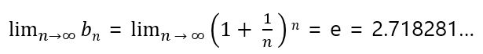
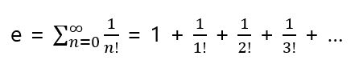

# 네이피어수 e

위의 e를 네이피어수(Napier's constant) 또는 자연로그의 밑이라고 한다. e는 분수로 나타낼 수 없는 수이다.

e가 많은 영역에서 쓰이는 이유는 e^x라는 지수함수를 미분해도 모양이 바뀌지 않기 때문이다. 즉, e^x를 미분하여 얻어지는 도함수도 e^x이며 적분은 미분의 역연산이므로 e^x를 적분하여 얻어지는 원시함수도 역시 e^x이다. 그밖에도 y = e^x으로 나타내어진 지수함수에서 x = 0에서의 접선의 기울기는 1이며 x가 0에 가까울 때는 y가 1 + x라는 아주 단순한 1차함수와 비슷하게 된다. 또 e는 다음과 같이 정의할 수도 있다.

네이피어수의 기호 e는 그 본질을 처음으로 밝혀낸, 유명한 수학자 레오나르도 오일러(Leonhard Euler, 1707-1783)의 머리글자에서 유래한다. 