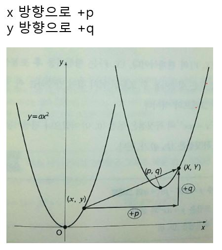
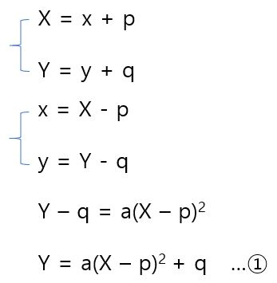
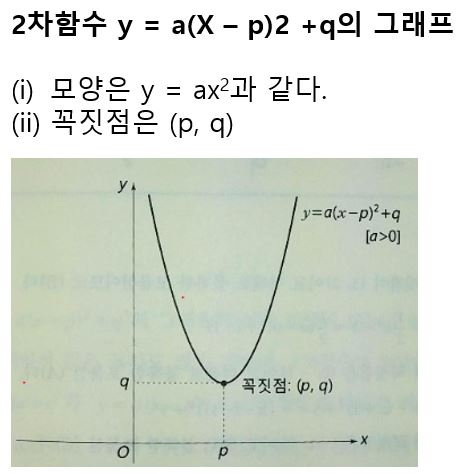

# 그래프의 평행이동

원점을 꼭지점으로 하는 y = ax^2의 그래프를 다음과 같이 평행이동할 수 있다.

좀 더 자세히 설명하면 (x, y)가 (X, Y)로 옮겨졌다고 하면 X, Y에 관한 식으로 나타낼 수 있고 이를 다시 x, y로 정리할 수 있다. 이를 y = ax^2에 대입하여 정리하면 다음과 같다. 

1의 식은 (X, Y)의 관계식이다. (X, Y)는 평행이동 후 포물선 위의 점이므로 1은 평행이동 후 포물선 위의 점이 만족하는 식, 즉 평행이동 후 그래프의 식이다. 이렇게 평행이동 했을 때 꼭지점은 (0, 0)에서 (p, q)가 된다.

