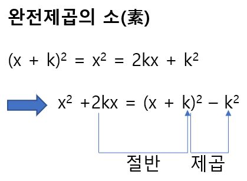
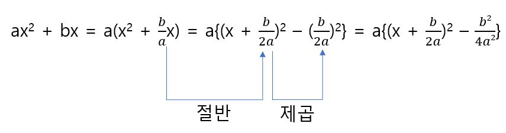

# 완전제곱과 2차함수의 그래프

2차함수의 일반형 y = ax^2 + bx +c의 그래프가 어떤 그래프가 되는지 알기 위해서는 완전제곱이라는 식 변형이 필요하다. 이는 다음과 같은 것을 말한다.

완전제곱은 아주 어려운 식 변형이다. 따라서 다음과 같은 완전제곱의 소라는 식 변형에 익숙해져야 한다.

y = ax^2 + bx+ c에서 ax^2 + bx를 완전제곱의 소를 사용하여 다음과 같이 변형 할 수 있다.

이상에서 다음의 완전제곱을 유도할 수 있다.

y = ax^2 + bx + c의 꼭지점을 구하고 그래프를 그리면 다음과 같다.

