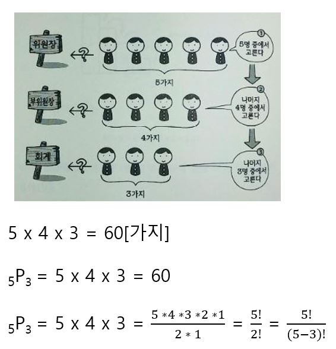
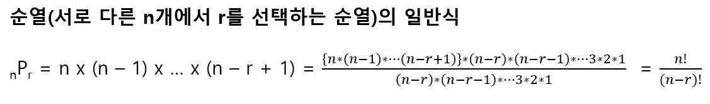
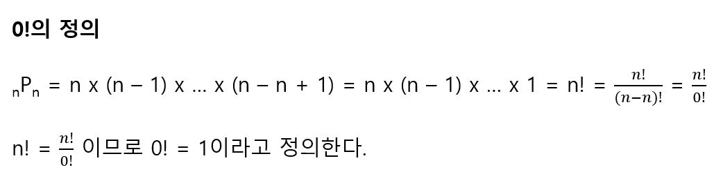

# 순열

A, B, C, D, E의 5명 중에서 1위원, 2위원, 3위원을 뽑는다고 가정하자. (1위원 A, 2위원 B, 3위원 C)와 (1위원 C, 2위원 B, 3위원 A)가 다른 경우라고 할 때, 뽑는 경우의 수는 5명 중에 한 명을 뽑고 남은 4명 중에 한 명을 뽑고 또 남은 3명 중에 한 명을 뽑으면 된다. 이와 같이 순서를 고려하는 경우의 수를 순열(順列)이라고 한다. 

일반적으로 다음과 같이 쓴다. 

0!은 0이 아님에 주의한다. 