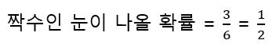
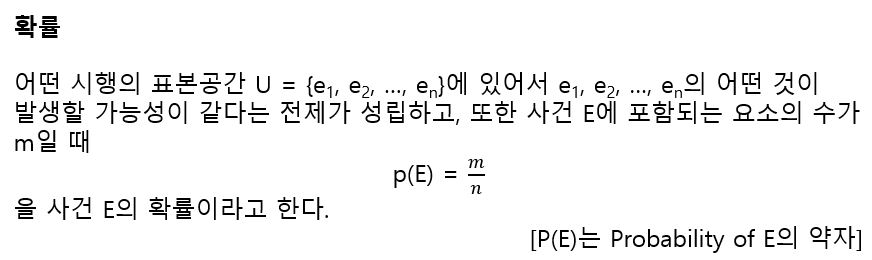
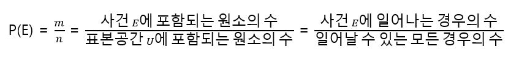
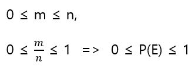

# 확률

주사위를 던졌을 때 짝수인 눈이 나올 확률을 구하라는 문제가 있을 때 주사위에서 나오는 눈은 1~6가지이며 그 중 짝수는 2, 4, 6의 3가지이므로 다음과 같다.

위의 문제에서 주사위를 던진다 같은 행위를 시행, 주사위에서 나오는 눈 모두를 표본공간, 짝수인 눈이 나오는 것을 사건이라고 한다. 

- 시행(Trial) - 몇 번이고 반복할 수 있으며, 심지어 그 결과가 우연에 좌우되는 행위
- 표본공간(Sample space) - 어떤 시행을 했을 때 일어날 수 있는 모든 결과를 모은 집합
- 사건(Event) - 표본 공간의 일부(표본 공간의 부분 집합)

이 용어들을 사용하여 확률을 다음과 같이 정의한다.

위의 정의는 다음과 같이 쓸 수 있다.

표본 공간 U에 포함된 원소의 수를 n, 사건 E에 포함되는 원소의 수를 m이라고 하면 다음이 성립한다.

또한 확률을 구하려 할 때 표본공간에 포함되는 각각의 원소가 마찬가지로 발생 가능성이 같다는 것을 전제로 하는 것은 매우 중요하다. 예를 들어서 내일 날씨에 대한 표본 공간 U={맑음, 흐림, 비, 눈}이라고 하고, 사건 E={눈}이라고 하면 표본공간 U에 포함되는 원소는 4개, 사건 E에 포함되는 원소는 1개이므로 내일 날씨가 되는 확률 P(E) = 1/4가 된다. 내일 날씨가 맑을지 흐릴지 비일지 눈일지는 각각 일어날 확률이 같지 않으므로 이런식으로 확률을 계산하는 것은 옳지 않다.