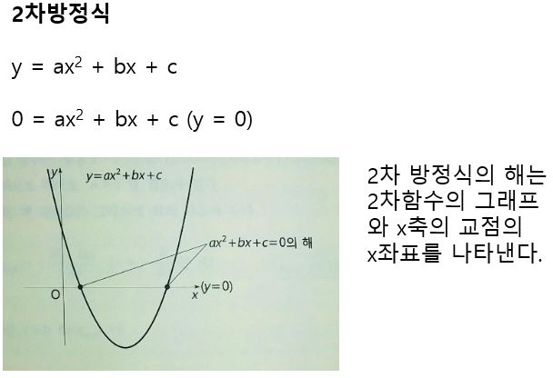
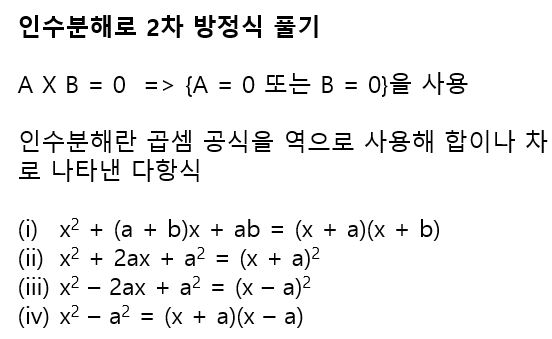
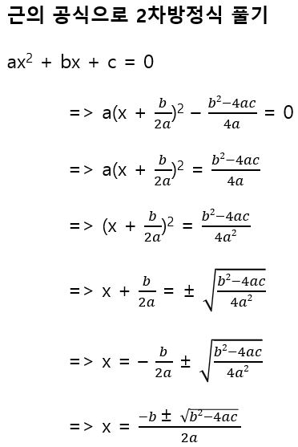

# 2차함수와 2차방정식

2차함수의 y에 0을 대입하면 2차방정식의 일반형이 나온다. 이것을 그래프로 그렸을 때 2차 방정식의 해는 2차 함수의 그래프와 x축의 교점의 x좌표가 된다.

2차 방정식의 풀이법은 다음과 같이 크게 두가지가 있다.

| 인수분해로 풀기                                              | 근의 공식으로 풀기                                           |
| ------------------------------------------------------------ | ------------------------------------------------------------ |
|  |  |

