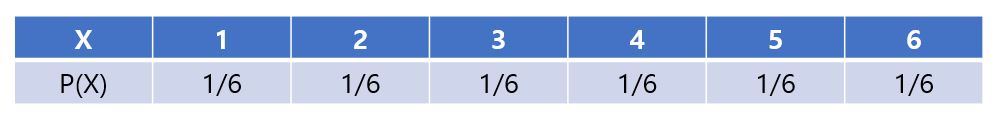
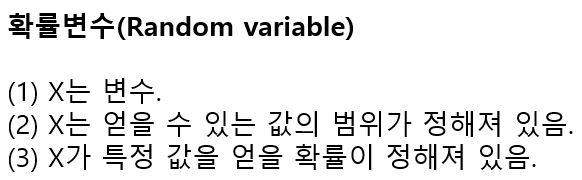
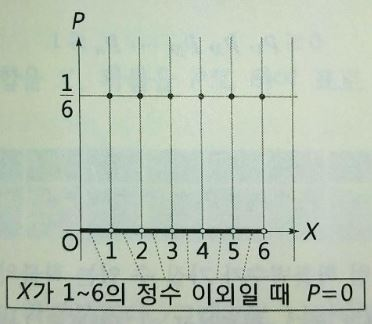
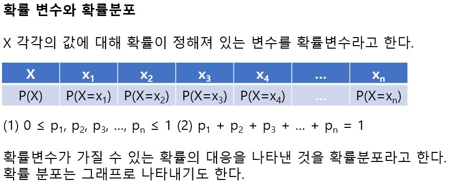

# 확률변수와 확률분포

주사위를 한 번 던졌을 때 나오는 눈을 X라고 하면 각 눈이 나올 확률은 1/6이 된다. 이를 표로 나타내면 다음과 같다.

여기서 X는 1-6의 값을 얻는 변수인데 X가 각각의 값을 얻을 확률이 정해져 있다. 이처럼 변수 X가 특정 값을 얻을 때의 확률이 정해져 있을 때 X를 확률 변수(Random variable)라고 한다.

통계는 관심이 있는 현상을 확률 변수에 의해 표현하고, 추정 또는 예측하는 학문이라고 할 수 있다. 또한 확률 변수 X의 값과 확률 P의 대응관계를 확률 분포(Probability distribution)라고 한다. 확률 분포는 표로 정리하거나 다음과 같이 그래프로 나타낼 수 있다.

특히 주사위의 눈처럼 X의 값이 Discrete한 값을 갖는 확률 변수를 이산형 확률변수라고 한다. 

