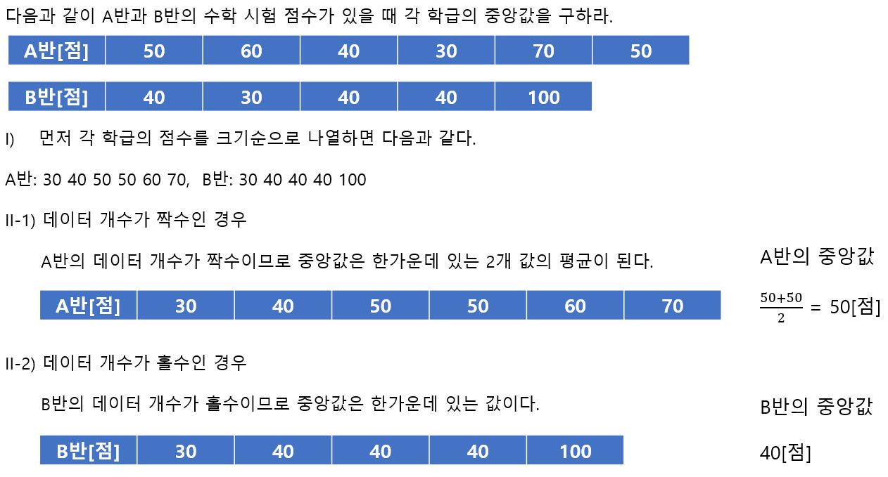
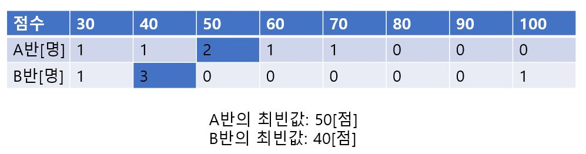
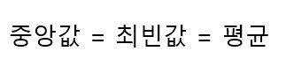

# Representative Value

데이터의 경향이나 특징을 간결하게 나타낼 수 있는 방법 중 하나로 **대푯값** 이 있다. 대푯값 중에 가장 자주 활용되는 것이 평균이다. 그러나 평균이란 전체를 평평하게 했을 때의 값이므로 두드러지게 점수가 높은 사람이나 낮은 사람이 있으면 평균도 그에 따라 위아래로 움직인다. 

평균이외에도 중앙값과 최빈값이라는 것이 활용된다. 

- **중앙값(Median)** - 데이터를 크기순으로 나열했을 때 중앙에 오는 값. 

  (i) 데이터를 크기 순으로 나열한다.

  (ii-1) 데이터가 홀수인 경우 중앙값은 딱 한 가운데 값이다.

  (ii-2) 데이터가 짝수인 경우 중앙값은 한가운데 있는 2개 값의 평균이다.  

A반과 B반의 평균은 같지만, 중앙값은 B반이 낮다. B반과 같이 데이터에서 **벗어난 값(다른것과 비교해서 두드러지게 크거나 작은 값, Outlier)이 있는 경우 평균은 그 벗어난 값의 영향을 받아 큰 값, 또는 작은 값을 갖기 쉬워진다. 이럴 때는 중앙값으로 데이터를 대표하는 것이 적절하다.** 

- **최빈값(Mode)** - 도수가 가장 많은 데이터의 값. 

양적 데이터에서는 계급을 만든 다음 도수가 가장 큰(히스토그램에서 가장 높은 막대) 계급의 계급값을 최빈값으로 한다. 

최빈값은 데이터 자체보다 확률분포에서 훨씬 중요하다. 특히 정규분포의 경우는 다음과 같이 된다. 

