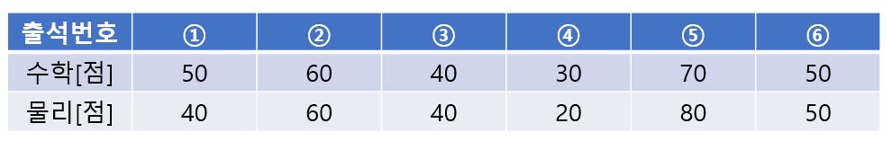
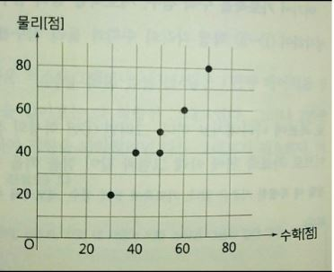
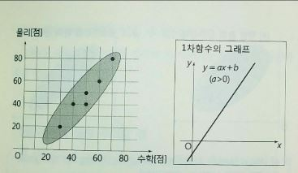
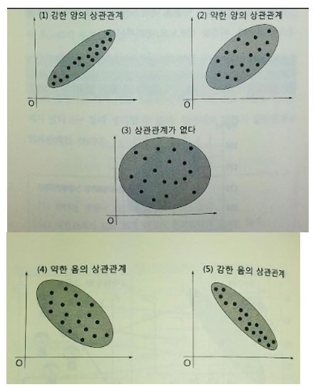
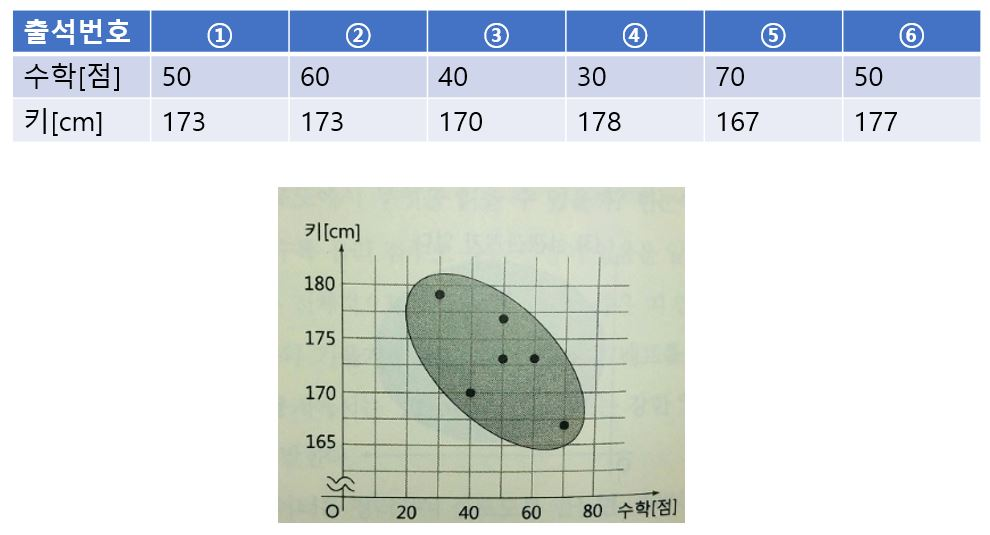

# 산포도

히스토그램이나 상자그림은 1변량 데이터를 정리해서 그 경향을 알아보는 데 적합한 그래프라면 산포도(또는 산점도)는 2변량 데이터를 정리하여 경향을 파악하는데 적합한 그래프다.

다음과 같이 6명의 학생의 수학 점수와 물리 점수가 있다고 하자. 

여기서 가로축을 수학 점수, 세로축을 물리 점수로 한 좌표 축을 생각하여 좌표에 나타내면 다음과 같다.

이 산포도에서 알 수 있는 점은 수학 점수가 높은 사람일수록 물리 점수도 높은 경향이 있다는 것이다. 산포도의 각 점이 우상향의 비교적 좁은 띠 안에 들어 있다. 이것은 양수의 기울기를 갖는 1차 함수의 그래프를 닮았다. 이럴때 통계에서는 2개의 변량 사이에 강한 양의 상관관계가 있다고 한다.

산포도를 만들면 두 변량 사이의 대략적인 상관관계의 유무나 강약을 알 수있다. 

아래 표는 6명의 학생의 수학 점수와 키의 데이터를 정리한 것이다. 이를 산포도로 정리하면 다음과 같다.

이 학생들의 수학 점수와 키 사이에는 약한 음의 상관관계가 있음을 알 수 있다.

상관관계를 조사할 때 주의해야 하는 점이 2가지 있다. 

- 얻어진 상관관계는 어디까지나 그 조사 대상에 대한 결과이며, 그것을 곧바로 '일반적 관계'로 연결할 수는 없다. 앞의 결과로 키카 클수록 수학 점수가 낮다라는 상관관계를 얻을 수는 있지만 이를 모든 고교생에게 적용시키기는 어렵다. 

- 2변량 데이터에 대해 어떤 상관관계가 있음을 알았다 하더라도 양자 사이의 인과관계는 단정할 수 없다. 상관 관계 ≠ 인과 관계이다. 

  

  

