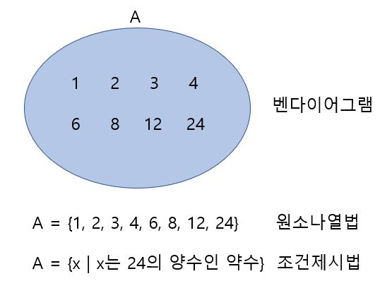
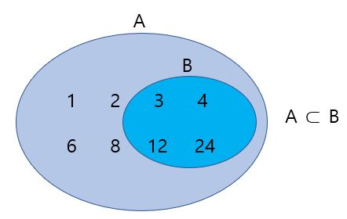

# 집합

24의 양수인 양수 등 범위가 확실한 것의 모음을 집합(集合)이라고 하고, 집합에 포함되어 있는 하나하나를 그 집합의 원소(元素)라고 한다. 작은 수의 모임 등 범위가 확실하지 않은 것은 집합이 아니다. 집합을 나타내는 방법은 다음과 같이 3가지가 있다.

또한 A = {1, 2, 3, 4, 6, 8, 12, 24}, B = {3, 4, 12, 24}라고 하면 집합 B의 원소는 모두 집합 A의 원소다. 이처럼 집합 B가 집합 A에 완전히 포함될 때, B는 A의 부분집합이라고 하고 다음과 같이 나타낸다. 

