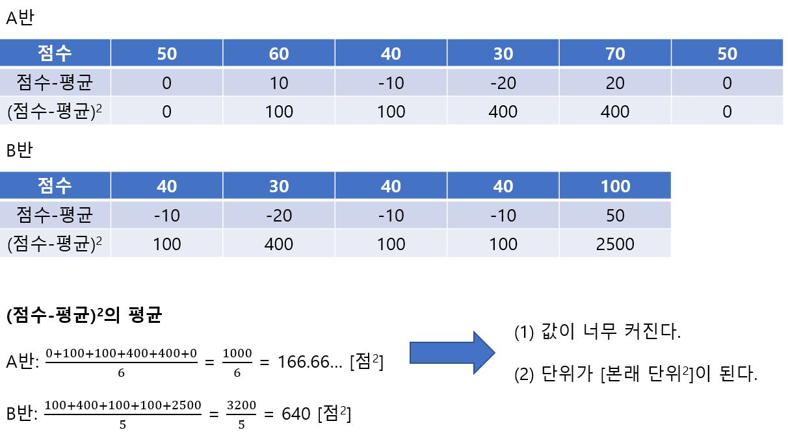
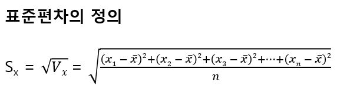
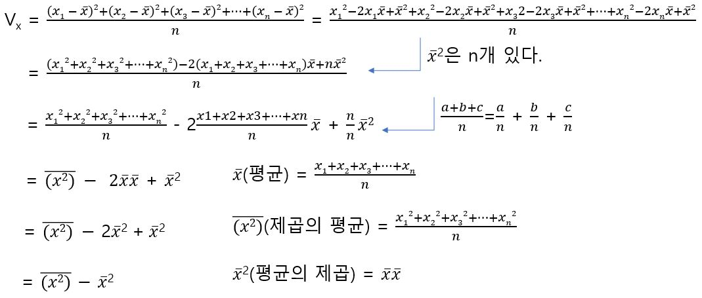
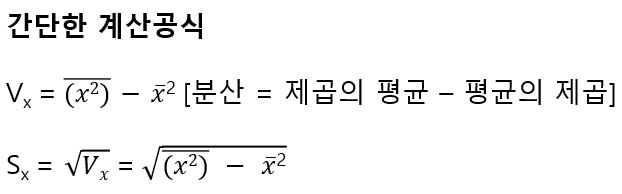
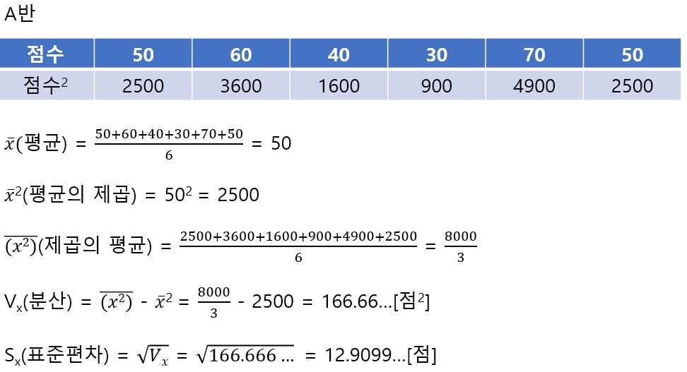

# 표준편차

분산은 평균으로부터의 차가 확실하게 보이므로 평균 주위에 흩어진 정도를 나타내기에는 아주 적합하지만 2가지 문제가 있다.

위의 2가지 모두 데이터의 평균으로부터 떨어진 정도를 제곱해서 계산함으로써 일어난 현상이므로 분산의 √를 벗기면 문제가 해결된다. 

A반이 약 13점, B반이 약 25점으로 표준 편차가 각 반의 흩어진 정도를 잘 표현한다고 할 수 있다.

분산 계산을 좀 더 쉽게 할 공식을 유도하면 다음과 같다.

A반의 데이터로 이 공식을 사용하면 다음과 같다.

(참고로 다봉성분포(피크가 여러 개 있는 분포)에서는 분산이나 표준편차 값을 해석하기 힘들다. 그런 경우 평균과 최빈값이 크게 차이 나서 평균으로 데이터를 대표하는 것이 반드시 적절하지 않은 경우가 많다.)