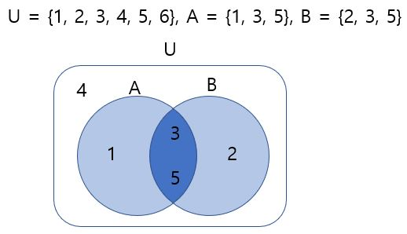
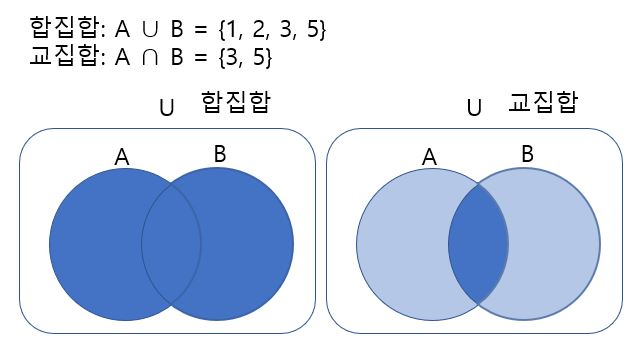
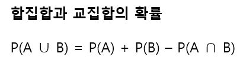
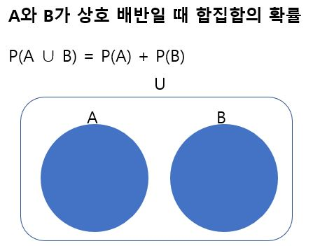

# 합집합과 교집합

주사위를 던진다는 시행에서 표본공간을 U, 홀수의 눈이 나온다는 사건을 A, 소수의 눈이 나온다는 사건을 B라고 하면 다음과 같다. 

일반적으로 시행에서 A와 B라는 2개의 사건이 있을 때 A와 B 중에서 적어도 한 사건이 일어난다를 A와 B의 합집합이라고 한다(위에서는 {1, 2, 3, 5}). 또한 A와 B 두 사건이 동시에 일어난다를 교집합이라고 한다(위에서는 {3, 5}). 

합집합의 확률과 교집합의 확률 사이에는 다음의 관계가 성립한다.

그런데 A와 B가 동시에 일어나는 일이 없어서 A와 B의 교집합의 확률이 0이라면 A와 B 중에서 한쪽이 일어나면 다른쪽은 일어나지 않는다. 이때 A와 B는 상호배반(Mutually exclusive)적인 관계라고 하며 다음의 식이 성립한다.

