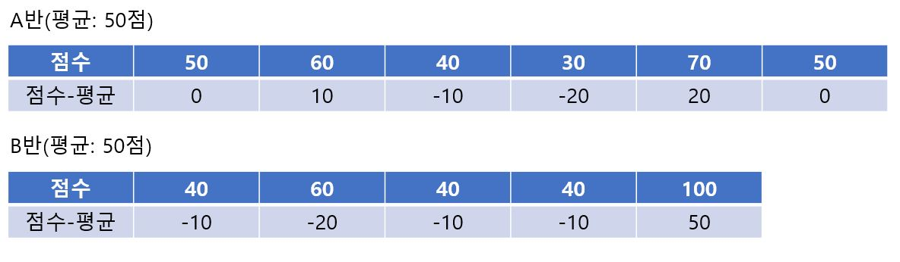
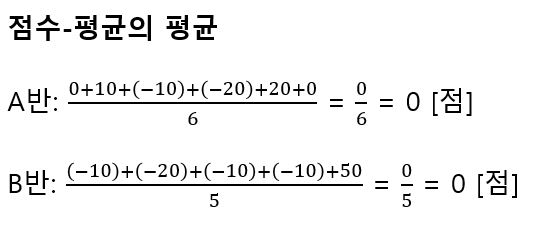
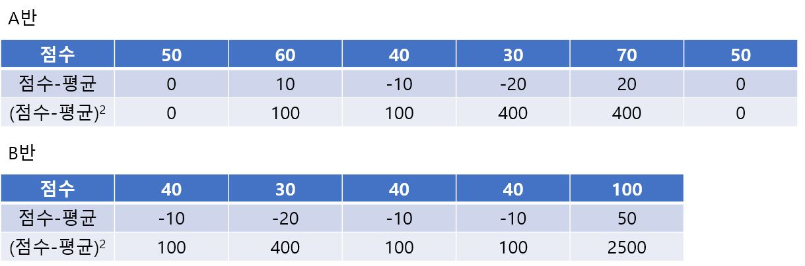
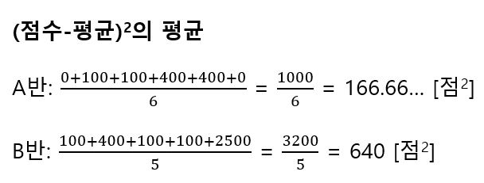
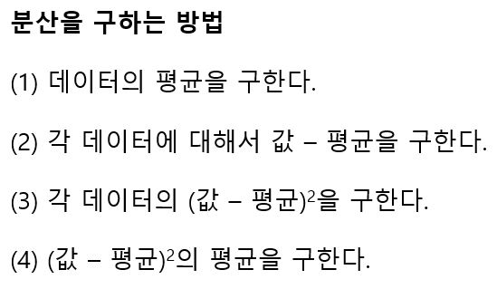
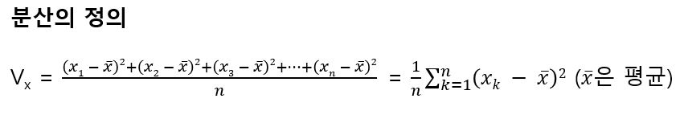

# 분산

다음과 같이 A반과 B반의 시험 점수 그리고 시험 점수와 평균의 차이가 표로 정리되어 있다고 가정한다.

각 반의 점수와 평균의 차의 평균을 구하면 다음과 같다.

결과는 둘 다 0이 된다. 평균 = 기준값 + 기준값의 차의 평균으로도 구할 수 있다. 기준 값에 평균을 사용하면 기준값으로부터의 차의 평균이 0이 된다. 즉, 점수와 평균의 차로는 평균 주위의 흩어진 정도를 조사할 수 없다. 그 값이 음수나 양수가 돼 각각 제거되어 평균으로부터 떨어져 있는 것이 보이지 않게 되기 때문이다. 점수와 평균의 차의 제곱의 평균을 구하면 다음과 같다. 

음수 값도 제곱하면 양수가 되므로 이렇게 하면 A반과 B반의 차이가 확실하게 보인다. 이처럼 음수든 양수든 평균으로부터 떨어진 정도가 잘 보일 수 있도록 고안된 (평균으로부터의 차)^2의 평균을 분산(Variance)이라고 한다. 분산을 구하는 순서는 다음과 같다.

일반적으로 분산의 정의는 다음과 같다.

