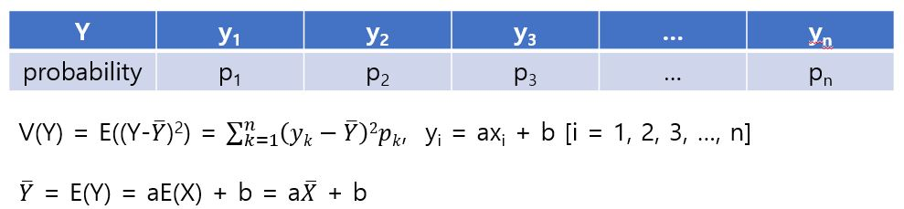
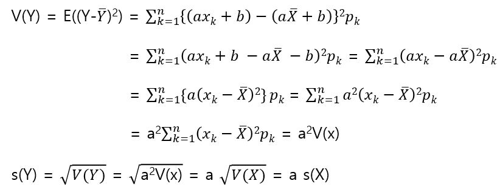
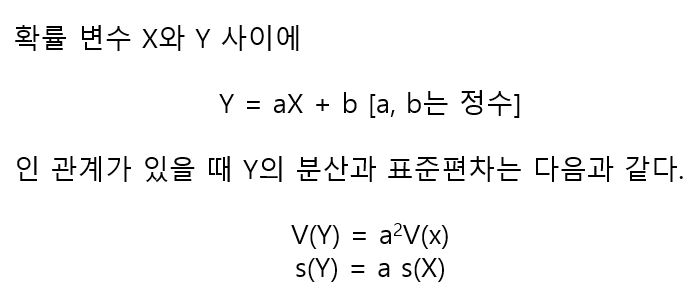
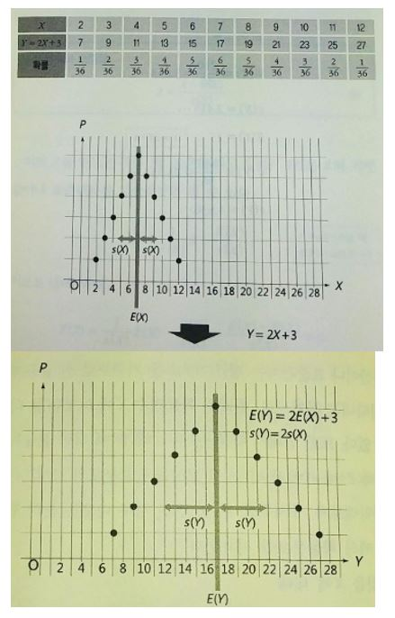

# aX+b의 분산과 표준편차

확률 변수 Y = aX+b(a, b는 정수)일때, Y의 분산이나 표준편차가 어떻게 바뀌는지 생각해볼 수 있다.

분산이나 표준편차는 평균(기댓값)을 기준으로 한 불규칙한 상태를 나타내는 값이므로, 원래의 확률변수 X에 b(정수)를 더해도 영향은 없다. 또한 원래의 확률변수를 a배(정수배)하면 불규칙한 상태도 a배(분산은 a^2배)가 된다.

