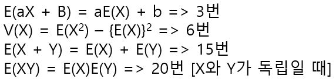
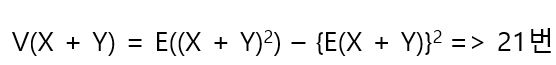
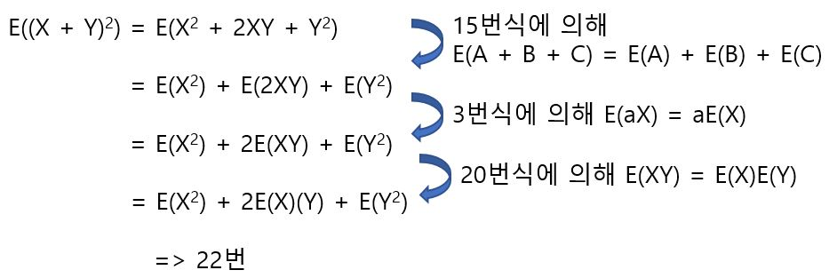
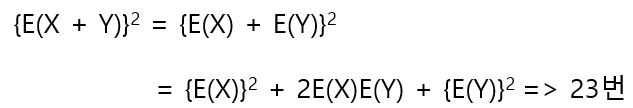
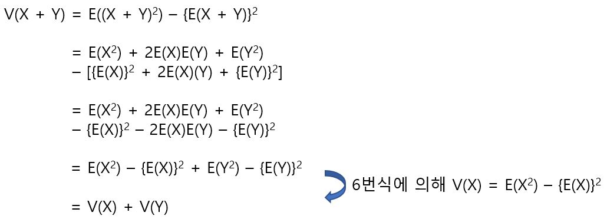
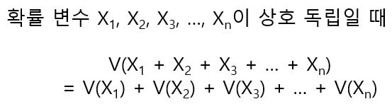

# 합의 분산

확률변수 X, Y가 독립일 때 X + Y의 분산 V(X + Y)를 구하는 방법은 다음과 같다.

위와 같은 공식이 있을 때, 6번식에 의해서 다음이 성립한다.

21번 식의 첫번째 항은 다음과 같이 계산한다.

21번식의 두 번째 항은 다음과 같이 계산한다.

따라서 다음을 만족한다.

합의 분산에 대해서 일반적으로 다음과 같은 식이 성립한다.

