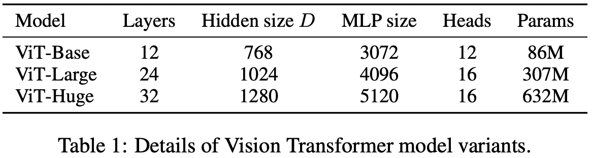
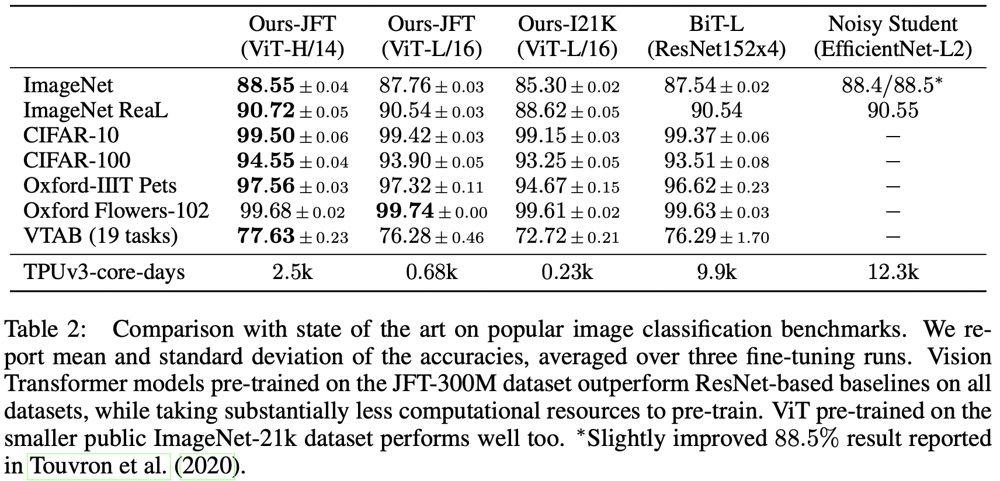
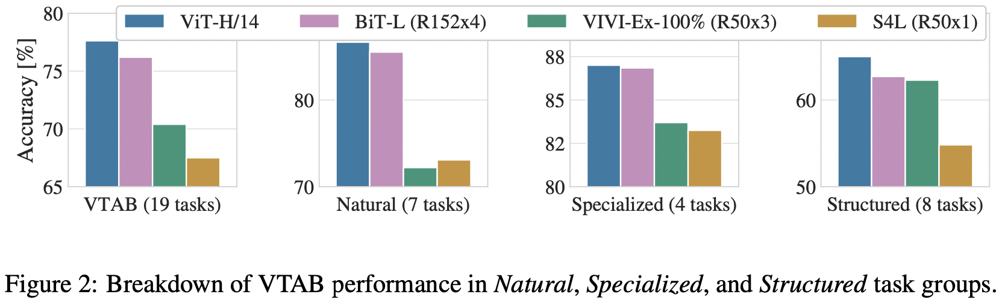
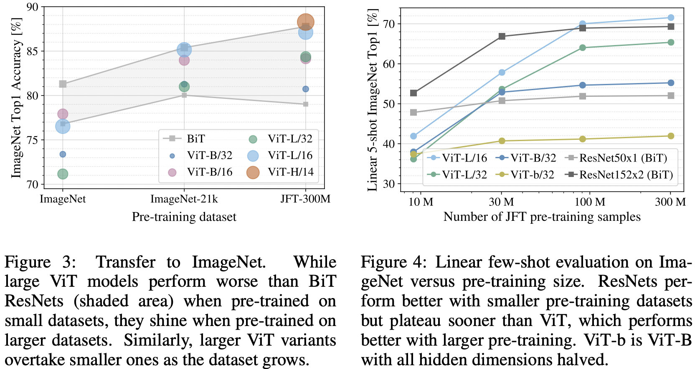

# AN IMAGE IS WORTH 16X16 WORDS: TRANSFORMERS FOR IMAGE RECOGNITION AT SCALE

Alexey Dosovitskiy, Lucas Beyer, Alexander Kolesnikov, Dirk Weissenborn, Xiaohua Zhai, Thomas Unterthiner, Mostafa Dehghani, Matthias Minderer, Georg Heigold, Sylvain Gelly, Jakob Uszkoreit, Neil Houlsby(Google Research, Brain Team)

## ABSTRACT

Transformer가 NLP 분야에서 사실상 표준이 된 반면에 컴퓨터 비전에 적용에 적용하는 하는 사례는 제한적이었다. 비전에서 Attention은 CNN과 같이 쓰이거나 CNN의 전체적인 구조는 남긴채 특정 부분만 Attention으로 바꾸는 방식으로 활용했다. 저자들은 CNN에 대한 의존이 꼭 필요한 것은 아니며 이미지 패치의 시퀀스에 직접적으로 적용하는 방식의 순수 Transformer가 Classification에서 좋은 성능을 보임을 확인했다. 많은 양의 데이터셋에서 미리 학습시키고 중간이나 적은 양의 데이터셋으로 전이 학습을 적용할때 Vision Transformer(ViT)는 최신 CNN과 비교해서 훌륭한 성능을 달성했을뿐만 아니라 훈련 시키는데 훨씬 적은 양의 계산 리소스만 필요했다. 

## INTRODUCTION

Self-attention 기반의 아키텍처들 중에 Transformer는 NLP에서 대세가 됐다. 주로 많은 양의 텍스트 말뭉치로 모델을 미리 훈련시키고 적은 양의 데이터셋으로 Fine-tuning했다. Transformer의 계산적 효율성과 확장석 덕분에 100B 파라미터 크기 이상의 모델을 훈련시키는 것이 가능해졌다. 모델과 데이터셋의 크기가 커쳐도 성능 상의 수렴은 보이지 않았다. 

그러나 컴퓨터 비전 분야에서는 CNN 아키텍처가 주류인채로 남아있었다. NLP에서의 성공 사례에 영감을 받아서 많은 연구에서 CNN 아키텍처과 Self-attention을 결합하려는 시도를 했다. 어떤 연구에서는 Convolution을 완전히 Attention으로 대체하려고 했다. 후자의 경우 이론적으로는 더 효율적인 모델을 만들 수 있으나 현대의 하드웨어 가속기에서 효율적으로 이런 모델을 적용하지는 못했는데 Specialized attention pattern을 사용하기 때문이었다. 그러므로 CNN 방식의 연구가 여전히 비전 분야에서는 SOTA의 자리를 차지하고 있었다. 

저자들은 표준 Transformer를 직접적으로 이미지에 적용하는 실험을 했다(NLP를 위해 생성한 모델의 구조에서 약간 변경해서). 그렇게 하기 위해서 저자들은 이미지를 패치들로 나누고 이런 패치들의 선형 임베딩의 시퀀스를 Transformer의 입력으로서 집어넣었다. 이미지 패치들은 NLP에서 토큰(단어)와 같이 취급된다. 저자들은 이 모델을 지도 학습 방식으로 Classification을 수행하도록 훈련시켰다. 

저자들이 ImageNet 같은 중간 크기의 데이터셋으로 훈련시켰을때 이런 모델들은 비슷한 크기의 ResNet보다 몇 포인트 더 낮은 정확도를 보였다. 저자들이 말하길 Transformer는 CNN에 내재되어 있는 (Translation equivariance, Locality 같은) Inductive bias가 부족하기 때문에 충분하지 못한 데이터로 훈련시키면 잘 일반화 시킬 수 없다고 한다. 

그런데 더 큰 데이터셋으로 훈련시킬때는 양상이 달라진다고 한다. 저자들의 ViT가 충분히 많은 양의 데이터셋으로 미리 학습시키고 나서 전이 학습을 적용했더니 준수한 성능을 달성했다고 한다. 

## RELATED WORK

Transformer는 원래 기계번역을 위해서 Vaswani등이 제안했고 NLP 분야에서 SOTA의 자리를 차지했다.  크기가 큰 Transformer 기반의 모델은 주로 양이 많은 말뭉치로 미리 학습시키고 수동으로 특정 도메인을 위해 Fine tuning시켰다. (BERT, GPT 등)

이미지에 Self-attention을 적용하는 Native한 방식은 각 픽셀이 모든 다른 픽셀을 참고하도록 했다. 그런데 픽셀 숫자의 제곱에 해당하는 Cost 때문에 실제 크기를 가진 이미지에 적용할 수 없었다. Transformer를 이미지 처리 과정에 적용하기 위해서 이와 근사한 방식의 연구가 수행되었다. Parmer 등은 각 Query에서 픽셀들이 오직 주변의 이웃 픽셀만 참고하도록 하는 Self-attention을 적용했다. 이런 Local multi-head dot-product self attention 블럭은 여러 연구에 따르면Convolution을 대체할 수 있다고 한다. 이와는 다르게 Sparse Transformer의 경우 이미지에 적용가능하도록 Global self-attention을 고안했는데 참고 근사정도를 조절가능하게 했다. Attention의 정도(크기)를 조절하는 다른 방법은 다양한 크기의 블럭에 적용하거나 각 축을 따라 따로 적용하는 방법도 있다. 이런 특화된 Attention 아키텍처가 컴퓨터 비전 분야에서 괜찮은 성능을 보여줬지만 하드웨어 가속기에서 효율적으로 구현하는데에는 복잡한 엔지니어링이 필요하다고 한다. 

CNN을 Self-attention과 결합하는 시도도 많았다. Classification을 위한 Feature map을 Augmenting한다던가 Self-attention을 사용하여 CNN의 출력 결과를 좀 더 처리하다던가 하는 방식이 있다. 

저자들이 말하길 저자들의 연구 이전에 Transformer를 원본 이미지 크기에서 Global self-attention을 적용한 연구 사례는 찾지 못했다고 한다. iGPT와 저자들의 모델이 유사하다고 한다. 여기서는 Transformer를 이미지 해상도와 Color space를 줄이고 난 이미지 픽셀들에 적용했다. 모델은 생성 모델 부분에서는 비지도적인 방식으로 학습했고 Classification 성능을 위해서 출력 Representation을 Fine-tuning하거나 선형적으로 탐사했다고 한다. 

저자들은 표준 ImageNet 데이터셋보다 많은 양의 데이터셋에서 Image recognition을 수행하는 것에 관심이 있었다. 추가적으로 데이터를 사용하면 표준 Benchmark에서 SOTA의 성능을 보인다고 한다. 그밖에 저자들이 참고한 연구 논문으로는 다음과 같은 것들이 있다. Sun 등은 CNN 성능이 데이터셋의 크기에 따라 달라지는 지를 연구했고 Kolesnikov 등과 Djolonga 등은 큰 데이터 셋에서의 CNN 전이 학습과 관련된 연구를 수행했다. 저자들은 ImageNet-21k, JFT-300M 데이터셋으로 실험을 수행했다. 

## METHOD

저자들은 모델을 디자인할때 최대한 원본 Transformer를 따랐다. 이렇게 하는 이유는 확장 가능한 NLP Transformer 아키텍처를 거의 즉시 사용할 수 있다는 점이다. 

모델의 개요는 Figure 1과 같다. 표준 Transformer는 1D 토큰 임베딩의 시퀀스를 입력으로 받는다. 2D 이미지를 처리하기 위해서 저자들은 다음과 같은 차원의 이미지를 패치로 나눠서 Flatten 시킨뒤에 시퀀스로 만든다. 

| 원본 이미지                                                  | Flatten된 2D 패치들                                          |
| ------------------------------------------------------------ | ------------------------------------------------------------ |
|  |  |

(H, W)는 원본 이미지의 해상도이고 C는 채널 수이다. (P, P)는 각 이미지 패치의 해상도이고 N = HW/P^2은 패치의 숫자이며 Transformer의 입력 시퀀스의 길이이다. Transformer는 모든 계층에 대해서 고정된 Latent vector 크기 D를 사용한다. 그래서 저자들은 패치들을 Flatten시키고 나서 (학습이 가능한) 선형 Projecttion을 통해 D 차원으로 매핑한다. 

저자들은 이 Projection의 출력을 Patch embedding이라고 불렀다. 

BERT의 [class] 토큰과 유사하게 저자들도 임베딩된 패치 시퀀스 앞에 학습가능한 임베딩을 추가한다(z0^0 = x_class). 이때 Transformer encoder(z_L^0)의 출력 부분에서의 State는 Image representation y의 역할을 한다. 

Pre-training이나 Fine-tuning 하는 동안, Classification head가 z_L^0에 붙는다. Classification head는 Pre-training 시에는 한 개의 Hidden 계층을 가지는 MLP로 구현되며, Fine-tuning 시에는 하나의 단일 Linear 계층으로 구현된다. 

Positional embedding가 위치 정보를 유지하기 위해서 Patch embeddings에 추가된다. 저자들은 학습이 가능한 Standard 1D position embeddings을 사용했다. 왜냐하면 저자들이 실험한 결과 2D를 인식할 수 있는 Position embeddings를 사용해도, 1D와 비교했을때 성능 상의 큰 개선이 없었기 때문이다. 이 작업에서의 출력 Embedding vector들의 시퀀스는 Encoder의 입력으로 들어간다. 

Transformer encoder는 Multihead self-attention과 MLP 블럭으로 구성된 요소의 스택으로 구성된다. Laynorm(LN)은 모든 블럭 전에 적용되고 Residual connection이 모든 블럭 뒤에 적용된다. MLP는 2개의 계층과 GELU 비선형으로 구성된다. 

 

#### Hybrid Architecture

원본 이미지 패치를 사용하는 것 대신에 입력 시퀀스를 CNN의 Feature map의 형태로 구성할 수 있다. 이런 하이브리드 모델에서 CNN feature map에서 얻은 패치들에 식1의 Patch embeddings prejection을 적용한다. 특수한 경우로, 패치의 Spatial size는 1x1이 될 수 있다. 이것이 의미하는 바는 입력 시퀀스가 Feature map의 Spatial 차원을 Flatten해서 얻을 수 있고(패치사이즈가 1x1이면 224x224의 Feature map에서 1x(224x224)로 Flatten시키면 됨) Transformer 차원으로 Projection 하기만 하면 된다는 것이다. Classification Input embeddings와 Position embeddings는 위에서 설명한 바와 같이 동일한 작업으로 추가된다. 

### FINE-TUNING AND HIGHER RESOLUTION

저자들은 ViT를 큰 데이터 셋에서 Pre-training시키고 나서 상대적으로 크기가 작은 도메인 데이터 셋에서 Fine-tuning 시켰다. 이를 위해서 Pre-training 했을때의 Prediction head를 제거하고 (0 값으로 초기화 된) D x K 크기의 Feedforward 계층을 붙였다. 여기서 K는 도메이 데이터셋의 클래스의 숫자이다. 그런데 종종 Pre-training 보다는 그냥 도메인 데이터셋의 더 높은 해상도로 Fine-tuning시키는게 더 좋을때도 있다. 높은 해상도의 이미지를 주입할 때 패치 크기는 유지하는데 이러면 유효한 시퀀스 길이가 더 커진다. ViT는 메모리의 제약까지 임의의 시퀀스 길이를 처리할수 있지만 이때 Pre-trained된 Position embedding은 필요 없어질 수 있다. 그래서 저자들은 원본 이미지의 위치에 따라서 Pre-train된 Position embeddings의 2D interpolation을 수행했다. 이런 해상도 조정이나 Patch extraction은 이미지들의 2D 구조에 대한 Inductive bias가 유일하게 수동적으로 ViT에 주입되는 지점이다. 

## EXPERIMENTS

저자들은 각 모델이 이미지 특징을 학습하는 역량을 평가했다(ResNet, ViT, Hybrid). 각 모델에 대해서는 당야한 사이즈의 데이터셋으로 미리 훈련시키고 각 Benchmark Task에서 평가했다. 저자들에 따르면 모델을 미리 훈련시킬때 연산량을 고려하면 ViT가 타 모델에 비해 유리한 면이 있다고 한다(낮은 Pre-training cost로 대 부분의 Recognition benchmark에서 SOTA의 성능을 달성했다고 한다). 그리고 Self-supervision을 사용한 규모가 비교적 작은 간단한 실험을 했는데 Self-supervised ViT가 더 연구할 가치가 있음을 확인했다고 한다. 

### SETUP

#### Datasets

실험에서 쓰인 데이터셋에 대해서는 본문 참고

#### Model Variants

저자들은 기본적으로 BERT에 쓰인 Configuration을 기본 ViT configuration으로 설정했다고 한다(Table 1 참고). 

Base와 Large 모델은 BERT에서 쓰인 모델을 거의 직접적으로 도입했고 Huge 라는 더 큰 모델을 실험에 추가했다. 저자들은 논문에서 모델의 크기와 입력 패치의 크기를 가리키기 위해서 다음과 같은 표현을 썼다. 예를 들어서 ViT-L/16은 Large 모델의 16x16 입력 패치 크기라는 의미다. Transformer의 시퀀스 길이는 패치 크기의 제곱에 반비례하기 때문에 패치 사이즈가 작은 모델일수록 계산량이 더 많아 진다. 

Baseline CNN으로는 ResNet을 사용했지만 BN 계층을 Group Normalization으로 교체했고 Standardized convolution을 사용했다고 한다. 이런 변경이 Transfer 했을때 성능을 개선했다고 한다. 저자들은 이 변경된 모델을 ResNet(BiT)라고 표시했다. Hybrid 모델은 CNN에서의 Intermediate feature map을 ViT에 제공하는 방식으로 구현했다고 한다. 

서로 다른 길이의 시퀀스를 적용한 실험을 하기 위하여 저자들은 

1. 원래 ResNet50 모델의 Stage4의 출력을 얻는다.
2. Stage4를 제거한 뒤에 Stage3에서의 계층 숫자와 똑같은 양의 계층을 위치시키고(총 계층 숫자를 유지하기 위해서) 이 확장된 Stage 3의 출력을 얻는다. 

2번 옵션으로 4배 더 긴 시퀀스 길이를 얻었기 때문에 ViT 모델에서 Cost가 더 커진다. 

#### Traning & Fine-tuning

이와 관련된 설정은 본문 참고. 

#### Metrics

저자들은 Downstream 데이터셋의 결과를 Few-shot 혹은 Fine-tuning accuracy로 측정했다. Fine-tuning accuracy는 각 모델을 해당 데이터셋에서 Fine-tuning 하고 나서 성능을 측정하는 것이다. Few-shot accuarcy는 훈련 이미지의 부분집합의 (Frozen) representation을 {-1, 1}^K의 타겟 벡터로 매핑하는 Regularized linear regression 문제를 풀어서 얻는다. 저자들은 주로 Fine-tuning 성능에 초점을 맞추지만 가끔 Fine-tuning의 비용이 너무 비쌀때 빠른 평가를 위해서 Linear few-shot accuacy를 확인했다고 한다. 

### COMPARISON TO STATE OF THE ART

모델 성능 비교는 본문 참고.

Figure2는 VTAB task를 각 그룹으로 나눠서 이 Benchmark에 대한 SOTA 방법들과 비교한 것이다. BiT, VIVI는 ImageNet과 Youtube 데이터셋에서 공동으로 훈련된 ResNet이고 S4L은 ImageNet 데이터셋으로 Supervised, Semi-supervised 양상으로 훈련한 모델이다. 

### PRE_TRAINING DATA REQUIREMENTS

ViT는 JFT-300M 데이터셋(아주 큰 데이터셋)에서 미리 훈련시켰을때 성능이 좋다. 저자들은 ResNet 계열의 모델보다 Vision에 관한 Inductive bias가 적을때 데이터셋의 크기가 얼마나 중요한지 궁금했다. 그래서 두 가지 방식의 실험을 수행했다. 

첫번째로 ViT 모델을 미리 훈련시킬때 데이터셋의 크기를 점점 키워봤다(ImageNet, ImageNet-21k, JFT-300M). 작은 데이터셋에서 가능한 좋은 성능을 얻기 위해서 세 가지 규제 파라미터를 최적화했다(Weight decay, Dropout, Label smoothing). Figure 3는 ImageNet에서 Fine-tuning 후의 결과를 보여준다(다른 데이터셋에 대한 결과는 Table 5 참고). 

ImageNet과 같은 비교적 작은 데이터셋으로 미리 훈련시켰을때 ViT-Large 모델은 ViT-Base 모델과 성능을 비교했을때 더 안 좋은 것을 확인할 수 있다(강한 규제에도 불구하고). 그러나 ImageNet-21k 데이터셋만 해도 성능이 유사하고 JFT-300M 데이터셋에서는 큰 모델이 이점을 취하는 것을 확인할 수 있다. Figure 3는 각기 다른 크기의 BiT 모델에 걸쳐있는 성능 영역을 보여준다. BiT CNN들은 ImageNet에서 ViT를 상회하지만(규제 최적화에도 불구하고) 큰 데이터셋에서는 ViT가 성능을 압도한다. 

두번째로 저자들은 JFT-300M 데이터셋에서 9M, 30M, 90M 그리고 전체 데이터셋으로 모델을 훈련시켜봤다. 저자들은 작은 크기의 서브 데이터셋에 추가적인 규제를 하지 않고 모두 동일한 하이퍼파라미터 셋팅을 적용했다. 이렇게 한 이유는 규제의 효과가 아니라 모델의 고유 속성을 측정하기 위해서다. Early-stopping을 적용하지 않았고 훈련 동안에 최고의 Validation accuracy를 기록했다. 시간을 줄이기 위해서 Fine-tuning accuracy 대신에 Few-shot linear accuracy를 측정했다. Figure 4는 그 결과를 나타낸다. ViT들은 작은 데이터셋에서는 비슷한 연산 Cost이지만 ResNet 모델보다 좀 더 과적합 하는 경향이 있었다. 예를 들어서 ViT-B/32는 ResNet50보다 약간 빠르지만 9M 서브셋에서는 성능이 훨씬 안 좋고 90M 서브셋 이상에서는 오히려 더 좋았다. ResNet152x2와 ViT-L/16의 경우도 마찬가지다. 이 결과를 통해 알 수 있는 점은 Convolution의 Inductive biase가 규모가 작은 데이터셋에서는 유용하지만 규모가 큰 데이터셋에서는 적절한 패턴을 학습하는 것만으로 충분하고 오히려 이점이 있을수도 있다는 것이다. 

전체적으로 ImageNet에서의 Few-shot 결과(Figure 4)와 VTAB에서의 Low-data 결과(Table 2)은 Very low-data transfer에서는 유의미 해 보인다. 

### SCALING STUDY

여기서 저자들은 JFT-300M 데이터셋의 전이 학습 성능을 평가하여 각기 다른 모델의 Controlled scaling study를 수행했다. 이 셋팅에서 데이터 크기는 모델 성능의 Bottleneck이 아니고 각 모델의 사전 훈련 비용 대비 성능을 측정한다. 모델은 7개의 ResNet 모델의 경우 (R50x1, R50x2 R101x1, R152x1, R152x2)을 7 에폭동안 사전 훈련했고 R152x2와 R200x3는 14 에폭동안 사전 훈련시켰다. 6개의 ViT 모델은 (ViT-B/32, B/16, L/32, L/16)을 7 에폭동안 사전훈련 시켰고 L/16, H/14 모델을 14 에폭동안 사전 훈련시켰다. 5개의 Hybrid 모델은 (R50+ViT-B/32, B/16, L/32, L/16) 7 에폭동안 사전 훈련시켰고 R50+ViT-L/16 모델을 14 에폭동안 훈련 시켰다(Hybrid의 경우, 모델 이름 끝에 숫자는 패치 사이즈가 아니라 ResNet Backbone에서의 총 Downsampling ratio를 의미한다). 

Figure 5는 총 사전 훈련 연산량 대비 전이 학습 성능을 나타낸다. 각 모델 마다의 더 자세한 결과는 Appendix의 Table 6를 참고. 

몇 가지 패턴을 관측할 수 있는데 

- 첫째는 Performance/compute trade-off 면에서 ViT가 ResNet을 상회한다는 것이다. ViT는 거의 2-4배 더 적은 얀산을 ResNet과 비슷한 성능(5개의 데이터셋의 평균)을 달성하는데 필요했다. 
- 둘째는 Hybrid 모델이 연산 부담량 측면에서 ViT를 상회하지만 용량이 큰 모델에서는 이 차이가 없어진다는 것이다. 이결과는 저자들의 결과의 예상 밖이었다. 왜냐하면 저자들이 생각했을때 Convolutional local feature precessing이 어떤 크기에서든 ViT의 성능을 더 개선하는데 도움이 될 것이라고 예상했기 때문이다. 
- 세번째는 ViT의 실험 범위에서 성능의 포화 현상이 일어나지 않았기 때문에 향후 Scaling과 관련된 연구를 더 수행할 동기를 얻었다는 것이다. 
