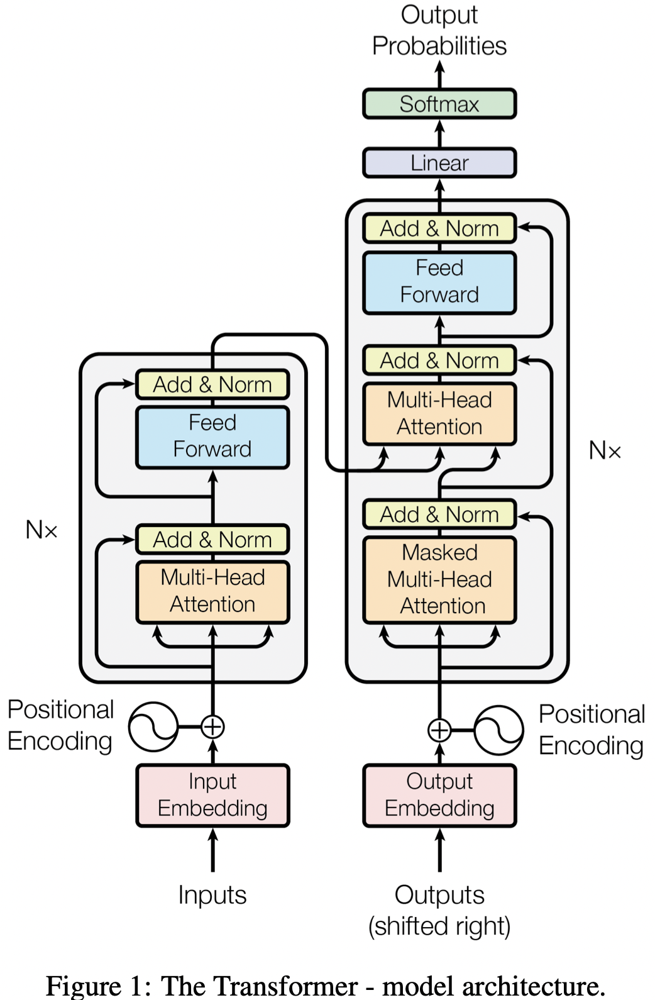
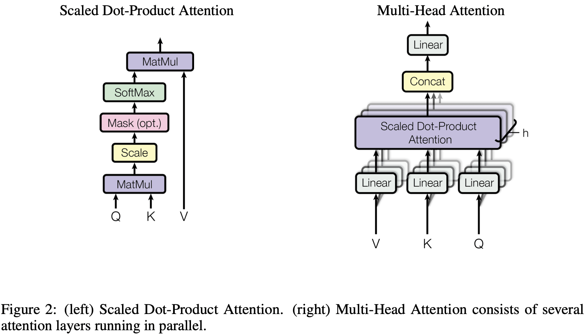
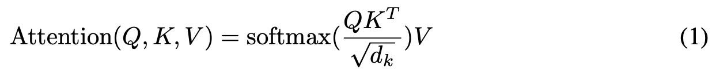
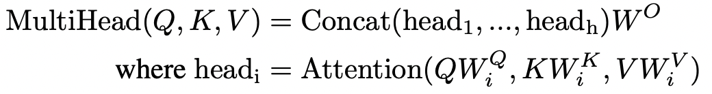
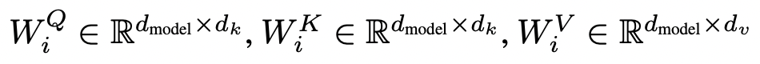
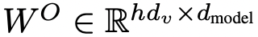
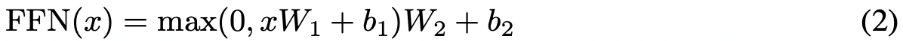
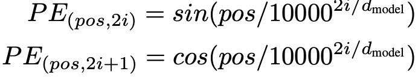

# Attention Is All You Need

Ashish Vaswani, Noam Shazeer, Łukasz Kaiser(Google Brain), Niki Parmar, Jakob Uszkoreit, Llion Jones(Google Research), Aidan N. Gomez(University of Toronto), Illia Polosukhin

## Abstract

어떤 시계열 데이터를 변환하는 모델 개발에서 지배적인 경향은, Encoder와 Decoder를 포함하는 복잡한 RNN 혹은 CNN를 기반으로 모델을 만든다. 가장 성능이 좋은 모델들을 보면 Attention 매커니즘으로 Encoder와 Decoder를 연결한다. 저자들은 Transformer라는 새로운 네트워크 아키텍처를 제안했다. 특징으로는 RNN이나 CNN에 의존하지 않고 오직 Attention 매커니즘에만 근거한다는 것이다. 이 모델로 두 기계 번역을 실시했을때 성능이 압도적이었으며 동시에 병렬적으로 데이터를 처리할 수 있었고 훈련 하는데 시간도 상당히 짧았다고 한다. 저자들은 Transformer가 저자들이 실험한 작업 말고 다른 작업에서도 잘 동작할 수 있다고 말한다. 

## Introduction

RNN, Long-term memory, Gated RNN은 기계 번역같은 시계열 데이터를 변환하는 문제에서 확고하게 SOTA의 성능을  보여왔고 지배적인 위치를 차지해 왔다. 많은 연구 노력들이 지속적으로 RNN과 Encoder-Decoder 아키텍처 스타일의 모델의 한계를 더 높이려고 해왔다. RNN은 기본적으로 입력과 출력 열의 각 기호의 위치에 따라 계산 과정을 분해한다. 계산 과정의 각 단계에 따라서 t 위치의 입력 값과 바로 전 모델의 가중치 상태 h_t-1을 입력으로 새롭게 모델의 가중치 상태를 h_t로 만든다. 그런데 이런 과정은 입력 데이터를 병렬적으로 처리하는 것을 방해한다. 그리고 이것은 메모리의 한계 때문에 아주 길이가 긴 열 데이터에서는 치명적일 수 있다. 어떤 연구에서는 인수분해 트릭과 조건에 따른 계산 기법을 통해 계산 과정을 최적화 해서 상당히 이런 과정을 개선시켜왔다. 그러나 이런 시계열적 계산 과정(앞의 데이터를 처리하고 나서 뒤의 데이터를 처리하는)은 본질적으로 한계가 있을 수 밖에 없다. 

Attention 매커니즘은 다양한 분야에서 시계열 데이터를 모델링하거나 변환하는 과정을 해야할때 필수적인 부분이 되고 있다. 왜냐하면 입력과 출력 시계열의 거리와 상관 없이 데이터의 의존성을 모델링 할 수 있기 때문이다. 그러나 이런 Attention 매커니즘은 RNN과 같이 사용되고 있다는 점에서 한계가 있다. 

이 연구에서 저자들은 Transformer라는 아키텍처를 제안했다. 이 모델은 RNN 부분을 없애고, 입력과 출력 간의 전역적인 의존성을 모델링 하는데에도 완전히 Attention 매커니즘에만 의존한다. Transformer에서는 데이터를 병렬적으로 처리가 가능하고 그로 인해서 모델 훈련 시간이 빨라진다. 

## Background

연속적인 연산의 연산량을 줄인다는 목적은 Extended Neural GPU, ByteNet 등의 연구의 발단이 되었다. 이 모든 연구들은 CNN을 기본 빌딩 블럭으로 사용했고 모든 입력과 출력 위치에 대해서 병렬적으로 중간 과정의 표현들을 계산했다. 그런데 이런 모델들에서 두 임의의 입력이나 출력 위치 사이의 시그널과 관련된 연산량은 두 위치가 멀수록 증가했다. 예를 들어서ConvS2S의 경우는 선형적으로, ByteNet은 로그함수적으로 늘어났다. 이런 특성은 두 위치 사이의 거리가 멀면서 연관성이 있을때 이를 학습하는 것을 어렵게 했다. Transformer에서는 이런 거리가 멀때 필요한 연산의 숫자가 상수적으로 줄어든다(O(상수)). Attention-weighted 위치에서의 평균을 구하는 것 때문에 유효한 해상도가 줄어들긴하지만 Multi-Head Attention으로 이 악영향에 대응한다. 

Self-attention 혹은 Intra-attention은 한 시퀀스의 표현을 계산하기 위해서 하나의 시퀀스의 각기 다른 위치들을 연관시키는 Attention 매커니즘이다. Self-attention은 그동안 다양한 과업에 사용되었다. 

End-to-End memory 네트워크는 Sequence-aligned recurrence 대신에 Recurrent attention 매커니즘에 근거한다. 이 네트워크는 단순한 질문 및 답변 수행히안 언어 모델링 과업에서 좋은 성능을 보였다. 

저자들이 말하길 Transformer는 Sequence-aligned RNN 혹은 컨볼루션을 사용하는 것 대신에 입력과 출력 사이의 표현을 연산해내기 위해서 온전히 Self-attention에 의존하는 첫번째 Transduction(시퀀스 간 변환) 모델이라고 한다.

## Model Architecture

대부분의 경쟁력 있는 신경망 기반의 Sequence transduction 모델은 Encoder-decoder 구조를 가지고 있다. 이런 구조에서는 Encoder가 (x1, ..., xn)이라는 입력 시퀀스를 연속적인 표현인 z = (z1, .., zn)으로 매핑한다. z에 대해서 Decoder는 출력 시퀀스 (y1, ..., yn)을 하나의 시간에 하나의 심볼씩 만들어낸다. 각 스텝에서 모델은 Auto-regressive하기 때문에 다음 단계에서 심볼 시퀀스를 만들어낼때 바로 전에 만들어진 심볼을 추가적인 입력으로 사용한다. 

Transformer는 Figure 1과 같이 Encoder와 Decoder에 Stacked self-attention과 Point-wise 그리고 완전 연결 계층을 사용해서 위와 같은 구조를 따른다. 

### Encoder and Decoder Stacks

- Encoder: Encoder는 위의 그림에서 N=6의 Stack으로 구성되어 있다. 각 계층은 두 가지 서브 계층들로 이루어져 있다. 첫 번째는 Multi-head self-attention 매커니즘을 따르고 두번째는 단순하게 Position-wise fully connected feed-forward 네트워크이다. 저자들은 Residual connection을 적용하고 Layer normalization을 적용했다. 그러므로 각 서브 계층의 출력은 LayerNorm(x + Sublayer(x))가 되고 여기서 Sublayer(x)는 각 서브 계층의 기능을 구현한 것이다. Residual connection을 용이하게 하기 위해서 모델에 있는 모든 서브 계층들과 임베딩 계층들은 출력 차원을 512로 고정했다. 
- Decoder: Decoder도 마찬가지로 N=6의 Stack으로 구성되어 있다. Encoder에서의 두 서브 계층들에다 세 번째 서브 계층이 추가되었다. 여기서는 전 단계의 계층의 출력 뿐만 아니라 Encoder stack의 출력 또한 입력으로 받아서 Multi-head attention을 수행한다. Encoder와 유사하게 각 서브 계층들에는 Residual connection과 Layer normalization을 적용했다. 특별히 Decoder stack에서 Self-attention 서브 계층을 수정했는데 어떤 위치에서 다음 미래의 위치의 정보를 참고하는 것을 방지하게 했다. 이런 Masking 작업은 Position i에서의 예측값이 오직 i 이전의 위치에 있는 정보만 참고할 수 있도록 한다. 

### Attention

Attention function이란 하나의 Query와 여러 쌍의 Key-value의 한 집합을 출력에 매핑하는 것으로 설명할 수 있다. 여기서 Query, Keys, Values, 출력 모두 벡터이다. 출력은 Value들의 가중치 합으로 계산할 수 있다. 여기서 각 Value에 할당된 가중치는 Query와 이에 대응하는 Key의 Compatibility function으로 계산한다. 

#### Scaled Dot-Product Attention

저자들은 저자들이 사용한 Attention function을 Scaled Dot-Product Attention이라고 불렀다(Figure 2). 이 Attention의 입력은 dk 차원의 Key들과 Query들 그리고 dv차원의 Value들로 구성되어 있다. 저자들은 Query와 모든 Key들에 대해서 내적을 수행하고 루트dk 값으로 각 요소 값을 나누며 Softmax function을 통과시켜서 Value들에 할당될 가중치 값들을 얻어낸다. 

실제 계산할 때는 저자들은 여러 Query들에 대해서 동시에 행렬 Q를 만들고 동시에 Attention function을 통과시킨다. Key들과 Value들도 각각 행렬 K, V로 묶는다. 저자들은 출력값의 행렬을 다음과 같이 계산한다. 

가장 흔히 사용되는 두 가지 Attention function은 Additive attention과 Dot-product(Multiplicative) attention이다. Dot-product attention은 저자들과 한 가지 빼고 동일하다. 그것은 루트 dk로 행렬의 요소 값들을 나누는 것이다. Additive attention은 한 개의 Hidden 계층이 있는 Feed-forward 네트워크를 사용해서 Compatibility function의 연산을 수행한다. 이론적으로 위의 두 가지 방식의 복잡도는 유사하나 Dot-product attention은 고도로 최적화된 행렬 곱셉 코드 덕분에 좀 더 빠르고 공간복잡도를 줄일수 있다고 한다. 

dk가 작은 값일 경우 두 Attention function은 유사한 성능으로 작동하나 큰 값의 dk로 Scaling하지 않는다면 Additive attention이 Dot product보다 성능이 좋다. 저자들이 이에 대해서 추측하길 큰 값의 dk의 경우 Dot product의 값들이 상당히 커지고, Softmax function에서 기울기 값이 극도로 작게 만들기 때문이라고 한다. 이런 효과를 상쇄하기 위해서 저자들은 루트dk로 Dot product 값을 Scaling 했다고 한다. 

#### Multi-Head Attention

d_model 차원의 Key, value, query로 Attention function을 하나 수행하는 것 대신에 저자들이 발견하기에 더 성능 상으로 유익한 방법이 있다. 그것은 Query, Key, Value들을 각각 dk, dk, dv 차원으로 (학습이 가능한)Linear projection 하는 것은 h번 하는 것이다. 이 각각의 Projected된 Q, K, V에 대해서 병렬적으로 Attention function을 통과 시키고 dv 차원의 출력 값을 만들어낸다. 이 값들은 Concatenated되고 나서 다시 한 번 Projected되고 최종 값을 만들어낸다(Figure 2).

Multi-head attention은 모델이 각각 다른 데이터 위치에서 다른 Representation subspace에서의 정보를 참고하도록 한다. Attention head가 하나만 있을 경우 평균화가 이를 억제한다. 

Projection은 다음과 같은 가중치 매트릭스로 수행한다. 

여기서 저자들은 h = 8의 병렬적인 Attention 계층 혹은 Head를 사용했다. 각각에 대해서 dk = dv = d_model/h = 64를 적용했다. 각 Head의 차원이 줄어들기 때문에 총 연산량은 한 개의 Head의 Full dimensionality와 유사하다. 

#### Applications of Attention in our Model

Transformer에서는 세 가지 방식으로 Multi-head attention을 활용한다고 한다. 

- Encoder-decoder attention 계층에서, Query는 Decoder에서 바로 전 계층에서 입력으로 들어온다. Memory key들과 Value들은 Encoder의 출력에서 나와 Decoder의 해당 계층의 입력으로 들어온다. 이런 방식으로 Decoder의 위치에서 입력 시퀀스 안의 모든 위치의 정보를 참고 하도록 한다. 이것은 Sequence-to-sequence 모델에서 흔히 쓰이는 Encoder-decoder attention 매커니즘을 모방한 것이다. 
- Encoder는 Self-attention 계층을 포함한다. Self-attention 계층에서는 모든 Key들과 Value들 그리고 Query들이 바로 그 위치(Encoder)에서 나온다. 이 연구에서는 Encoder에서 바로 전 계층의 출력에 해당한다. Encoder 안의 각 위치에서는 Encoder에서 바로 전 계층의 모든 위치의 정보를 참고한다. 
- 이와 유사하게 Decoder 안의 Self-attention 계층에서는 Decoder 안의 모든 위치가 해당 위치가 참고하는 위치까지의 모든 위치의 정보를 참고할 수 있게 한다. 저자들이 말하길 Auto-regressive적인 특성을 방지하기 위해서 Decoder에서 (오른쪽에서) 왼쪽으로 정보가 흘러가는 것을 방지했다고 한다. 이를 구현하기 위해서 Scaled dot-product attention 부분에서 Sotfmax의 입력으로 들어가는 데이터를 살펴보고 유효하지 않은 위치의 모든 값들을 마이너스 무한대로 마스킹한다. 

### Position-wise Feed-Forward Networks

Attention에서 서브 계층에 더해서, 본 연구의 Encoder와 Decoder에서의 각 계층은 Fully connected feed-forward 네트워크를 포함한다. 이 네트워크는 각 위치에 독립적으로 하나씩 존재하며 구조는 동일하다. 이 네트워크는 두 개의 선형 변환 사이에 ReLU activation이 껴 있는 구조로 구성되어 있다. 

선형 변환이 각 위치에 상관 없이 동일한 연산을 수행하지만 계층마다의 파라미터는 다르다. 이를 이해하기 쉽게 설명하자면 커널 사이즈가 1인 두 개의 컨볼루션 계층이라고 생각하면 된다. 입력과 출력의 차원인 d_model = 512이고 그 중간 계층들의 차원은 d_ff = 2048이다. 

### Embeddings and Softmax

다른 Sequence transduction 모델과 유사하게, 저자들은 입력과 출력 토큰들을 d_model 차원의 벡터로 변경하기 위한 학습된 임베딩을 사용한다. 그리고 다른 연구에서와 흔히 하는 것과 같이 학습된 선형 변환과 Softmax 연산으로 Decoder의 출력을 다음 토큰 출력 예측 값으로 변경한다. 저자들의 모델에서는 두 개의 임베딩 계층과 Pre-softmax 선형 변환 사이에 같은 가중치 행렬을 공유한다. 임베딩 계층 안에서는 이 가중치들에 루트d_model 값을 곱한다. 

### Positional Encoding

저자들의 모델에는 Recurrence나 Convolution 연산이 없기 때문에 모델이 Sequence의 순서 정보를 활용하게 하기 위해서 Sequence 안의 토큰들의 상대적 혹은 절대적 위치 정보를 주입해야 한다. 그래서 저자들은 Encoder와 Decoder의 Bottom에서 입력 Embedding에 Positional encoding을 추가했다. Positional encoding은 Embedding과 같이 d_model 차원이다. 그래서 Embedding과 Sum할 수 있다. Positional encoding은 학습이 가능하게 할 수도 있고 고정시킬수도 있다. 

본 연구에서 저자들은 다른 주기를 가진 Sine과 Cosine 함수를 사용했다. 

pos는 위치이고 i는 차원이다. Positional encoding의 각 차원은 사인 함수에 대응되게 된다. 파장은 2π에서 10000 * 2π까지 파장을 형성한다. 저자들은 이 함수를 선택했다. 왜냐하면 저자들이 가정하길 이 함수가 모델이 쉽게 상대적인 위치로 정보를 참고하는 것을 학습할 수 있게끔 할 수 있다고 생각했기 때문이다. 왜냐하면 어떤 고정된 Offset k에 대해서, PE_pos+k는 PE_pos의 선형 함수로서 표현할 수 있기 때문이다. 

저자들은 학습이 가능한 Positional embedding을 사용하는 실험을 수행하기도 했다. 그리고 두 가지 버전이 거의 동일한 결과를 도출하는 것을 발견했다(Table 3 E 참고). 그런데 사인함수를 사용하는 버전을 선택했다. 이유는 모델이 훈련 중에 마주하는 Sequence 길이보다 더 길게 외삽할 수 있기 때문이다. 
