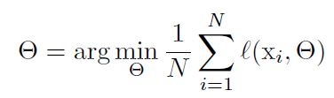
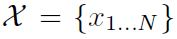
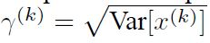
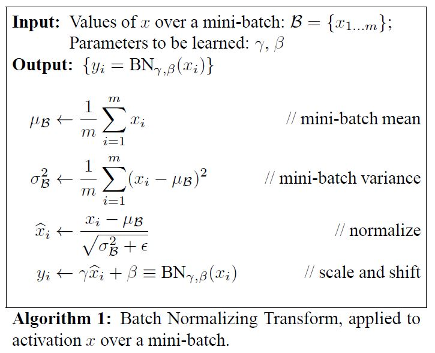

# Batch Normalization: Accelerating Deep Network Training by Reducing Internal Covariate Shift

Sergey Ioffe(Google Inc.), Christian Szegedy(Google Inc.)

## Abstract

딥러닝 네트워크를 훈련시키는 것은 쉽지 않은 일이다. 그 이유는 모델 파라미터가 계속 변하게 되면 계층의 연산을 통해서 나오는 출력(다음 레이어의 입력)의 분포가 계속 달라지기 때문이다. 그래서 결과적으로 학습률과 초기 파라미터 값을 잘 설정해야하기 때문에 학습이 느려진다. 무엇보다도 비선형성의 Saturating 현상(activation 값이 0이 되어서 역전파 시에 모델 파라미터 업데이트가 되지 않는 현상)때문에 모델의 학습이 매우 어렵다. 저자들은 각 계층 입력 값의 분포 때문에 생기는 이런 현상을 Internal covariate shift라고 명명했다. 이를 해결하기 위해서 학습 데이터의 mini-batch에 대해서 정규화를 시행했다. 이것은 높은 학습률과 덜 민감한 초기화를 가능하게 한다. 또, BN의 규제의 역할도 할 수 있기 때문에 어떤 경우에는 Dropout를 제거하는 것도 가능하게 한다. ImageNet 분류 문제에서는 심지어 사람이 분류했을때의 정확도보다 더 정확도가 높기도 했다. 

## Introduction

SGD는 딥러닝 네트워크를 훈련시키는 효율적인 방법으로 알려져 있으며 여러 가지 파생 알고리즘도 존재한다(momentum, Adagrad 등). SGD는 다음과 같은 방법으로 모델파라미터 Θ를 업데이트 시킨다. 

여기서 x1 ... xN은 훈련 데이터, L은 손실함수. SGD로 모델을 업데이트 하면서 훈련 단계마다 전체 훈련 셋을 사용하기 보다는 m개의 min-batch 훈련 셋을 사용한다. 미니 배치 훈련셋 x1 ... xm에 대해서 손실 함수에서 각 파라미터와 관련된 Gradient을 다음과 같이 계산한다.

데이터 1개씩 m번 계산하는 것보다 m개의 미니 배치 훈련 데이터로 훈련하는 것의 장점은 2가지가 있다.

- 미니 배치 훈련셋의 손실 Gradient는 전체 훈련 셋의 Gradient에 대한 추정치가 된다. 이는 m이 커질수록 더 근사된다. 
- 병렬 컴퓨팅 기술이 발전하면서 1개씩 m번 하는 것보다 m개의 미니 배치 훈련 데이터셋으로 훈련하는 방법이 더 효율적이다.

SGD가 단순하고 효율적이긴 하나 학습률과 같은 최적화와 관련된 파라미터을 주의 깊게 설정해야 하고 모델 파라미터의 초깃값을 잘 설정할 필요가 있다. 딥러닝 모델에서 각 계층은 주로 선형적으로 연결되어 있으므로 각 계층은 이전 계층들에 영향을 받는다. 예를 들어서 모델의 낮은 층의 작은 변화가 깊은 층에 크게 영향을 줄 수 있고 이는 모델의 깊이가 깊어질수록 심해진다. 계층의 입력 데이터의 분포가 달라지는 것은 문제가 된다. 왜냐하면 각 계층이 달라진 입력 데이터 분포에 적응해야 하기 때문이다. 전체적인 학습 시스템의 입력 데이터의 분포가 바뀌는 이런 현상을 Covariate shift라고 하고 주로 Domain adaptation으로 해결해왔다. 그러나 비단 전체 시스템뿐만 아니고 시스템의 서브 시스템에도 이런 개념을 확장해서 생각해볼 수 있다.  다음과 같은 네트워크가 있다고 가정하면

여기서 F1(u, Θ1)  F2의 입력 x라고 가정하면 다음과 같이 나타낼 수 있다.

이때 Θ2의 업데이트는 다음과 같이 이루어진다.

만약에 x의 분포가 훈련이 진행되도 거의 고정되어 있다면 Θ2를 이 x의 분포 변화에 맞게 재조정할 필요가 없어진다.

입력 값 분포의 고정은 하나의 서브 시스템의 밖에서도 이 서브 시스템의 훈련 효율성에 긍정적인 효과를 미칠수 있다. 

u를 입력 데이터, W, b는 각각 훈련이 가능한 가중치와 편향값이라고 하고 z를 다음과 같은 g 활성화 함수의 출력 activation이라고 가정한다.

위에서 x의 절대값이 커질수록 g'(x)은 0에 가까워질 것이다. 이것은 u로 흘러들어가는 Gradient가 거의 사라지고 훈련 진행이 느려질 것이라는 것을 의미한다. x는 W, b의 영향을 받으므로 훈련 중에 W, b의 변화로 인해서 activation의 Saturation이, 네트워크가 깊어질수록 심해진다. 이를 해결하기 위해서 ReLU 활성화 함수나 Glorot 가중치 초기화 방법을 사용하기도 한다. 그런데 만약에 비선형 함수를 거친 activation의 분포가 훈련 과정 중에 안정적이라는 것이 보장된다면, 그래서 Gradient가 Saturation 현상을 겪지 않게 된다면 훈련 진행에 가속도가 붙게 될 것이다. 

저자들은 네트워크의 내부 노드에서의 이런 변화를 Internal Covariate Shift라고 이름 붙였다. 이 문제를 해결하는 방법으로 Batch Normalization 기법을 제시했다. BN을 통해서 각 계층의 입력 값의 평균과 분산 통계치를 거의 고정시킨다. 이렇게 함으로서 가중치 초기값이나 스케일에 대한 의존성을 줄이게 된다. 

## Towards Reducing Internal Covariate Shift

저자들은 여기서 Internal Covariate Shift의 정의를 정확히 기술했다. 이것은 네트워크 훈련간에 발생하는 모델 파라미터의 변화로 인해서 발생하는 네트워크의 activation의 변화이다. LeCun 등의 연구에 따르면 네트워크의 입력 데이터가 whitened 된다면 훈련 성능의 수렴이 더 빨라진다고 한다. 예를 들어서 평균이 0, 분산이 1인 선형 변환이나 Decorrelated 같은 것들이 있다. 각 계층의 입력은 이전 계층들에 의해서 만들어지므로 계층마다 같은 whitening을 수행하면 이점이 있다. 저자들은 Internal covariate shift의 부정적인 효과를 없애고 입력 데이터의 분포를 고정시키 위해서 각 계층의 입력을 whitening 했다고 한다.

activation whitening은 매 훈련 단계나 특정 주기에 수행되었고 네트워크를 직접적으로 수정하거나 네트워크 activation 값에 따라 최적화 알고리즘의 매개변수를 바꾸는 방법으로 수행되었다. 만약에 이런 수정이 최적화 단계에 끼어들게 되면 경사 하강 단계에서, 뭔가가 업데이트 되어야 하는 정규화 방법에서 파라미터를 업데이트 하는 것을 수행하게 된다. 이는 경사 하강 단계에서의 효율성을 떨어트린다. 예를 들어서 입력 u와 학습이 가능한 편향 b가 어떤 계층에 있고 후년 데이터의 평균을 빼는 방법으로 정규화 한다고 가정하면 

| 정규화                                                       | 입력 데이터                                                  | 훈련 셋                                                      | 평균                                                         |
| ------------------------------------------------------------ | ------------------------------------------------------------ | ------------------------------------------------------------ | ------------------------------------------------------------ |
|  |  |  |  |

만약에 경사 하강 단계에서 b에 대한 평균값의 의존성을 무시한다면 b는 다음과 같이 업데이트 될 것이다.

(Δb는 정규화된 입력 데이터의 변화량 대한 손실 값의 변화량의 음수 값에 비례한다.)

이렇게 되면 다음과 같이 b에 대한 업데이트와 정규화 과정에서의 변화가 계층의 출력에 아무런 변화를 일으키지 않고 결과적으로 손실에도 별다른 변화를 일으키지 못하게 된다.

훈련이 계속될수록 b는 계속 커지지만 손실 값은 변화가 없어지게 된다. 이는 편향에 대한 shift 뿐만 아니고 가중치에 의한 스케일링이 추가되면 더 심각해진다. 

따라서 저자들에 의하면 네트워크의 어떤 파라미터든 학습이 가능하다면 이상적인 분포를 이루어야 한다. x를 어느 한 계층의 입력 벡터라고 하고 X를 이런 훈련 벡터들의 집합이라고 한다면 정규화는 다음과 같은 변환으로 나타낼 수 있다.

 

(위 식은 단순히 x에만 의존적인 것이 아니라 X에 있는 모든 데이터에 의존적이다. x가 만약에 다른 계층들에 의해서 만들어진다면 X에 있는 요소들은 Θ에 의존적이다.)

역전파 시에 다음과 같은 야코비(Jacobian) 행렬을 계산해야 한다.

바로 전에 기술된대로 입력 값x을 제외한 다른 학습 가능한 파라미터를 무시하면 모델이 결국 폭파될 것이다.  각 계층의 입력을 whitening 하는 것은 많은 노력이 소요된다. 왜냐하면 다음과 같은 공분산 행렬을 계산해야하고 이것의 역제곱근을 계산해하기 때문이다(whitening 과정에서 분산의 제곱근으로 나눠주게 되므로). 또 역전파 할 때 이런 변환들의 미분도 계산해야 한다.

| 공분산행렬                                                   | Whitening                                                    |
| ------------------------------------------------------------ | ------------------------------------------------------------ |
|  |  |

그래서 저자들은 미분 가능하면서도 매번 파라미터를 갱신할 때마다 전체 훈련 셋에 대한 통계치를 계산할 필요가 없는 입력 데이터 정규화 방법을 추구하게 되었다. 그러면서 전체 데이터 셋의 통계치와 어느정도 관련성이 있는 방법을 구상하게 되었다. 

## Normalization via Mini-Batch Statistics

모든 계층의 입력을 whitening 하는 것은 힘들기도 하고 모든 곳이 미분 가능한 것도 아니기 때문에 저자들은 두 가지를 가정했다. 첫번째는 계층의 입력과 출력의 특징들을 유기적으로 whitening하는 것 대신에 각 특징들을 독립적으로, 평균 0, 분산 1이 되도록 정규화한다. d 차원의 입력 x = (x1, ..., xd)에 대해서 각 차원을 다음과 같이 정규화 했다.

여기서 평균과 분산은 훈련 데이터 셋과 관련해서 계산한다. 이렇게 하면 각 특징들이 관련 있지 않아도 성능이 더 빨리 수렴된다. 

그런데 계층의 각 입력을 단순히 정규화하는 것은 계층이 표현할 수 있는 것들을 변경할 가능성이 있다. 예를 들어서 시그모이드의 입력을 정규화하는 것은 비선형 활성화 함수를 사용함에도 불구하고 비선형성을 추가하지 못할 수 있다. 이런 이슈를 처리하기 위해서 저자들은 네트워크에 추가되는 이런 변환들은 항등 변환을 나타낼 수 있는지 여부를 확실하게 했다. 그래서 각 정규화된 입력들을 스케일링하고 Shift하는 파라미터를 추가했다. 

추가된 γ, β는 훈련 중 모델 파라미터와 더불어 학습이 가능하며 네트워크의 원래 표현력을 회복한다. 

| 감마                                                         | 베타                                                         |
| ------------------------------------------------------------ | ------------------------------------------------------------ |
|  |  |

위와 같이 셋팅해서, 만약에 최적화 하는데 필요하다면 원래의 activation을 회복한다(전체 데이터에 대한 분산과 평균).

두번째 가정은 mini-batch를 Stochastic gradient 훈련 과정에서 사용하기 때문에 각 mini-batch는  각 activation의 평균과 분산의 추정치를 만들어 낸다는 것이다.  이 방법으로는 정규화 하는데 사용된 통계치들이 완전하게 역전파 때 사용될 수 있다. 여기서 주의할 점은 mini-batch를 사용하는 것이 각 차원을 통합해서 구하는 공분산을 계싼하기 보다 차원 별로 계산함으로서 가능하다는 것이다. 만약에 통합해서 통계치를 구하게 되면 규제가 추가적으로 필요하게 된다. 왜냐하면 min-batch의 크기가 보통 whitening되는 activation의 수보다 작기 때문에 결과적으로 역행렬이 없는 공분산 행렬을 만들어낸다. 

크기가 m인 mini-batch Β가 있다고 가정한다. 정규화는 각 activation에 대해서 독립적으로 수행된다. 예를 들어서 그 중에 어떤 특정한 activation x^(k)가 있다고 한다(편의상 k 생략). 이 activation에는 m개의 값이 있다.

 

정규화된 입력을 다음과 같다고 하고,

이때의 선형 변환을 y1...m이라고 할 때, BN을 다음과 같이 나타낼 수 있다.

다음은 BN 알고리즘의 과정을 나타낸 것이다. 여기서 ε은 mini batch 분산의 안정화를 위해 추가된 값이다.

