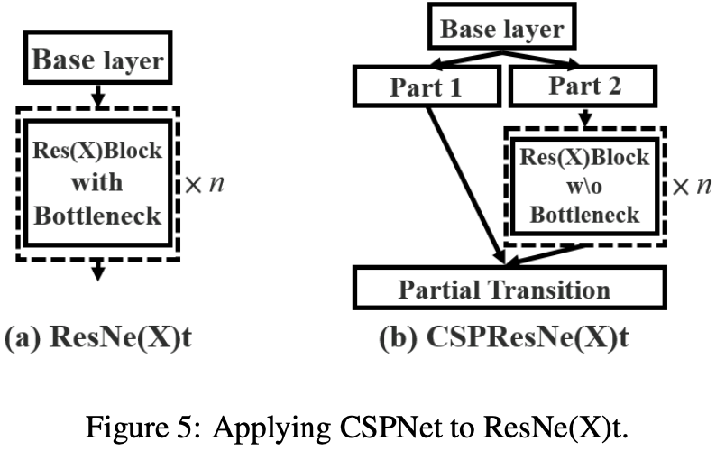

# CSPNET: A NEW BACKBONE THAT CAN ENHANCE LEARNING CAPABILITY OF CNN

Chien-Yao Wang(Institute of Information Science Academia Sinica, Taiwan),

Hong-Yuan Mark Liao(Institute of Information Science Academia Sinica, Taiwan),

I-Hau Yeh(Elan Microelectronics Corporation, Taiwan),

Yueh-Hua Wu(Institute of Information Science Academia Sinica, Taiwan),

Ping-Yang Chen(Department of Computer Science National Chiao Tung University, Taiwan),

Jun-Wei Hsieh(College of Artificial Intelligence and Green Energy National Chiao Tung University, Taiwan)

## Abstract

신경망 기반의 방식은 Object detection과 같은 컴퓨터 비전 Task에서 놀라운 결과를 낼 수 있게 했는데 문제는 컴퓨팅 리소스에 크게 의존한다는 것이다. 이 논문에서 저자들은 Cross Stage Partial Network(CSPNet)이라는 것을 제시해서 이 문제를 완화시키고자 했다. 저자들은 네트워크 단의 무거운 연산량이 네트워크 최적화 과정에서 그래디언트 정보가 복제되기 때문에 발생한다고 보았다. 그래서 네트워크 각 Stage의 시작과 끝의 Feature map을 합치는 방법으로 그래디언트의 변동성을 고려했더니 성능이 더 좋아졌다. 저자들이 말하길 CSPNet은 구현하기 쉽고 ResNet, ResNeXt, DenseNet 계열의 아키텍처에서 구현해도 충분히 일반화 잘 된다고 한다. 

## Introduction

네트워크가 깊고 넓을수록 강력하다는 것은 잘 알려진 사실이지만 네트워크를 확장하는것은 필연적으로 더 많은 연산량을 필요로 한다. 그래서 애초에 Object detection과 같이 연산량을 많이 요구하는 Task에서는 깊고 넓은 네트워크를 사용하기 쉽지 않다. 경량 컴퓨팅 시스템은 주목을 받게 된 이유는 실제 애플리케이션이 주로 작은 디바이스에서의 빠른 추론을 요구하기 때문인데 이는 컴퓨터 비전 알고리즘에게는 도전적인 일이다. 몇몇 연구가 모바일 CPU를 위해 디자인되긴 했으나 Depth-wise separable 컨볼루션 같이, 이런 종류의 연구는 상업적으로 사용되는 IC 디자인과는 맞지 않다. 그래서 저자들은 ResNet, ResNeXt, DenseNet과 같은 방식에서 컴퓨팅 연산의 부담이 얼마나 되는지를 조사했다. 그리고 저자들은 앞서 언급한 네트워크들이, 성능을 저해하지 않으면서도 CPU와 모바일 GPU에 배치 될 수 있도록 하는, 연산적으로 효율적인 요소들을 개발했다. 

저자들은 CSPNet의 주요 목적이, 앞서 언급한 네트워크들을 사용하여, 연산량을 줄이면서 더 풍부한 그래디언트 조합을 달성할 수 있도록 하는 것이라고 했다. 이를 위해서 각 Stage의 Base 계층의 Feature map을 두 부분으로 나누고 난 다음 이 연구에서 제안하는 Cross-stage hierarchy로 다시 합친다. 다시 말해서 주요 컨셉은 그래디언트 흐름을 나눠서 각기 다른 네트워크 내의 경로를 통해서 그래디언트가 전파 될 수 있게 하는 것이다. 이런 방법으로 저자들은 Concatenation과 Transition 단계를 바꿈으로서 전파된 그래디언트 정보가 큰 상관관계의 차이를 보임을 확인했다. 게다가 CSPNet은 아래 그림과 같이 계산량을 크게 줄이면서도 정확도와 추론 속도를 개선시켰다. 

| BFLOPS                                                       | FPS                                                          |
| ------------------------------------------------------------ | ------------------------------------------------------------ |
|  |  |

CSPNet 기반의 Object detector들은 다음과 같은 세가지 문제를 다룬다. 

- CNN의 학습 능력을 강화시킨다 - 보통 경량화 후에 CNN의 정확도가 낮아지는데 저자들은 CNN의 학습 능력을 강화시켜서 경량화 중에도 정확도를 유지할 수 있기를 원했다. CSPNet을 위에서 언급한 네트워크에 적용하고 나서 10~20퍼센트 연산량이 줄어들 수 있다. 그런데 저자들에 따르면 ImageNet 데이터셋에서 오히려 원본 네트워크의 성능보다 더 좋았다고 한다. 
- 연산 과정에서의 Bottleneck부분을 제거한다 - 너무 높은 연산 과정 중의 Bottleneck은 추론 과정을 끝내기 위해서 더 많은 Cycle을 수행하게 한다던지 어떤 요소들을 Idle 상태에 놓이게 한다던지 하는 결과를 나타나게 한다. 그래서 저자들은 CNN의 각 계층의 연산량을 고르게 분배하고 각 연산 요소들의 활용도를 높여서 불필요한 연산을 줄이는데 관심을 뒀다. 저자들에 따르면 CSPNet으로 PeleeNet의 Bottleneck을 거의 반으로 줄였다고 한다. 그리고 MS COCO 데이터셋으로 수행한 Object detection 실험의 경웅는 YOLOv3 기반 모델에서 테스트 했을때 80% 정도의 연산 Bottleneck을 줄였다고 한다.
- Memory 사용량을 줄인다 - 메모리 사용량을 줄이기 위해서 저자들은 Cross-channel pooling 연산을 도입해서 Feature pyramid 생성 과정 중에 Feature map을 압축했다. 이 방법으로 CSPNet Object detector는 PeleeNet Backbone 모델의 Feature pyramid 생성 중의 메모리 사용량의 75%를 줄였다. 

저자들에 의하면 CSPNet이 CNN의 학습 능력을 증가시키기 때문에 정확도 높은 모델을 만드는 목적이 있음에도 불구하고 작은 모델을 사용했다고 한다. 그리고 CSPNet은 메모리 트래픽의 상당한 양을 절감했다. 또한 CSPNet은 연산과정 중에 Bottleneck을 상당히 줄이고 Exact Fusion Model(EFM)이 효율적으로 필요한 메모리 대역폭을 줄인다고 한다. 

## Related work

### CNN architectures design

본문 참고.

### Real-time object detector

본문 참고.

## Method

### Cross Stage Partial Network

#### DenseNet

Figure 2(a)는 DenseNet의 구조를 보여준다. DenseNet의 각 Stage는 Denseblock과 Transition 계층을 포함하고 있다. 그리고 각 Denseblock은 k개의 Dense 계층들로 이루어져 있다. i번째 Dense 계층의 출력은 i번째 Dense 계층의 입력과 Concatenated되고 이 결과물은 i+1번째 Dense 계층의 입력이 된다. 이 매커니즘을 식으로 표현하면 아래와 같다. 

*는 컨볼루션 연산을 의미하고 [x0, x1, ...]는 x0, x1, ...의 Concatanation 연산을 의미하며 wi와 xi는 각각 i번째 Dense 계츠으이 가중치와 출력을 의미한다. 역전파 시에 가중치를 업데이트할 때의 식은 아래와 같다.

f는 가중치 업데이트 함수이고 gi는 i번째 Dense 계층으로 전파된 그래디언트를 의미한다. 저자들이 여기서 발견한 사실은 많은 양의 그래디언트 정보가 각기 다른 계층의 가중치를 업데이트를 위해서 사용되는데 재사용된다는 사실이다. 이로 인해서 서로 다른 Dense 계층들이 반복적으로 복사된 그래디언트 정보를 학습한다. 

#### Cross Stage Partial DenseNet

CSPDenseNet의 아키텍처는 Figure 2(b)에 나와 있다. CSPDenseNet의 각 Stage는 부분적인 Denseblock과 부분적인 Transition 계층으로 구성된다. 부분적인 Denseblock에서 Base 계층의 Feature map들은 두 부분으로 나눠져서 x0 = [x0', x0'']가 된다. x0''와 x0'에 관해서 전자는 곧바로 그 단계의 마지막 부분으로 연결되고 후자는 Denseblock을 거친다. 부분적인 Transition 계층의 단계는 다음과 같다. 

1. Dense 계층의 출력인 [x0'', x1, ..., xk]은 Transition 계층을 거친다. 
2. Transition 계층의 출력인 xT는 x0''와 Concatenated되고 다른 Transition 계층을 거친다. 그러면 xU가 생성된다. CSPDenseNet의 순전파와 가중치 업데이트 식은 아래와 같다. 

| CSPDenseNet 순전파                                           | CSPDenseNet 가중치 업데이트                                  |
| ------------------------------------------------------------ | ------------------------------------------------------------ |
|  |  |

가중치 업데이트 식을 보면 Dense 계층에서 흘러들어온 그래디언트가 각각 합쳐지는 것을 볼 수 있다. 다른 한 편, Dense 계층들을 거치치지 않은 Feature map x0' 역시 따로 합쳐지는 것을 확인할 수 있다. 가중치를 업데이트 하기 위한 그래디언트 정보에 대해서 두 경로 모두 상대 경로에 속한, 중복된 그래디언트 정보는 포함하지 않는다. 

결론적으로 CSPDenseNet은 DenseNet의 Feature를 재사용한다는 특징의 이점은 보존하면서 동시에, 그래디언트 흐름을 짤라내서 과도하게 그래디언트 정보가 중복되는 것을 방지한다. 

#### Partial Dense Block

부분적인 Denseblock을 디자인 한 목적은 다음과 같다.

- 그래디언트 흐름 경로 증가: 나누고 합치는 접근 방식으로 그래디언트가 흐르는 경로는 두배가 된다. 이런 Crosos-stage 전략 덕분에 Concatenation을 위해서 Feature map을 복사하기 때문에 발생하는 단점을 경감한다.
- 각 계층의 연산 부담의 균형: 보통 DenseNet에서는 Base 계층의 채널 수가 Growth rate보다 훨씬 크다. 부분적인 Dense block의 Dense 계층 연산에 포함되어 있는 Base 계층의 채널 수는 원본 DenseNet의 경우의 거의 절반밖에 되지 않기 때문에 원본에서의 연산 Bottleneck의 거의 절반 가량을 해결 할 수 있다. 
- 메모리 트래픽 감소: Denseblock의 Base feature map 크기가 w x h x c, Growth rate가 d라고 가정하고 총 m개의 Dense 계층이 있다고 가정하면 Dense block의 CIO는 (c x m) + ((m^2 + m) x d) /2가 되고 부분적인 Dense block의 CIO는 ((c x m) + (m^2 + m) x d) / 2가 된다. m과 d가 보통 C보다 훨씬 작을때 부분적인 Dense block은 최대 절반에 가까운 네트워크의 메모리 트래픽을 줄일 수 있다. 

#### Partial Transition Layer

부분적인 Transition 계층을 디자인한 목적은 그래디언트 조합의 다양성을 극대화 하기 위해서이다. 부분적인 Transition 계층은 Hierarchical feature fusion 매커니즘인데 각 계층이 중복된 그래디언트 정보를 학습하는 것을 방지 하기 위해서 그래디언트 흐름을 짤라내는 전략을 사용한다. 여기서 저자들은 CSPDenseNet의 두 가지 변경체를 디자인해서 그래디언트 흐름을 짤라내는 것이 네트워크의 학습 능력에 어떤 영향을 끼치는지 알아봤다. 

Figure 3(c)와 3(d)는 두 가지 방식의 Fusion을 나타낸다. CSP-Fusion first는 두 가지 경로에 의해서 만들어진 Feature map들을 Concatenation하고 나서 Transition 연산을 수행한다. 이렇게 하면 많은 양의 그래디언트 정보가 다시 사용된다. CSP-Fusion last에서는 Dense block에서의 출력이 Transition 계층을 거치고 난 다음에 두 경로에서의 Feature map들이 합쳐진다. 이때는 그래디언트 흐름이 짤라지기 때문에 그래디언트 정보가 재사용되지 않는다. 아래 그림은 Figure 3의 구조를 적용한 각 아키텍처로 Image classification을 수행했을 때 결과를 나타낸다. 

Figure 4를 보면 CSP-Fusion last를 도입하여 Image classification을 수행하면 연산량은 상당히 줄어들고 Top-1 accuracy가 0.1% 떨어지는 것을 볼 수 있다. CSP Fusion first를 도입해도 연산량이 줄어드는데 Top-1 accuracy가 1.5% 줄어드는 것을 확인할 수 있다. 이런 방식의, 여러 Stage 걸친, 분할 및 병합 접근 방식을 사용해서 정보가 합쳐지는 과정 중에 정보의 중복이 발생할 가능성을 줄일 수 있다. Figure 4의 결과대로 반복되는 그래디언트 정보를 줄이면 네트워크의 학습 능력이 상당히 개선될 수 있다. 

#### Apply CSPNet to Other Architectures

CSPNet은 쉽게 ResNet과 ResNeXt에 적용될 수 있다. 아키텍처는 아래 Figure 5와 같다. 

 

오직 Feature channel의 절반만이 Res(X)Block을 거치기 때문에 Bottleneck 계층을 도입할 이유가 없어진다. 이것은 FLOPs가 고정되어 있을 때 Memory Access Cost(MAC)의 이론적 하한선을 생기게 한다. 

### Exact Fusion Model

#### Looking Exactly to predict perfectly

저자들은 각 Anchor에 관한 적절한 Field of View(FoV)를 캐치하는 EFM을 제안했는데 이는 One-stage object detector의 정확도를 강화할 수 있다고 한다. Segmentation에서는 픽셀 수준의 레이블은 보통 전역적인 정보를 포함하고 있지 않기 때문에 더 나은 정보 탐색을 위해서는 픽셀 수준보다 큰 패치를 고려하는 것이 선호된다. 그러나 Image classification과 Object detection의 경우는 이미지 수준이나 바운딩 박스 수준의 레이블을 관찰했을때 몇몇의 중요 정보를 탐지하는데 방해될 수도 있다. Li 등에 의하면 CNN은 자주 이미지 수준의 레이블로 학습시킬때 정보를 잘 못찾는 경향이 있고 이 때문에 Two-stage detector가 One-stage detector보다 정확도가 더 높다고 한다. 

#### Aggregate Feature Pyramid

여기서 제안한 EFM은 초기 Feature pyramid의 Feature들을 잘 집계할 수 있다고 한다. YOLOv3에 기반한 EFM은 각 GT에 정확히 한 개의 바운딩 박스 Prior를 할당한다. 각 GT 박스는 IoU 임계점을 넘은 하나의 Anchor 박스와 매칭된다. 만약에 Anchor 박스의 크기가 격자 Cell의 FoV와 같다면 S번째 크기의 격자 Cell들에 관해서는 매칭되는 바운딩 박스들의 크기가 최저 (S-1)번째 크기 최고 (S+1)번째 크기가 된다. 그러므로 EFM은 세 가지 Scale에서 Feature들을 모으게 된다. 

#### Balance Computation

Feature pyramid로부터 Cancatenated된 Feature map들은 매우 많기 때문에 어마한 양의 메모리 양과 연산량을 필요로 한다. 이 문제를 경감시키기 위해서 저자들은 Feature map들을 압축하기 위한 Maxout 기법을 적용했다. 

## Experiments

저자들은 CSPNet의 성능을 검증하기 위해서 ILSVRC 2012에서 사용된 ImageNet Image classification 데이터셋을 사용했고 EFM의 유용성을 확인하기 위해서 MS COCO object detection 데이터셋을 사용했다. 

### Implementation Details

실험에 관한 하이퍼파라미터 설정은 본문 참고.

### Ablation Experiments

#### Ablation study of CSPNet on ImageNet

CSPNet과 관련된 Ablation study에서 저자들은 PeleeNet을 Baseline으로 하고 ImageNet이 성능을 측정하기 위해서 사용되었다. 저자들은 각기 다른 Partial ratio 값 γ과 각기 다른 Feature fusion 전략을 적용해서 실험했다. 밑에 Table 1은 그 결과를 보여준다. SPeleeNet과 PeleeNeXt는 PeleeNet에 각각 Sparse connection과 Group 컨볼루션을 적용한 아키텍처이다. CSP(Fusion first)와 CSP(Fusion last)가 부분 Transition의 이점을 검증하기 위해서 본문에서 제안된 전략이다. 

#### Ablation study of EFM on MS COCO

다음으로 저자들은 MS COCO 데이터셋으로 EFM에 관한 Ablation study를 수행했다. 여기서 저자들은 아래 Figure 6에 나와 있는 세 가지 다른 Feature fusion 전략을 비교했다. 

저자들은 비교를 위해서 두 가지 경량적인 모델인 PRN과 ThunderNet을 선택했다. PRN은 비교를 위해서 사용된 Feature  pyramid 아키텍처이고 ThunderNet과 Context Enhancement Module(CEM) 그리고 Spatial Attention Module(SAM)은 비교를 위해서 선택된 전역 Fusion 아키텍처이다. 저자들은 Global Fusion Model(GFM)을 EFM과 비교하기 위해서 디자인했다. 여기다가 Ablation study를 위해서 GIoU, SPP 그리고 SAM이 EFM에 적용되었다. Table 2에 나와 있는 결과는 모두 CSPPeleeNet을 Backbone으로 사용했다.

### ImageNet Image Classification

저자들은 CSPNet을 여러 아키텍처에 적용했고 그 실험 결과는 아래 Table 3에 나와 있다. 

#### MS COCO Object Detection

Object detection과 관련해서 저자들은 세가지 시나리오를 세웠다. 

- GPU에서의 실시간: PANet(SPP)를 적용한 CSPResNeXt50
- 모바일 GPU에서의 실시간: EFM(SAM)을 적용한 CSPPeleeNet, CSPPeleeNet Reference, CSPDenseNet Reference 
- CPU에서의 실시간: PRN을 적용한 CSPPeleeNet Reference, CSPDenseNet Reference

결과는 Table 4에 나와 있다. 

