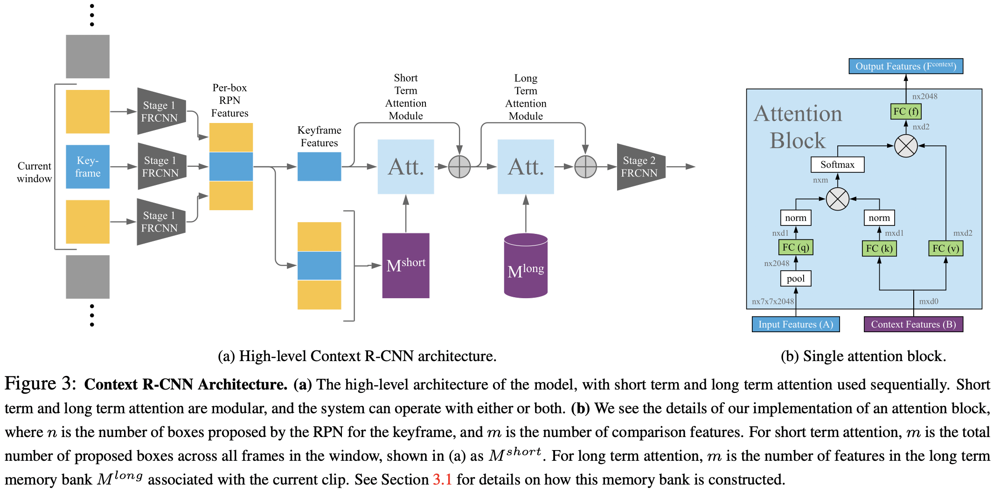
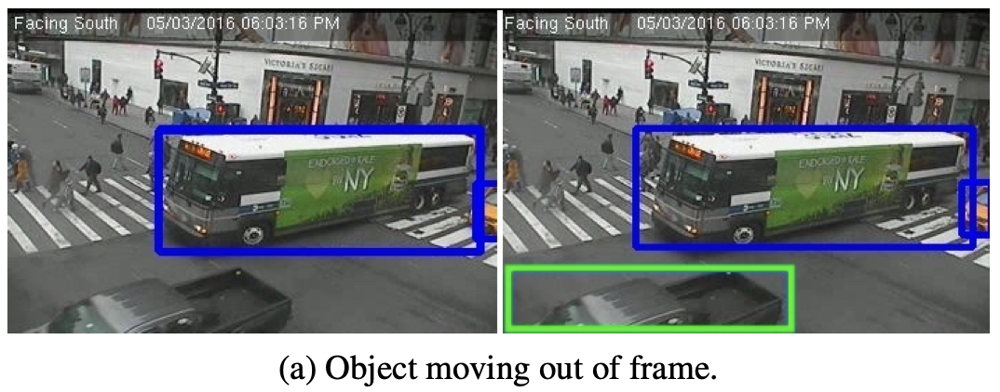
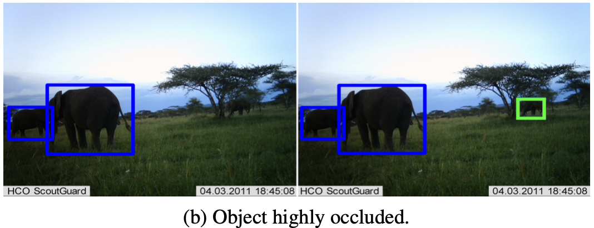
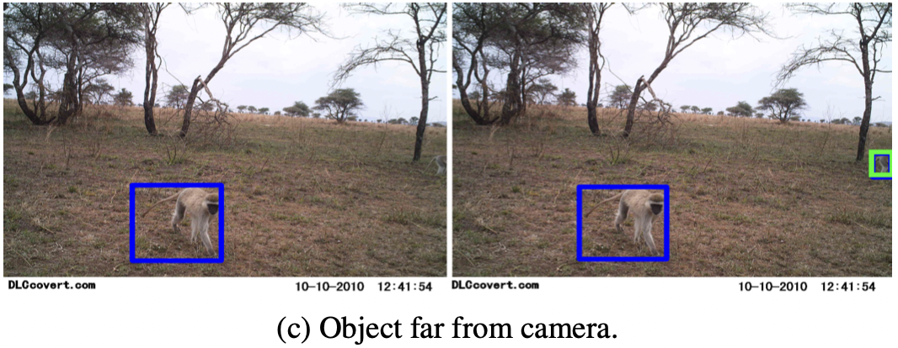
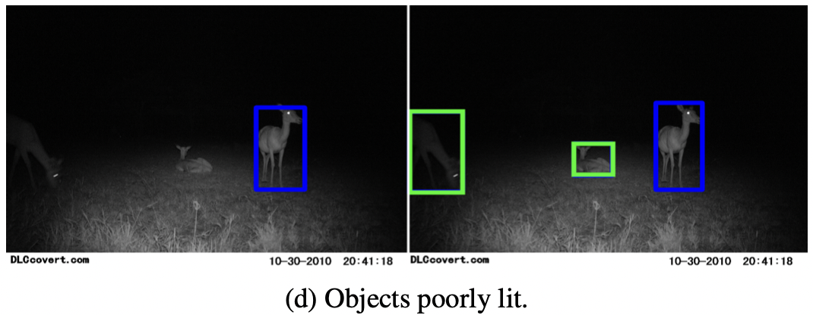
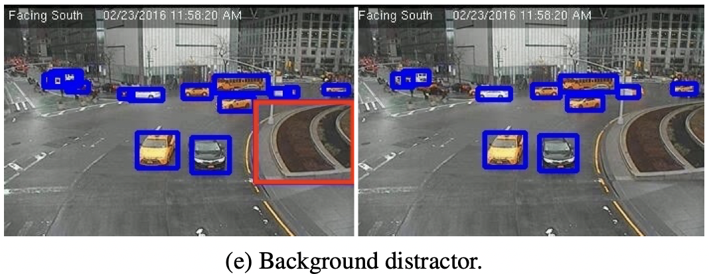
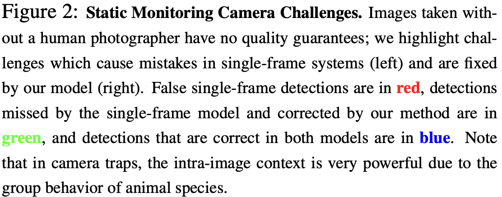

# Context R-CNN: Long Term Temporal Context for Per-Camera Object Detection

Sara Beery(California Institute of Technology, Google), Guanhang Wu, Vivek Rathod, Ronny Votel, Jonathan Huang(Google)

## Abstract

정적으로 고정되어 있는 카메라의 경우, 유용한 Contextual 정보가 몇초를 넘어서 늘어날 수 있다. 유용한 Contextual 정보란 다음과 같은 것이다. 영상 안의 객체가 여러 날 동안 비슷한 행동 패턴을 보인다거나 배경 객체가 영상 안에서 바뀌지 않고 똑같은 모습으로 남아 있는 것이다. 전력이나 저장 상의 제약 사항때문에 샘플링 빈도가 낮거나 1 FPS보다 느리거나 모션 인식 될때 촬영하는 것 때문에 불규칙적으로 찍힐 수도 있다. 이런 환경에서 모델의 성능을 높이기 위해서는 비규칙적인 샘플링 비율에 모델이 Robust해야 한다. 본 연구에서는 이런 카메라에서 모델의 성능을 개선하기 위해서 Temporal context을 이용하는 방법을 제안했다. 구체적으로 저자들은 저자들의 모델인 Context R-CNN이 카메라 단위로 구축된 장기 기억 Bank에 색인을 할 수 있도록 하는 Attention 기반의 접근 방법을 제안했다. 이 방법은 또한 현재 대상이 되는 Frame에서의 Object Detection의 성능을 높이기 위해서 다른 Frame에서 Cotextual feature를 모은다. 

저자들은 두 가지 환경에서 Context R-CNN을 적용한다. 하나는 카메라 트랩을 사용한 종 탐지, 다른 하나는 교통 카메라에서 차량 탐지. 저자들은 또 Contextual time의 기간을 늘리는 것이 더 나은 결과를 보임을 확인했다. Snapshot Serengeti 데이터셋에서의 카메라 트랩 데이터에 적용할때, 한 달 동안의 이미지에서의 Context로 구동한 Context R-CNN의 모델의 성능은 단일 Frame 모델보다 성능(mAP)이 더 좋다. 

## Introduction

저자들은 위치가 고정적이고 오랜 시간 동안 Sparse하게 데이터를 모으는 카메라에서의 인식 성능을 개선하는 것을 추구했다. 이런 카메라에서의 모델 성을 개선시키기 힘든 이유는 촬영 기간 동안 획득한 유의미한 데이터가 거의 비어 있는(객체가 찍혀 있지 않은) 데이터이기 때문이다. 게다가 관심 대상이 영상에 찍혔다고 해도, 영상 중앙에 초점이 맞는 채로, 적절한 크기로 잘 찍힌다는 보장이 없다. 저자들은 이런 문제를 세 가지 카테고리로 나눴다. 이런 문제들은 단일 Frame의 Detection 네트워크가 탐지를 실패하도록 한다.

- 대상이 부분적으로만 영상에 찍힌다 - 객체가 카메라에 매우 가까운 위치에서 찍혀서 Frame 가장 자리에 폐색된 상태가 될 수도 있고 배경에 의해서 부분적으로 가려진 상태가 되거나 카메라에서 매우 멀리 떨어진 상태에서 찍힐 수도 있다. 
- 질 낮은 영상으로 찍힌다 - 조명이 어둡거나 초점이 흐릿하거나 눈이나 안개와 같은 기상 조건으로 인해 가려질 수 있다. 
- 산만하게 배경이 찍힌다 - 카메라의 위치를 옮길때 False positive를 반복적으로 일으키는 두드러진 배경 객체가 존재할 수 있다. 

위와 같은 경우는 사람이 보기에도 헷갈릴 수 있다. 그런데 이런 문제를 해결할 수 있는 가능성이 있다. 예를 들어서 대상 객체가 여러 날 동안 같은 패턴을 보인다던가 배경 객체가 움직이지 않고 계속 고정적으로 남아있다던가 하는 경우이다. 이런 경우에 같은 카메라로 찍힌 추가적인 Frame의 형태로 Temporal context를 모델에 제공하면 문제를 해결하는데 도움이 된다. 실제로 사람이 영상을 볼 때도 탐지하기 어려운 물체를 더 잘 보기 위해서 이전 영상을 다시 보기를 하기도 한다. 

이는 저자들에게, 같은 카메라에서의 탐지 모델의 성능을 개선하기 위해 상대적으로 탐지 여부가 쉬운 예제들을 찾아내거나 사용하는 법을 모델에 학습시키는 것에 대한 영감을 주었다. 

교통 카메라나 카메라 트랩 데이터의 경우 대상 클래스 분포에 있어서 Long-tailed(긴 시간 동안 촬영하면 유사한 패턴이 여러번 등장하는)의 특성이 있다. 그래서 다른, 등장이 빈번한 예제에서 출현 빈도가 적은 클래스를 위한 Context를 제공해서, 흔하게 탐지되는 클래스와 같이, 출현 빈도가 흔한 클래스에 대한 탐지 성능을 개선할 수 있다고 한다. 

구체적으로 저자들은 Context R-CNN이라고 하는 탐지 아키텍처를 제안했다. 이 아키텍처의 모델은 고정된 위치의 카메라로 탐지를 지속적으로 수행하는 동안 장기 기억 Bacnk로 인덱싱을 하는 법을 학습한다. 이 아키텍처는 유연하고 낮은 가변 프레임 속도의 환경에서도 적용 될 수 있다. 저자들이 말하길 저자들의 방법은 Faster R-CNN과 같은 높은 성능의 Parametric function의 (성능 상) 위에 있는 비모수 추정 방법(Nearest neighbors와 같은)으로 구성될 수 있다고 한다. 카메라의 훈련과 테스트의 위치가 꽤 다르다고 하더라도, Parametric 함수가 잘 일반화 하기 힘들 것으로 예측되는 것에 반해 Context R-CNN의 경우, 일반화 성능을 개선하기 위해서 테스트 예제들의 레이블링 되어 있지 않은 Neighborhood를 이용할 수 있다. 

저자들은 다음과 같은 두 시나리오의 도메인에 집중했다.

- 카메라 트랩은 원거리에서 카메라로 모니터링 할때 쓰는 방법으로 생물학자들이 동물 종의 출현 빈도, 개체 수, 행동을 연구하기 위해 사용한다. 
- 교통 카메라는 도시의 교통 패턴을 분석하기 위해서 교차로나 차로를 고정된 위치에서 모니터링 한다. 

두 도메인 모두 하나의 카메라 위치에서 Contextual signal은 강한 편이기 때문에 네트워크가 현재 Frame과 연관성 있는 (전에 찍힌) 영상이 무엇인지 결정할 수 있게한다(두 Frame이 시간적으로 얼마나 떨어져 있는지 상관 없이). 이것은 객체가 주기적으로 여러 날 혹은 여러 주 떨어져서 습관적인 행동을 보이는 환경에서 중요하다. 

저자들이 말하는 이 연구의 기여하는 바는 다음과 같다. 

- 저자들은 Context R-CNN을 제안했다. 이 모델에서는 유효 Frame 비율이나 Frame을 샘플링 하는 주기가 불규적임에도 불구하고 Object Detection의 성능을 개선할 수 있도록 시간적 Context를 이용할 수 있다. 
- 저자들이 말하길 Single-frame 모델의 성능을 뛰어넘었다고 한다.
- Context R-CNN으로 한달의 Context를 이용할 수 있다고 한다. 

## Related Work

Single frame object detection, video object detection, object-level attention-based temporal aggregation methods, camera traps and other visual monitoring systems와 관련된 여러 연구에 대한 내용은 본문 참고. 

