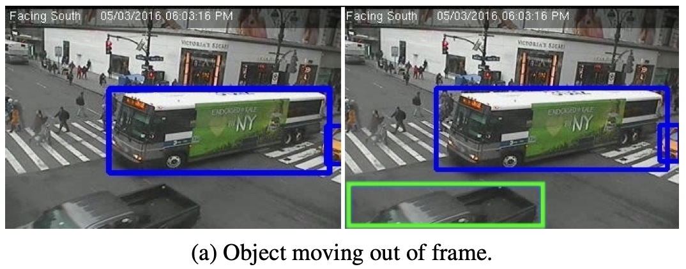
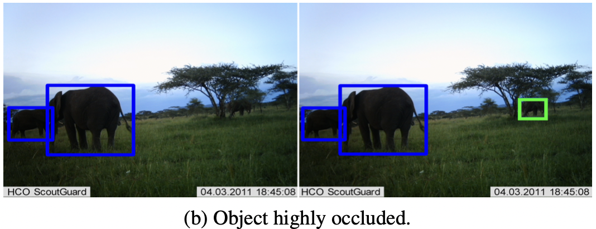
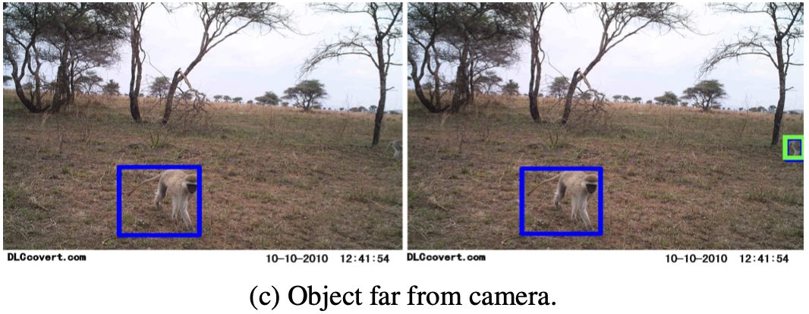
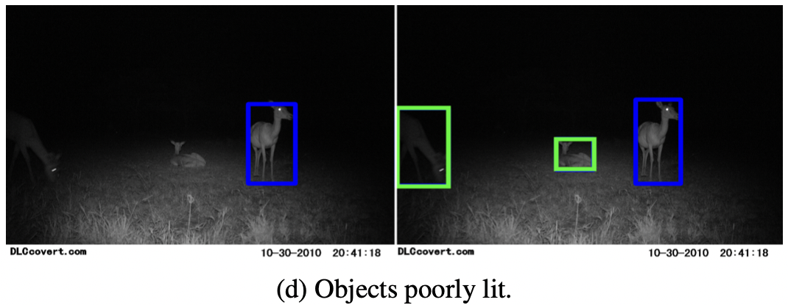
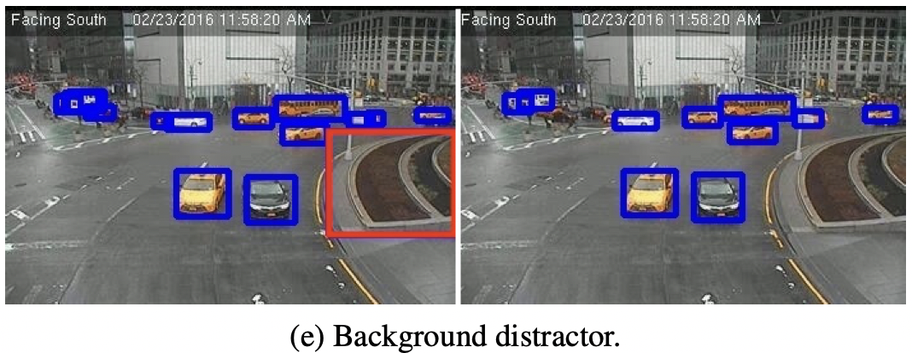
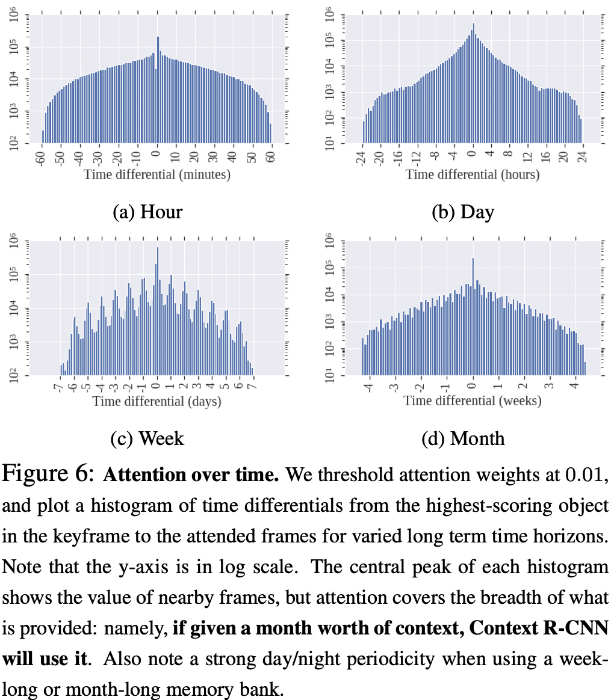

# Context R-CNN: Long Term Temporal Context for Per-Camera Object Detection

Sara Beery(California Institute of Technology, Google), Guanhang Wu, Vivek Rathod, Ronny Votel, Jonathan Huang(Google)

## Abstract

정적으로 고정되어 있는 카메라의 경우, 유용한 Contextual 정보가 몇초를 넘어서 늘어날 수 있다. 유용한 Contextual 정보란 다음과 같은 것이다. 영상 안의 객체가 여러 날 동안 비슷한 행동 패턴을 보인다거나 배경 객체가 영상 안에서 바뀌지 않고 똑같은 모습으로 남아 있는 것이다. 전력이나 저장 상의 제약 사항때문에 샘플링 빈도가 낮거나 1 FPS보다 느리거나 모션 인식 될때 촬영하는 것 때문에 불규칙적으로 찍힐 수도 있다. 이런 환경에서 모델의 성능을 높이기 위해서는 비규칙적인 샘플링 비율에 모델이 Robust해야 한다. 본 연구에서는 이런 카메라에서 모델의 성능을 개선하기 위해서 Temporal context을 이용하는 방법을 제안했다. 구체적으로 저자들은 저자들의 모델인 Context R-CNN이 카메라 단위로 구축된 장기 기억 Bank에 색인을 할 수 있도록 하는 Attention 기반의 접근 방법을 제안했다. 이 방법은 또한 현재 대상이 되는 Frame에서의 Object Detection의 성능을 높이기 위해서 다른 Frame에서 Cotextual feature를 모은다. 

저자들은 두 가지 환경에서 Context R-CNN을 적용한다. 하나는 카메라 트랩을 사용한 종 탐지, 다른 하나는 교통 카메라에서 차량 탐지. 저자들은 또 Contextual time의 기간을 늘리는 것이 더 나은 결과를 보임을 확인했다. Snapshot Serengeti 데이터셋에서의 카메라 트랩 데이터에 적용할때, 한 달 동안의 이미지에서의 Context로 구동한 Context R-CNN의 모델의 성능은 단일 Frame 모델보다 성능(mAP)이 더 좋다. 

## Introduction

저자들은 위치가 고정적이고 오랜 시간 동안 Sparse하게 데이터를 모으는 카메라에서의 인식 성능을 개선하는 것을 추구했다. 이런 카메라에서의 모델 성을 개선시키기 힘든 이유는 촬영 기간 동안 획득한 유의미한 데이터가 거의 비어 있는(객체가 찍혀 있지 않은) 데이터이기 때문이다. 게다가 관심 대상이 영상에 찍혔다고 해도, 영상 중앙에 초점이 맞는 채로, 적절한 크기로 잘 찍힌다는 보장이 없다. 저자들은 이런 문제를 세 가지 카테고리로 나눴다. 이런 문제들은 단일 Frame의 Detection 네트워크가 탐지를 실패하도록 한다.

- 대상이 부분적으로만 영상에 찍힌다 - 객체가 카메라에 매우 가까운 위치에서 찍혀서 Frame 가장 자리에 폐색된 상태가 될 수도 있고 배경에 의해서 부분적으로 가려진 상태가 되거나 카메라에서 매우 멀리 떨어진 상태에서 찍힐 수도 있다. 
- 질 낮은 영상으로 찍힌다 - 조명이 어둡거나 초점이 흐릿하거나 눈이나 안개와 같은 기상 조건으로 인해 가려질 수 있다. 
- 산만하게 배경이 찍힌다 - 카메라의 위치를 옮길때 False positive를 반복적으로 일으키는 두드러진 배경 객체가 존재할 수 있다. 

위와 같은 경우는 사람이 보기에도 헷갈릴 수 있다. 그런데 이런 문제를 해결할 수 있는 가능성이 있다. 예를 들어서 대상 객체가 여러 날 동안 같은 패턴을 보인다던가 배경 객체가 움직이지 않고 계속 고정적으로 남아있다던가 하는 경우이다. 이런 경우에 같은 카메라로 찍힌 추가적인 Frame의 형태로 Temporal context를 모델에 제공하면 문제를 해결하는데 도움이 된다. 실제로 사람이 영상을 볼 때도 탐지하기 어려운 물체를 더 잘 보기 위해서 이전 영상을 다시 보기를 하기도 한다. 

이는 저자들에게, 같은 카메라에서의 탐지 모델의 성능을 개선하기 위해 상대적으로 탐지 여부가 쉬운 예제들을 찾아내거나 사용하는 법을 모델에 학습시키는 것에 대한 영감을 주었다. 

교통 카메라나 카메라 트랩 데이터의 경우 대상 클래스 분포에 있어서 Long-tailed(긴 시간 동안 촬영하면 유사한 패턴이 여러번 등장하는)의 특성이 있다. 그래서 다른, 등장이 빈번한 예제에서 출현 빈도가 적은 클래스를 위한 Context를 제공해서, 흔하게 탐지되는 클래스와 같이, 출현 빈도가 흔한 클래스에 대한 탐지 성능을 개선할 수 있다고 한다. 

구체적으로 저자들은 Context R-CNN이라고 하는 탐지 아키텍처를 제안했다. 이 아키텍처의 모델은 고정된 위치의 카메라로 탐지를 지속적으로 수행하는 동안 장기 기억 Bacnk로 인덱싱을 하는 법을 학습한다. 이 아키텍처는 유연하고 낮은 가변 프레임 속도의 환경에서도 적용 될 수 있다. 저자들이 말하길 저자들의 방법은 Faster R-CNN과 같은 높은 성능의 Parametric function의 (성능 상) 위에 있는 비모수 추정 방법(Nearest neighbors와 같은)으로 구성될 수 있다고 한다. 카메라의 훈련과 테스트의 위치가 꽤 다르다고 하더라도, Parametric 함수가 잘 일반화 하기 힘들 것으로 예측되는 것에 반해 Context R-CNN의 경우, 일반화 성능을 개선하기 위해서 테스트 예제들의 레이블링 되어 있지 않은 Neighborhood를 이용할 수 있다. 

저자들은 다음과 같은 두 시나리오의 도메인에 집중했다.

- 카메라 트랩은 원거리에서 카메라로 모니터링 할때 쓰는 방법으로 생물학자들이 동물 종의 출현 빈도, 개체 수, 행동을 연구하기 위해 사용한다. 
- 교통 카메라는 도시의 교통 패턴을 분석하기 위해서 교차로나 차로를 고정된 위치에서 모니터링 한다. 

두 도메인 모두 하나의 카메라 위치에서 Contextual signal은 강한 편이기 때문에 네트워크가 현재 Frame과 연관성 있는 (전에 찍힌) 영상이 무엇인지 결정할 수 있게한다(두 Frame이 시간적으로 얼마나 떨어져 있는지 상관 없이). 이것은 객체가 주기적으로 여러 날 혹은 여러 주 떨어져서 습관적인 행동을 보이는 환경에서 중요하다. 

저자들이 말하는 이 연구의 기여하는 바는 다음과 같다. 

- 저자들은 Context R-CNN을 제안했다. 이 모델에서는 유효 Frame 비율이나 Frame을 샘플링 하는 주기가 불규적임에도 불구하고 Object Detection의 성능을 개선할 수 있도록 시간적 Context를 이용할 수 있다. 
- 저자들이 말하길 Single-frame 모델의 성능을 뛰어넘었다고 한다.
- Context R-CNN으로 한달의 Context를 이용할 수 있다고 한다. 

## Related Work

Single frame object detection, video object detection, object-level attention-based temporal aggregation methods, camera traps and other visual monitoring systems와 관련된 여러 연구에 대한 내용은 본문 참고. 

## Method

Context R-CNN은 Contextual Frame에 근거한 Memory bank를 구축하고 Detection 모델이 이 Memory bank를 조건으로 해서 예측을 수행하도록 한다. 이 Section에서 저자들은 다음의 내용을 다룬다. 

- 저자들의 Detection 아키텍처 선택의 이유, 근거
- Contextual Frame을 어떻게 표현할 것인가
- 현재 Frame에 대해서 모델이 예측을 수행할때 Contextual Frame들을 어떻게 이용할 것인가

저자들이 목표로 하는 환경에서는 Frame이 불규칙적으로 찍히기 때문에 3D convnet이나 RNN과 같은 통상적인 Temporal 아키텍처는 잘 맞지 않는다. 왜냐하면 Frame 간의 시간적 일관성이 부족하기 때문이다(찍힌 두 Frame 사이에 상당히 많은 변화가 있을 수 있다). 대신에 저자들은 Context R-CNN을 Single Frame 탐지 모델 위에 구축하기로 했다. 추가적으로 저자들의 직감(움직이는 객체는 주기적으로 같은 장소에서 같은 행동 패턴을 보인다)에 더해 저자들은 Contextual Frame에서의 Instance tnwnsdml Feature들을 조건으로 해서 예측에 영향을 끼치고 싶었다. 이런 마지막 조건 때문에 저자들은 Faster R-CNN을 저자들의 기본 탐지 모델로 선택했다. Faster R-CNN은 경쟁력 있는 메타 아키텍처이며 어떻게 Instance 수준의 Feature을 추출하는지에 대한 명확한 선택 옵션을 제공하기 때문이다. 저자들이 말하길 저자들의 방법은 어떤 Two-stage 프레임워크에도 적용 가능하다고 한다. 

Faster R-CNN은 두 단계로 구성되어 있다. 하나의 이미지가 RPN이라고 하는 첫 번째 단계를 통과하고 나서 NMS를 수행하면 클래스와 상관 없는 Proposal들이 생성된다. 이 Proposal들은 두 번째 단계를 통과하고 Instance 수준의 Feature들을 ROIAlign 연산을 통해 추출하게 된다. 그리고 이 Feature들로 분류와 박스 회귀를 수행한다. 

Context R-CNN에서 첫번째 단계에서 Proposal들은 두 개의 Attention 기반의 모듈을 통해서 라우팅된다. 이 모듈들은 Memory bank에서 인뎅식을 하고 모델이 Contextual Frame에서의 Feature들을 포함하도록 한다. 이렇게 하는 이유는 Local, Global 시간적 Context를 모델에 제공하기 위해서이다. 이런 Attention 기반의 모듈들은 상황에 맞는 Feature vector를 리턴하고 이 Vector는 Faster R-CNN에서의 두번째 단계를 통과하게 된다. 

### Building a memory bank from context features 

#### Long Term Memory Bank(M^long)

주어진 핵심 Frame i_t에 대해서(탐지를 수행하고자 하는 대상 Frame) 저자들은 같은 카메라에서 미리 정의된 기간인 i_(t-k)부터 i\_(t+k)까지의 모든 Frame에 대해서 미리 학습된(더이상 학습하지 않는) Detector로 작업을 수행한다. 그리고 Detection 결과에 해당하는 Feature 벡터들로 Long term memory bank를 구축한다. 하드웨어 메모리의 제약사항 때문에 Memory bank에 어떤 것을 저장할 것인가를 선택하는 것은 중요한 문제이다. 저자들은 아래의 세 가지 전략을 Memory bank에 적용했다. 

- 저자들은 RPN에서의 Proposal들을 Cropping 하고 나서 Instance level feature 벡터들을 얻은 후에 날짜 및 상자 위치에 근거해서 시공간적 Encoding으로 Concatenated된 각 텐서의 모아진 표현들만을 저장한다(박스 마다 임베딩 벡터들을 만들어낸다).
- 저자들은 저장할 Feature들을 위한 Proposal을 수를 제한한다 - 저자들은 여러 전략을 적용해서 어떤 Feature들을 얼마나 Memory bank에 저장할 것인지를 결정했다. 
- 저자들은 ResNet-101 Bacnkbone의 Faster R-CNN을 Single Frame Feature extractor로 사용했다(학습되지 않음). 저자들은 이때 COCO로만 훈련시킨 Extractor와 각 데이터셋의 훈련 셋으로 Fine-tuning 시킨 Extractor로 작업을 수행했을때 결과를 봤는데 COCO Extractor도 괜찮은 결과가 나왔다. 

저자들은 이 전략으로 8,500의 Contextual feature들을 포함하는 Memory bank를 구축할 수 있다고 하는데 저자들이 관심 있는 데이터셋에서는 한 달 동안의 Feature들의 Context를 포함하기에 충분하다고 한다. 

#### Short Term Memory(M^short)

저자들은 실험을 통해서 전체 네트워크의 예측 과정에서 대상 Frame의 바로 주변 Frame에서의 Short term context feature를 포함시키는 개별적인 매커니즘을 추가하는 것이 도움이 된다는 것을 알아냈다. 이때의 feature는 핵심 Frame에서 Feature을 추출할때 쓰는 (학습 하지 않는) 미리 학습된 Feature extractor를 사용해서 뽑아냈다. 이것은 위에서의 Long term memory 매커니즘과는 별개이다. Long term과는 다르게 Short term으로는, 만약에 Window 사이즈가 작을 경우 모든 Box proposal에 대한 Feature를 메모리에 잡는게 가능하기 때문에 Curate 시키지 않는다. 대상 Frame 주변에 모든 Frame에 대해서(주로 5개 이하의 Frame) 작은 크기의 Window로 Cropped된 Instance 레벨의 Feature tensor들을 획득한다. 그리고 공간적 차원(너비와 넓이)에 걸쳐서 전역적으로 풀링한다. 이 과정을 통해서 (#Proposals per frame * #frames) * (Feature depth) 형태의 매트릭스가 만들어진다. 이 매트릭스는 (저자들이 Short Term Memory, M^short이라고 부르는) Box proposal마다 하나의 임베딩 벡터를 포함하고 있다. 이 매트릭스는 만들어 진후에 Short term attention block으로 들어간다. 

### Attention module architecture

저자들은 Attention block을 정의했다. 이 블럭에서는 입력 Feature를 Key로 해서 Context feature를 집계한다(Figure 3). 예를 들어 A를 현재 Frame로부터의 입력 Feature의 Tensor라고 가정하자(저자들의 연구에서는 [n x 7 x 7 x 2048] 모양의 Tensor. 여기서 n은 Faster R-CNN의 첫 단계에서 나온 Proposal의 숫자). 저자들은 먼저 너비와 높이 차원에서의 A를 모은다. 만들어진 A^pool의 모양은 [n x 2048]이다. B를 Context feature의 행렬이라고 가정하자. 이때 모양은 [m x d_0]이다. B = M^short 혹은 M^long이다. 그리고 key 함수를 k(.;θ)로 정의하고 Query 함수를 q(.;θ)로 정의하고 Value 함수를 v(.;θ)로 정의한다. 그리고 f(.;θ)를, 입력 Feature에 다시 추가하기 위해서 올바른 출력 Feature length로 되돌리는 최종 Projection으로 정의한다. 저자들은 θ^long과 θ^short을 따로 사용한다. 저자들의 실험에서 k, q, v, f는 완전 연결 계층이고 차원은 2048이다. 저자들은 Attention 가중치 w를 Standard dot-product attention을 사용해서 계산한다. 

T > 0이고 Softmax temperature 파라미터이고 w는 [n x m] 모양의 Attention weight이고 d는 2048짜리 Feature depth이다. 그리고 저자들은 각 Box에 대해서 Context feature F^context를 구축한다. 이 연산은 다음과 같이 Projected된 Context feature의 가중치 합을 계산해서 얻는다. 

F^context의 모양은 여기서 [n x 2048]이다. 마지막으로 F^context를 원래 입력 Feature A에 Feature 채널당 Bias로서 추가한다. 

## Data

카메라의 위치가 고정되어 있기 때문에 저자들은 위치가 다른 카메라의 데이터셋을 훈련과 테스트 셋으로 나눴다. 그래서 모델이 검증 셋에 과적합 되어 있지 않다는 것을 확인했다. 

### Camera Traps

카메라 트랩의 경우 움직임이 포착되면 1~10장의 Frame을 연속으로 찍게 되어 있다(1 FPS 속도로). 그래서 데이터의 형태가 다양하고 Frame rate가 낮다. 이 연구에서 저자들은 Snapshot Serengeti와 Caltech Camera Traps 데이터셋을 사용했다. 이 데이터셋들은 사람이 직접 BB 레이블링을 했다. 저자들은 Microsoft AI for Earth MegaDetector에서의 클래스에 상관 없는 탐지된 박스들과 저자들의 Training 위치에서의 Image-level species label을 쌍으로 해서 훈련을 위한 BB labeled 이미지의 수를 늘렸다. SS는 공개적으로 사용 가능한 10개 시즌의 데이터가 있다. 저자들은 1-6시즌의, 225의 카메라, 3.2M 이미지, 48개의 클래스 데이터를 사용했다. CCT는 140개의 카메라, 243K 이미지, 18개의 클래스의 특성을 지닌 데이터셋이다. 두 데이터셋 모두 잘못된 움직임 포착에 의한 데이터를 많이 가지고 있다(75%의 SS, 50%의 CCT). 그러므로 많은 이미지에 사실상 동물이 찍혀 있지 않다. 저자들은 데이터를 나눌때 카메라의 위치로 데이터를 나눴다. 검증 데이터셋은 SS는 45개의 위치의 64K 이미지, CCT는 40개 위치의 62K의 이미지이다. 

### Traffic Cameras

CityCam 데이터셋은 10 종류의 차량 클래스를 포함하고 60K Frame과 900K의 Annotated된 객체가 있다. 이 데이터셋은 17대의 카메라로 교통량이 많은 도시의 교차로나 공원 도로를 모니터링해서 찍었고 데이터 클립은 몇 달, 몇 년을 걸쳐 하루에 여러번 샘플링된다. 데이터는 다양한데, 밤과 낮, 눈과 비, 높거나 낮은 교통량에서의 Frame을 포함한다. 저자들은 13개의 위치에서의 데이터를 훈련으로 4개의 위치에서의 데이터를 테스트로 사용했다. 

## Experiments

저자들은 모든 모델을 위치가 고정된 카메라에 탑재하여 평가했다. 평가 척도로는 0.5 IoU에서의 mAP와 AR로 평가 했다. 저자들은 모른 데이터셋을 Single frame 모델과 비교했다. 저자들은 주요 실험 요소를 SS 데이터셋으로 실험했다. 알아보고자 하는 주요 실험 요소는 Short term과 Long term attention의 영향력, Feature extractor의 영향력, Long term time horizon의 영향력, M^long을 위한 Frame-wise sampling strategy의 영향력이다. Frame 별로 추가적인 여러 특징들의 영향에 대해 알아보고자 할 때는 CityCam 데이터셋을 사용했다. 

### Main Results

저자들에 의하면 Context R-CNN은 ResNet-101 Backbone의 Faster R-CNN의 성능을 상회한다고 한다(SS, CCT 데이터셋). 그리고 CityCam 데이터 셋에서도 유의미한 성능 향상을 보여줬다고 한다(Table 1 (a)). 모든 실험에서 저자들이 특별히 언급하지 않는 이상 Memory bank를 위한 Feature extractor를 해당 Dataset으로 Fine-tuning시켰다고 한다. 

SS셋으로 저자들은, Context R-CNN과 여러 Baseline을 비교했는데 이때 Baseline들은 Short term temporal information에 접근이 가능하게 했다(Table 1 (d)). 모든 Short term 실험은 3 Frame 길이 짜리 입력 Window를 사용했다. 

- 저자들은 먼저 Window 안에서 가장 Confidence가 높은 Single frame detection에 결처 Majority vote를 하는 것을 고려했는데 이는 Single frame baseline의 성능을 개선하지 못했다(Maj. Vote). 
- 저자들은 먼저 핵심 Frame으로부터의 RPN box classifier feature의 Temporal-distance-weighted average과 함께 그 주변 Frame의 같은 박스 위치의 Cropped된 RPN feature들을 이용하는 방식의 카메라의 Static-ness를 이용하는 방법을 시도했는데 Single-frame baseline의 성능이 약 1.9% mAP 정도 개선되었다. 
- S3D는 유명한 Video object detection 모델 중의 하나로, 일정하게 높은 비율로 Frame이 샘플링되는 Video에 맞게 디자인 되었어도 Single frame 모델의 성능을 6.8% mAP 정도 더 상회한다. 
- 보통 카메라 트랩에 잡히는 동물들은 그룹 단위로 출현하기 때문에 Cross-object intra-image context가 유용하다. 이와 관련된 직관적인 Baseline 중 하나는 Short term attention context window(M^short)를 현재 Frame에 제한 시키는 것이다(SF Attn). 이것은 Temporal context를 없애고 Non-local적인 바업ㅂ으로 Box proposal에 걸쳐 명시적으로 정보를 공유하는 것에서 얼마나 성능이 향상되었는 지를 보여준다. 
- Short term context window의 크기를 3개 Frame까지 키웠을때(Kerframe에 두 개의 인접 Frame) 1.5 mAP의 성능이 향상되는 것을 관측했다(ST Attn).
- 한달의 시간 주기의 Long term attention만 고려했을때(LT Attn), Short term attention보다 9.2% mAP가 향상된 것을 관측했다. 
- 두 Attention 모듈을 하나의 단일 모델에서 혼합했을때 가장 높은 성능을 보였으며(ST + LT Attn) 아래 Figure 5와 같이 클래스간 불균형이 있는 데이터셋에서 모든 클래스에 대해 성능 향상이 일어났다. 

### Changing the Time Horizon (Table 1 (b))

저자들은 M^long의 시간 범위를 점차 늘리면서 Long term attention에 대한 Ablation 실험을 수행했다. 그리고 이 시간 범위를 늘릴수록 성능이 더 좋아지는 것을 확인했다. 메모리에 분 단위의 정보만 저장해도 단일 Frame 모델에 비해 성능이 많이 오르는 것을 확인했다. 저자들에 의하면 이것은 샘플링 방식에 의한 것인데 상호 관련성이 높은 이미지들이 한꺼번에 캡처 되기 때문이다. Long term attention block은 어떻게 이 정보를 집계할 것인지를 결정하고, 하나의 Burst에는 여러 미이미지에 걸쳐서 유용한 Context가 있게 된다. 그런데 어떤 카메라는 트리거에 의해 영상을 찍을 때 한 장의 이미지만 찍는 경우가 있다. 저자들의 말에 의하면 이럴때는 Long term context가 더 중요해진다고 한다. 저자들은 Context R-CNN의 융통성(변동성이 큰 Frame rate 뿐만 아니라 다양한 샘플링 전략으로 훈련되는)은 저자들의 시스템의 중요한 특성이라고 한다. 

Figure 6에서 저자들은 시스템이 가장 밀접하게 관심을 갖는 특징들과 이미지들의 Top scoring 박스 사이의 시간 차이를 분석했다. 이때 Attention weight에 대해 Threshold를 0.01로 했다. 저자들은 주간과 월간 단위의 Plot에서 낮과 밤의 주기성을 발견했는데 이는 Attention이 같은 날에 찍힌 객체에 초점을 맞춘다는 뜻이라고 한다. 시간 범위가 늘어날수록 Attention 모듈의 시간적 다양성이 늘어난다. 그리고 Context R-CNN은 시간 범위에 걸쳐 접근이 가능한 것에 초점을 맞춘다(Frame이 시간상 가까이 있는 것들에 강하게 초점을 맞추며, Figure 4 참고). 

### Contextual features for constructing m^long

#### Feature extractor (Table 1(c))

SS에 대해서 저자들은 COCO로 훈련 시킨 Feature extractor와 COCO로 훈련시키고 SS 훈련 셋으로 Fine tuning시킨 Extractor를 고려했다. 후자를 적용했을때가 mAP가 5.3% 더 높긴 했으나 카메라 트랩 이미지를 전혀 보지 못한 Memory feature를 사용했다고 하더라도 Single-frame 모델보다는 12.4% 더 성능이 좋다고 한다. 

#### Subsampling memory (Table 1(c))

저자들은 Long term memory에 대한 Ablation 실험을 더 수행했다. Memory bank 안에서 정보를 저장하는 곳의 Stride는 줄이고 한 달이라는 시간 범위는 유지했다. Stride 2를 사용하여 Memory bank에서 반만 서브 샘플링 할때는 3.1% mAP가 하락했다. Stride를 4로 늘렸을때는 추가로 1.7%가 하락했다. Stride를 늘리는 것 대신에 Positive 샘플만 서브샘플링 할 경우, 저자들은 여전히 성능이 떨어지는 것을 확인했다. 

#### Keeping representations from empty images

저자들의 모델이 동작하는 카메라 환경에서는 Long term memory bank에 비거나 비지 않은 Frame들에서의 Feature들을 추가할것인지를 선택할 수 있다. 이런 결정을 고려하는 이유는 영상 안에 지속적으로 찍히면서 움직이지는 않는, 두드러진 배경 Object들이 Single frame 아키텍처에서 지속적으로 잘못 탐지 되기 때문이다. 저자들이 추측하길 Extractor에서 추출한 Feature들은 시각적으로 특징이 있기 때문에 Foreground, Background 정보에 충분히 활용가능했다. 그래서 눈에 띄는 Background object의 정보를 저장하면 모델이 특별한 감시 없이 이런 객체의 클래스와 위치를 파악하는 법을 학습하고 탐지 결과에서 제외할 수 있도록 할 수 있다고 생각했다. 

Figure 7에서 볼 수 있는 것처럼 모든 Confidence threshold에 걸쳐, Positive 정보만으로 훈련된 모델보다 Empty 정보를 추가한 경우가 False positive의 숫자가 더 적었다. 저자들은 Context R-CNN에서 100개의 가장 높은 Confidence를 가진 False positive를 조사했는데 거의 대부분(97/100)의 경우 모델이, 사람은 찾아내지 못한 경우를 올바르게 찾아냈다. SS 데이터셋에는 5%의 노이즈가 껴있는 것으로 나와있다. Context R-CNN으로, 원래 Empty라고 레이블링된 이미지 중에서 예측 결과 높은 Confidence를 가진 이미지를 다시 한번 보는 것은 이런 잘못 분류된 이미지를 캐치할 수 있는 방법이다. 몇 가지 케이스는 정말 어려운 경우인데 동물을 영상에서 알아차리기 힘든 경우나 Annotation을 하는 사람이 충분히 납득이 갈만한 정도로 잘못 분류하는 경우가 있다. 

#### Keeping multiple representations per image(Table 1(e))

SS 데이터셋에는 평균적으로 비어 있는 않는 이미지에 1.6마리의 객체와 1.01개의 클래스가 존재한다. 그런데 75%의 이미지가 Empty이다. 다수의 이미지는 하나의 객체를 포함하고 있고 몇몇 이미지에는 한 클래스의 여러 객체가 그룹으로 있다. 이런 경우 Top-scoring detection만 Memory에 추가하는 것은 괜찮은 방법인데 영상 내에서 그 객체가 다른 객체들의 대표성을 띄기 때문이다(얼룩말 무리에서 하나의 얼룩말의 탐지 결과만 남기는 것). 그러나 CityCam 데이터셋에서는 평균적으로 14개의 객체와 4개의 클래스가 존재하고 0.3%의 Frame만 Empty이다. 이런 경우 추가적으로 객체를 메모리에 저장하는 것은 유용하다. 이렇게 하면 그 Memory bank가 어떤 카메라 위치의 대표성을 띄게 된다. 저자들은 Top-scoreing 1과 8개의 탐지 결과에서의 Feature를 추가했을때 결과를 조사했고 Frame 당 8개의 객체를 선택하는 것이 가장 좋은 결과를 내는 것을 확인했다. 저자들이 이렇게 추가적인 Feature를 저장하는 것은 단순히 Confidence때문이 아니고 Diversity를 늘리기 위함도 있다. 

#### Failure modes

이런 (Frame 간의) 유사성 기반의 접근 방식의 한 가지 잠재적인 실패 유형은 환영의 위험이다. 만약에 테스트 환경에서의 한 이미지가 무언가 강하게 잘못 분류된 것을 포함하고 있다면 이 결과는 그 카메라의 다른 탐지 결과에도 악영향을 줄 것이다. 예를 들어서, Context R-CNN에서 SS 데이터셋에서 잘못 분류한 3/100 이미지의 경우 똑같은 위치의 나무를 모델이 기린으로 잘못 분류한 경우가 있다. 

## Conclusion and Future Work

본 연구에서 저자들은 최대 한 달까지의, 카메라의 Temporal context를 사용하는 모델을 개발했다. 그리고 위치가 고정적인 카메라 환경에서 이런 Attention 기반의 Temporal context가 유용하다는 것을 보여줬다. 저자들의 방법인 Context R-CNN은 일반화가 잘 되며 Single frame 기반의 모델보다 성능이 더 좋다는 것을 보여줬다(카메라 트랩, 교통 카메라 데이터 사용). 추가적으로 Context R-CNN은 어떤 모션 트리거에 의해서 영상이 찍히기 때문에 낮고 불규칙적으로 샘플링 되는 환경에 융통적이고 강인한 성능을 보여줬다. 

저자들의 실험 결과에서 분명히 알 수 있는 점은 어떤 정보를 얼마나 메모리에 저장하는 것을 결정하는 것이 중요하다는 것이다. 

## Supplementary Material

본문 참고. 
