# CornerNet: Detecting Objects as Paired Keypoints

Hei Law, Jia Deng(Princeton University, Princeton, NJ, USA)

## Abstract

저자들이 발표한 CornerNet은 바운딩 박스를 Top-left와 Bottom-right의 두 개의 쌍으로 보고 탐지하는 방법이다. One-stage 알고리즘이고 1개의 Unified network를 사용한다. 저자들이 말하길 이렇게 함으로써 Anchor 박스를 디자인하는 번거로움을 없앴다고 한다. 또 Corner pooling이라고 하는 새로운 Pooling 연산을 소개하면서 말하길 이 연산으로 네트워크가 객체의 위치를 더 잘 찾을 수 있다고 한다. MS COCO에서 42.2% AP를 달성했다. 

## Introduction

ConvNet 계열의 Object detection 알고리즘들이 공통적으로 도입하는 요소는 Anchor box라는 개념이다. 이 박스들은 다양한 크기와 종횡비를 가지는데 Detection을 위한 Candidate의 역할을 한다. 특히 One-stage 알고리즘에서 많은 수의 Anchor box가 사용된다. 

그런데 저자들이 주장하길 이런 방식에는 두 가지 단점이 있다고 한다.

- 첫번째로 매우 많은 양의 Anchor 박스가 있고 그 중에서 몇 가지만 GT에 가깝게 조정된다. 이렇게 되면 실제적으로 정답에 가까운 박스들은 극 소수이고 나머지는 정답이 아닌 박스들이므로 클래스간 심각한 불균형 문제가 발생한다. 
- 두번째로  Anchor 박스를 디자인하기 위한 디자인 문제가 발생한다. 여기에는 박스 모양과 관련된 Size, Aspect ratio 같은 하이퍼 파라미터 요소를 포함한다. 이 요소들은 경험적으로 사용자에 의해서 결정되어야 하는데, 네트워크 디자인에 더 많은 옵션을 고려해야할 경우 더 복잡해진다. 

저자들은 그래서 Anchor 박스 개념 없이 Object detection을 수행하는 방법을 제안했다. 구체적으로 Single convolutional network에서 각 객체들의 Top-left corner를 위한 Heatmap과 Bottom-right corner를 위한 Heatmap 그리고 각 Corner를 각 객체에 맞게 그룹핑하는데 쓰는 Embedding vector들을 출력한다. 

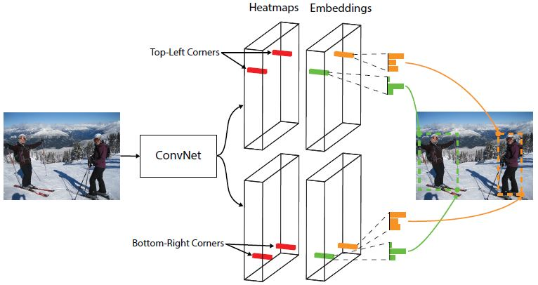

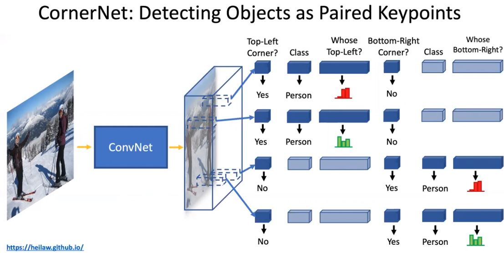

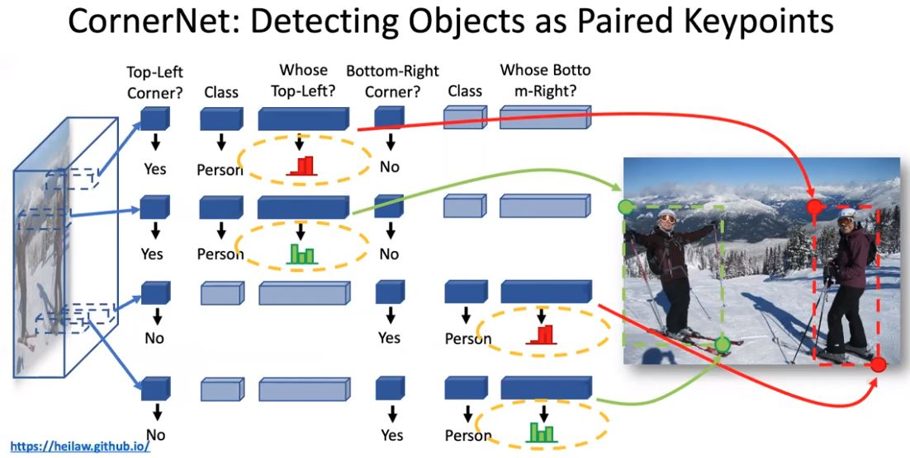

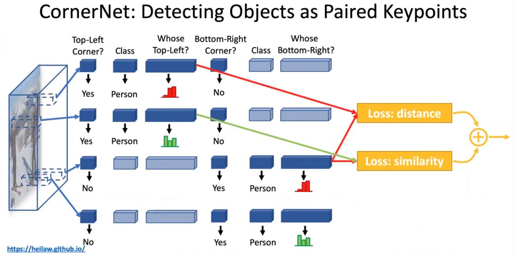

위 그림과 같이 Heatmap에서 Corner들을 찾고 나서 Embedding vector를 조사해서 각 객체에 맞게 그룹핑한다. Heatmap의 경우 각 클래스마다, 두 가지 Corner가 다른 Channel로써 예측되므로 Channel수가 # of Classes x 2가 들어간다. 

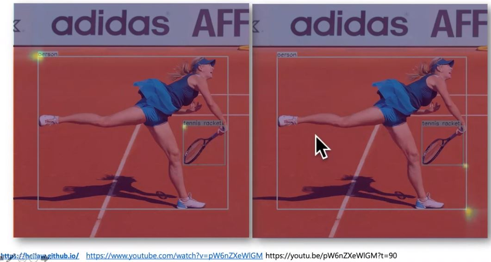

다음으로 저자들은 Corner pooling이란 개념을 소개했다. 이것은 바운딩 박스의 Corner가 다음과 같이 실제 객체에서 굉장히 떨어져 있는 경우를 보완하기 위한 개념이다. 

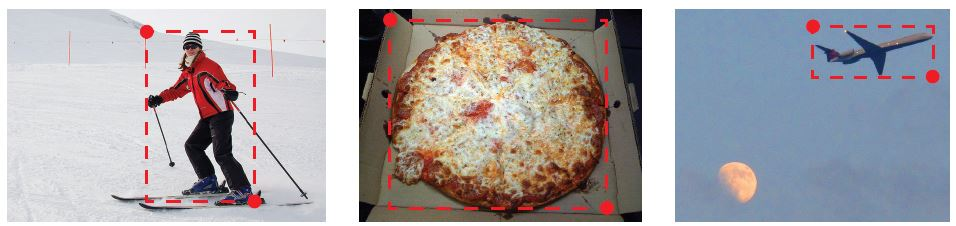

위의 경우 Top-corner가 정확히 객체의 Top-corner 라는 것을 보장하지 못하기 때문에 Top-corner에서 수평적으로 이미지의 오른쪽 끝까지 살펴보고, 수직적으로 이미지의 아래쪽 끝까지 살펴볼 필요가 있다. 그래서 아래 그림과 같이 같은 직선에 있는 값들에 대해서 Max pooling을 수행한다.

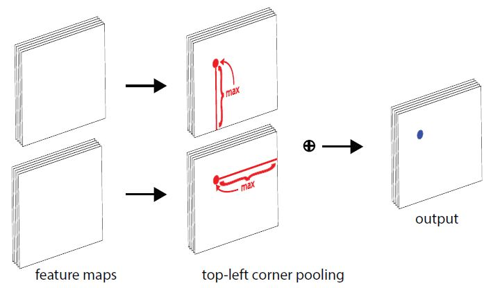

저자들이 말하는 기존의 방법보다 여기서 발표한 방법이 더 나은 이유는 두 가지가 있다. 

- 첫 번째로 Corner와 다르게 객체의 Center와 관련해서는 Center로부터 4가지 방향을 신경써야 한다. 

  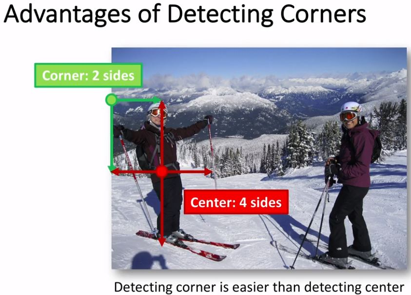

- 두 번째로 상자의 공간을 조밀하게 이산화하는 효율적인 방법을 제공한다. 아래 그림을 보면 CornerNet의 경우 Heatmap을 표현하는데 O(WH)의 공간이 필요한데 반해 기존의 방법들은 이미지 전체 좌표 상에서 각 박스의 w, h도 표현해야 하므로 O(W^2H^2)의 공간이 필요하다.

  

  

[princeton-vl - CornerNet](https://github.com/princeton-vl/CornerNet)

## Related Works

### Two-stage object detectors

R-CNN, SPP, Fast R-CNN, Faster R-CNN에 대한 설명은 그동안의 논문 리뷰에서 충분히 했기 때문에 패스. R-FCN은 Faster R-CNN의 모든 완전 연결 계층(Detection을 실제적으로 수행하는 브랜치 안에)을 모두 컨볼루션 계층으로 대체했다. 그 밖의 Two-stage 알고리즘에서 저자들이 참고한 연구들은 본문 참조.

### One-stage object detectors

SSD나 YOLO에 대한 설명은 그동안의 논문 리뷰에서 충분히 했기 때문에 패스. DSSD와 RON에서도 Hourglass 네트워크 아키텍처와 비슷한 아키텍처를 채용해서 Low-level과 High-level의 Feature들을 Skip-connection으로 합칠수 있도록 했다고 한다. 이렇게 되면 Richer context information과 Finer accurate information을 둘 다 포함하는 Feature로 Detection을 수행할 수 있게 된다. One stage 알고리즘들은 RetinaNet의 등장 전까지 Two-stage 알고리즘들에 비해 정확도 면에서 밀렸다. RetinaNet에서는 Sample의 대다수를 차지하는 Easy negative sample들이 전체 Loss에서 차지하는 비중을 자연스럽게 줄이는 방법으로 정확도 향상을 꾀했다. RefineDet에서는 이런 Negative sample들을 Detection 전에 걸러내고 Anchor 박스들을 좀 더 Detection에 맞게 조정하는 전처리 과정을 포함한다. 이때 이 모든 과정은 End-to-End로 수행된다. 

DeNet은 Anchor 박스로 ROI를 만들어 내는 방식이 아니다. 먼저 이미지 내 각 위치가 각 객체의 바운딩 박스의 좌상단, 좌하단, 우상단, 우하단에 얼마나 가까운지를 계산하고 여기서 추출한 Corner들로 가능한 모든 경우의 ROI를 만들어 내서 Two-stage에서의 Detection을 수행한다. 저자들이 말하는 DeNet과 CornerNet이 다른 점은 다음과 같다. 

- DeNet은 Corner들이 같은 객체에 묶이는지 여부를 판단하지 않으며 잘 안 맞는 ROI를 걸러내기 위해서 별도의 Sub-detection 네트워크를 사용한다. 이에 반해 저자들의 방법은 Corner를 찾고 그룹핑 하는 과정을 한 번에 수행하는 One-stage 방법에 가깝다. 
- DeNet은 분류 대상 지역과 관련된 위치를 Manually 찾고 그 위치의 특징을 추출한다면 저자들의 방법은 이런 Manually 특징을 선택하는 과정 자체가 없다고 한다. 
- 또 저자들의 방법은 Corner detection 성능을 올리고 보조하기 위한 Corner pooling이라는 개념을 처음 도입한다. 

Point Linking Network는 Anchor 박스 없이 Detection을 수행하는 One-stage 알고리즘이다. 먼저 4개의 Corner과 Center를 찾고 나서 각 Corner의 픽셀 값은 얼마나 Center의 픽셀 값과 가까운지, Center의 픽셀 값은 얼마나 각 Corner의 픽셀 값과 가까운지를 계산한다. 그리고 이 정보로 바운딩 박스를 만들어 낸다. 저자들이 말하는 PLN과 CornerNet이 다른 점은 다음과 같다. 

- PLN은 픽셀 위치를 예측해서 그룹핑을 수행하지만 CornerNet은 각 Corner별 Embedding vector를 예측해서 그룹핑을 수행한다. 
- CornerNet은 각 Corner의 위치를 더 잘 찾기 위해서 Corner pooling을 별도로 수행한다. 

저자들은 Newell 등의 연구인 "Associative Embedding in the context of multi-person pose estimation"에 영향을 받았다고 인정한다. 여기서 Newell등은 사람의 관절을 탐지하고 그룹핑 하는 작업을 Single network에서 수행하는 방법을 제안했다. 여기서 각 관절에는 관련된 Embedding vector가 있는데 관절들은 이 Embedding vector들의 Distance를 계산해서 그룹핑된다. 

저자들은 Hourglass 아키텍처를 상당히 개조했고 Focal loss를 저자들의 목적에 맞게 변경했다. 

## CornerNet

### Overview

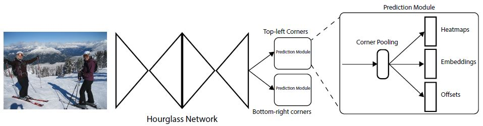

전체적인 네트워크 구조는 위와 같다. Hourglass network에서 추출한 Feature로 Top-left corner와 관련된 작업을 수행하는 브랜치와 Bottom-right corner와 관련된 작업을 수행하는 브랜치 2개가 존재한다. Heatmap은 각 Corner의 위치를 파악하는데 쓰이고 Embedding vector는 같은 객체의 Corner끼리의 Vector의 Distance를 줄여서 같이 그룹핑 될 수 있도록하는데 쓰인다. Offset은 좀 더 객체의 GT에 잘 맞는 박스를 예측해내기 위해서 각 Corner의 위치를 조정하는데 쓰인다. 각 요소를 생산해낸 후 박스를 만드는 후처리 작업을 수행한다. 또 각 브랜치에는 Backbone에서 추출한 Feature들을 갈무리하고 정확한 박스를 만들어 내는 작업을 하는 Corner pooling module이 있다. 저자들이 말하길 다른 Detection 알고리즘처럼 각기 다른 크기의 객체를 탐지하기 위해서 다른 크기의 Feature들을 사용하지 않았다고 한다. 

### Detecting Corners

각 Corner별 Heatmap의 크기는 HxWxC이다. 여기서 C는 카테고리 수이므로 카테고리마다 Heatmap을 만들어낸다는 것을 알 수 있다. Background 카테고리는 없다. 각 Channel은 해당 클래스에 해당하는 Corner들의 위치를 나타내는 Binary mask이다. 

각 Corner에는 하나의 GT Positive location이 있고 나머지 location은 다  Negative이다. 모델을 훈련시킬 때 저자들은 모든 Negative에 동일하게 Penalty를 주는 대신에 Positive location의 특정 반경에 있는 위치들에 대해서는 감소된 Penalty를 부여했다.  왜냐하면 정확히 GT는 아니지만 Positive location의 반경 안에 포함되는 Corner들은 다음 그림 5와 같이 GT에 충분히 들어맞는 박스를 만들어 낼 수 있기 때문이다. 

이때 저자들은 이 반경의 크기를 정할때, 반경 안에 있는 Corner들로 박스를 만들어 냈을때 GT와 적어도 t IOU만큼 겹칠수 있게 하도록(저자들은 t를 0.3으로 정했다.) 반경의 크기를 정했다. 반경에 대해서 Penalty 감소의 정도는 다음과 같은 2D Gaussian 커널에 의해서 정해졌다. 

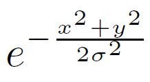

여기서 중심점은 Positive location이고 σ는 반경의 1/3이다. 

Pcij를 예측된 Heatmap에서 클래스 C에 대한 Location (i, j)에서의 Score로 하고 ycij를 Unnormalized Gaussian 커널에 의해서 증대된 GT Heatmap이라고 했을때 저자들은 다음과 같은, 저자들의 연구에 맞는 Focal loss를 고안해 낼 수 있었다. 

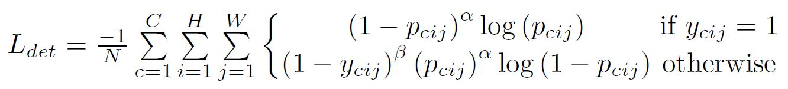

N은 이미지 내의 객체의 숫자이고 α, β는 Focal loss의 하이퍼파라미터이다(각 Sample이 Loss에 기여하는 정도를 결정하는 파라미터. 저자들은 각각 2, 4로 설정했음.). Focal loss에서도 설정했지만 Focal loss에서는 Easy sample의 Loss에 대한 기여를 낮추는 것이 목적이다. ycij = 1로 Positive location일때 Pcij라는 Score가 높을수록(강하게 확신할수록) Loss 값이 낮아진다. ycij=1이 아닐 경우에, ycij가 높다는 것은 GT location에 가깝다는 뜻이므로 이에 대한 Loss 값이 낮아진다. 

다음으로 보통 많은 방법들이 Global information을 얻고 Memory 사용량을 줄이기 위해서 Down sampling을 수행하는데 이렇게 되면 Resolution에서 처음의 이미지와 출력 이미지의 크기가 달라진다. 그러므로 (x, y)에 있던 개체가 Heatmap에서는 다음과 같은 위치로 매핑된다. 

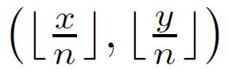

여기서 n은 입력과 출력 사이의 Down sampling factor(입력 대비 출력이 얼마만큼 줄었는지, 다른 논문에서는 Stride로 표현하기도 함.)이다. 이렇게 되면 Small 박스에 대해서는 GT 박스와의 IOU에 큰 영향을 끼칠 수도 있다. 이를 해결하기 위해서 저자들은 Location offset이라는 개념을 도입했다. 이 Offset으로, 박스를 원래의 Resolution으로 재매핑하기 전에 위치를 약간 조정한다. 

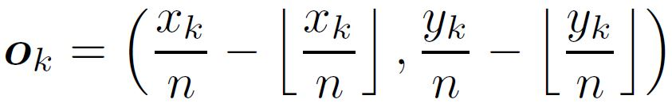

Ok는 Offset이고 xk, yk는 Corner k의 x, y 좌표이다. 이 offset은 클래스별 박스에서 각각 따로 구하는 것이 아니고 Top corner들끼리, 또 Bottom corner들끼리 공유한다. 이 Offset에 관한 Loss는 다음과 같이 디자인했다. 

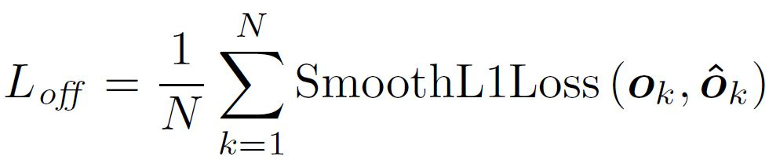

### Grouping Corners

저자들이 Corner들을 그룹핑하는 방법은 Newell 등이 제안한 방법을 많이 참고했다. 

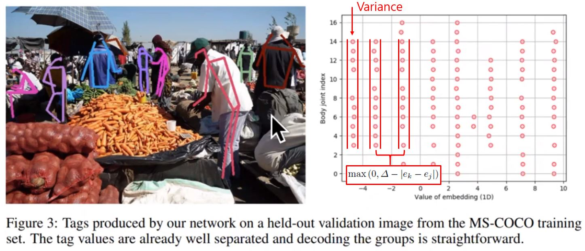

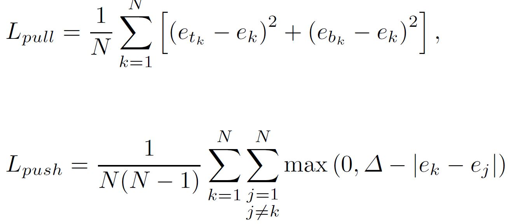

Lpull은 같은 객체의 Corner들간의 그룹핑을 수행할때 발생하는 Loss이고 Lpush는 다른 객체의 Corner들간의 그룹핑을 수행했을때 발생하는 Loss이다. Lpull에서 ek는 객체 k의 Top-left corner의 Embedding 값과 Bottom-right corner의 Embedding 값의 평균이다. etk는 Top-left corner의 Embedding 값이고 ebk는 Bottom-right corner의 Embedding 값이다. 위의 Newell의 논문과 관련된 그림을 보면 오른쪽 그래프에서 각 점들이 Embedding 값에 따라 일자로 정렬되어 있는 모습을 볼 수 있다. Lpull에서의 목적은 etk, ebk가 최대한 ek와 비슷해져서 Loss를 줄이는 것이다. 이때 모습은 그래프에서와 같이 같은 객체 내의 Point들의 Variance가 크지 않을때의 모습과 유사할 것이다. 반대로 Lpush의 목적은 각기 다른 객체의 Embedding 값의 평균이 커지는 것이다. 그렇게 되면 그래프와 같이 다른 객체 사이의 점들의 거리는 커질 것이다. 저자들은 Δ를 1로 정했다. 

### Corner Pooling

서론에서 언급한대로 Figure 2와 같이 바운딩 박스가 객체 전체를 포함하기 위해서 Top-corner가 객체에서 멀리 떨어져야 하는 경우가 있다. 그래서 Top-corner의 위치가 적절한지 이미지의 오른쪽 끝으로 선을 긋고 이미지의 아래쪽으로 선을 그었을때 객체를 다 포함하는지 확인할 필요가 있다. 이를 위해서 저자들은 Corner pooling 이라는 개념을 고안해냈다.  연산 방법은 아래와 같다. 

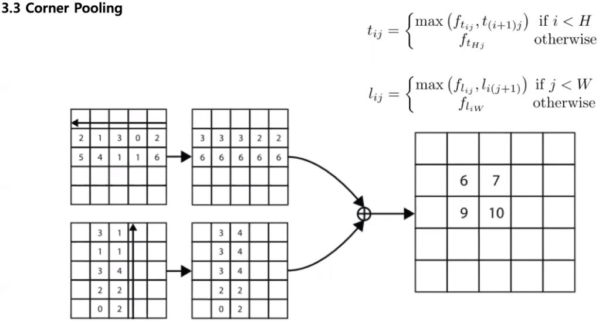

연산 수행 결과 예시는 아래와 같다.

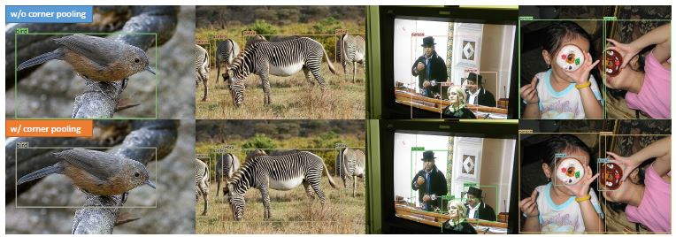

이 모듈의 아키텍처는 아래와 같다. 

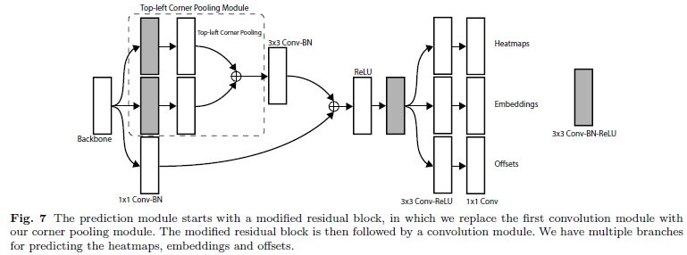

먼저 Residual block에서 3x3 convolution module를 저자들이 고안한 Corner pooling module로 대체한다(Backbone에서의 Feature를 3x3 컨볼루션 두개로 처리한다(특별히 언급하지 않는 이상 하나의 컨볼루션에는 BN, ReLU 포함.). 채널은 128. 위 그림의 점선 부분 참고).  그리고 나서 3x3 Conv-BN 256 Channel 계층을 통과 시키고 나서 Projection shortcut으로 Feature들을 더한다. ReLU를 통과하고 나서  3X3 Convolution 256 channel 계층을 통과 한 뒤에 3개의 Conv-ReLU-Conv 브랜치를 통과 하고 나면 Heatmap, Embedding, Offset이 생성된다. 

### Hourglass Network

Hourglass Network는 원래 Human pose estimation Task에서 처음 도입되었다. 하나의 네트워크는 여러개의 Hourglass module로 이루어져 있다. Hourglass module에서는 먼저 일렬로 연결되어 있는 Convolution과 Max pooling 계층으로 입력 이미지 Feature를 Down sampling한다. 그리고 나서 마찬가지로 일렬로 되어 있는 Convolution과 Upsampling 계층으로 Up sampling을 수행한다. Max pooling에서 Detail들이 사라지므로 Skip connection으로 Up sampled Feature에 더해준다. 이렇게 하면 Global, local Feature를 하나의 단일한 네트워크로 캐치할 수 있다. 

CornerNet은 두 개의 Hourglass module로 구성되어 있다. 다만 저자들은 원래의 module을 목적에 맞게 약간 변경했다. Max pooling 계층 대신에 Stride 2의 Convolution을 사용했다. 5배 정도 입력 Feature를 Down sampling하면서 채널 수를 늘린다(256, 384, 384, 384, 512). Up sampling 시에는 2개의 Residual block과 Nearest neighbor upsampling 계층을 사용한다. 모든 Skip connection은 2개의 Residual block로 구성되어 있다. 하나의 Module에는 채널 512의 Residual block이 4개있다. Hourglass module에 Feature를 통과 시키기 전에는 7x7 stride 2 128 channel의 Convolution과 Stride 2 256 channel의 Residual block으로 본래의 Image resolution을 4배 정도 줄인다. 

네트워크 중간의 Feature들로 예측을 수행하는 것은 성능에 도움이 되지 않아서 적용하지 않았다고 한다. 1x1 Conv-BN을 첫 번째 Hourglass module의 입력과 출력에 적용했고 이들을 원소별 덧셈으로 합친 다음 ReLU와 256 Channel의 Residual block에 통과 시킨다. 이렇게 생성된 특징은 두 번째 Hourglass module의 입력을 들어간다. 전체 네트워크의 깊이는 104층이다. 저자들은 맨 마지막 출력 Feature로만 예측을 수행했다고 한다. 

## Experiments

### Training Details

저자들은 모델을 파이토치로 개발했고 특별히 논문에서 언급하지 않은 셋팅들은 파이토치의 기본 세팅을 따랐다고 한다. 그리고 모델은 별도의 데이터로 Pretraining하지 않았다고 한다. 저자들만의 Focal loss를 디자인하면서 Corner heatmap를 출력하는 컨볼루션에서의 편향값 셋팅은 원 저자들의 방법을 따랐다고 한다. 훈련 중의 입력 Resolution은 511x511이고 이는 최종적으로 128x128의 Resolution을 출력해낸다. 과적합성을 줄이기 위해서 여러가지 Data augmentation을 적용했따고 한다. 그리고 입력 이미지에 대해서는 (아마 이미지 용량을 줄이기 위함일듯) PCA를 적용했다고 한다. Adam으로 가중치 최적화를 진행했고 전체 훈련 손실은 다음과 같이 정의한다. 

 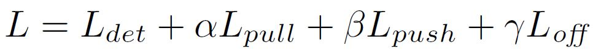

각 가중치는 Push(카테고리가 다른 Corner끼리 밀어내기 위함.), Pull(같은 객체의 Corner끼리 그룹핑 하기 위함), Offset(입력과 출력간의 Resolution 차이에 의한 바운딩 박스의 위치 에러를 보정하기 위함)이 손실에서 차지하는 비중을 결정한다. 저자들은 Pull, Push의 비중은 0.1 그리고 Offset 관련된 손실의 비중은 1로 설정했다. 저자들은 실험 결과 Pull, Push의 비중을 1보다 크거나 같게 할 경우 성능이 나빠지는 것을 확인했다. 배치 사이즈나 GPU, Learning rate, 학습 시간 등은 본문 참조. 

### Testing Details

추론 시에는 후처리 작업을 통해서 Heatmap, Embedding, Offset으로부터 바운딩 박스를 만들어 냈다. 먼저 3x3 Max pooling 계층에 Corner heatmap 통과 시켜서 NMS를 수행했다. 그리고 나서 각각 Top 100의 Top-left, Bottom-right의 Corner들만 Heatmap에서 골라낸다. 그리고 Offset으로 각 Corner들의 위치를 조정하고 Top-left, Bottom-right의 Embedding으로 L1 distance를 계산한다. 만약에 Distance가 0.5 이상이거나 각 Corner가 다른 카테고리에 해당할 경우 이 쌍은 제거한다. Top-left와 Bottom-right의 Average score는 Detection score로서 해석한다. 

저자들은 이미지를 고정된 크기로 재조정 하는 것 대신에 원본 이미지의 Resolution을 유지하고 CornerNet에 입력으로 넣기 전에 0으로 패딩을 붙인다. 원본 이미지와 Flipped된 이미지가 테스트 할때 사용된다. 이 데이터셋의 Detection 결과에 대해서 Bodla 등이 고안해낸 Soft-nms를 수행하여 중복된 Detection 결과를 제거한다. 그리고 Top 100의 Detection 결과만 평가한다. Titan X(PASCAL 평가에서 쓰이는) GPU 기준으로 장당 244ms의 시간으로 처리된다. 

### MS COCO

저자들은 CornerNet을 MS COCO 데이터셋으로 평가했다. 저자들은 Training set과 Validation set에서의 35k 이미지를 모델을 훈련시키는데 쓰고 Validation set에서의 5k 이미지를 하이퍼 파라미터 서치와 Ablation study에서 사용했다. Test set에서 평가한 결과는 MS COCO 평가 서버에 제출되었다. 

### Ablation Study

#### Corner Pooling

Corner pooling이 저자들의 모델에 끼치는 영향을 확인하기 위해서, 같은 크기의 Corner pooling이 없는 대조군과 성능 차이를 확인했다. 

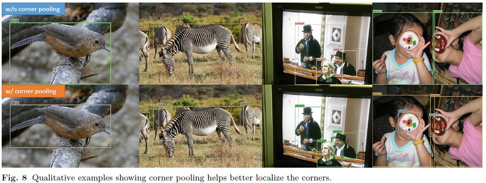

#### Stability of Corner Pooling over Larger Area

저자들은 Corner pooling 연산 시에 각 이미지의 사분면의 크기가 다를때 Corner들의 위치가 Corner pooling 연산의 안정성에 영향을 끼칠 수 있다고 가정했다. 그래서 실험을 수행했고 저자들이 내린 결론은 Corner pooling 연산이 Corner의 위치에 상관 없이 안정적으로 수행될 수 있도록 한다는 것이다. 

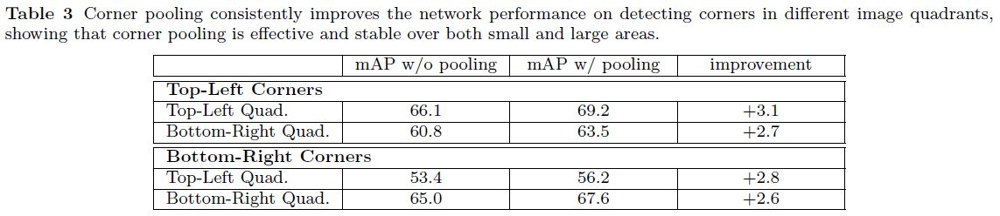

#### Reducing Penalty to Negative Locations

저자들은 객체의 크기에 따라 결정되는 반경 내의, Positive location 주위의 Negative location들에 대해 Penalty를 줄여봤다.  하나는 Penalty reduction이 없는 네트워크이고 다른 하나는 반경이 2.5로 고정되어 있는 네트워크이다. 

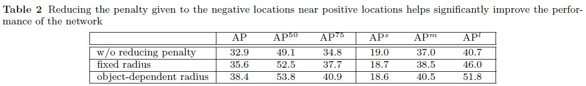

저자들은 Object 크기에 따른 반경의 성능이 더 좋고, Penalty reduction의 효과가 특히 중간 크기 이상의 객체에서 더 좋다는 것을 발견했다. 

#### Hourglass Network

저자들은 Hourglass Network의 영향력을 알아보기 위해서 Hourglass Network 대신에 ResNet-101의 FPN 네트워크에서 CornerNet을 구현해봤다. 저자들은 FPN의 마지막 출력으로만 예측을 수행했다. 또한 Hourglass Network를 Backbone으로 하는 Anchor 박스 기반의 Detector도 구현해봤다. 이때 Hourglass module은 Up sampling 과정 중의 다양한 크기의 Feature들에서 Anchor box로 예측을 수행했다. Anchor box 디자인은 RetinaNet을 따랐고 Intermediate supervision을 훈련 중에 더했다. 여기서의 실험은 CornerNet에서의 훈련 설정을 적용했고 Network는 Pre training없이 Scratch부터 훈련되었다. 

저자들은 Hourglass Network가 CornetNet의 성능에 중요한 영향을 끼친다는 것을 확인했다. 

