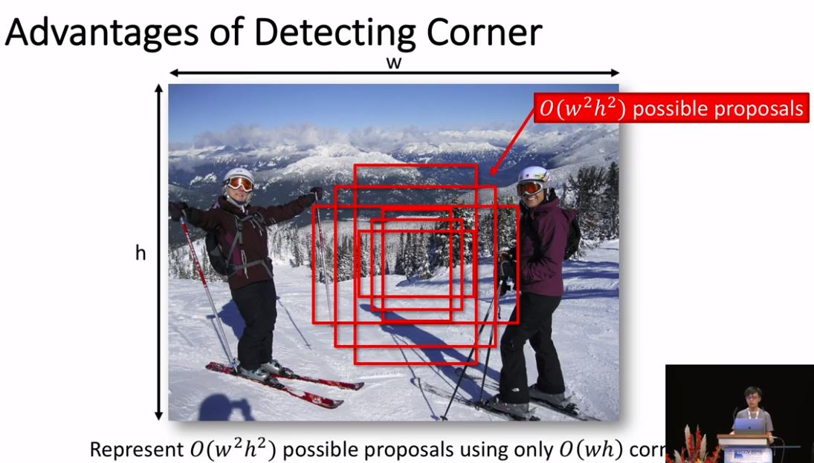
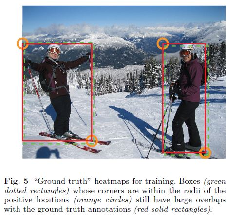

# CornerNet: Detecting Objects as Paired Keypoints

Hei Law, Jia Deng(Princeton University, Princeton, NJ, USA)

## Abstract

저자들이 발표한 CornerNet은 바운딩 박스를 Top-left와 Bottom-right의 두 개의 쌍으로 보고 탐지하는 방법이다. One-stage 알고리즘이고 1개의 Unified network를 사용한다. 저자들이 말하길 이렇게 함으로써 Anchor 박스를 디자인하는 번거로움을 없앴다고 한다. 또 Corner pooling이라고 하는 새로운 Pooling 연산을 소개하면서 말하길 이 연산으로 네트워크가 객체의 위치를 더 잘 찾을 수 있다고 한다. MS COCO에서 42.2% AP를 달성했다. 

## Introduction

ConvNet 계열의 Object detection 알고리즘들이 공통적으로 도입하는 요소는 Anchor box라는 개념이다. 이 박스들은 다양한 크기와 종횡비를 가지는데 Detection을 위한 Candidate의 역할을 한다. 특히 One-stage 알고리즘에서 많은 수의 Anchor box가 사용된다. 

그런데 저자들이 주장하길 이런 방식에는 두 가지 단점이 있다고 한다.

- 첫번째로 매우 많은 양의 Anchor 박스가 있고 그 중에서 몇 가지만 GT에 가깝게 조정된다. 이렇게 되면 실제적으로 정답에 가까운 박스들은 극 소수이고 나머지는 정답이 아닌 박스들이므로 클래스간 심각한 불균형 문제가 발생한다. 
- 두번째로  Anchor 박스를 디자인하기 위한 디자인 문제가 발생한다. 여기에는 박스 모양과 관련된 Size, Aspect ratio 같은 하이퍼 파라미터 요소를 포함한다. 이 요소들은 경험적으로 사용자에 의해서 결정되어야 하는데, 네트워크 디자인에 더 많은 옵션을 고려해야할 경우 더 복잡해진다. 

저자들은 그래서 Anchor 박스 개념 없이 Object detection을 수행하는 방법을 제안했다. 구체적으로 Single convolutional network에서 각 객체들의 Top-left corner를 위한 Heatmap과 Bottom-right corner를 위한 Heatmap 그리고 각 Corner를 각 객체에 맞게 그룹핑하는데 쓰는 Embedding vector들을 출력한다. 

위 그림과 같이 Heatmap에서 Corner들을 찾고 나서 Embedding vector를 조사해서 각 객체에 맞게 그룹핑한다. Heatmap의 경우 각 클래스마다, 두 가지 Corner가 다른 Channel로써 예측되므로 Channel수가 # of Classes x 2가 들어간다. 

다음으로 저자들은 Corner pooling이란 개념을 소개했다. 이것은 바운딩 박스의 Corner가 다음과 같이 실제 객체에서 굉장히 떨어져 있는 경우를 보완하기 위한 개념이다. 

위의 경우 Top-corner가 정확히 객체의 Top-corner 라는 것을 보장하지 못하기 때문에 Top-corner에서 수평적으로 이미지의 오른쪽 끝까지 살펴보고, 수직적으로 이미지의 아래쪽 끝까지 살펴볼 필요가 있다. 그래서 아래 그림과 같이 같은 직선에 있는 값들에 대해서 Max pooling을 수행한다.

저자들이 말하는 기존의 방법보다 여기서 발표한 방법이 더 나은 이유는 두 가지가 있다. 

- 첫 번째로 Corner와 다르게 객체의 Center와 관련해서는 Center로부터 4가지 방향을 신경써야 한다. 

  

- 두 번째로 상자의 공간을 조밀하게 이산화하는 효율적인 방법을 제공한다. 아래 그림을 보면 CornerNet의 경우 Heatmap을 표현하는데 O(WH)의 공간이 필요한데 반해 기존의 방법들은 이미지 전체 좌표 상에서 각 박스의 w, h도 표현해야 하므로 O(W^2H^2)의 공간이 필요하다.

  

  

[princeton-vl - CornerNet](https://github.com/princeton-vl/CornerNet)

## Related Works

### Two-stage object detectors

R-CNN, SPP, Fast R-CNN, Faster R-CNN에 대한 설명은 그동안의 논문 리뷰에서 충분히 했기 때문에 패스. R-FCN은 Faster R-CNN의 모든 완전 연결 계층(Detection을 실제적으로 수행하는 브랜치 안에)을 모두 컨볼루션 계층으로 대체했다. 그 밖의 Two-stage 알고리즘에서 저자들이 참고한 연구들은 본문 참조.

### One-stage object detectors

SSD나 YOLO에 대한 설명은 그동안의 논문 리뷰에서 충분히 했기 때문에 패스. DSSD와 RON에서도 Hourglass 네트워크 아키텍처와 비슷한 아키텍처를 채용해서 Low-level과 High-level의 Feature들을 Skip-connection으로 합칠수 있도록 했다고 한다. 이렇게 되면 Richer context information과 Finer accurate information을 둘 다 포함하는 Feature로 Detection을 수행할 수 있게 된다. One stage 알고리즘들은 RetinaNet의 등장 전까지 Two-stage 알고리즘들에 비해 정확도 면에서 밀렸다. RetinaNet에서는 Sample의 대다수를 차지하는 Easy negative sample들이 전체 Loss에서 차지하는 비중을 자연스럽게 줄이는 방법으로 정확도 향상을 꾀했다. RefineDet에서는 이런 Negative sample들을 Detection 전에 걸러내고 Anchor 박스들을 좀 더 Detection에 맞게 조정하는 전처리 과정을 포함한다. 이때 이 모든 과정은 End-to-End로 수행된다. 

DeNet은 Anchor 박스로 ROI를 만들어 내는 방식이 아니다. 먼저 이미지 내 각 위치가 각 객체의 바운딩 박스의 좌상단, 좌하단, 우상단, 우하단에 얼마나 가까운지를 계산하고 여기서 추출한 Corner들로 가능한 모든 경우의 ROI를 만들어 내서 Two-stage에서의 Detection을 수행한다. 저자들이 말하는 DeNet과 CornerNet이 다른 점은 다음과 같다. 

- DeNet은 Corner들이 같은 객체에 묶이는지 여부를 판단하지 않으며 잘 안 맞는 ROI를 걸러내기 위해서 별도의 Sub-detection 네트워크를 사용한다. 이에 반해 저자들의 방법은 Corner를 찾고 그룹핑 하는 과정을 한 번에 수행하는 One-stage 방법에 가깝다. 
- DeNet은 분류 대상 지역과 관련된 위치를 Manually 찾고 그 위치의 특징을 추출한다면 저자들의 방법은 이런 Manually 특징을 선택하는 과정 자체가 없다고 한다. 
- 또 저자들의 방법은 Corner detection 성능을 올리고 보조하기 위한 Corner pooling이라는 개념을 처음 도입한다. 

Point Linking Network는 Anchor 박스 없이 Detection을 수행하는 One-stage 알고리즘이다. 먼저 4개의 Corner과 Center를 찾고 나서 각 Corner의 픽셀 값은 얼마나 Center의 픽셀 값과 가까운지, Center의 픽셀 값은 얼마나 각 Corner의 픽셀 값과 가까운지를 계산한다. 그리고 이 정보로 바운딩 박스를 만들어 낸다. 저자들이 말하는 PLN과 CornerNet이 다른 점은 다음과 같다. 

- PLN은 픽셀 위치를 예측해서 그룹핑을 수행하지만 CornerNet은 각 Corner별 Embedding vector를 예측해서 그룹핑을 수행한다. 
- CornerNet은 각 Corner의 위치를 더 잘 찾기 위해서 Corner pooling을 별도로 수행한다. 

저자들은 Newell 등의 연구인 "Associative Embedding in the context of multi-person pose estimation"에 영향을 받았다고 인정한다. 여기서 Newell등은 사람의 관절을 탐지하고 그룹핑 하는 작업을 Single network에서 수행하는 방법을 제안했다. 여기서 각 관절에는 관련된 Embedding vector가 있는데 관절들은 이 Embedding vector들의 Distance를 계산해서 그룹핑된다. 

저자들은 Hourglass 아키텍처를 상당히 개조했고 Focal loss를 저자들의 목적에 맞게 변경했다. 

## CornerNet

### Overview

전체적인 네트워크 구조는 위와 같다. Hourglass network에서 추출한 Feature로 Top-left corner와 관련된 작업을 수행하는 브랜치와 Bottom-right corner와 관련된 작업을 수행하는 브랜치 2개가 존재한다. Heatmap은 각 Corner의 위치를 파악하는데 쓰이고 Embedding vector는 같은 객체의 Corner끼리의 Vector의 Distance를 줄여서 같이 그룹핑 될 수 있도록하는데 쓰인다. Offset은 좀 더 객체의 GT에 잘 맞는 박스를 예측해내기 위해서 각 Corner의 위치를 조정하는데 쓰인다. 각 요소를 생산해낸 후 박스를 만드는 후처리 작업을 수행한다. 또 각 브랜치에는 Backbone에서 추출한 Feature들을 갈무리하고 정확한 박스를 만들어 내는 작업을 하는 Corner pooling module이 있다. 저자들이 말하길 다른 Detection 알고리즘처럼 각기 다른 크기의 객체를 탐지하기 위해서 다른 크기의 Feature들을 사용하지 않았다고 한다. 

### Detecting Corners

각 Corner별 Heatmap의 크기는 HxWxC이다. 여기서 C는 카테고리 수이므로 카테고리마다 Heatmap을 만들어낸다는 것을 알 수 있다. Background 카테고리는 없다. 각 Channel은 해당 클래스에 해당하는 Corner들의 위치를 나타내는 Binary mask이다. 

각 Corner에는 하나의 GT Positive location이 있고 나머지 location은 다  Negative이다. 모델을 훈련시킬 때 저자들은 모든 Negative에 동일하게 Penalty를 주는 대신에 Positive location의 특정 반경에 있는 위치들에 대해서는 감소된 Penalty를 부여했다.  왜냐하면 정확히 GT는 아니지만 Positive location의 반경 안에 포함되는 Corner들은 다음 그림 5와 같이 GT에 충분히 들어맞는 박스를 만들어 낼 수 있기 때문이다. 

이때 저자들은 이 반경의 크기를 정할때, 반경 안에 있는 Corner들로 박스를 만들어 냈을때 GT와 적어도 t IOU만큼 겹칠수 있게 하도록(저자들은 t를 0.3으로 정했다.) 반경의 크기를 정했다. 반경에 대해서 Penalty 감소의 정도는 다음과 같은 2D Gaussian 커널에 의해서 정해졌다. 

여기서 중심점은 Positive location이고 σ는 반경의 1/3이다. 

Pcij를 예측된 Heatmap에서 클래스 C에 대한 Location (i, j)에서의 Score로 하고 ycij를 Unnormalized Gaussian 커널에 의해서 증대된 GT Heatmap이라고 했을때 저자들은 다음과 같은, 저자들의 연구에 맞는 Focal loss를 고안해 낼 수 있었다. 

N은 이미지 내의 객체의 숫자이고 α, β는 Focal loss의 하이퍼파라미터이다(각 Sample이 Loss에 기여하는 정도를 결정하는 파라미터. 저자들은 각각 2, 4로 설정했음.). Focal loss에서도 설정했지만 Focal loss에서는 Easy sample의 Loss에 대한 기여를 낮추는 것이 목적이다. ycij = 1로 Positive location일때 Pcij라는 Score가 높을수록(강하게 확신할수록) Loss 값이 낮아진다. ycij=1이 아닐 경우에, ycij가 높다는 것은 GT location에 가깝다는 뜻이므로 이에 대한 Loss 값이 낮아진다. 

다음으로 보통 많은 방법들이 Global information을 얻고 Memory 사용량을 줄이기 위해서 Down sampling을 수행하는데 이렇게 되면 Resolution에서 처음의 이미지와 출력 이미지의 크기가 달라진다. 그러므로 (x, y)에 있던 개체가 Heatmap에서는 다음과 같은 위치로 매핑된다. 

여기서 n은 입력과 출력 사이의 Down sampling factor(입력 대비 출력이 얼마만큼 줄었는지, 다른 논문에서는 Stride로 표현하기도 함.)이다. 이렇게 되면 Small 박스에 대해서는 GT 박스와의 IOU에 큰 영향을 끼칠 수도 있다. 이를 해결하기 위해서 저자들은 Location offset이라는 개념을 도입했다. 이 Offset으로, 박스를 원래의 Resolution으로 재매핑하기 전에 위치를 약간 조정한다. 

Ok는 Offset이고 xk, yk는 Corner k의 x, y 좌표이다. 이 offset은 클래스별 박스에서 각각 따로 구하는 것이 아니고 Top corner들끼리, 또 Bottom corner들끼리 공유한다. 이 Offset에 관한 Loss는 다음과 같이 디자인했다. 

### Grouping Corners

저자들이 Corner들을 그룹핑하는 방법은 Newell 등이 제안한 방법을 많이 참고했다. 

Lpull은 같은 객체의 Corner들간의 그룹핑을 수행할때 발생하는 Loss이고 Lpush는 다른 객체의 Corner들간의 그룹핑을 수행했을때 발생하는 Loss이다. Lpull에서 ek는 객체 k의 Top-left corner의 Embedding 값과 Bottom-right corner의 Embedding 값의 평균이다. etk는 Top-left corner의 Embedding 값이고 ebk는 Bottom-right corner의 Embedding 값이다. 위의 Newell의 논문과 관련된 그림을 보면 오른쪽 그래프에서 각 점들이 Embedding 값에 따라 일자로 정렬되어 있는 모습을 볼 수 있다. Lpull에서의 목적은 etk, ebk가 최대한 ek와 비슷해져서 Loss를 줄이는 것이다. 이때 모습은 그래프에서와 같이 같은 객체 내의 Point들의 Variance가 크지 않을때의 모습과 유사할 것이다. 반대로 Lpush의 목적은 각기 다른 객체의 Embedding 값의 평균이 커지는 것이다. 그렇게 되면 그래프와 같이 다른 객체 사이의 점들의 거리는 커질 것이다. 저자들은 Δ를 1로 정했다. 
