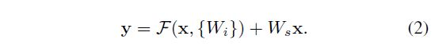

# Deep Residual Learning for Image Recognition

Kaiming He(Microsoft Research), Xiangyu Zhang(Microsoft Research), Shaoqing Ren(Microsoft Research), Jian Sun(Microsoft Research)

## Abstract

딥러닝 모델은 깊이가 길어질수록 훈련 시키기 어렵다. 저자들이 주장하길, 저자들은 이 연구에서 잔차의 개념을 적용한 깊은 신경망 모델 학습 방법을 제시해서 아주 깊은 모델도 학습하기 쉽도록 했다고 한다. 모델의 각 계층의 잔차와 계층으로의 입력을 이용해서 이를 구현했다. 이를 바탕으로 VGG net 계열보다 8배 깊은 152 계층의 모델을 생성했는데도 오히려 복잡도는 더 낮다고 주장한다. 이런 잔차 네트워크의 앙상블 모델이 ImageNet 테스트 셋으로 평가했을 때 3.57%의 에러를 달성했고, ILSVRC 2015 분류 대회에서 1등을 차지했다. 

객체 탐지 분야에서도 모델의 깊이가 중요한 역할을 차지한다고 저자들은 생각했고, 깊이와 관련된 부분만 연구에 적용했을 때, COCO 객체 탐지 데이터셋에서 그 전의 연구보다 28%의 개선됨을 보였다. 저자들의 연구 성과로 다수의 분류 및 탐지 대회에서 수상을 했다고 한다.

## Introduction

DCNN은 이미지 분류 문제에서 하나의 패러다임이 되었다. 이미지 특징들의 Low/Mid/High 단계의 특징들이 합쳐지고 네트워크 안의 분류기들은 종단간으로 협력하게 된다. 특히 계층을 쌓아 올림으로써 이미지에서 추출하는 특징들이 풍부해지는데, ImageNet 대회에서 우수한 성적을 거둔 연구들이 깊은 신경망 모델을 사용했다는 사실을 볼 때, 이 가정이 사실임을 알 수 있다. 

그런데 정말 네트워크에서 계층을 쌓는 것이 쉬울까하는 의문이 들었을 때, 한 가지 문제가 되는 것은 기울기 소실/폭팔 이라는 문제이다. 이 문제가  모델이 훈련을 시작하고 나서 어떤 특정한 수준으로 성능이 수렴하는 것을 방해한다. 다행히 이 부분은 초기화의 정규화, 훈련 중간의 정규화 같은 방법으로 어느정도 해결이 되었다. 그래서 수십개의 계층이 쌓여 있어도 SGD와 역전파로 모델 성능의 수렴이 가능해졌다. 

저자들이 연구를 진행하다가 성능 저하 문제를 발견했다. 네트워크 깊이가 깊어질수록 정확도의 개선이 이루어 지지 않고 정체되어 있다가 급격하게 하락하는 것이다. 그런데 이것은 과적합에 의한 결과가 아니었다. 

이런 성능 저하 현상으로 모든 시스템이 최적화하기 쉽다는 것은 아니라는 것을 알 수 있다. 

저자들은 이 연구에서 잔차 학습 프레임워크를 도입하여 이런 성능 저하 문제를 해결하고자 했다. 그래서 계층들이 이런 잔차 매핑을 수행할 수있도록 구축했다. 계층들이 입력 데이터로 출력 데이터를 도출할 수 있도록 하는 원래의 어떤 작업을 H(x)라고 했을 때, 그 쌓여 있는 비선형 계층들의 각 매핑을 F(x) := H(x) - x로 바꿨다. 따라서 원래의 매핑은 F(x)+x로 변경된다. 

F(x)+x는 신경망에서 순전파 시에 Shortcut connection으로 구현될 수 있다. 

이 연구에서 Shortcut은 입력 데이터를 가지고, 중간 계층들의 F(x) 연산을 건너뛰고 항등 매핑 연산을 수행해서 결과에 더하는 작업을 수행한다. 항등 매핑 연산을 수행하기 때문에 추가적인 모델 파라미터나 컴퓨팅 작업이 필요하지 않다. 또, 학습 시에 SGD optimization 정책을 따르는 역전파를 네트워크에서 어떤 부분을 수정할 필요없이 여전히 종단간으로 수행할 수 있다. 그리고 Caffe같은 보통의 라이브러리로 쉽게 구현이 가능하다.

저자들은 ImageNet에서 저자들이 가정하고 구현한 프레임워크로 여러가지 포괄적인 실험을 진행했다. 그리고 도출된 결과는 

- 깊은 잔차 네트워크가 최적화하기 쉬운데 반해 평범한 네트워크는 깊이가 깊어질수록 높은 훈련 에러율을 보인다는 점
- 깊은 잔차 네트워크는 깊이가 깊어질때의 정확도가 개선되는 효과를 누릴 수 있다는 점

CIFAR-10 데이터셋서도 이런 결과를 생성함으로 단순히 특정 데이터셋에만 적용되는 것이 아니라는 점을 확인했다. 100개 이상의 층에서 만족할만한 결과를 내었고 1000개 이상의 층에서도 실험을 해봤다고 한다.

## Related Work

본문 참조.

## Deep Residual Learning

### Residual Learning

어떤 계층들이 쌓여 있을때 입력 x를 처리하여 나온 출력을 H(x)라고 가정한다. 만약에 여러 비선형 계층이 점근적으로 뭔가 복잡한 함수에 근사할 수 있다면, 이 비선형 계층은 잔차 함수에 점근적으로 근사하는 것이 가능할 것이다(예를 들어 출력과 입력의 차인 H(x) - x, 이때는 물론 출력과 입력의 차원이 같아야 한다). 그래서 저자들은, 계층들이 출력 H(x)을 근사하는 것보다  잔차 함수를 근사하는 것으로   명시했다(F(x) := H(x) - x).  따라서  원래의 함수가 F(x) 대신에 F(x) + x가 되었다. (이 부분은 좀 잘 이해가 안되는데 x를 Transformation하여 나온 출력이 H(x)이고, F(x)가 출력과 입력간의 잔차라고 cs231n에서는 설명한다. 즉, 애초에 계산하기 힘든 H(x)가 가능하다면 H(x)와 입력 x의 잔차 F(x)를 계산하는 것도 가능하다는 의미인 것 같다)

[CS231n: Convolutional Neural Networks for Visual Recognition](http://cs231n.stanford.edu/) 

F(x) + x와 같은 식은 서론에서 언급한 Degradation 문제를 해결하고자 하는 동기에서 비롯돼었다. 추가되는 계층이 항등 매핑 역할을 하는 것 이상이 아니라면 깊은 모델이 얕은 모델보다 훈련 에러가 더 높지 않을것이라고 생각했다. 여러 비선형 계층에 의해서 항등 매핑을 근사하는 것에는 어려움이 있을 수 있다. 그러나 위의 변형된 식에서는 만약에 항등 매핑이 최적화된 상태라면 항등 매핑에 근사하기 위해서 비선형 계층들의 가중치가 0으로 가까워질 것이다. 

그러나 실제로는 항등 매핑이 최적의 상태가 아니다. 하지만 변형된 식이 문제에 대한 선행 조건을 처리하는데는 도움이 될 수 있다. 역전파 시에 항등 매핑에서는 기울기가 최소 1이라도 나오게 된다. 그렇기 때문에 아주 작은 변화라도 일어나는 것이 변화가 없는 매핑보다 더 낫다. 

### Identity Mapping by Shortcuts

저자들이 구현한 네트워크의 모든 블럭에 Residual learning이 적용되었다. 이 블럭을 식으로 나타내면 다음과 같다.

x, y와는 각각 블럭의 입력과 출력이고 F(x, {Wi})는 학습되어야할 잔차 매핑이다. 서론에서 다뤘던 잔차 블럭은 두 계층으로 이루어져 있다. 여기서 잔차를 식으로 나타내면 F = W2σ(W1x)로 나타낼 수 있다. 여기서 σ는 ReLU 활성화 함수이며 편향은 표기 편의상 생략되었다. F + x은 Shortcut connection에 의해서 수행되며, Element-wise(요소별) 덧셈이 수행된다. Shortcut connection에서 특별히 더 추가되는 모델 파라미터나 계산상의 복잡함은 없다. 특히 저자들의 연구에서 이 개념을 차용해서 Residual learning을 적용한 네트워크와 그렇지 않은 평범한 네트워크 사이의 비교를 진행했다. 두 네트워크는 파라미터 수, 깊이, 넓이, 계산상의 cost 등이 모두 같다(무시해도 될 정도로 아주 적은 요소별 덧셈을 제외하고). 보통은 x와 F의 차원 같으나 그렇지 않은 경우(입력과 출력의 타원이 다른 경우), 차원을 맞추기 위해서 Linear projection Ws 연산을 Shortcut connection에서 수행한다.

식(1)에서도 Ws 연산을 수행할 수 있으나 보통 항등 매핑이면 충분하고 또 경제적이다. 또 저자들이 말하길 이 연구에서는 잔차 블럭에서 2개 혹은 3개의 계층만 사용했으나 다른 수의 계층도 가능하다고 한다. 다만 계층이 1개인 경우 선형 계층(y = W1x + x)과 유사해져서 딱히 장점이 없어진다. 

또, 위의 식이 Fc 같아 보이지만 컨볼루션 계층에도 적용 가능하다고 한다. 이떄에는 F(x, {Wi})가 여러 컨볼루션 계층이 쌓인 것의 매핑을 의미하고 요소별 덧셈은 채널 별로, 두 개의 특징 맵 끼리 수행된다고 한다.

### Network Architectures

|  |
| :----------------------------------------------------------: |
|  |
|  |

#### Plain Network

대조군(평범한) 네트워크는 기본적으로 VGG 네트워크 계열의 방식을 따른다. 컨볼루션 계층은 대부분은 3x3의 필터를 가지며 같은 크기의 특징 맵을 출력하는 계층은 같은 숫자의 필터 수를 가지고 특징 맵의 크기가 반이 되면 계층당 시간 복잡도를 유지하기 위해서 필터 수가 두 배가 된다. 다운 샘플링 시에는 컨볼루션 계층의 Stride를 2로 해서 다운 샘플링을 진행한다. 네트워크의 끝에는 Gap가 붙어 있고 1000개의 클래스를 분류할 수 있도록 Softmax 활성화 함수를 수행하는 Fc가 붙어 있다. 주목할만 한 점은 VGG 네트워크보다 더 적은 필터 숫자를 가지고 있고 더 낮은 모델 복잡도를 보인다는 것이다. 

#### Residual Network

대조군 네트워크에 Shortcut connection을 적용하여 잔차 블럭을 생성한 네트워크가 잔차 네트워크이다. 위 그림에서 3번째 네트워크를 보면 Shortcut connection이 실선으로 나와 있는 것과 점선으로 나와 있는 것이 있다. 실선은 입력과 출력의 차원이 같고 점선은 출력의 차원이 입력의 차원보다 크다. 차원이 증가할 때 두 가지 옵션이 있다.

- 항등 매핑을 진행하되 차원을 맞추기 위해서 증가된 차원에는 0을 추가하므로 추가되는 모델 파라미터는 없다.
- Projection connection이 식 2에서 차원을 맞추기 위해서 사용되었다(1x1 컨볼루션을 통해서). 

두 옵션 모두 Shortcut이 두 가지 특징 맵 크기를 고려하여 진행될 때 Stride 값을 2로 설정하여 수행된다.

### Implementation

ImageNet의 이미지들은 Scale augmentation을 위해서 [256, 480] 의 값 중에 한 값을 뽑아서 짧은쪽의 길이를 이 값으로 하여 크기가 재조정 된다. 224x224 Crop된 패치가 원본 이미지나 횡으로 뒤집힌 이미지 중에서 샘플링 되고 픽셀 마다 평균을 빼는 정규화가 진행되었다. 그리고 Standard color augmentation이 적용되었다. 컨볼루션 후, 활성화 함수 적용 전에는 BN이 수행되었고 "Delving deep into rectifiers: Surpassing human-level performance on imagenet classification"의 연구에서 했던 것처럼 가중치를 초기화 했으며 모든 네트워크는 처음부터 훈련이 진행되었다. 최적화 정책으로 SGD를, 배치 사이즈로 256을 설정했으며 Lr은 0.1부터 시작해서 에러율이 정체될때마다 10으로 나눠졌다. 모델은 총 60x10^4 Iteration 만큼 훈련되었다. Weight decay 0.0001 Momentum 0.9 값을 적용행ㅆ으며 Dropout을 적용하지 않았다. 

테스트 시에는 Standard 10 crop을 도입했고 Fully convolutional form을 적용했으며 여러 크기에서의 Score를 평균냈다(짧은 쪾의 길이가 {224, 256, 384, 480, 640}가 되도록).

## Experiments

### ImageNet Classification

저자들의 네트워크는 ImageNet 2012에서 검증되었다(레이블 1000개). 1.28 million의 훈련 이미지로 훈련시키고 50k의 검증 이미지로 검증했으며 100k의 테스트 이미지로 최종 결과를 확인했다. 결과로 top-1, top-5 에러율을 확인한다.

#### Plain Networks

위 결과들을 보면 대조군(평범한) 모델에서 34 계층의 모델이 18 계층의 모델보다 검증 에러율이 더 높다는 것을 확인할 수 있다. 저자들은 여기서 Degradation 문제를 다시 한번 확인했다.

저자들이 주장하길 이것의 원인은 단순히 기울기 소실 문제가 아니라는 것이다. 저자들은 이를 의식하고 BN을 적용하여 순전파와 역전파 시에 신호(Signals)가 사라지지 않도록 했다. Table3을 보면 그래도 어느정도 경쟁력 있는 정확도를 보인다. 저자들은 깊은 대조군 모델의 아주 낮은 수렴 비율 때문에 훈련간 에러율을 줄이는데 영향을 끼치지 않았을까라고 추측했다. 

#### Residual Networks

잔차 네트워크 모델은 대조군 모델에 Shortcut connection을 도입한 모델이다. Shortcut connection에서는 항등 매핑을 적용했고, 차원을 늘려야 한다면 0을 패딩으로 해서 차원을 늘렸다. 그래서 대조군 모델과 비교해서 추가적인 파라미터는 없었다. 

결과는 대조군과 반대였다. 34 계층의 잔차 네트워크가 낮은 훈련 에러율을 보였고 검증 데이터에도 사용 가능할 정도로 잘 일반화 되었다. 이것으로 저자들이 보기에는 Degradation 문제가 잘 해결되었고, 층을 더 깊게 만드는 것의 이점을 충분히 획득했다. 

18 계층에서는 대조군이나 잔차 네트워크나 정확도가 비슷했는데 잔차 네트워크의 수렴이 좀 더 빨랐다. 저자들이 말하길 이런 경우에는 학습의 초기 단계에서 최적화가 쉽게 될 수 있도록 하는 역할을 할 수 있다고 한다. 

#### Identity vs. Projection Shortcut

여기서 저자들은 Identity shortcut과 Projection shortcut(Identity Mapping by Shortcuts 섹션에서 식 2. 입력 x에 Ws를 통해 Transformation 함)을 비교했다. 

저자들은 여기서 3가지 실험 방법을 설계하고 실험을 진행했다.

- (A) 차원이 증가될 때 0을 패딩으로 하고 모든 Shortcut은 추가적인 파라미터가 없게 하는 방법
- (B) 차원이 증가될 때만 Projection shortcut 적용, 나머지는 Identity shortcut 적용
- (C) 모든 Shortcut에 Projection shortcut 적용

모든 대조군 네트워크보다 잔차 네트워크의 성능이 좋았다. B 옵션이 A 옵션보다 성능이 약간 좋았는데 저자들은  0으로 패딩 처리를 한 부분은 잔차 학습 개념이 적용되지 않기 때문일 것으로 추측했다.  또 C가 B보다 약간 성능이 좋은데 Projection shortcut에서 추가된 많은 모델 파라미터 때문일 것으로 저자들은 생각했다. A, B, C의 미미한 성능 변화 때문에 저자들은 C 옵션을 사용하지 않기로 결정했다(리소스 복잡도를 줄이고 모델 사이즈를 줄이기 위해). 저자들이 말하길, Identity shortcut이   Bottleneck architectures에서의 복잡도를 줄이는데 아주 중요하다고 한다.

#### Deeper Bottleneck Architectures

저자들이 모델 훈련에 들어갈 시간이 여유롭지 못했기 때문에 Bottleneck 디자인을 고안했다고 한다. 

Bottleneck 디자인에서 첫번째 1x1 컨볼루션에서 입력 차원의 수를 줄여 3x3 컨볼루션에서 계산에 부담이 되지 않게 했고 두 번째 1x1 컨볼루션에서는 3x3 컨볼루션에서의 출력 데이터의 차원을 다시 회복하는 역할을 맡았다고 한다.

만약에 Bottleneck 디자인에서 Identity Shortcut 대신에 Projection Shortcut을 적용할 경우 시간 복잡도와 모델 사이즈가 두 배가 되므로 Identity Shortcut은 이 디자인에서 굉장히 중요한 개념이라고 한다.

