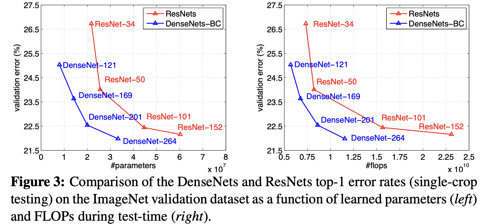
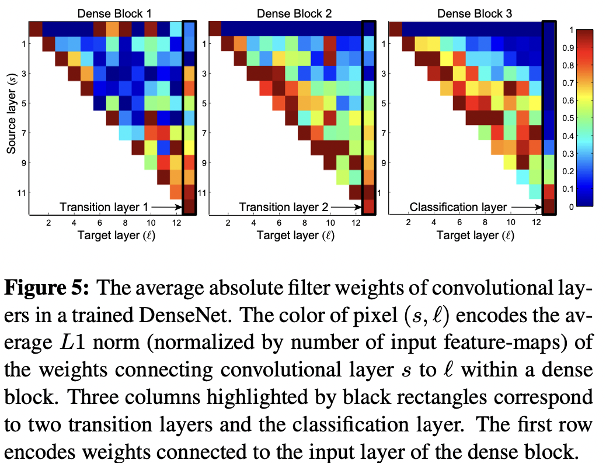

# Densely Connected Convolutional Networks

Gao Huang(Cornell University), Zhuang Liu(Tsinghua University), Laurens van der Maaten(Facebook AI Research), Kilian Q. Weinberger(Cornell University)

## Abstract

상식적으로 입력에 가까운 계층과 출력에 가까운 계층 사이에 Shortcut이 있다면 컨볼루션 네트워크는 좀 더 깊고 정확하며 효율적으로 훈련시킬 수 있다. 저자들은 이런 상식을 포함시켜서 Dense Convolutional Network(DenseNet)을 발표했는데 역전파시에 각 계층을 모든 다른 계층에 연결하는 구조를 띄고 있다. 전통적인 컨볼루션 계층이 L 계층 사이에 L개의 연결 경로를 가진다면 DenseNet에서는 L(L+1)/2의 연결 경로를 가진다. 각 계층에 대해서는 모든 선행 계층들의 Feature map들은 다음 계층의 입력으로 쓰이고 이 계층의 Feature map들은 모든 후행 계층들의 입력으로 쓰인다. DenseNet은 몇가지 강력한 이점을 가지고 있다. 그래디언트가 역전파 중에 사라지는 문제를 완화하고 Feature 전파력를 강화시키며 Feature를 다시 사용함으로서 전체 파라미터 수를 줄인다. 저자들은 저자들의 아키텍처를 여러 벤치마크에서 검증했다(CIFAR-10, CIFAR-100, SVHN, ImageNet). 저자들에 의하면 DenseNet으로 필요한 연산량을 줄이고 높은 성능으로 모델을 개선했다고 한다. 

## Introduction

CNN이 점점 깊어지면서 새로운 문제가 발생했는데 입력 데이터에 대한 정보나 많은 계층을 거쳐가는 그래디언트가 사라질 수 있다는 것이다. 많은 연구들이 이를 해결하려고 노력했다. ResNet이나 Highway Network는 Identity connection을 통해서 한 계층에서 다음으로 Signal을 우회해서 보낸다. Stochastic depth는 훈련 과정 중에 ResNet에서 랜덤하게 계층을 드롭해서 정보와 그래디언트를 잘 흘려보낼 수 있게 한다. FractalNet은 반복적으로 몇 개의, 다른 수의 컨볼루션 블럭을 가진 병렬 계층 열을 조합하는 방식으로 네트워크에서 많은 Shortcut을 유지한다. 비록 이런 접근법들이 네트워크 토폴로지나 훈련 방법에 따라 다양하긴 하지만 공통적인 특징을 보인다. 초기 계층에서 후기 계층으로의 Shortcut을 만든다는 점이다. 저자들은 다음의 아이디어를 반영한 아키텍처를 제안했다. 네트워크의 각 계층 사이의 정보 흐름을 최대화 하기 위해서 모든 계층을(Feature map 크기가 맞는 계층끼리) 연결한다. 각 계층은 추가적인 입력 데이터를 모든 선행 계층으로부터 받고 그 계층의 모든 Feature map을 모든 후행 계층에 전달한다. 

ResNet과는 다르게 Summation으로 Feature map을 합치는 것이 아니라 Concatenation으로 Feature map을 합친다. 그러므로 l번째 계층이 l개의 입력을 받는다면 이 입력은 모든 선행 계층의 Feature map으로 구성된다. 그리고 이 계층의 Feature map들은 L-l개의 후행 계층들에 전달된다. 그렇기 때문에 네트워크의 경로는 총 L(L+1)/2가 된다. 

저자들에 의하면 이 아키텍처 구조는 전통적인 컨볼루션 계층보다 더 적은 파라미터만 있으면 된다고 하는데 그 이유는 중복되는 Feature map을 다시 학습할 필요가 없기 때문이라고 한다. 전통적인 순전파 아키텍처를 상태가 계층 간에 전파되는 알고리즘으로서 본다면 각 계층은 바로 이전 계층에서 상태를 읽고 바로 다음 계층에 상태를 쓰는 형태가 된다. 계층이 상태를 변화시키기는 하지만 보존되어야할 정보는 그대로 전달하게 된다. ResNet의 경우 Identity transformation으로 이런 작업을 명시적으로 수행했다. Stochastic depth 연구에서는 사실 많은 계층에서 최종 예측에 기여하는 바가 매우 작기 때문에 훈련 중에 랜덤하게 계층을 드롭해도 된다고 주장했다. 이것이 ResNet을 unrolled RNN과 유사하게 보이게 하는데 ResNet의 파라미터 숫자는 엄청나게 많다. 왜냐하면 각 계층이 그 자신만의 가중치를 보유하기 때문이다. DenseNet에서는 네트워크에 추가되는 정보와 보존되어야할 정보를 분리시켰다. DenseNet에서의 계층들은 보통 얇은데(계층당 12개의 필터 수준) 네트워크의 Collective knowledge에 적은 셋의 Feature map만을 추가하고 남아 있는 Feature map의 상태를 변경하지 않기 때문이다(마지막에서 Classification은 모든 계층의 Feature map으로 수행한다). 

효율적인 파라미터 사용과 더불어 DenseNet의 큰 이점 중 하나는 네트워크를 관통하는 정보나 그래디언트 흐름이 개선되었다는 것이다. 이것이 모델을 훈련시키기 쉽게 만든다. 각 계층은 Loss function과 원본 입력 데이터 Signal로부터의 그래디언트로 직접적인 접근이 가능한데 이는 암시적인 Deep supervision이다. 이것이 깊은 아키텍처의 훈련을 돕는다. 그리고 저자들의 관찰 결과 Dense connection은 규제의 효과도 있어서 적은양의 데이터셋으로 인한 과적합 정도를 줄일 수 있다고 한다. 

저자들의 모델은 그 당시 SOTA 기법들과 정확도는 유사하면서 더 적은 파라미터를 가졌다고 한다. 

## Related Work

아키텍처에서 계층의 수가 많아질수록 각 연구의 아키텍처의 구조가 달라졌고 연결 패턴을 서로 어떻게 다르게 할 것인지에 대한 연구에 대한 동기 부여가 되었고 이미 나온 아이디어를 다시 돌아보는 계기가 되었다. 

Highway Network는 100개 이상의 계층을 가진 네트워크를 End-to-End로 효율적으로 훈련시키는 수단을 제시한 거의 첫 번째 아키텍처라고 한다.  게이트 유닛과 함께 우회 경로를 사용해서 Highway Network는 수백개의 계층이 있어도 어렵지 않게 최적화 될 수 있다고 한다. 이 우회 경로 개념은 매우 깊은 네트워크를 훈련시키는 것을 쉽게 하는 핵심 요소라고 추정이 된다. ResNet에서 이런 추정을 뒷받침하는데 여기서는 Identity mapping을 우회 경로로 사용한다. Stochastic depth는 1202 계층짜리 ResNet을 훈련시키는 방법으로서 제안되었다. Stochastic depth에서는 훈련 중에 랜덤하게 계층을 드롭해서 깊은 Residual 네트워크를 훈련시킨다. 이 연구가 암시하는 바는 모든 계층이 훈련에 필요하지 않을지도 모르고 사실은 깊은(Residual) 네트워크에 어마어마한 양의 중복이 존재할지도 모른다는 사실이다. 저자들의 연구는 부분적으로 이 추정에 영향을 받았다고 한다. 

네트워크를 깊게 쌓는 것과는 별개의 접근 방법은 네트워크의 너비를 늘리는 것이다. GoogLeNet에서는 Inception module을 사용하는데 이는 각기 다른 크기의 필터로 만든 Feature map들을 Concatenation 하는 것이다. ResNet의 어떤 변종에서는 Wide generalized residual 블럭이 제안되기도 했다. 사실 ResNet에서 각 계층의 필터 수를 늘리는 것만 해도, 깊이가 충분하다면 성능을 향상시킬수는 있다. 실제로 FractalNet에서도 Wide 네트워크 구조를 사용해서 몇몇의 데이터셋에서 좋은 결과를 보여주기도 했다. 

극도로 깊거나 넓은 아키텍처에서 표현력을 끌어내는 것 대신에 DenseNet에서는 Feature를 재사용해서 네트워크의 성능 향상에 대한 잠재력을 이용했는데, 덕분에 효율적이고 훈련시키기쉬운 간결한 모델을 생성할 수 있었다. 각기 다른 계층에서 만들어진 Feature map을 Concatenation 하는 것은 후행 계층들의 입력에서의 변동성을 증가시키고 효율성을 개선시킨다. 저자들이 말하길 이같은 점이 ResNet과 DenseNet이 다른 점이라고 한다. Inception 네트워크와 비교해서, Inception 네트워크도 각 계층에서의 Feature들을 Concatenation 하긴 하지만 DenseNet이 더 간단하고 효율적이라고 저자들이 주장한다. 

 

## DenseNet

x0라는 하나의 이미지가 컨볼루션 계층을 통과한다고 가정해보자. 네트워크는 L개의 계층으로 이루어져 있고 각 계층은 H_l(.)이라는 비선형성 변환으로 구현되어 있다. 여기서 l은 각 계층의 인덱스를 의미한다. H_l(.)은 여러 연산들의 합성 함수인데 BN이나 ReLU, Pooling, 컨볼루션 등으로 구성되어 있다. 여기서 l번째 계층의 출력을 x_ㅣ이라고 하기로 한다. 

### ResNets

전통적인 컨볼루션 계층은 l번째 계층의 출력을 ㅣ+ 1번째 계층의 입력으로 연결한다. 이때 다음의 전환이 발생한다. 

ResNet은 Skip-connection이라는 개념을 추가하는데 이 개념은 계층의 입력 시그널이 Identity function을 통해 비선형성 변환을 우회해 가는 것을 의미한다. 

ResNet의 장점은 그래디언트가 역전파 시에 Identity function 경로를 통해서 후행 계층에서 선행 계층으로 곧바로 흘러갈 수 있다는 점이다. 그러나 Identity function과 H_l의 출력이 Summation으로 결합되기 때문에 네트워크 안에서 정보의 흐름에 방해가 될 수도 있다. 

### Dense connectivity

계층 간의 정보의 흐름을 개선하기 위해서 저자들은 다른 연결 패턴을 제안했다. 어떤 계층에서 그 계층의 모든 후행 계층에 직접적으로 경로를 만드는 방식이다. Figure 1에서 그 레이아웃을 확인할 수 있다. 결과적으로 l번째 계층은 모든 선행 계층의 Feature map인 x0, ..., x_l-1을 입력으로 받는다. 

여기서 [x0, ..., x_l-1]은 0, ..., l-1번째 계층의 Feature map을 Concatenation한 것이다. 이 연결 패턴 때문에 저자들은 저자들의 아키텍처를 Dense Convolutional Network(DenseNet)이라고 부르기로 했다. 

### Composite function

저자들은 H_l(.)을 다음의 연속적인 세개의 연산으로 이루어진 합성 함수로 정의했다. BN, ReLU, 3x3 컨볼루션

### Pooling layers

식 2의 Concatenation 연산은 Feature map 들의 크기가 변하면 수행할 수 없는 연산이다. 그런데 컨볼루션 네트워크에서는 어쩔수 없이 다운 샘플링을 통해서 Feature map의 크기가 변하게 된다. 다운 샘플링을 고려해서 저자들은 네트워크를 아래와 같이 여러개의 Densely connected dense 블럭으로 나눴다. 

여기서 저자들은 블럭들 사이에 있는 계층들을 Transition 계층이라고 했다. 이 계층에서는 컨볼루션과 풀링 연산을 수행한다. 저자들의 구현체에서 Trasition 계층은 BN, 1x1 컨볼루션 계층, 2x2 Average 풀링 계층으로 구성된다. 

### Growth rate

만약에 각 H_l 함수가 k개의 Feature map을 만들어낸다면 l번째 계층은 ko + k*(l-1) 입력 Feature map을 가질 것이다. 여기서 k0는 입력 계층의 채널 숫자이다. DenseNet이 여타 다른 아키텍처와 다른 점은 채널 숫자가 작다는 것이다(예를 들어서 k = 12). 저자들은 하이퍼 파라미터 k를 네트워크의 Growth rate라고 불렀다.  저자들이 주장하길 상대작은 작은 Growh rate만으로도 충분히 좋은 성능을 보일 수 있다고 하는데 이에 대한 이유로, 각 계층이 같은 블럭 안에 있는 모든 선행 계층의 Feature map에 접근이 가능하므로 네트워크가 Collective knowledge를 가질 수 있기 때문이라고 했다. Feature map을 네트워크의 전역적 상태라고 볼 수 있는데 각 계층은 그 계층들의 k 개의 Feature map을 이 상태에 더할 수 있다. Growth rate는 각 계층의 새로운 정보가 얼마나 전역 상태에 기여하는지를 규제한다. 전역 상태는 네트워크 안의 어디서든 접근이 가능하므로 전통적인 네트워크 아키텍처와는 다르게 계층 사이에 복제될 필요가 없다고 한다. 

### Bottleneck layers

각 계층이 k개의 Feature map만 만들어낸다고 할지라도 Bottleneck 계층에서는 보통 더 많은 입력을 받는다. 1x1 컨볼루션은 Bottleneck 계층으로서 3x3 컨볼루션 계층 전에, 입력 Feature map의 숫자를 줄여서 연산 효율성을 개선하기 위해서 쓰인다. 저자들은 이런 디자인이 특히 DenseNet에 효율적일 것이라고 보고 DenseNet에 Bottleneck 계층을 적용한 아키텍처를(예를 들어서 BN-ReLU-Conv(1x1)-BN-ReLU-Conv(3x3)) DenseNet-B라고 불렀다. 저자들의 구현체에서는 각 1x1 컨볼루션이 4k개의 Feature map을 만들어내도록 구현되었다. 

### Compression

모델의 간결함을 위해서 저자이 말하길 Transition 계층에 있는 Feature map의 숫자를 줄일 수 있다고 한다. 만약에 Dense block에 m개의 Feature map이 있다면 그 다음의 Transition 계층은 Floor of θm의 Feature map을 만들어 낼 수 있다고 한다(이때 0 < θ <= 1이며 θ를 Compression factor라고 부른다). θ=1일때 Transition 계층 간의 Feature map의 숫자는 변하지 않는다. 저자들은 θ < 1인 DenseNet을 DenseNet-C라고 불렀다. 저자들은 구현체에서는 θ=0.5로 정했다. 만약에 Bottleneck 계층이 쓰이고 Transition 계층의 θ < 1일때 저자들은 이 모델을 DenseNet-BC라고 불렀다. 

### Implementation Details

ImageNet을 제외한 모든 데이터셋에서 저자들의 구현체는 3개의 Dense 블럭을 가지고 각 블럭에는 동일한 숫자의 계층이 있다. 첫번째 블럭에 진입하기 전에 16개의 출력 채널을 가진 컨볼루션(혹은 DenseNet-BC의 Growth rate의 두배)을 입력 이미지들이 통과한다. 3x3 컨볼루션 계층의 경우 입력의 각 측면에는 1픽셀의 Zero 패딩이 추가되어 Feature map의 크기를 유지시킨다. 저자들은 1x1 컨볼루션 후에 2x2 average pooling을 두 개의 연속적인 Dense 블럭 사이의 Transition 계층으로서 사용한다. 마지막 Dense 블럭에서는 Global average 풀링이 수행되고 나서 Softmax classifier가 붙는다. 세 개의 Dense 블럭에서 Feature map의 크기는 32x32, 16x16 그리고 8x8이다. 저자들은 다음과 같은 셋팅으로 기본 DenseNet을 실험했다. {계층 숫자 L= 40, Growth rate k = 12}, {L=100, k=12}, {L=100, k=24}. DenseNet-BC의 경우 다음과 같은 셋팅으로 실험했다. {L=100, k=12}, {L=250, k=24}, {L=190, k=40}

ImageNet 데이터셋의 실험에서는 DenseNet-BC, 4개의 Dense 블럭 구조의 네트워크로 실험했다. 블럭에 들어가기 전 초반의 컨볼루션의 출력은 2k개이고 7x7 커널의 Stride 2이다. 다른 모든 계층은 k개의 출력을 가진다. ImageNet과 관련된 설정은 Table 1에 나와 있다. 

 

 

## Experiments

### Datasets

#### CIFAR

CIFAR-10과 CIFAR-100은 32x32 픽셀 크기의 색이 있는 자연 이미지이다. CIFAR-10은 10개의 클래스로, CIFAR-100은 100개의 클래스로 이루어져 있다. 훈련셋과 테스트 셋은 각각 50,000과 10,000장이고 저자들은 5,000장의 훈련 셋을 검증셋으로 썼다. 저자들은 Data augementation(Mirroring, Shifting)을 데이터셋에 적용했다. 저자들은 Data augmentation을 적용한 데이터셋을 C10+이라고 했다. 전처리를 위해서 Channel means와 Standard deviations로 정규화했다. 마지막에는 검증 셋의 데이터를 모두 이용해서 모델을 훈련시키고 테스트 결과를 냈다. 

#### SVHN

Street View House Numbers(SVHN) 데이터셋은 32x32의 색이 있는 디지털 이미지이다. 73,257장의 훈련셋과 26,032장의 테스트 셋이 있고 531,131장의 이미지가 추가적인 훈련을 위해 있다. 저자들은 모든 훈련 데이터셋을 Data augmentation 없이 사용했고 6,000장의 이미지를 훈련 셋에서 분리해서 검증셋으로 사용했다. 저자들은 훈련 도중에 검증 에러가 가장 낮은 모델을 선택해서 테스트 셋으로 평가했다. 전처리로를 픽셀 값을 255로 나누어 [0, 1]의 값을 갖도록 했다. 

#### ImageNet

ILSVRC 2012 classification 데이터셋은 1.2 백만의 훈련 이미지, 50,000의 검증 이미지로 이루어져 있고 클래스가 1,000개이다. 저자들은 훈련셋에 Data augmentation을 적용했고 테스트 시에는 224 크기의 Single crop 혹은 10 crop을 적용했다. 검증셋으로 최종 에러를 나타냈다. 

### Training

훈련 과정과 관련한 여러 설정은 본문 참고.

### Classification Results on CIFAR and SVHN

CIFAR, SVHN으로 테스트 했을 때 결과는 아래 Table 2에 나와 있다. 저자들의 방법에서 좋은 성능을 낸 결과는 굵은체로 전체적으로 최상의 결과는 파란색으로 나타냈다. 

### Classification Results on ImageNet

아래 Table3는 ImageNet에서 Single crop과 10 crop을 적용한 DenseNet 모델들의 검증셋 에러를 보여준다.

## Discussion

표면상으로는 DenseNet은 꽤 ResNet과 유사한것처럼 보인다. Eq 1은 Eq 2와 비교했을 때 H_l(.)으로 들어가는 입력이 Summation 대신 Concatenation 되었다는 점만 다르다. 그러나 이 작은 차이는 두 네트워크 아키텍처의 작동 방식을 완전하게 다르게 만든다. 

### Model compactness

입력의 Concatenation의 직접적인 결과로 DenseNet 계층들의 Feature map은 모든 후행 계층들에 의해서 접근이 가능하다. 이것은 네트워크 전체에서 Feature들을 재사용할 수 있게 만들고 좀 더 간결한 모델이 되게 한다. 

Figure 4의 왼쪽 그림은 DenseNet 모든 변종들의 파라미터 효율성을 비교하는 것을 보여주고 가운데 그림은 ResNet 아키텍처와의 비교를 보여준다. 저자들은 여러 C10+ 데이터 셋에서 깊이를 다르게 한 여러 작은 네트워크를 훈련시키고 테스트 셋에서의 정확도를, 네트워크 파라미터를 입력으로 하는 함수의 결과로서 나타냈다. AlexNet, VGG-net과 같은 다른 네트워크 아키텍처와 비교했을때 ResNet with pre-activation은 보통 더 적은 파라미터를 쓰면서 더 좋은 결과를 보이곤 한다. 저자들은 DenseNet(k = 12)와 이 아키텍처를 비교했다고 한다. 이 DenseNet의 훈련 설정은 이전의 DenseNet에서와 동일하다. 

그래프에서 확인 할 수 있는 것처럼 DenseNet-BC는 어떤 아키텍처와 비교해도 가장 파라미터 효율적인 DenseNet의 변종이다. 동일한 수준의 정확도를 달성하기 위해서 DenseNet-BC는 ResNet(Figure 4의 가운데 그림)과 비교해서 1/3 정도의 파라미터만 필요하다. 저자들이 말하길 이런 결과는 Figure 3에서 보여준 ImageNet에서의 결과와 비슷한 맥락이라고 한다. Figure 4의 오른쪽 그림을 보면 DenseNet-BC는 0.8M의 훈련 가능한 파라미터로도 1001개의 계층을 가진(Pre-activation) ResNet의 10.2M 파라미터와 유사한 정확도를 보인다고 한다. 

### Implicit Deep Supervision

DenseNet이 향상된 정확도를 보여주는 이유를 설명할 수 있는 한 가지 추정은 각 계층들이 Shortcut을 통해 Loss function으로 부터 추가적인 감시를 받는다는 것이다. DenseNet에서 Deep supervision을 수행한다고 해석할 수도 있다. 

DenseNet에서 암시적인 양상으로 네트워크의 꼭대기에 있는 하나의 Classifier가, 많으면 두 개 혹은 세개의 Transition 계층을 통해서 모든 계층에 직접적인 감시를 한다고 추정할 수 있다. 

### Stochastic vs. deterministic connection

DenseNet과 ResNet의 Stochastic Depth regularization 사이에 흥미로운 연관성이 있다. Stochastic depth에서는 ResNet의 계층들이 랜덤으로 드롭되는데 이때 드롭 되는 계층 주변의 계층 사이에 직접적인 경로가 만들어진다. Pooling 계층은 드롭되지 않기 때문에 네트워크는 DenseNet에서의 연결 패턴과 유사하다. 만약에 중간 계층이 랜덤하게 드롭된다면 Pooling 계층 사이에 있는 어떤 두 계층끼리 직접적으로 연결될 작은 확률이 존재하게 된다. 

### Feature Reuse

디자인에 의해서 DenseNet의 모든 계층은 선행 계층들의 Feature map에 접근이 가능하다(같은 블럭 안에 있지 않으면 Transition 계층을 거치지긴 하지만). 저자들은 훈련된 네트워크가 이런 이점을 잘 활용하는지를 조사하기 위한 실험을 수행했다. 저자들은 우선 C10+으로 L=40, k=12의 DenseNet을 훈련시켰다. 한 블럭 안에 있는 각 컨볼루션 계층 l에 대해서 저자들은 계층 s와 경로가 설정되어 있는 계층들의 Average(absolute) weight를 계산했다. 다음의 Figure 5는 세 개의 Dense 블럭에 대한 Heat map을 보여준다. 

Average absolute weight는 컨볼루션 계층의 선행 계층들에 대한 의존성을 나타내는 역할을 한다. (l, s) 자리의 빨간 점은 계층 l이 평균적으로 강하게, s 계층 이전에 만들어진 Feature map을 사용한다는 뜻이다. 

- 모든 계층은 Weight를 같은 블럭 안에 있는 많은 입력에 대해서 펼쳐놨다. 이것은 초기 계층에서 추출된 특징들이 같은 블럭 안에서 더 깊은 계층들에 의해서 직접적으로 사용된다는 것을 의미한다.
- Transition 계층의 Weight들은 선행하는 Dense 블럭 안에 있는 모든 계층에 걸쳐 펼쳐진다. 이는 몇가지 간접적인 방법으로 DenseNet의 각 첫 번째 계층에서 마지막 계층들로 정보가 흐름을 나타낸다.
- 두 번째와 세 번째 블럭에 있는 계층들은 지속적으로 Transition 계층에 최소의 Weight를 할당하는데 이는 Transition 계층이 많은 중복된 Feature를 출력한다는 것을 나타낸다. 이런 결과는 DenseNet-BC의 결과와 동일하다.
- 마지막 Classification 계층이 전체 Dense 블럭에 걸친 Weight를 사용하긴 하지만 마지막 Feature map으로 초점이 맞춰지는 것으로 보이면 이것은 네트워크 후반부에 더 상위 수준의 Feature가 있을 수 있음을 나타낸다. 

## Conclusion

저자들은 DenseNet이라는 아키텍처를 제안했는데 여기서는 Feature map의 사이즈가 같은 두 계층이 서로 연결 될 수 있다. 이런 방법으로 수백만의 계층으로 Scale이 조절될 수 있다. 저자들은 실험을 통해 DenseNet이 성능 하락이나 과적합 없이 파라미터의 수가 증가함에 따라 정확도가 지속적으로 개선되는 경향이 있음을 확인했다고 한다. 저자들이 말하는 DenseNet의 장점은 매우 적은 파라미터와 연산량으로도 SOTA의 정확도를 달성할 수 있다고 하는 점이다. 저자들은 ResNet에서의 최적화된 하이퍼파라미터 셋팅을 DenseNet에 적용했기 때문에 이를 DenseNet에 맞게 재조정하면 더 나은 결과가 있을 것이라고 주장한다.  

Integration the properties of identity mappings, Deep supervision, Diversified depth, Feature reuse
