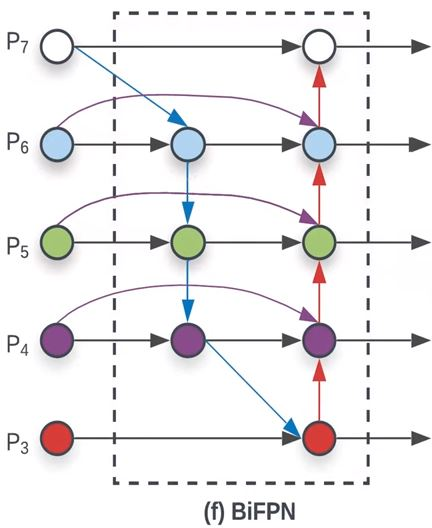

# EfficientDet: Scalable and Efficient Object Detection

Mingxing Tan,  Ruoming Pang, Quoc V. Le(Google Research, Brain Team)

## Abstract

저자들은 모델의 효율성을 개선하기 위한 방법을 본 논문에서 제안했다. 

- 첫번째로, 다양한 크기의 Feature들을 합치는 방법인 Bi-directional feature pyramid network(BiFPN)을 제안했다. 
- 두번째로, 네트워크의 Backbone, Feature network, Box/class prediction network의 Resolution, Depth, Width를 동시에 Scaling하는 Compound scaling method를 제안했다. 

이를 바탕으로 저자들은 EfficientDet이라고 하는, 다양한 리소스 환경에서 구동이 가능하면서 비슷한 성능을 낼 수 있는 Detection 알고리즘을 만들었다. 

[google-automl-efficientdet](https://github.com/google/automl/tree/master/efficientdet)

## Introduction

Object detection 분야에서 상당히 많은 발전이 이뤄졌지만 그만큼 Cost가 비싸졌다. 한 예로 AmoebaNet 기반의 NAS-FPN detector의 경우는 167M개의 파라미터와 3045 BFLOPS를 필요로 한다. 그런데 이렇게 크고 비싼 모델은 로보틱스나 자율주행차와 같은, 모델 사이즈와 Latency 때문에 상당히 제한적인 환경의 Application에는 맞지 않는다. 그래서 이런 환경에 맞는, 효율성에 초점을 둔 One-stage, Anchor-free detection 알고리즘을 만들어내려는 노력들이 많았다. 그런데 이 알고리즘들은 대게 효율성은 높지만 정확도는 희생을 감수하는 경우가 많다. 게다가 기존의 연구들은 모델이 돌아가는 환경이 구체적으로 정해져 있다고 보는 경우가 많은데 실제로는 Mobile device부터 Datacenter까지 각기 다른 환경에서 구동되는 경우가 있다. 

저자들은 그래서 각기 다른 환경에서 구동시킬 수 있으면서 높은 정확도와 효율성을 가지는 모델을 구축할 수 있는 방법이 없을까를 고민했다. 그래서 저자들은 Detection 아키텍처의 다양한 디자인 옵션을 알아봤다. 그 결과 두 가지 해결해야할 사항을 확인했다. 

- Efficient multi-scale feature fusion: FPN은 다양한 크기의 Feature들을 합치는데 많이 쓰이고 있다. PANet, NAS-FPN 같은 연구에서는 Cross-scale Feature fusion을 위한 네트워크 구조를 개발하기도 했다. 이런 연구들은 Feature들을 구분 없이 단순히 더해버린다. 하지만 저자들이 관찰한 결과 이 Feature의 Resolution들이 같지 않기 때문에 합쳐진 Output에 기여하는 바가 다르다고 한다. 그래서 저자들은 Top-down과 Bottom-up의 Multi-scale feature fusion이 반복되는 구조에서 각 Feature들의 중요도를 결정하는 Weight들을 학습이 가능하도록 만드는 BiFPN을 제안했다. 
- Model scaling: 보통 많은 연구들이 주로 더 높은 정확도를 위해서 더 큰 Backbone 네트워크에 의존하거나 더 큰 입력 이미지 사이즈에 의존하는데, 저자들이 관찰한 바에 의하면 정확도와 효율성을 동시에 고려했을때 Feature network와 Box/class prediction network를 Scaliing 하는 것도 중요하다고 한다. 그래서 저자들은 Backbone, Feature network, Box/class prediction network의 Resolution, Depth, Width를 동시에 Scaling 하는 Compound scaling method를 고안해냈다. 
- 저자들은 다른 Backbone보다 EfficientNet의 성능이 좋은 것을 확인했다. 그래서 저자들이 제안한 BiFPN과 Compound scaling method를 결합해서 EfficientDet를 만들어냈다. 저자들이 말하는 EfficientDet은 훨씬 적은 모델 파라미터와 FLOPs로 준수한 정확도를 낼 수 있는 알고리즘이다. 

## Related Work

### One-stage Detectors

저자들은 One-stage의 기조를 따르면서 최적화된 Network 아키텍처로 효율성과 정확도를 높일 수 있다고 한다. 

### Multi-Scale Feature Representations

Object detection에서 가장 큰 어려움 중 하나는 효율적으로 다양한 크기의 Feature들을 처리하는 방법이다. 초기의 Detector들은 종종 Backbone network에서 출력된 Pyramidal feature hierarchy에서 예측을 수행하곤 했다. FPN은 이 Feature들을 결합하기 위한 Top-down pathway를 제안하기도 했다. PANet은 추가적인 Bottom-up path aggregation network를 FPN의 위에 더했다.  STDL은 Cross-scale feature들을 이용하기 위한 Scale-transfer module을 제안하기도 했다. M2det은 U모양의 module로 다양한 크기의 Feature들을 Fuse했다. G-FRNet은 Gate unit으로 Feature에 대해서 Information flow를 조절하는 방법을 소개했다. NAS-FPN은 Feature network topology를 자동으로 디자인하는 Neural architecture search에 의존한다. 성능은 좋긴하지만 Search 시간이 매우 길고 Network 모양이 불규칙적이기 때문에 해석하기 어렵다. 

### Model Scaling

보통 더 나은 정확도를 위해서 쓰는 방법은 더 큰 Backbone 네트워크를 사용하는 것이다. 그런데 몇몇 연구에서 채널 크기를 키우는것과 Feature network 구조를 반복하는 것이 정확도를 향상시킨다는 것을  발견했다. 이런 방법들은 하나나 몇가지 안되는 요소를 조절하는 것에 초점을 맞춘다. 그런데 저자들은 EfficientNet 연구에서 이런 요소들을 동시에 Scaling하는 방법이 모델의 효율성을 괄목할만하게 개선한다는 것을 입증했다. 그래서 저자들은 EfficientNet의 Compound scaling method 방법을 본 연구에서도 적용했다. 

## BiFPN

### Problem Formulation

Multi-scale feature fusion은 각 해사도의 Feature들을 합치는 것을 목표로 한다. 다음과 같이 Feature들의 리스트가 있다고 가정한다. 

여기서 

는 Level l_i에서의 Feature를 나타낸다. 저자들의 목표는 이 입력 Feature 리스트로 하나의 새로운 출력 Feature들의 리스트를 만들어낼수 있도록 입력 Feature들을 효율적으로 합칠 수 있는 Transformation f를 찾는 것이다. 

예를 들어서 설명하자면, Figure 2(a)는 전통적인 FPN의 구조를 보여준다. 이때 FPN은 Level3-7의 입력 Feature를 받는다(각 Feature들의 해상도는 입력 이미지 대비 1/2^i). 

이때 전통적인 FPN은 다음과 같이 Top-down 방법으로 여러 크기의 Feature들을 합친다. 

여기서 Resize는 해상도를 맞추기 위한 Up sampling 혹은 Down sampling을 의미한다. 

### Cross-Scale Connections

전통적인 FPN은 정보의 흐름이 단편적이기 때문에(Top-down 1번) 한계가 있다. 이에 PANet에서는 추가적인 Bottom-up aggregation network를 추가했다(Figure 2(b)). 

NAS-FPN은 Neural architecture search로 Cross-scale feature network topology를 자동으로 찾는다. 성능은 좋지만 시간이 오래 걸리고 네트워크 구조가 불규칙 적이라 네트워크를 해석하거나 변경하기 어렵다는 단점이 있다(Figure 2(c)). 

저자들은 이 세 네트워크의 성능을 비교했는데 PANet이 FPN, NAS-FPN보다 더 높은 정확도를 달성하기는 했으나  더 많은 파라미터와 계산량을 필요로 하는 것을 관찰했다. 저자들은 모델의 효율성을 개선하기 위해서 몇가지 최적화 방법을 Cross-scale connection에 적용했다. 

- 먼저 Input edge만 있고 Feature fusion을 하지 않는 노드는 제거한다. 이는 저자들의 목적인 각 Feature를 Fuse하는데 기여를 별로 하지 않을 것이기 때문이다. 

  

- 입력과 출력 노드가 같은 Level에 있다면 이 둘을 연결하는 Edge를 추가한다. 이렇게 하면 많지 않은 Cost로 더 많은 Featue를 출력 노드에 Fuse 할 수 있게 된다. 

  

- PANet에서는 하나의 Top-down과 Bottom-up path만이 있지만 저자들은 각 Bidirectional(Top-down & Bottom-up) path를 하나의 Feature network 계층으로 취급하여 여러번 반복하여 이어 붙인다. 이렇게 되면 더 높은 차원의 Feature fusion을 수행할 수 있게 된다. 

이렇게 저자들이 고안한 Feature network를 Bidirectional feature pyramid network(BiFPN)이라고 한다. 

### Weighted Feature Fusion

다른 해상도의 Feature를 Fuse 하는 가장 흔한 방법은 Feature의 크기를 조정해서 같은 해상도로 만든 다음에 더하는 것이다. 기존의 방법들은 모든 입력 Feature들을 구분 없이 동등하게 취급한다. 그러나 저자들이 관찰한 결과는 입력 Feature들의 해상도가 모두 다르기 때문에 Output에 기여하는 바도 다르다는 것이다. 저자들은 이런 문제를 해결하기 위해서 각 입력 Feature에 가중치를 두는 방법을 생각했다. 이 가중치는 모델 훈련 중에 학습이 가능하다. 저자들은 이런 Weighted fusion 방법을 세가지 관점에서 생각했다. 

- Unbounded fusion

  

w는 학습이 가능한 가중치과 I는 입력 Feature들이다. w는 Scaler(Feature 값 전체에 하나), Vector(Channel당 하나), 다차원 Tensor(Pixel당 하나)가 될 수 있다. 직관적으로 입력 Feature에 가중치를 곱해서 더하는 방식으로 이해할 수 있다. 저자들은 Scaler가 최소의 Cost로 다른 방식과 비견될만한 정확도를 보이는 것을 확인했다. 그러나 Scaler weight가 Unbounded되었기 때문에 학습이 불안정해질 수 있다(값이 이상치로 튈 수 있다). 그래서 저자들은 이 Weight를 정규화 하여 특정 범위의 값을 가지도록 하는 방법을 생각했다. 

- Softmax-based fusion

  

이런 가중치를 정규화 하는 방법 중 하나는 단순히 Softmax를 적용하는 것이다. Softmax를 적용하면 모든 값이 0과 1 사이가 된다. 그러나 이 방법에서 Softmax를 계산하는 과정이 GPU의 속도를 상당히 느리게 했다. 저자들은 이런 Latency cost를 최소화 하기 위해서 다른 방법을 생각해야 했다. 

- Fast normalized fusion

  

여기서 각 가중치는 양수임이 보장되어야 하기 때문에 ReLU를 통과시킨다. ε = 0.0001로 Numerical instability를 없애기 위한 값이다. Softmax 방식과 마찬가지로 여기서의 가중치 값들은 0과 1 사이가 된다. 그러나 Softmax 연산 방식보다 훨씬 효율적이다. Softmax 방식과 학습 방식이나 정확도가 매우 유사하지만 30% 더 빠르게 GPU에서 연산이 가능하다고 한다. 

BiFPN은 Bidirectional cross-scale connection과 Fast normalized fusion 개념을 합친다. 

저자들은 Feature fusion 과정에서 Depthwise separable convolution을 썼고 Batch normalization과 Activation을 각 Convolution 연산 후에 수행했다고 한다. 

## EfficientDet

### EfficientDet Architecture

EfficientDet의 아키텍처는 위와 같으며 전체적으로 One-stage 알고리즘의 패러다임을 따른다. EfficientNet Backbone은 ImageNet에서 Pretraining했다. BiFPN은 Feature network의 역할을 하는데 Backbone에서의 P3-7까지의 Feature를 입력으로 받아서 Top-down과 Bottom-up의 Bidirectional feature fusion을 반복적으로 통과시킨다. 이렇게 만들어진 Fused feature들은 Class, box prediction network의 입력으로 들어간다. Class, box prediction network는 모든 Level의 Feature에 대해서 공유된다. 

### Compound Scaling

저자들은 저자들의 선행 연구의 방법을 Object detection에도 적용하기로 했다. 그래서 Compound coefficient ø로 네트워크의 Backbone, BiFPN, class/box network, Resolution을 동시에 유기적으로 Scaling 한다. 저자들이 말하길 Object detection은 Image classification과는 다르게 Grid search를 수행하기 힘드므로 Scaling factor에 대한 Search는 Heuristic할 수밖에 없음을 인정한다. 

#### Backbone network

Backbone에서는 EfficientNet-B0부터 B6까지의 Width/Depth Scaling coefficient와 동일한 값을 다시 사용해서 ImageNet으로 Pretrained된 checkpoints를 다시 사용할 수 있도록 했다. 

#### BiFPN network

BiFPN의 Width, Height은 위 그림과 같이 Scaling된다. BiFPN의 너비에 대해서는 {1.2, 1.25, 1.3, 1.35, 1.4, 1.45}에서 Grid search를 수행했는데 1.35의 결과가 가장 좋게 나왔다. 

#### Box/class prediction network

Box/class branch의 너비는 BiFPN과 같게 고정시켰다. 그러나 깊이는 위 그림과 같이 Scaling 한다. 

#### Input image resolution

BiFPN에서 Level3-7까지의 Feature가 사용되기 때문에 입력 Resolution은 2^7=128로 나눠 떨어져야 한다. 그래서 위 그림과 같이 Scaling 한다. 

ø에 따른 각 Scaling 값은 위 Table 1과 같다. D7과 D7x는 같은 BiFPN, Head 구조를 사용하는데 D7의 경우 더 큰 Resolution이고 D7x는 더 큰 Backbone과 Feature level을 사용한다(P3-P8). 

## Experiments

### EfficientDet for Object Detection

셋팅과 관련된 사항은 본문 참조. 

성능 평가 결과와 관련된 사항은 본문 참조.

### EfficientDet for Semantic Segmentation

Semantic Segmentation와 관련된 실험 결과는 본문 참조. 

## Ablation Study

여기서의 Ablation study는 COCO validation 셋으로 수행했다. 

### Disentangling Backbone and BiFPN

Table 4는 Backbone의 영향력과 BiFPN의 영향력을 보여준다. 먼저 Backbone을 바꿨을때 성능이 더 향상된 것을 확인할 수 있고 FPN을 BiFPN으로 바꿨을때 더 성능이 좋아진것을 확인할 수 있다.

### BiFPN Cross-Scale Connections

Table 5는 서로 다른 스타일로 Cross-scale connection을 수행하는 Feature network의 각 방법들을 사용했을때의 성능을 보려준다(Figure 2). 주의할 점은, 원래의 FPN과 PANet은 오직 하나씩의 Top-down, Bottom-up의 흐름만이 있는데 공평하게 성능을 비교하기 위해서 저자들은 이 구조를 여러번 반복해서 넣고 모든 Conv를 Depthwise separable conv로 바꿔서 BiFPN과 유사하게 만들었다. 그리고 같은 Backbone과 Class/box prediction network 그리고 같은 Training setting을 적용했다. 저자들이 말하길 원래의 FPN은 한방향의 Flow(Top-down) 때문에 정보의 흐름이 내부적으로 제한적일 수 밖에 없기 때문에 상대적으로 낮은 AP를 보인다고 한다. FPN+PANet은 정확도는 NAS-FPN보다 살짝 높지만 더 많은 파라미터와 FLOPs를 요구한다고 한다. 저자들이 제안한 BiFPN은 FPN+PANet과 정확도면에서는 유사한데 훨씬 적은 파라미터와 FLOPs를 요구한다. 여기에 Feature가 Output에 기여하는 weighted라는 개념을 적용하면 성능은 더 좋아진다고 한다. 

### Softmax vs Fast Normalized Fusion

저자들은 Fast normalized feature fusion이라는 개념을 제시해서 정규화된 weights들의 이점은 유지하면서 Softmax 시의 Cost는 줄일 수 있다는 것을 언급한 바 있다. 

Table 6에서는 다른 크기를 가진 3가지 Detector에서 Softmax와 Fast Fusion의 성능을 제시했다. Softmax와 Fast normalized 방식은 정확도면에서는 유사하나 저자들의 방법이 속도가 훨씬 빠르다는 것을 확인할 수 있다. 

Figure 5는 EfficientDet-D3의 BiFPN에서 임의로 선택된 세 개의 Feature fusion 노드에서의 학습된 가중치를 나타낸다. Normalized weights들은 항상 모든 입력 값에 대해서 합하면 1이 된다.  이 정규화된 weight들은 훈련 과정 중에 빠른 시간안에 변하는데 각 Feature들은 Feature fusion에 각기 다른 양으로 기여한다. 저자들의 방식과 Softmax의 방식의 변화 경향이 유사하다는 것을 확인할 수 있다. 

###  Compound Scaling

Figure 6는 저자들이 제안한 Compound scaling 방법과, 모델을 Scaling 하는 다른 방법들을 비교한 것이다. 

## Conclusion

저자들은 효율적인 Object detection을 위한 네트워크 아키텍처 디자인 선택의 일환으로 Weighted bidirectional feature network와 Detection에 맞는 Compound scaling method를 제안했다. 이를 바탕으로 EfficientDet이라고 하는 아키텍처를 제안했는데 이 구조는 훨씬 적은 수의 파라미터 수와 FLOPs으로도 당시의 SOTA의 정확도를 보였다. 

## Appendix

Traning epoch 수와 입력 이미지 크기에 대한 Jittering 그리고 입력 이미지의 해상도에 따른 모델 성능의 변화는 본문을 참고. 
