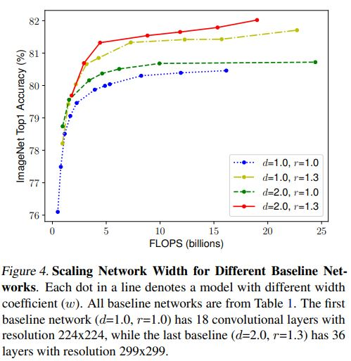

# EfficientNet: Rethinking Model Scaling for Convolutional Neural Networks

Mingxing Tan, Quoc V. Le(1Google Research, Brain Team, Mountain View, CA)

## Abstract

저자들은 이 연구에서 Model scaling 방법에 대해서 연구하고 네트워크의 너비, 깊이, 입력 Resolution을 균형적으로 Scaling하는 것이 임의로 Scaling 하는 것보다 더 좋은 성능 향상으로 이어짐을 확인했다. 이를 바탕으로 Compound coefficient라고 하는, 깊이 너비, Resolution의 차원을 균등하게 Scaling하는 방법을 제시했다. MobileNet 계열과 ResNet에서 이 방법의 효과를 입증했다.  그리고 저자들은 저자들이 제시한 방법을 적용했을때 효과를 늘리기 위한 저자들만의 네트워크 아키텍처인 EfficientNet을 고안했다.

[tpu-models-official-efficientnet/]( https://github.com/tensorflow/tpu/tree/master/models/official/efficientnet)

## Introduction

컨볼루션 네트워크의 경우 Scaling up을 통해서 더 좋은 성능을 꾀하기 마련이다. 예를 들어서 ResNet은 깊이를 더 늘려서 Scaling up을 수행한다. GPipe의 경우에는 Baseline 모델보다 4배 더 깊이를 키워서 ImageNet 데이터셋에서 84.3%의 Top-1 accuracy를 달성했다. 그러나 저자들이 연구를 수행할 당시에는 Scaling up 하는 방식에 대한 깊은 연구가 이뤄지지 않았다. 가장 대표적으로 Scaling up을 수행하는 방법은 모델의 깊이나 너비를 넓히는 것이다. 이보다는 덜 일반적이긴 하지만 Image resolution을 키우는 방법도 있다. 이런 요소를 임의로 조정하는 것은 매우 번거로운 일일 뿐더러 가장 최적의 정확도와 효율성을 보장할 수도 없었다. 

저자들의 연구는 이런 요소를 조정하는데 효율적인 방법이 없을까하는 질문에서 기인한다. 저자들은 이런 요소들을 일정한 비율로 균형감 있게 조정해야 좋은 성능을 얻을 수 있다는 것을 관찰했고 이를 바탕으로 Compound scaling method라는 것을 제안했다. 예를 들어서 네트워크의 용량을 2^N만큼 키우고 싶다면 직관적으로 생각했을때 깊이, 너비, 이미지 크기를 각각 α^N, β^N, γ^N(여기서 α, β, γ는 모델의 용량을 키우기 전의 작은 네트워크에서 그리드 서치로 찾아낸 상수 Ratio들)만큼 키우면 된다. 

저자들의 방법이 직관적으로 말이 되는 이유는 생각해보면 만약에 입력 이미지가 커지면 이를 위한 Receptive field도 커져야 할 것이고 큰 이미지에 대한 Fine-grained pattern을 좀 더 잘 캐치하기 위해서 채널 수도 커져야 할 것이다. 저자들은 저자들의 방법이 MobileNet, ResNet 계열의 모델에서 잘 적용되는 것을 관찰했다. 그러면서 말하길 Baseline 네트워크가 중요하다고 말했다. 저자들의 연구를 위해서 새로운 모델 아키텍처인 EfficientNet을 고안해냈다. 아래 Figure 1은 ImageNet 데이터셋에 대한 각 아키텍처의 성능을 나타낸 것이다. 

## Related Work

### ConvNet Accuracy

관련 연구 내용은 본문 참조. 

### ConvNet Efficiency

깊은 Convolution 네트워크는 자주 모델 파라미터수가 비대해진다. 그래서 다음과 같은 Model compression이 Accuracy와 Efficiency를 조절하면서 모델의 크기를 줄이는 보통의 방법이다. 

- Han, S., Mao, H., and Dally, W. J. Deep compression: Compressing deep neural networks with pruning, trained quantization and huffman coding. ICLR, 2016
- Yang, T.-J., Howard, A., Chen, B., Zhang, X., Go, A., Sze, V., and Adam, H. Netadapt: Platform-aware neural network adaptation for mobile applications. ECCV, 2018.

또 Mobile이 대중화 되면서 이에 맞는 ConvNet들, 예를 들면 SqueezeNets, MobileNets, ShuffleNets 등을 사용하기도 한다. 방금 언급한 네트워크 아키텍처는 실험적으로 모델의 설정이나 구조를 바꿔야 하지만 모바일에 맞는 네트워크 아키텍처를 디자인하기 위해서 Neural architecture search를 하기도 한다. 

- Tan, M., Chen, B., Pang, R., Vasudevan, V., Sandler, M., Howard, A., and Le, Q. V. MnasNet: Platform-aware neural architecture search for mobile. CVPR, 2019.

이런 Search로 네트워크를 극대로 Tuning하면 Hand-crafted mobile ConvNets보다 성능이 더 나아지기도 한다. 그러나 이런 기술을, 디자인할 여지가 많이 남아있는 큰 모델이나 Tuning 비용이 많은 모델에 어떻게 적용할지는 미지수이다. 저자들은 이런 문제를 해결하는데 초점을 둔다. 그러기 위해서 Model scaling에 주목했다. 

### Model Scaling

ConvNet을 각기 다른 Resource 제약에 따라 Scale 하는 방법은 여러가지가 있다. ResNet에서는 네트워크의 깊이를 줄이거나 늘려서 Scale을 조절한다. WidResNet과 MobileNets은 네트워크 너비를 조절한다. 또 보통 더 큰 Input image size는 좀 더 많은 FLOPS의 Overhead가 있긴 하지만 Accuracy를 높이는데 도움이 되는 것으로 알려져 있다. 저자들의 연구는 이 세 요소를 Scaling 하는 방법에 대해 다룬다. 

## Compound Model Scaling

### Problem Formulation

여기서 각 Stage의 모든 계층은 같은 구조를 띈다. Figure 2(a)는 <224, 224, 3>의 이미지를 <7, 7, 512>로 출력하는  ConvNet 구조를 보여준다. 보통의 ConvNet은 가장 좋은 계층의 구조 Fi를 찾는데 초점을 둔다면 Model scaling은 네트워크 깊이 Li, 너비 Ci, Resolution (Hi, Wi)를 Fi의 변경 없이 유기적으로 확장하는데 목적을 둔다. 저자들은 주어진 Resource 제약 사항 하에 이 요소들을 조절하여 최적의 Accuracy를 내는데 목적이 있다. 이때 이 요소들은 일정한 비율로 균등하게 Scaled된다. 

### Scaling Dimensions

방금 전의 목표에서의 문제는 Resource 제약사항 하에서 d, w, r라는 값들이 서로 의존되어 있다는 것이다. 즉 하나의 값을 변경하면 그에 따라 다른 값들도 변경되어야 한다. 

#### Depth(d)

직관적으로 더 깊은 네트워크일수록 더 풍부한 Complex feature들을 잘 잡아낼수 있고 새로운 Task에 대해서 일반화 하기 쉽다는 것을 알 수 있다. 그러나 깊은 네트워크일수록 Vanishing gradient 문제 때문에 모델을 훈련시키기 어려워진다. Skip connections, Batch normalization 같은 방법들이 이런 문제를 완화시키기는 하나 깊이를 늘리는 방법만으로는 여전히 한계가 있다. 에를 들어서 ResNet-1000은 ResNet-101과 정확도면에서 큰 차이가 없다. Figure 3(middle)을 보면 모델이 어느정도 깊어지면 성능이 Saturation 되는 현상을 볼 수 있다. 

#### Width(w)

모델의 너비를 Scaling 하는 방법은 크기가 작은 모델에서 흔히 쓰이는 방법이다. 아래의 연구에 따르면 너비가 더 넓은 모델은 Fine-grained feature들을 잘 잡아내고 훈련 시키기 쉬운 경향이 있다. 

- Zagoruyko, S. and Komodakis, N. Wide residual networks. BMVC, 2016.

그러나 극도로 넓은 그러나 얇은(모델의 용량을 키우기에는 제약사항이 있기 때문에 넓어진만큼 얇아질 수 밖에 없다.) 모델은 Higher level feature(Context information)를 잡는데 어려움을 겪는다. Figure 3(left)를 보면 너비가 어느 순간 Saturation 되는 현상을 볼 수 있다. 

#### Resolution(r)

좀 더 고해상도의 입력 이미지로 훈련시킬 경우 모델은 좀 더 Fine-grained pattern들을 잘 캐치할 가능성이 커진다. Figure 3(right)를 보면 Resolution을 높여서 훈련시킬 경우 정확도가 증가시키는 것을 확인 할 수 있다. 그러나 마찬가지로 해상도가 어느정도 커지면 모델의 성능이 Saturation 된다.(r=1은 224x224, r=2.5는 560x560)

#### Observation 1

네트워크의 깊이, 너비, 입력 이미지 해상도를 높이는 것은 정확도를 개선하는데 도움이 되지만 어느정도 모델의 용량이 커지면 이런 이점은 점차 사라진다. 

### Compound Scaling

저자들은 경험을 통해서 Scaling 요소들이 상호 의존적이라는 것을 알았다. 직관적으로 고해상도의 이미지의 경우 네트워크의 깊이가 깊어야 더 큰 Receptive field가 이미지 안의 더 큰 픽셀을 가지는 비슷한 특징들을 잘 캐치할 것이다. 또 너비가 커져야 Fine-grained한 패턴을 잘 잡아낼 수 있을 것이다. 이런 점으로 봤을때 한 가지 요소만 Scaling할 것이 아니고 이 요소들을 균형적으로 조정하는 것이 맞다는 것은 지당해보인다.  

저자들은 이 가정이 유효한지 확인해보기 위해서 Figure 4와 같이 여러 조건들을 비교해봤다. 

#### Observation 2

모델이 더 나은 정확도와 효율성을 가지기 위해서는 네트워크의 깊이, 너비, 이미지 해상도의 차원을 균형적으로 조절하는 것이 중요하다. 

저자들은 이런 맥락에서 이 요소들을 균일하게 조절하는 Compound scaling method라는 것을 제안했다. ø는 Compound coefficient로 실질적으로 이 요소들을 조절하는 역할을 한다. 

α, β, γ는 그리드 서치를 통해서 결정되는 상수 값이고 ø는 유저가 Model scaling 정도를 조절할때 쓰는 Coefficient인데 Resource가 얼마나 가용한지에 따라 다르게 설정한다. α, β, γ는 가용한 자원을 각 요소에 얼만큼 배치할 것인가를 결정한다. 흥미로운 점은 보통의 Convolution의 경우 FLOPS가 d, w^2, r^2에 각각 비례한다.  저자들은  α\*β^2\*γ^2가 거의 2가 되게 해서 모델의 용량이 2^ø만큼 커질수 있도록 했다. 

## EfficientNet Architecture

Model Scaling 과정 동안 Baseline 네트워크 안의 계층의 Operator인 Fi는 바뀌지 않기 때문에 저자들이 말하길 좋은 Baseline network를 선택하는 것도 중요하다고 한다. 저자들은 여러 ConvNets에서 저자들의 방법을 실험하긴 했으나 저자들의 방법의 효과를 극대화 하기 위해 EfficientNet이라고 하는 Mobile-size의 네트워크 아키텍처를 고안해냈다. 

저자들은 EfficientNet을 고안할때 아래의 연구에 영감을 받았다고 한다. 

- Tan, M., Chen, B., Pang, R., Vasudevan, V., Sandler, M., Howard, A., and Le, Q. V. MnasNet: Platform-aware neural architecture search for mobile. CVPR, 2019

이 아키텍처를 고안할때 정확도와 FLOPS를 최적화 하는 Multi-objective neural architecture search를 수행했다. 이때 Search space는 위의 연구와 동일하고 아래의 식을 Optimization goal로 설정했다. 

ACC(m)과 FLOPS(m)는 각각 모델 m의 정확도와 FLOPS를 나타낸다. T는 목표 FLOPS 값을 나타내고 w = -0.07로 설정했는데 정확도와 FLOPS 사이의 Trade-off를 조절하는 하이퍼파라미터이다. 위의 연구와는 다르게 저자들은 Latency보다는 FLOPS에 초점을 둬서 Optimization을 수행했다. 왜냐하면 저자들은 특정 하드웨어 디바이스를 목표로 이 연구 방법을 만들어 낸 것이 아니기 때문이다. 이렇게 해서 탄생한 것이  EfficientNet-B0이다. 위의 연구와 Search space가 동일하기 때문에 네트워크 아키텍처 구조가 MnasNet과 유사하지만 EfficientNet-B0은 더 큰 FLOPS 값을 목표로 했기 때문에 MnasNet보다 좀 더 크다. EfficientNet-B0의 구조는 아래와 같다. 

Main building block은 아래 논문들에서 쓰였던 Mobile inverted bottleneck인 MBConv이다. 

- Sandler, M., Howard, A., Zhu, M., Zhmoginov, A., and Chen, L.-C. Mobilenetv2: Inverted residuals and linear bottlenecks. CVPR, 2018.
- Tan, M., Chen, B., Pang, R., Vasudevan, V., Sandler, M., Howard, A., and Le, Q. V. MnasNet: Platform-aware neural architecture search for mobile. CVPR, 2019.

그리고 아래 연구와 같이 Squeeze-and-excitation optimization이라는 개념도 도입했다. 

- Hu, J., Shen, L., and Sun, G. Squeeze-and-excitation networks. CVPR, 2018.

EfficientNet-B0에서 시작해서 아키텍처의 Scale을 Compound scaling method로 키우기 위해서 다음과 같은 두 가지 단계를 거친다. 

1. 먼저 ø를 1로 고정해서 Resource가 현재보다 두 배 정도 가용하다고 가정하고 α, β, γ에 대한 그리드 서치를 수행한다(이때 이전에 언급한 조건들을 만족시킨다). 저자들은  EfficientNet-B0에 대해서  α=1.2, β=1.1, γ=1.15라는 값이 α\*β^2\*γ^2 almost 2 라는 제약 조건 하에 가장 최적의 값이라는 것을 실험적으로 알아냈다. 
2. 최적의 α, β, γ을 고정시키고 기존의 조건을 만족한다는 제약 하에 ø를 늘려서 모델의 용량을 키운다. 그렇게 해서  EfficientNet-B1-B7까지의 모델을 구축할 수 있었다. 

