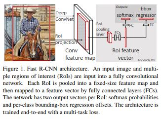
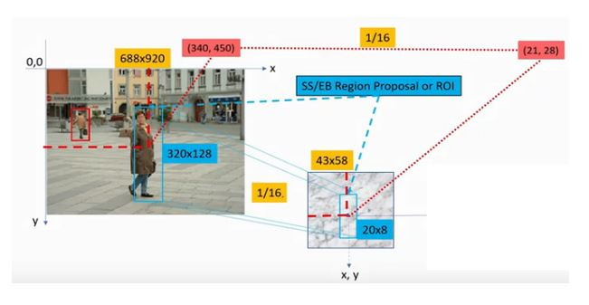
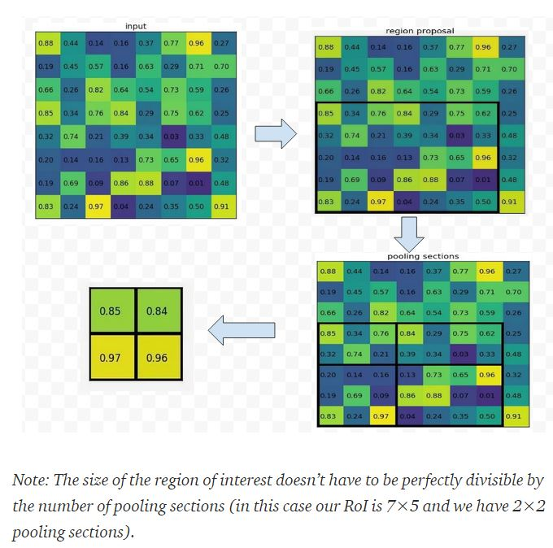

# Fast R-CNN

Ross Girshick(Microsoft Research)

## Abstract	

Fast R-CNN은 R-CNN을 발전시킨 연구이다. R-CNN과 비교해서 PASCAL VOC 2012 데이터셋에서 훈련시간은 9배, 테스트 시간은 213배 더 빠르고, 더 높은 mAP를 달성했다. SPP net과 비교해서는 3배 빠른 훈련시간, 10배 빠른 테스트 시간 더 높은 정확도를 달성했다. Python과 C++(Caffe)로 구현되었다. 다음에서 코드를 확인 할 수 있다. 

[rbgirshick - fast-rcnn](https://github.com/rbgirshick/fast-rcnn)

## Introduction

Classification에 비해 Detection은 파이프라인이 여러 단계로 구성된다. 즉 End-to-End 학습이 안되기 때문에 훈련 복잡도가 증가한다. 파이프라인이 여러 단계인 이유는 객체의 클래스에 대한 분석 뿐만 아니라 정확한 위치까지 알아내야 하기 때문인데 이는 다음의 이슈 사항을 제기한다. 

- Proposal이라고 하는 많은 양의 Object Location 후보들을 처리해야 한다.
- 이 후보들은 객체의 위치에 대한 추정치를 표현하므로 이 추정치를 정확하게 하기 위해서 후속 처리가 필요하다. 

이 연구에서는 객체의 클래스를 분류하고 후보의 위치를 조정하는 작업을 한꺼번에 할 수 있는 훈련 알고리즘을 제안했다. 객체 후보를 생성하는 작업을 제외하고 이미지를 처리하는데 0.3초가 걸리는데, PASCAL VOC 2012 에서 66%의 mAP를 달성했다. 

### R-CNN and SPP net

R-CNN이 가지고 있는 단점은 다음과 같다.

- 훈련 파이프 라인이 여러 단계이다. - CNN을 지역 후보들의 셋으로 Fine-tuning하고 Class scoring을 하는 SVM들을 훈련시키고 Bounding-box regressor들을 훈련시킨다.
- 훈련 간 시간과 공간 복잡도가 크다 - 각 이미지의 지역 후보들에 대해서 특징 벡터를 추출해서 디스크에 저장하므로 시간 및 공간 복잡도가 크다.
- 객체 탐지 시간이 느리다 - 테스트 시에 각 이미지에 대해서 후보를 생성하고 이 후보들에 대해서 후속 작업을 수행하므로 테스트 시간이 매우 느리고 이는 실시간성이 중요한 애플리케이션에는 치명적이다. 

SPPNet은 R-CNN의 단점을 커버하기 위해서 제안되었다. 전체 이미지에 대해서 특징 맵을 한 번 추출하고 지역 후보들이 이 특징 맵을 공유하므로 시간 복잡도를 크게 줄일 수 있다. 또, SPP layer를 통해서 고정된 길이의 벡터를 출력할 수 있으므로 입력 크기가 고정될 필요가 없어서, 여러 크기의 입력에 대해서 훈련이 가능하므로 정확도가 증가한다. 

그러나 SPPnet도 마찬 가지로 단점을 가지고 있다. 

- 여전히 훈련 파이프 라인이 여러 단계이다. 
- 추출된 특징들이 디스크에 저장된다.
- Fine tuning 시에 컨볼루션 계층들의 가중치는 업데이트 될 수 없으므로 정확도가 떨어진다. 

### Contribution

이 연구가 기여하는 바는 다음과 같다.

- R-CNN, SPP net보다 높은 탐지 퀄리티
- (지역 후보 생성을 제외하고) Multi-task loss를 적용한 Single-stage Training
- 훈련 간에 모든 계층의 가중치를 갱신 할 수 있음
- 특징을 디스크에 저장할 필요가 없음.

## Fast R-CNN architecture and training

지역 후보를 생성해서 좌표 정보를 기록해둔다. 이미지를 입력으로 받아 CNN에서 연산을 한 뒤에 특징 맵을 추출해낸다. 원본 이미지와 특징 맵의 스케일만큼을 지역 후보의 좌표 정보에 곱한다. 

[Arun Mohan - A Review On Fast RCNN](https://medium.com/datadriveninvestor/review-on-fast-rcnn-202c9eadd23b)

그런 다음에 각 지역 후보들에 대해서 RoI(Region of Interest) Pooling에서 고정된 길이의 특징 벡터를 추출해서 완전 연결 계층으로 출력한다. 몇가지 완전 연결 계층을 거치고 난 뒤에 나온 출력 값은 두 부분의 브랜치로 나눠 들어 간다. 하나는 K+1(클래스 K, Background 1)의 Softmax 확률 추정치를 생성하는 브랜치이고 다른 하나는 각 지역의 바운딩 박스의 위치를 조정할때 필요한 4개의 값을 생성하는 브랜치이다. 

### The RoI pooling layer

RoI pooling에서는 지역에 있는 특징을 고정된 길이의 벡터로 바꾸는 작업을 한다. 이 연구에서 ROI는 직사각형(정사각형이 아니어도 됨)의 형태를 띈다. 각 RoI는 4개의 값으로 표현된다(r, c, h, w). (r, c)는 각 ROI의 좌 상단 좌표이고 (h, w)는 ROI의 넓이와 높이이다. 각 RoI는 h/H x w/W 크기의 Cell로 이루어진 그리드로 구성되고 이 그리드에 Max pooling 연산이 수행되어 고정된 길이의 벡터가 만들어진다. RoI 계층은 하나의 레벨로 이루어진 SPP 계층과 동일하다. 

[Arun Mohan - A Review On Fast RCNN](https://medium.com/datadriveninvestor/review-on-fast-rcnn-202c9eadd23b)

예를 들어서 RoI가 7x5이고 그리드의 크기가 2x2이면 7/2 = 3.5, 5/2 = 2.5이므로 각 Cell의 크기는 2x3, 2x4, 3x3, 3x4가 된다. 

### Initializing from pre-trained networks

이 연구에서는 ImageNet으로 미리 훈련된 네트워크를 사용한다. 5번과 13번째 컨볼루션 계층 사이에 5개의 Max pooling 계층이 있는 네트워크이다.  이 네트워크를 Fast R-CNN에 맞춰 초기화 할 때 다음과 같은 과정을 거친다. 

1. 마지막 Max pooling 계층은 RoI pooling 계층으로 대체된다. 
2. 네트워크의 마지막 완전 연결 계층(Softmax 연산을 수행하는)은 앞에서 언급한 두가지 브랜치로 대체된다.
3. 네트워크가 이미지 리스트와 각 이미지에 있는 ROI 리스트를 받을 수 있도록 변경된다.