#  Fast R-CNN

Ross Girshick(Microsoft Research)

## Abstract	

Fast R-CNN은 R-CNN을 발전시킨 연구이다. R-CNN과 비교해서 PASCAL VOC 2012 데이터셋에서 훈련시간은 9배, 테스트 시간은 213배 더 빠르고, 더 높은 mAP를 달성했다. SPP net과 비교해서는 3배 빠른 훈련시간, 10배 빠른 테스트 시간 더 높은 정확도를 달성했다. Python과 C++(Caffe)로 구현되었다. 다음에서 코드를 확인 할 수 있다. 

[rbgirshick - fast-rcnn](https://github.com/rbgirshick/fast-rcnn)

## Introduction

Classification에 비해 Detection은 파이프라인이 여러 단계로 구성된다. 즉 End-to-End 학습이 안되기 때문에 훈련 복잡도가 증가한다. 파이프라인이 여러 단계인 이유는 객체의 클래스에 대한 분석 뿐만 아니라 정확한 위치까지 알아내야 하기 때문인데 이는 다음의 이슈 사항을 제기한다. 

- Proposal이라고 하는 많은 양의 Object Location 후보들을 처리해야 한다.
- 이 후보들은 객체의 위치에 대한 추정치를 표현하므로 이 추정치를 정확하게 하기 위해서 후속 처리가 필요하다. 

이 연구에서는 객체의 클래스를 분류하고 후보의 위치를 조정하는 작업을 한꺼번에 할 수 있는 훈련 알고리즘을 제안했다. 객체 후보를 생성하는 작업을 제외하고 이미지를 처리하는데 0.3초가 걸리는데, PASCAL VOC 2012 에서 66%의 mAP를 달성했다. 

### R-CNN and SPP net

R-CNN이 가지고 있는 단점은 다음과 같다.

- 훈련 파이프 라인이 여러 단계이다. - CNN을 지역 후보들의 셋으로 Fine-tuning하고 Class scoring을 하는 SVM들을 훈련시키고 Bounding-box regressor들을 훈련시킨다.
- 훈련 간 시간과 공간 복잡도가 크다 - 각 이미지의 지역 후보들에 대해서 특징 벡터를 추출해서 디스크에 저장하므로 시간 및 공간 복잡도가 크다.
- 객체 탐지 시간이 느리다 - 테스트 시에 각 이미지에 대해서 후보를 생성하고 이 후보들에 대해서 후속 작업을 수행하므로 테스트 시간이 매우 느리고 이는 실시간성이 중요한 애플리케이션에는 치명적이다. 

SPPNet은 R-CNN의 단점을 커버하기 위해서 제안되었다. 전체 이미지에 대해서 특징 맵을 한 번 추출하고 지역 후보들이 이 특징 맵을 공유하므로 시간 복잡도를 크게 줄일 수 있다. 또, SPP layer를 통해서 고정된 길이의 벡터를 출력할 수 있으므로 입력 크기가 고정될 필요가 없어서, 여러 크기의 입력에 대해서 훈련이 가능하므로 정확도가 증가한다. 

그러나 SPPnet도 마찬 가지로 단점을 가지고 있다. 

- 여전히 훈련 파이프 라인이 여러 단계이다. 
- 추출된 특징들이 디스크에 저장된다.
- Fine tuning 시에 컨볼루션 계층들의 가중치는 업데이트 될 수 없으므로 정확도가 떨어진다. 

### Contribution

이 연구가 기여하는 바는 다음과 같다.

- R-CNN, SPP net보다 높은 탐지 퀄리티
- (지역 후보 생성을 제외하고) Multi-task loss를 적용한 Single-stage Training
- 훈련 간에 모든 계층의 가중치를 갱신 할 수 있음
- 특징을 디스크에 저장할 필요가 없음.

## Fast R-CNN architecture and training

지역 후보를 생성해서 좌표 정보를 기록해둔다. 이미지를 입력으로 받아 CNN에서 연산을 한 뒤에 특징 맵을 추출해낸다. 원본 이미지와 특징 맵의 스케일만큼을 지역 후보의 좌표 정보에 곱한다. 

[Arun Mohan - A Review On Fast RCNN](https://medium.com/datadriveninvestor/review-on-fast-rcnn-202c9eadd23b)

그런 다음에 각 지역 후보들에 대해서 RoI(Region of Interest) Pooling에서 고정된 길이의 특징 벡터를 추출해서 완전 연결 계층으로 출력한다. 몇가지 완전 연결 계층을 거치고 난 뒤에 나온 출력 값은 두 부분의 브랜치로 나눠 들어 간다. 하나는 K+1(클래스 K, Background 1)의 Softmax 확률 추정치를 생성하는 브랜치이고 다른 하나는 각 지역의 바운딩 박스의 위치를 조정할때 필요한 4개의 값을 생성하는 브랜치이다. 

### The RoI pooling layer

RoI pooling에서는 지역에 있는 특징을 고정된 길이의 벡터로 바꾸는 작업을 한다. 이 연구에서 ROI는 직사각형(정사각형이 아니어도 됨)의 형태를 띈다. 각 RoI는 4개의 값으로 표현된다(r, c, h, w). (r, c)는 각 ROI의 좌 상단 좌표이고 (h, w)는 ROI의 넓이와 높이이다. 각 RoI는 h/H x w/W 크기의 Cell로 이루어진 그리드로 구성되고 이 그리드에 Max pooling 연산이 수행되어 고정된 길이의 벡터가 만들어진다. RoI 계층은 하나의 레벨로 이루어진 SPP 계층과 동일하다. 

[Arun Mohan - A Review On Fast RCNN](https://medium.com/datadriveninvestor/review-on-fast-rcnn-202c9eadd23b)

예를 들어서 RoI가 7x5이고 그리드의 크기가 2x2이면 7/2 = 3.5, 5/2 = 2.5이므로 각 Cell의 크기는 2x3, 2x4, 3x3, 3x4가 된다. 

### Initializing from pre-trained networks

이 연구에서는 ImageNet으로 미리 훈련된 네트워크를 사용한다. 5번과 13번째 컨볼루션 계층 사이에 5개의 Max pooling 계층이 있는 네트워크이다.  이 네트워크를 Fast R-CNN에 맞춰 초기화 할 때 다음과 같은 과정을 거친다. 

1. 마지막 Max pooling 계층은 RoI pooling 계층으로 대체된다. 
2. 네트워크의 마지막 완전 연결 계층(Softmax 연산을 수행하는)은 앞에서 언급한 두가지 브랜치로 대체된다.
3. 네트워크가 이미지 리스트와 각 이미지에 있는 ROI 리스트를 받을 수 있도록 변경된다.

### Fine-tuning for detection

SPP net이 역전파를 통해서 가중치 갱신을 하기 어려운 이유는 각 데이터 샘플이 다른 크기로 들어오기 때문에 이런 방식이 비효율적이라는데 있다. 어떤 ROI는 매우 커서 Receptive field가 거의 전체 이미지에 걸쳐 있는 경우가 있는데 이를 여러 레벨의 Spatial pyramid로 연산을 수행하면 연산량도 커지고 출력 용량이 커질 것이다. 

Fast R-CNN에서는 SGD mini batch를 수행하는데 N 이미지를 샘플링하고 샘플링 한 이미지에서 R/N 만큼의 ROI를 샘플링한다. 같은 이미지에서 샘플링된 ROI들은 역전파, 순전파 간에 같은 연산 결과를 공유한다. 예를 들어서 N=2, R = 128이라면 2장의 이미지를 배치로 뽑고 각 이미지에서 64개의 ROI를 추출한다. 이것은 서로 다른 128개의 이미지에서 ROI 1개씩 뽑는 것보다 속도가 빠르다. 

ROI가 같은 이미지에서 샘플링되었기 때문에 훈련 성능이 늦게 수렴할 수 있다는 우려가 있을 수 있는데 실제로 N=2, R=128로 했을 때 오히려 R-CNN보다 좋은 결과를 달성했기 때문에 걱정할 필요가 없다는 것을 저자들이 확인했다. 

그리고 Fast R-CNN은 Softxmax classifier와 Bounding gox regressor를 동시에 최적화 한다. 

#### Multi-task loss

Fast R-CNN은 최종적으로 두가지 종류의 값을 출력한다. 

| ROI의 K+1 카테고리에 대한 Softmax 확률 분포 | ROI의 k클래스 바운딩 박스 OFFSET |
| ------------------------------------------- | -------------------------------- |
| 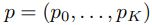               | 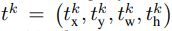    |

각 훈련 ROI에는 GT class u와 GT bounding box regression target v가 매칭되어 있다. 이 연구에서는 다음과 같이 Classification과 Localization에 대한 Loss를 동시에 계산한다. 

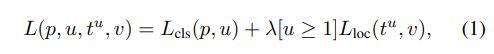

첫번째 항은 다음과 같이 소프트맥스에 의해 계산된 p에 대한 log loss 값을 계산한다.

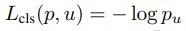

두번째 항은 다음과 같이 계산한다. 우선 클래스 u에 대한 GT box의 정보 v는 4개의 값의 튜플로 표현된다(v = (v_x, v_y, v_w, v_h)). 그리고 u 클래스에 대한 예측 박스의 정보는 위 표의 오른쪽과 같이 표현된다. [u >= 1]의 경우, 적어도 하나 맞는 클래스의 박스가 있으면 1, 아예 없으면 0이 된다. 그래서 모든 Background class에 대한 박스에 대해서는 u가 0이 된다. 그래서 위치 정보와 관련된 Loss는 무시된다. 

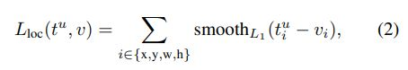

Localization에 관한 손실은 x, y, w, h에 대한 GT 박스에 예측 박스의 Smooth l1 손실로 계산된다. 

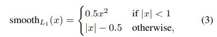

L1 손실이 L2 손실보다 Outliner에 대해서 덜 민감하다. 만약에 L2 손실로 훈련할 경우에는 Gradients exploding을 신경써서 Learning rate를 튜닝해야 한다. (3)식은 이런 민감도를 제거한다. 

(1)번식을 보면 λ가 있는데 이는 두 종류의 Loss의 균형을 담당한다. 저자들은 GT v = (v_x, v_y, v_w, v_h)를 정규화하여 평균 0, Unit variance를 가젝 했다. 여기서 모든 실험은 λ = 1로 설정한다. 

#### Mini-batch sampling

Fine tuning 시에 각 객체 후보의 GT 박스와 IoU가 적어도 0.5되는 RoI가 전체의 25%정도 되고 이 RoI들은 그 클래스에 대한 Foreground object class로 레이블링 된다(u >= 1), 나머지 RoI들은 GT 박스와 IoU가 [0.1, 0.5) 정도 겹치고 이 샘플들은 Background object class로 레이블링 된다(u = 0). Hard example mining에서 0.1이 Threshold로 설정되었고 각 이미지는 훈련 간에 0.5의 확률로 횡으로 Flipping 될 수 있다. 다른 Data augmentation은 수행하지 않았다. 

#### Back-propagation through RoI pooling layers

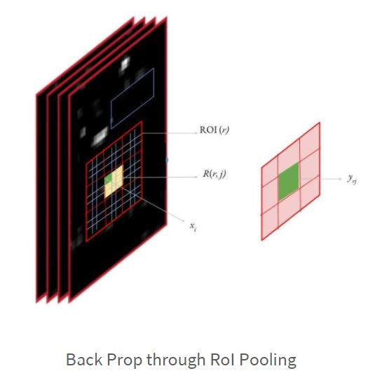

[염창동형준킴 - 갈아먹는 Object Detection \[3\] Fast R-CNN](https://yeomko.tistory.com/15)

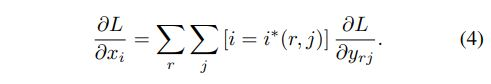

이제 End-to-End의 Training을 위해서는 ROI Pooling layer에서 역전파를 수행하는 것을 구현해야 한다(SPP에서는 이 부분이 해결되지 않아서 완전 연결 계층까지만 가중치가 업데이트 되었고 컨볼루션 계층의 가중치가 업데이트 되지 않는 문제가 있었다). 위에서 x_i는 특징 맵에서 하나의 실수 값이다. 전체 Loss에 대한 이 x_i의 편미분 값을 구하게 되면 역전파 시에 이 x_i 값을 갱신할 수 있게 된다. y_rj는 이 계층의 r번째 ROI 출력의 j번째 값이다. 이 y_rj는 다음과 같이 계산된다.

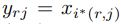

여기서 i*(r, j)는 ROI와 Sub Window index j가 주어져 있을 때(위에서 보면 RoI가 7x5이고 그리드의 크기가 2x2이면 7/2 = 3.5, 5/2 = 2.5이므로 각 Cell의 크기는 2x3, 2x4, 3x3, 3x4가 된다. 여기서 각 Cell을 Sub Window index라고 볼 수 있다.) Max pooling을 통해서 선택된 최대 값을 가진 특징 맵의 요소의 인덱스를 의미한다. 즉, RoI Pooling에서 선택된 값의 특징 맵에서의 인덱스를 의미한다. 역전파 시에 전체 Loss에 대한 이 요소의 편미분 값은 이미 계산되어져서 RoI Pooling 계층으로 들어오게 된다. 즉 위의 식에서 각 Cell에서 Max pooling의 결과로 선택된 특징 맵에서의 요소에 대해서, 대응되는 출력 값의 Loss에 대한 편미분 값으로 갱신할 수 있다는 말이 된다.  

### Scale invariance

저자들은 객체의 스케일에 구애 받지 않고 객체 탐지를 하기 위해서 두 가지 방법을 실험했다.

- Brute force - 각 이미지가 훈련 간이나 테스트 간에 정해진 크기로 재조정 된다. 
- Multi-scale - Image pyramid를 통해서 훈련 간에 다양한 크기의 입력을 만들고 테스트 시에는 Image pyramid가 각 지역 후보를 Scale 정규화 한다. 

## Fast R-CNN detection

네트워크는 Image pyramid에 의해서 크기별로 인코딩된 Image 리스트나 혹은 이미지 하나 그리고 그에 따른 R개의 지역 리스트를 입력으로 받는다. 테스트 시에는 R이 거의 2000개 정도 된다. Image pyramid를 사용할 때는 각 ROI가 거의 224^2이 되도록 한다. 

각 ROI가 테스트 될 때, 순전파를 하면 클래스 확률 분포 p와 ROI r과 관련된 바운딩 박스 오프셋 예측 값이 나온다(각 K 클래스가 재조정된 바운딩 박스 예측 값을 갖는다). 저자들은 r에 다음과 같은, 추정 확률 값을 계산하여 각 객체 클래스 k 마다  Detection confidence를 부여한다. 

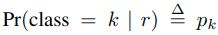

그러고 나서 NMS를 각 클래스마다 독립적으로 수행한다. 

### Truncated SVD for faster detection

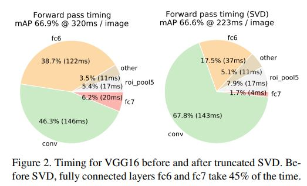

Classification에서는 컨볼루션 계층 연산에서에 비해 완전 연결 계층 연산에 쓰는 시간이 작은데 Detection에서는, 각 ROI에 대해서 수행해야 하므로 거의 순전파 시간의 절반을 완전 연결 계층의 연산에 쓴다. 저자들은 완전 연결 계층을 Truncated SVD를 통해서 잘라내어 Detection에서 시간을 줄이려고 노력했다. 여기서는 완전 연결 계층의 weight matrix W(u x v 크기)가 다음과 같이 특이값 분해 될 수 있다. 

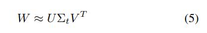

U는 u x t 크기이며 W에서 t개의 left-singular한 벡터들로 구성되어 있고 Σ\_k는 t x t 크기의 Diagonal matrix이며 각 대각 원소는 W에서 Top k개의 Singular value이다. V는 v x t 크기의 행렬이고 W에서 t개의 right-singular 벡터로 이루어져 있다. Truncated SVD를 적용하며 uv개의 파라미터 수를 t(u + v)만큼 줄일 수 있는데 t가 min(u, v)보다도 작다면 상당히 많이 줄일 수 있다. 이렇게 완전 연결 계층을 분해해서 두개의 행렬을 각각 따로 가지는 계층으로 분해 하는데 이 계층 사이에는 비선형이 추가되지 않는다. 첫 번째 계층은 Σ\_kV^T의 가중치 행렬을 쓰고(Bias 없음) 두번째 계층은 U 가중치 행렬을 쓴다(원래 W일때 사용하던 Bias를 씀). 저자들은 이런 방법으로 ROI가 굉장히 많을때, 속도를 증가시켰다고 한다. 

## Main results

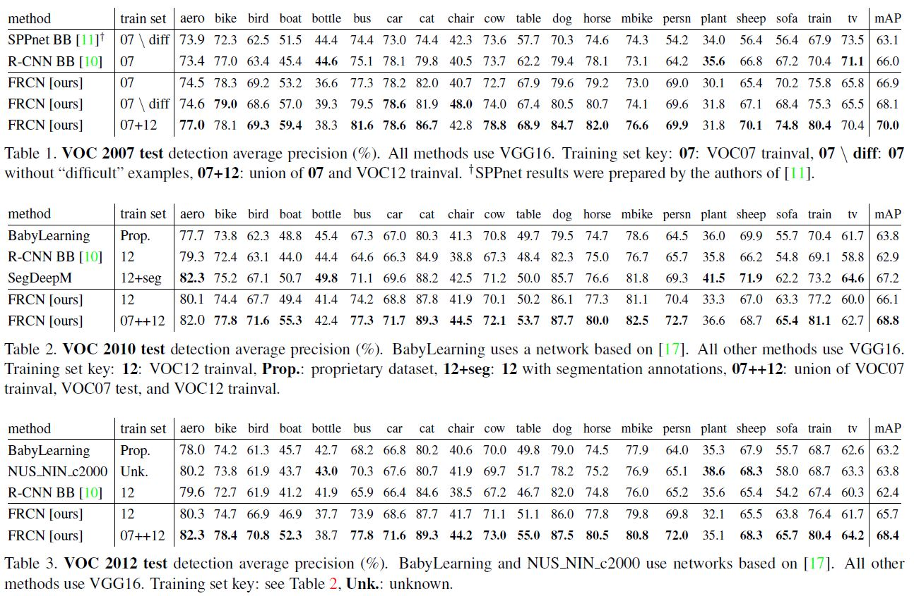

### Experimental setup

이 연구에서 실험을 할 때 사용한 pre-trained on ImageNet datasets 모델은 세 가지이다.

- R-CNN에서의 CaffeNet(AlexNet의 변경체). 이후 Small을 뜻하는 S로 부름.
- S와 깊이는 같으나 더 넓은 VGG_CNN_M_1024. 이후 Medium을 뜻하는 M으로 부름.
- Very deep VGG16. 이후 Largest를 뜻하는 L로 부름.

모든 실험은 Singe-scale training and testing이 원칙이다. 

### VOC 2010 and 2012 results

한 가지 주목할 점은 VOC10에서는 SegDeepM이 Fast R-CNN보다 높은 mAP를 달성했다는 것이다(67.2 VS 66.1). SegDeepM은 R-CNN의 Detection에서 Markov random field를 적용하여 정확도를 개선시킬 수 있도록 디자인 되어 있는데 R-CNN 대신에 Fast R-CNN을 적용할 경우 68.8%까지 mAP가 올라간다(테이블2). 

### VOC 2007 results

여기서 대조군으로 선택된 SPPnet은 훈련과 테스트 간에 5 scale로 실험이 진행되었다. 그럼에도 불구하고 Single-scale의 Fast R-CNN의 성능이 더 좋다.

### Training and testing time

Fast R-CNN은 훈련시간과 테스트 시간을 굉장히 줄인다. SVD를 적용하면 더 그렇다. 그리고 다른 방법들과는 다르게 Feature cache가 필요 없으므로 디스크에 데이터를 저장할 필요도 없다.

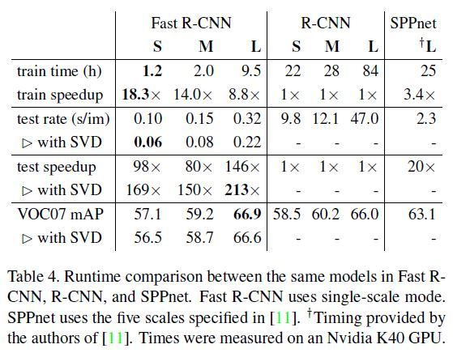

(s/im -> seconds per image)

#### Truncated SVD

저자들에 의하면 Truncated SVD를 적용해서 탐지 시간을 30%정도 줄일 수 있다고 한다(0.3로 아주 적은 mAP 감소와 함께). 이 연산을 수행 후에는 추가적인 Fine-tuning이 필요하지 않다고 한다. 

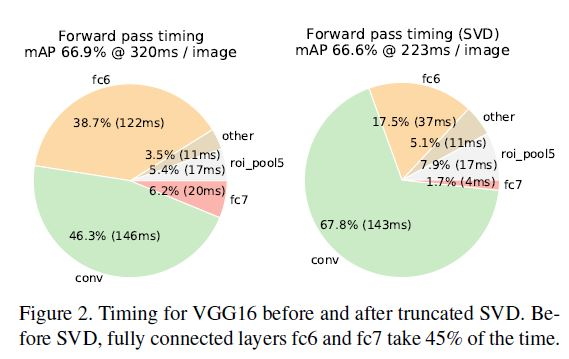

### Which layers to fine-tune?

SPPnet에서는 완전 연결 계층만 Fine-tuning을 해도 충분하다고 했는데 저자들은 이 주장이 아주 깊은 네트워크에서는 맞지 않는다고 생각했다. 그래서 이를 검증하기 위해서 Fast R-CNN에서 컨볼루션 계층을 Freeze를 하고 완전 연결 계층만 Fine-tuning을 한 결과 mAP가 66.9%에서 61.4%로 하락했다. 

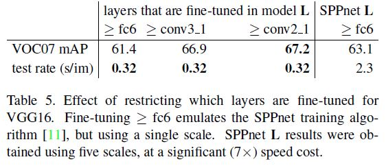

S나 M 같이 상대적으로 작은 네트워크의 Conv1 같은 경우에는 도메인에 독립적이므로 Fine-tuning을 하던 말던 mAP에 의미 있는 효과가 없고 L 같은 경우에는 Conv3_1부터 위까지 Fine-tuning을 했을때 효과가 있는 것을 확인했다고 한다. 그래서 여기에서는 S, M의 경우 Conv2부터 위까지 Fine-tuning을 하고 L은 Conv3_1부터 위까지를 Fine-tuning한다. 

## Design evaluation

Fast R-CNN의 Design decision과 관련된 실험은 PASCAL VOC07 데이터셋으로 수행했다.

### Does multi-task training help?

End-to-End로 네트워크의 각 Component들을 동시에 학습하는 것이 효과적인지를 확인하기 위해서 저자들은 Loss에서 Classification loss만을 사용해서 baseline networks들을 학습시켰다. 그 결과는 다음 테이블의 첫 번째 열에 나와 있다. 

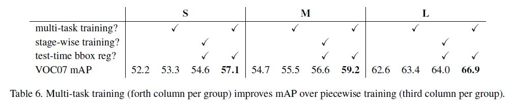

두 번째 열에는 원래대로 Loss를 적용하되 Bounding box regression을 적용하지 않았을 때이다. 그 결과 Multi-task training이 Classification만 훈련시킬때보다 성능이 더 좋은 것으로 나타났다. 그 다음으로 Classification 훈련을 완료한 baseline network들에 Bounding box regression 계층을 붙이고 Loss에서 Localization loss만을 사용해 훈련시키는 Stage-wise training을 수행했더니 첫 번째 열보다는 성능이 좋으나 Multi-task training + Bounding box regression을 했을때(네 번째 열) 보다는 성능이 떨어졌다.

### Scale invariance: to brute force or finesse?

Scale invariant한 Object detection을 위해서 저자들은 두 가지 접근 방법을 검토했다. 여기서 s를 이미지의 짧은쪽 길이라고 정의한다. 

- Brute-force learning(Single scale) -  s = 600으로 한다. s가 600보다 작을 때는 긴쪽이 1000이 되게 해서 종횡비를 유지하면서 캡처한다. PASCAL image들의 평균 크기는 384x473이기 때문에 1.6배 정도 Upsampling을 한다. 따라서 ROI pooling 계층의 평균적으로 효율적인 Stride는 대략 10픽셀 정도가 된다.
- Image pyramids(Multi-scale) - s  ∈ {480, 576, 688, 864, 1200}으로 하고 GPU memory를 초과하는 것을 막기 위해서 긴쪽의 길이를 2000픽셀이 되게 캡처 한다. 

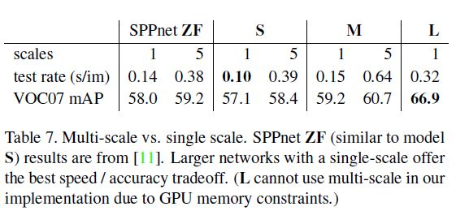

Single-scale의 mAP가 Multi-scale의 mAP와 큰 차이가 없는 것을 확인할 수 있다. 저자들은 이를 통해서 아주 깊은 모델에서는 자연스럽게 네트워크가 Scale invariance를 학습한다고 주장했다. 처리 시간이 늘어나는 것에 비해 mAP가 아주 조금 늘어나기 때문에 저자들은 모든 실험에서 s=600 픽셀로 하는 Single-scale로 실험했다고 한다. 

### Do we need more training data?

저자들은 더 많은 데이터로 더 많은 데이터와 더 많은 Iteration으로 학습 했을때, mAP가 상승하는 것을 확인했다.

### Do SVMs outperform softmax?

저자들은 이진 SVM 대신에 Softmax를 적용한 것이 유효한지 검증 하기 위해서 Fast R-CNN에 Softmax 대신에 이진 SVM을 달아서 Hard negative mining을 적용한 SVM을 실험해 봤다. 결과는 Softmax가 조금 더 좋았다. 저자들이 주장하길, 그럼에도 불구하고 Softmax는 SVM과 다르게 End-to-End로 학습이 가능해서 더 좋다고 한다.

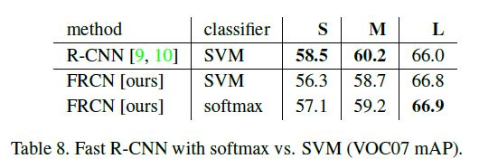

### Are more proposals always better?

저자들은 더 많은 Proposal이 더 좋은 성능을 보장하는 것은 아님을 입증하기 위한 실험을 했다. 

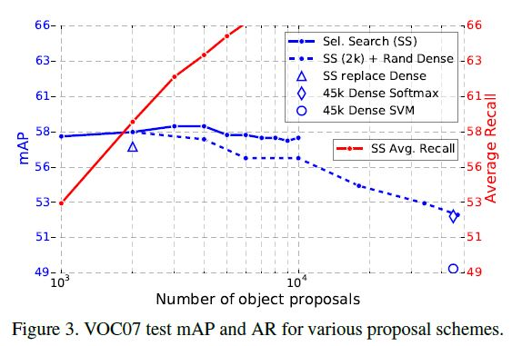

- 파란색 실선을 보면 SS에서 Proposal 수를 늘리면 성능이 조금 오르다가 오히려 떨어지는 것을 알 수 있다.
- Object proposal의 Quality를 측정하는 방법으로 Average Recall을 많이 사용한다. AR은 mAP와 Proposal의 수가 이미지 당 고정되어 있을 때, 상관 관계가 높은 것으로 알려져 있는데 Proposal의 수가 다양해짐에 따라 상관 관계가 거의 없는 것을 확인할 수 있다(붉은 실선과 파란색 선들의 추세).
- 파란색 삼각형 부분을 보면 Selective search로 찾은 박스를 Densely generated box로 바꿨을 때(IoU가 SS box들과 높은 박스들) 약간의 성능 하락이 발생한 것을 볼 수 있다. 
- 더 많은 Dense box들을 추가할 경우, SS box들을 사용할 때보다 성능이 많이 떨어지는 것을 알 수있다(파란색 점선).
- Dense box만 사용한 Fast R-CNN의 성능은 파란색 다이아몬드로 확인할 수 있다.
- SVM과 Hard-negative mining을 적용한 Fast R-CNN과 Dense box의 성능은 파란색 원으로 확인할 수 있다.

### Preliminary MS COCO results

MS COCO 데이터셋에 적용한 Fast R-CNN의 성능은 다음과 같다.

- The PASCAL-style mAP is 35.9%; the new COCO-style AP, which also averages over IoU thresholds, is 19.7%.

## Conclusion

저자들은 R-CNN과 SPPnet에서의 업데이트 버전인 Fast R-CNN을 제시했다. 실험을 통해서 Sparse object proposal이 탐지 성능을 높이는데 더 좋음을 확인했다. 
