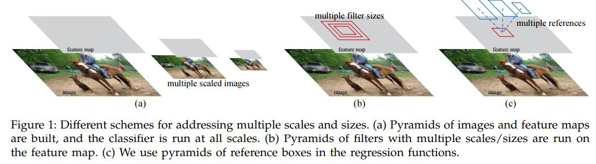

# Faster R-CNN: Towards Real-Time Object Detection with Region Proposal Networks

Shaoqing Ren(University of Science and Technology of China, Hefei, China),

Kaiming He, Jian Sun(Visual Computing Group, Microsoft Research)

Ross Girshick( Facebook AI Research)

## Abstract

Region proposal 방식의 Object Detection 알고리즘들은 그 동안 많은 기술적 발전을 이뤄왔다. 그 방향성은 네트워크의 각 컴포넌트들을 하나로 통일해서 End-to-End로 학습하는 방향이었다. 그럼에도 불구하고 Region proposal을 생성하는 방식은 통일하지 못해서 학습 단계에서 Bottleneck으로 남아있었다. 이 연구에서는 이 부분까지도 하나로 통일시켜서 이미지 하나의 Feature map으로 Region proposal도 생성하고 이 단계를 바탕으로 Classification과 Localization를 한 번에 진행하는 방법을 제안하고자 했다. 여기서 Region proposal을 하는 컴포넌트를 Region Proposal Network라고 한다. 구조를 보면 전체적인 네트워크 안에 작은 네트워크가 들어 있으므로 Network In Network의 논문을 떠올리게 한다. 최종적으로는 RPN과 선행 연구인 Fast R-CNN을 합친 방식을 고안하게 된다. 여기서 Attention Mechanism이라는 말이 나오는데 다음의 블로그를 참고해서 보자면, 아마 Feature map을 바탕으로 RPN에서 Region proposal을 생성해내고 이를 바탕으로 다시 Feature map에서 어느 위치를 볼껀지 'Attention'한다는 의미 인거 같다. 

[WikiDocs - 어텐션 메커니즘 (Attention Mechanism)](https://wikidocs.net/22893)

## Introduction

이 연구가 수행될때까지 Region Proposal 방식의 Object Detection 알고리즘에서 Bottleneck으로 남아 있는 가장 큰 문제는 역시 Region Proposal을 생성하는 부분이다. Selective search에서는 CPU로 수행하도록 구현되었으며 이미지 하나를 처리하는데 2초 이상이 걸린다. 그것보다는 더 획기적으로 시간을 줄였다고 하는 EdgeBoxes도 이미지 하나를 처리하는데 0.2초가 걸린다고 한다. 그럼에도 불구하고 Region Proposal 방식은 전체 수행 시간에서 꽤 많은 시간을 잡아 먹는다. 게다가 Fast R-CNN은 GPU를 활용하도록 구현되어 있고 Region Proposal 알고리즘들은 CPU로 수행되도록 구현되어 있기 때문에 잘 맞지 않는다. 그래서 저자들은 Fast R-CNN과 Convolution 연산을 공유하면서 Region Proposal을 생성할 수 있는 RPN을 고안해냈다.  RPN 또한 순수하게 Convolution Layer들로 이루어져 있다. 여기서는 그리드의 각 위치에서의 Objectness Score를 계산하고 Region bound의 Regression을 수행한다. 

RPN은 Region proposal들을 다양한 스케일과 종횡비로 보고 예측할수 있도록 고안되어 있다. 기존의 방법들이 위 그림의 a, b처럼 Pyramids of Images나 Pyramids of Filters의 방법을 적용했다면 여기서는 Anchor box들을 사용해서 이를 수행한다. 여기서 Anchor box들은 다양한 스케일과 종횡비의 Reference 역할을 한다. 이 방법은 전자의 방법들과 비교해서 이미지나 필터들을 여러가지 (크기나 종횡비의) 옵션으로 나열할 필요가 없기 때문에 속도면에서 더 효과적이라고 한다. 

## RELATED WORK

### Object Proposals

Object Proposals 생성하는 알고리즘에 대한 많은 문헌이 있는데 대표적으로 다음과 같은 것들이 있다.

- Grouping super-pixels - Selective Search, CPMC, MCG
- Sliding windows - Objectness in windows, EdgeBoxes

이 알고리즘들은 네트워크에 하나로 통합되기 보다는 외부 모듈로서 넣는다. 

### Deep Networks for Object Detection

R-CNN은 End-to-End로 학습이 이뤄지기는 하나, (바운딩 박스 회귀를 제외하고는) Object bounds 예측에는 관여하지 않는다. 그래서 Localization에 대한 정확도는 Region Proposal을 생성하는 알고리즘에 달려 있다. 몇가지 관련 연구들이 DNN 네트워크를 Object bounds를 예측하는데 사용할 수 있도록 하는 방법을 제시했다. 

- OverFeat - P. Sermanet, D. Eigen, X. Zhang, M. Mathieu, R. Fergus,and Y. LeCun, “Overfeat: Integrated recognition, localization and detection using convolutional networks,” in International Conference on Learning Representations (ICLR), 2014.
- MultiBox - (이 알고리즘을 통해 생성된 Region Proposal들이 R-CNN에서 사용된다.)
  - D. Erhan, C. Szegedy, A. Toshev, and D. Anguelov, “Scalable object detection using deep neural networks,” in IEEE Conference on Computer Vision and Pattern Recognition (CVPR), 2014. 
  - C. Szegedy, S. Reed, D. Erhan, and D. Anguelov, “Scalable, high-quality object detection,” arXiv:1412.1441 (v1), 2015.

위와 같이 네트워크를 통해서 Object bounds를 예측하려는 시도를 통해서 Convolution 연산을 공유하려는 시도가 증가 되었다. 왜냐하면 Visual recognition을 위한 Attention mechanism을 효율적이고도 정확하게 적용 가능해지기 때문이다. 

## FASTER R-CNN

여기서 시스템은 크게 두 가지 모듈로 구성된다.

- Deep Fully Convolutional Network - Attention mechanism을 적용하여 탐지기가 이미지의 어디를 봐야 하는지를 알려주는 Region Proposal 생성
- Fast R-CNN Detector - 위에서 생성된 Region Proposal을 보고 Classification + Localization을 수행.

### Region Proposal Networks

RPN은 임의의 크기의 이미지를 입력을 받아서 사각형의 Object Proposal과 각 사각형의 Objectness Score를 출력한다. 저자들은 이 Network를 Fully Convolutional Network로 구축했는데 Fast R-CNN Object Detection Network와 Computation을 공유하기 위함이라고 한다(공통의 CNN 계층에서 출력된 Feature map으로 RPN와 Fast R-CNN Detector Network에서 각각 Task를 수행한다.).

Region Proposal을 생성하기 위해서 RPN에서 먼저 입력으로 들어온 Feature map에 n x n의 Window로 Convolution 연산을 수행한다. 이에 대한 결과로 출력 크기는 같으면서 차원은 다른(ZF - 256d, VGG-512d with ReLU) Feature map을 출력하게 된다. 이 Feature map에  두 브랜치의 1 x 1 Convolutional Layer에서 연산을 수행하고 나서 Fully Connected Layer를 통해서 각각 Box regression과 Box classification과 관련된 산출물을 출력한다. 여기서는 n을 3으로 했지만 Receptive field가 클수록 좋다고 한다(Figure 3 left). 

#### Anchors

각 Sliding-window에서는 동시에 여러 Region Proposal을 생성하는데 각 위치에서 최대로 예측할 수 있는 Region Proposal의 개수는 k개이다.  그러므로 reg Layer에서는 각 Region Proposal의 스케일과 위치와 관련된 4 x k개의 값을 출력할 수 있고 cls Layer에서는 객체가 있는지 없는지 여부와 관련된 2 x k개의 값을 출력할 수 있다. 이 k개의 Proposal들은 k개의 Reference box들과 관련이 있는데 k개의 Reference box들을 Anchor라고 부른다. 즉 이 Anchor들의 Scale과 Coordinate을 조정하여 Region Proposal을 생성하는 것이다. 여기서는 3개의 Scale과 3개의 Aspect Ratio를 고려했으므로 총 9개의 Default Anchor box가 존재한다. 입력 Feature map이 W X H(보통 ~2,400)이라고 하면 W x H x k의 Anchor들을 조정하게 된다. 

#### Translation-Invariant Anchors

저자들이 주장하길 이미지 내에 객체의 위치가 상대적으로 변경되었더라도(Convolution 연산이나 Max pooling 연산을 통해서 객체가 움직인 것 처럼 보일 수 있음.) Detection은 이와 상관 없이 관련 연산을 수행할 수 있다고 한다(MultiBox는 그렇지 못함).

또, 이런 특성 때문에 MultiBox보다 상대적으로 모델의 파라미터 수가 훨씬 적고 이는 PASCAL VOC같은 수가 적은 데이터셋에서 과적합을 일으킬 위험을 줄인다.

#### Multi-Scale Anchors as Regression References

Multi-Scale을 모델 차원에서 다루는 여러가지 방법이 있다(Figure 1). 하나는 Image/Feature pyramid 방식이고(Figure 1-a) 다른 하나는 Filter pyramid 방식이다. 저자들이 이 연구에서 적용한 방식은 여러 크기와 종횡비의 Anchor들을 이용한 방식인데 앞선 두 방식과 비교했을 때, 단일 크기의 Feature map에서 단일 크기의 Filter로 다양한 스케일의 객체를 탐지하는 것을 학습할 수 있으므로 훨씬 비용이 적다. Anchor를 적용하는 방식 덕분에 Region Proposal을 생성하는 부분까지도 네트워크에 하나의 요소로서 통일 시킬 수 있었다.

#### Loss Function

RPN을 훈련시키기 위해서 각 Anchor에는 Positive(객체가 들어 있음)과 Negative(들어 있지 않음)이라는 레이블을 붙인다. 레이블이 붙지 않은 Anchor들은 무시한다. 

- Positive - GT와 가장 높은 IOU를 보인 Anchor, GT와 IOU가 0.7 이상인 Anchor. 첫 번째 조건을 굳이 추가한 이유는 두 번째 조건을 만족하는 샘플이 없는 아주 드문 경우 때문이다.
- Negative - Positive 하지 않은 Anchor 중에서 GT와의 IOU가 0.3보다 작은 Anchor.

Faster R-CNN의 Loss function은 Fast R-CNN과 거의 유사하다. 

여기서 i는 각 미니배치에서 Anchor의 인덱스를 의미한다. pi는 Anchor_i에 객체가 있을법한 확률을 예측한 것이고 p\*\_i는 Anchor가 Positive면 1, 아니면 0이다. ti는 예측된 Bounding box의 4가지 좌표 정보이고 t\*\_i는 해당 Positive box와 관련 있는 GT의 좌표 정보이다. Regression loss 같은 경우에는 예측 박스와 해당 GT의 Smooth L1 Loss를 사용하는데 이때 Positive 박스에 관련된 Smooth L1 Loss만 전체 Loss에 반영한다. λ는 두 Loss 간의 밸런싱을 담당하는데 저자들이 실험을 통해서 10을 기본으로 설정해뒀다. N_cls, N_reg는 두 Loss를 각각 정규화 하기 위함이고(평균 값) N_cls는 미니배치 사이즈, N_reg는 Feature map  크기이다(Feature map의 크기는 W x H이고 주로 under 2400. Feature map의 각 Cell마다 Positive인 Bounding box들의 Location만 신경씀). 저자들은 말하길 정규화는 꼭 필요한 과정은 아니라고 한다. 

t와 관련된 방정식은 다음과 같다.

x, y, w, h는 각 box의 중앙 좌표, 넓이, 높이이고 x, xa, x\*는 각각 예측, 기본 Anchor, GT box를 의미한다. Regression 과정의 경우는 Positive box로 레이블링된 Anchor box들을 GT box로 점점 맞춰가는 과정이라고 볼 수 있다. 

다양한 크기의 ROI를 다루기 위해서 K개의 Bounding box regressor가 존재하는데 각 Regressor는 하나의 스케일과 하나의 종횡비를 담당한다. 각 Regressor들은 학습 가중치를 공유하지 않는다. 이런 디자인 덕분에 Feature들의 크기나 종횡비가 고정되어 있어도 Box들이 다양한 스케일과 종횡비를 처리할 수 있게 되었다. 

#### Training RPNs

RPN은 역전파와 SGD를 통해서 End-to-End로 학습이 가능했다. 하나의 이미지에서 여러 미니배치가 만들어지고(Receptive field 슬라이딩) 각 미니배치에는 Positive나 Negative한 Anchor들이 있다. 이 Anchor들을 모두 고려해서 Loss 줄여 최적화 할 수도 있지만 Negative가 압도적으로 많기 때문에 Negative에 의해서 편향될 가능성이 크다. 따라서 저자들은 256의 Anchor들을 샘플링할때 Negative와 Positive 거의 1:1로 샘플링한다(Positive가 적으면 나머지는 Negative로 채운다).

Localization 계층들은 평균 0, 표준편차 0.01의 가우시안 분포를 따르는 랜덤 값으로 초기화 하고 Classification 계층들은 ImageNet classification Task에서 미리 학습한 가중치로 초기화 한다. ZF net은 모든 계층을 튜닝하고 VGG는 conv3_1부터 위까지 튜닝한다. PASCAL VOC 데이터셋에서 60k 미니 배치는 LR 0.001, 나머지 20k 미니배치는 0.0001로 학습시킨다. 모멘텀은 0.9, Weight decay는 0.0005를 적용한다. 