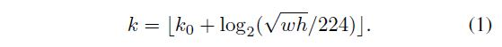
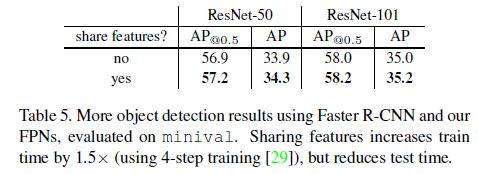

# Feature Pyramid Networks for Object Detection

Tsung-Yi Lin(Facebook AI Research, Cornell University and Cornell Tech),

Piotr Doll´ar(Facebook AI Research),

Ross Girshick(Facebook AI Research),

Kaiming He(Facebook AI Research),

Bharath Hariharan(Facebook AI Research),

Serge Belongie(Cornell University and Cornell Tech)

## Abstract

객체 인식 시스템에서 다른 크기의 객체를 탐지하기 위해서 크기가 다른 Feature를 사용하는 것은 당연한 일이었다. 그러나 이는 연산 시간이나 메모리를 상당히 잡아먹었다. 그래서 저자들은 Top-down 방식의 Lateral Connection 개념을 적용하여 질 좋은, 각 스케일의  Semantic Feature map을 예측에 사용할 수 있는 아키텍처인 Feature Pyramid Network(FPN)을 제안했다. 

## Introduction

원래는 Figure1의 a와 같이 이미지를 여러 크기로 재조정한 뒤에 예측을 진행하는 방식을 많이 사용했다. 이런 방식은 기본적으로 각 크기의 이미지에서 객체의 크기 변화를 Offset 개념으로 보았기 때문에 Scale-Invariant 했다. 그래서 모델이 넓은 범위의 스케일로 객체를 탐지하는 것을 가능하게 했다. 

CNN이 나오기 이전에 사람이 직접 Feature를 엔지니어링 해야했던 DPM 같은 알고리즘에서는 이런 방식이 많이 쓰였다. 그러다가 ConvNets 같은 DCNN이 등장하게 되면서 객체 인식 분야에서 많이 사용되었다. Figure1의 b와 같이 DCNN 기반의 방식들은 단일 스케일로도 객체의 크기 변화에 어느정도 Robust했다. 그러나 여전히 다양한 스케일에 대해서 더 정확한 결과를 내기 위해서는 a와 같은 방식을 차용할 필요가 있었다. 왜냐하면 a와 같은 방식은 고해상도의 Feature를 포함해서 모든 단계에서 Semantically Strong하기 때문이었다. 그럼에도 불구하고 a와 b의 방식을 섞어서 쓰는 방법은 추론 시에 속도가 느려서 실시간성이 필요한 애플리케이션에는 적용하지 못한다던가, 모델 훈련 간에는 메모리 용량때문에 적용하지 못한다던가 하는 제한사항 때문에 테스트 시에만 적용했는데 이는 훈련과 테스트 시에 모델의 추론 결과를 다르게 만들었다.  

a와 같은 방식 뿐만 아니라 c와 같은 방식으로도 Multi-scale Feature 표현이 가능하다. 계층별로 Feature를 뽑아내서 예측을 하는 방식은 다양한 크기의 객체를 탐지할 수 있긴 하지만 계층의 깊이별 Semantic Information에 대한 격차가 존재한다. 특히 저단계의 고해상도 Feature map 같은 경우에는 객체 인식 성능에 악영향을 끼칠 수 있다. SSD는 이런 방식을 거의 최초로 도입한 알고리즘 중 하나이다. SSD는 순전파때 여러 크기의 Feature map을 예측에 사용하기 때문에 a 방식과 비교했을 때 Cost가 거의 없다 시피한다. 그러나 저단계의 Feature map을 사용하는 것을 피하기 위해서 모든 계층에서 계산된 Feature map을 사용하는 것 대신에 상위 단계 계층에서 Feature Pyramid를 구축하여 Feature map을 사용한다. 그래서 고해상도 Feature map을 다시 사용할 수 없는데 저자들에 따르면 이 고해상도 Feature map이 작은 객체를 탐지하는데 중요한 역할을 한다고 한다.

그래서 저자들이 말하는 이 연구의 목적은 모든 단계에서 Strong Semantic Information을 포함하는 DCNN 기반의 네트워크를 만드는 것이라고 한다. 그림1의 d방식과 같이 Top-down pathway 구조에 Lateral Connection 연산을 통해서, Semantically Strong한 고레벨의 저해상도 Feature map과 Semantically Weak한 저레벨의 고해상도 Feature map을 결합한다. 이렇게 함으로서 모든 단계에서 Semantic이 풍부한 Feature map을 만들어내면서도 단일 이미지 사이즈에서 이 모든 프로세스를 진행하기때문에 빠른 네트워크를 구축할 수 있다고 한다. 이런 방식은 저자들이 말하는 기존 방식의 문제점인 표현력, 속도, 메모리의 어떤 희생 없이 Multi-scale의 탐지를 가능하게 한다. 

물론 저자들의 연구 전에도 비슷한 방식의 Top-down + Skip connection의 구조를 이용한 연구가 많았다. 이들의 목적이 예측을 진행할 단일의 고해상도 Feature map을 만들어 내는 거라면(Figure 2의 위의 방식) 저자들은 이와는 좀 다르다. 저자들은 Figure 2의 아래와 같이 비슷한 구조를 차용하지만 각 단계에서 독립적으로 예측이 진행된다. 

저자들은 이 FPN을 다양한 Detection, Segmentation 시스템에 적용하여 평가했다고 한다. 그 어떤 추가적인 개념을 도입하지 않고, 단순히 FPN과 기본적인 Faster R-CNN Detector를 결합한 네트워크를 사용했을때, 다른 Heavily-engineered Single Model들을 압도하면서 COCO Detection Benchmark에서 제일 좋은 성능을 보였다고 한다. Ablation 실험에서는 Bounding Box Proposal 생성에 대해서 기본 Faster R-CNN + ResNet 네트워크에 비해서 AR은 8 포인트, COCO 스타일의 AP에서는 2.3 포인트, PASCAL 스타일의 AP에서는 3.8 포인트 이상 성능이 더 좋아졌다고 한다. 또 FPN은 Mask Proposal에도 쉽게 적용가능한데 Image Pyramid에 의존하는 방법보다 AR과 속도 면에서 개선이 이루어졌다고 한다. 

FPN을 적용해도 종단 간 학습이 가능하고 메모리를 크게 잡아 먹지 않기 때문에 Image Pyramid와 비교했을 때, 훈련과 테스트 결과가 동일하고, 더 정확하며 속도가 빠르다는 장점이 있다고 한다. 

## Related Work

### Hand-engineered features and early neural networks

- SIFT - D. G. Lowe. Distinctive image features from scale-invariant keypoints. IJCV, 2004.
- HOG - N. Dalal and B. Triggs. Histograms of oriented gradients for human detection. In CVPR, 2005.

SIFT, HOG 같은 알고리즘은 Image Pyramid의 모든 단계에서 Feature를 추출해낸다. 

- P. Doll´ar, R. Appel, S. Belongie, and P. Perona. Fast feature pyramids for object detection. TPAMI, 2014.

위와 같이 빠르게 Image Pyramid에서 특징을 뽑아내려는 시도도 있었다. 

HOG, SIFT 전에 옛날의 ConvNets에서의 Face Detection 같은 경우에는 얇은 Image Pyramid 각 층에서 탐지를 수행했다. 

### Deep ConvNet object detectors

- Overfeat - P. Sermanet, D. Eigen, X. Zhang, M. Mathieu, R. Fergus, and Y. LeCun. Overfeat: Integrated recognition, localization and detection using convolutional networks. In ICLR, 2014.

OverFeat의 경우 기존의 방식과 같이 Image Pyramid에 ConvNet을 Sliding Window Detector로서 적용했다. 

R-CNN에서는 Region Proposal 생성에 Selective search를 적용했고 각 Proposal들은 ConvNet으로 분류 프로세스를 진행하기 전에 Scale-normalized되었다. 

SPPnet에서는 단일 이미지 스케일에서 추출된 Feature map이 Region-based 탐지 방법에 효율적으로 적용될 수 있는 방법을 제안했다. 

Fast R-CNN, Faster R-CNN의 경우 단일 이미지 스케일에 다양한 크기와 종횡비의 Anchor를 사용하여 준수한 성능의 탐지를 가능하게 했다.  그럼에도 불구하고 여러 이미지 스케일에서의 탐지가 더 좋은 성능(특히 작은 객체)을 보였다. 

### Methods using multiple layers

- FCN - J. Long, E. Shelhamer, and T. Darrell. Fully convolutional networks for semantic segmentation. In CVPR, 2015.

FCN에서는 Semantic Segmentation을 위해서 여러 크기의 Feature map에서 각 카테고리의 부분 점수를 합쳤다. 

- Hypercolumns - B. Hariharan, P. Arbel´aez, R. Girshick, and J. Malik. Hypercolumns for object segmentation and fine-grained localization. In CVPR, 2015.

Hypercolumns도 FCN와 비슷한 접근 방식을 Object Instance Segmentation을 위해서 적용했다고 한다.

- ION - S. Bell, C. L. Zitnick, K. Bala, and R. Girshick. Insideoutside net: Detecting objects in context with skip pooling and recurrent neural networks. In CVPR, 2016.
- HyperNet - T. Kong, A. Yao, Y. Chen, and F. Sun. Hypernet: Towards accurate region proposal generation and joint object detection. In CVPR, 2016.
- ParseNet - W. Liu, A. Rabinovich, and A. C. Berg. ParseNet: Looking wider to see better. In ICLR workshop, 2016.

위 방법들은 예측을 수행하기 전에 여러 계층의 Feature들을 Concatenation했다고한다.

- SSD - W. Liu, D. Anguelov, D. Erhan, C. Szegedy, and S. Reed. SSD: Single shot multibox detector. In ECCV, 2016.
- MS-CNN - Z. Cai, Q. Fan, R. S. Feris, and N. Vasconcelos. A unified multi-scale deep convolutional neural network for fast object detection. In ECCV, 2016.

위의 방법들은 여러 계층의 Feature map에서 예측을 수행하기는 했으나 Feature들이나 Scores를 합치지는 않았다.

- U-Net(Segmentation)  - O. Ronneberger, P. Fischer, and T. Brox. U-Net: Convolutional networks for biomedical image segmentation. In MICCAI, 2015.
- SharpMask(Segmentation) - P. O. Pinheiro, T.-Y. Lin, R. Collobert, and P. Doll´ar. Learning to refine object segments. In ECCV, 2016.
- Recombinator networks(Face detection) - S. Honari, J. Yosinski, P. Vincent, and C. Pal. Recombinator networks: Learning coarse-to-fine feature aggregation. In CVPR, 2016.
- Stacked Hourglass networks(Keypoint estimation) - A. Newell, K. Yang, and J. Deng. Stacked hourglass networks for human pose estimation. In ECCV, 2016.

위의 방법들과 같이 Lateral/Skip Connection을 적용하여 저단계의 Feature map을 여러 해상도와 Semantic 단계에 연관시키는 기법들도 있었다. 

Ghiasi 등은 FCN을 위해, Segmentation 방식을 획기적으로 개선하는, Laplacian pyramid presentation을 발표했다. 이런 방법들이 Pyramid 구조로 아키텍처를 바꾼것처럼 보이긴 하나 그림2와 같이 각 단계에서 예측이 독립적으로 수행되는 것은 아니었다. 오히려 그림2의 위와 같은 구조가 Multiple scale에서 수행되었다.  

## Feature Pyramid Networks

저자들은 여기서 연구 목적을 정확하게 제시했다. 저단계부터 고단계의, Semantic Information이 포함되어 있는 ConveNet의 Pyramidal Feature Hierarchy에 전체적으로 높은 수준의 Semantics을 가진 Feature Pyramid를 구축하는 것이다. FPN은 범용적으로 사용가능하지만 저자들은 이 연구에서는 RPN, Fast R-CNN과 연관시켜 연구를 진행했다고 한다. 또, FPN을 Instance Segmentation Proposal에도 적용했다고 한다. 

FPN은 단일 임의 크기의 이미지를 입력으로 받아, Fully Convolutional 양상 안에서 여러 단계에서 크기가 비례적으로 정해지는 Feature map을 출력한다. Backbone Architecture와 성능은 크게 상관이 없으며 여기서는 ResNet을 사용했다고 한다. 전체적인 구조는 Bottom-up Pathway, Top-down Pathway, Lateral Connection으로 구성되어 있다. 

### Bottom-up pathway

이 구조는 Backbone ConvNetdptj 순전파를 수행한다. 각 Stage에서는 여러 크기의 Feature map을 출력하는데 두 단계의 스케일링 과정을 포함한다. 같은 크기의 Output map을 출력하는 경우 같은 Stage에 있다고 말한다. 후술할 Lateral Connection을 위해서는 각 Stage의 마지막 출력 Feature map을 사용한다. 왜냐하면 각 Stage의 가장 마지막 Feature map에서 각 특징이 가장 잘 드러나기 때문이다. 

특히, ResNet에서는 각 Stage의 마지막 Residual Block에서의 Feature activations 출력을 사용한다. 이런 마지막 Residual Block의 출력을 Conv2, Con3, Conv4, Conv5에 대한 출력이라고 해서 {C2, C3, C4, C5}라고 언급한다. 이들의 Stride는 원본 입력 이미지에 대하여 각각 {4, 8, 16, 32}가 된다. Conv1은 메모리 제약 사항 때문에 Pyramid에 포함시키지 않는다. 

### Top-down pathway and lateral connections

이 구조에서는 가장 상위 Pyramid 단계의 Feature map의 Upsampling하여 Spatially coarser하지만 Sementically Stronger하게 만든다. 그 다음에 Lateral Connection을 통해서 Bottom-up pathway에서의 각 Stage의 Reference feature map을 통해서 보완한다.  Bottom-up Pathway의 Feature map의 경우는 Semantic Information이 적지만 Subsampling을 많이 하지 않아서 좀 더 각 객체의 위치 정보가 정확하다. 

 

[갈아먹는 Object Detection - 갈아먹는 Object Detection  Feature Pyramid Network]( https://yeomko.tistory.com/44)

그림 3에서 보면 Nearest Neighbor Upsampling을 통해서 상위 단계의 Feature map의 해상도를 2배로 늘리고 똑같은 크기의 Bottom-up pathway의 Feature map과 Element-wise Addition을 수행하는 것을 볼 수 있다. 이때,  Bottom-up pathway의 Feature map은 1x1 Convoltuion 연산을 통해서 채널 수를 맞춰준다. 이런 프로세스는 가장 해상도가 높은 Feature map(P2)을 만들어 낼때까지 반복된다. Iteration의 가장 처음에는 단순히 C5에 1x1 컨볼루션 계층을 덧붙여서 Coarsest Resolution map을 만들어낸다(P5). 각 Stage의 합쳐진 Feature map에는 3x3 Convolution 연산을 통해서 Upsampling을 통해서 발생하는 Aliasing Effect을 감소시킨다.  

Pyramid의 모든 단계에서 공통의 Classifier/Regressor를 사용하기 때문에 저자들은 Feature Dimension(# of Channels, d라고 표기)를 고정시켰는데 이 연구에서는 256으로 고정했다고 한다. 따라서 Backbone Architecture를 제외하고 새롭게 추가된 컨볼루션 계층의 모든 차원수는 256으로 고정되고 비선형은 추가되지 않는다. 

## Applications

저자들에 의하면 FPN은 범용적으로 사용이 가능하지만 여기서는 RPN에서 BB proposal 생성과 Fast R-CNN의 객체 탐지를 위해서 적용하는 실험을 했다고 한다. FPN이 단순 명료하면서 효과적임을 입증하기 위해서 원본 시스템을 최대한 변경하지 않으면서 적용했다고 한다. 

### Feature Pyramid Networks for RPN

기존의 RPN의 구조는 위 그림과 같다. 저자들은 여기서 위의 3x3 Convolution과 1x1 Convolution Braches를 묶어서 네트워크의 Head라고 언급했다.  [갈아먹는 Object Detection - 갈아먹는 Object Detection  Feature Pyramid Network]( https://yeomko.tistory.com/44)

[갈아먹는 Object Detection - 갈아먹는 Object Detection  Feature Pyramid Network]( https://yeomko.tistory.com/44)

Backbone Architecture에서 연산을 수행하여 각 Stage별 Feature map을 생성해두고 Lateral Connection을 통해서 Merged Feature map을 만들어 내는데 이를 Intermediate Feature map이라고 한다. 원래의 FPN은 각기 다른 크기의 Anchor들을 Feature map에 적용하여 Head에서 결과를 뽑아내지만 FPN에서는 각 Stage의 Intermediate Feature map의 해상도가 다르므로 다른 크기의 Anchor들을 적용한 것으로 볼 수 있다. 따라서 각 Intermediate Feature map에서 단일 크기의 Anchor box에 대해서 Head를 적용해서 Proposal에 대한 손실을 계산한다. 상위 Feature map은 상대적으로 크기가 큰 물체에 대한 정보를 담고 있을 것으로 예상 가능하고 반대로 하위 Feature map은 작은 물체에 대한 정보를 담고 있을 것으로 예상할 수 있다. 각 단계별 Anchor 박스의 크기는 {P2, P3, P4, P5, P6}에 대해서 {32x32, 64x64, 128x128, 256x256, 512x512}로 하고 종횡비 {1:2, 1:1, 2:1}를 적용해서 총 15개의 Anchor 박스를 사용하게 된다. 

저자들은 BB와 GT 박스의 IoU에 근거하여 각 Anchor에 레이블을 할당했다. 주의할 점은 GT 박스의 크기와 관련해서 각 Stage의 Anchor 박스에 GT를 할당한 것이 아니라 IoU에 근거하여 GT 박스를 각 Anchor에 할당했다는 점이다.  Head의 모든 가중치는 각 Stage별로 공유되는데 저자들이 확인하길 공유하지 않았을 때와 성능 차이가 크지 않았다. 이는 각 Pyramid 단계가 비슷한 Sementic 수준을 보유한다는 것을 반증하다고 주장했다. 이는 Image Pyramid에서 각 이미지 크기에 동일한 Head Classifier를 적용한 것과 맥락을 같이 한다. 

### Feature Pyramid Networks for Fast R-CNN

Fast R-CNN은 단일 크기 Feature map에 대해서 ROI를 뽑아내어 Pretrained된 모델의 Feature map에 투영시키는 방식으로 Detection을 진행하지만 FPN을 적용하면 여러 크기의 Feature map이 출력되므로 Head를 통해서 얻어낸 RoI들을 어떤 Feature map에 투영시킬지를 결정해야 하는 문제가 남았다. FPN에서 Pk 단계에서 출력되는 Feature map에 투영시킬 RoI를 다음과 같은 식으로 구한다.

여기서 224는 ImageNet에 Pretrained된 모델의 입력 사이즈이고 k0는 wxh = 224*224이 ROI가 투영되어야할 타겟 레벨을 의미한다. 이 연구에서는 4로 설정했다. 위의 식1은 직관적으로 생각해보면 만약에 ROI의 크기가 작다면 (224의 절반) 이 ROI는 고해상도 단계의 Feature map에 투영되어야 한다는 것이다(k=3). 512x512 짜리 ROI라면 4 + log2(2.28) = 5.11로 P5(저해상도 단계)에 투영된다. 이렇게 투영한 ROI에 Fast R-CNN의 Head를 붙인다. 이때 Head는 모든 ROI에 대해 가중치를 공유한다. 

[갈아먹는 Object Detection - 갈아먹는 Object Detection  Feature Pyramid Network]( https://yeomko.tistory.com/44)

저자들은 ROI Pooling Layer를 통해서 7x7 Feature를 추출하고 1024차원의 완전 연결 계층을 연결한 뒤에(ReLU 활성화 함수, 랜덤 초기화, Pretrained되지 않음) 다음 최종 분류와 바운딩 박스 회귀 브랜치를 병렬로 연결했다. 

## Experiments on Object Detection

저자들은 80의 카테고리로 나누어져 있는 COCO detection 데이터셋으로 성능을 실험했다. 훈련용 이미지 80k와 검증용 이미지 중 일부인 35k를 합쳐서 모델 훈련을 진행했다. 그리고 검증용 이미지의 일부인 5k로 Ablation Study를 진행했다고 한다. 그리고 나서 레이블이 알려져 있지 않은 테스트 셋으로 최종 결과를 뽑아냈다. 

ResNet-50과 101 모델을 ImageNet 1k 분류 셋으로 미리 훈련시키고 Detection 데이터 셋으로 Fine tuning했다. 

### Region Proposal with RPN

COCO스타일의 AR 방식으로 평가했고 AR은 크기가 작은, 중간, 큰 객체에 대해 각각 구했다(ARs, ARm, ARl) 그리고 결과는 각 이미지 당 100개 그리고 1000개의 Proposal을 생성하여 AR을 계산했다(AR100, AR1K)

#### Implementation details

논문 참고

#### Ablation Experiments

##### Comparisons with baselines

Table1의 b는 a에 비해 성능이 크게 차이가 나지 않는데 이를 통해서 알 수 있는 점은 높은 단계의 Feature map이라도 단일의 Feature map에 Detection을 수행하면(Anchor를 사용하여) 성능 개선에 효과가 없다는 것이다. 이것은 Coarser한 해상도와 Stronger한 Semantics 사이의 Trade-off 때문이다. 

C에서 FPN을 적용했을때 단일 스케일보다 성능이 더 좋아진 것을 확인할 수 있다. 특히 작은 크기의 객체에 대해서 성능이 많이 개선되었다. 이것은 FPN이 객체 크기 변화에 강건하다는 것을 입증한다. 

##### How important is top-down enrichment?

Top-down Pathway를 제거했을 때는 기본 RPN의 성능과 별반 다를바 없다. 저자들은 이것이 ResNet과 같은 깊은 모델에서 Bottom-up Pathway의 큰 Semantics 격차 때문이라고 추측했다(Table1의 d). d에서 Head의 가중치를 공유하지 않고 각각 따로 Head를 만들어 평가했을때 비슷한 성능 저하를 보였다.

##### How important are lateral connections?

Table1의 e는 1x1 Lateral Connection이 없는 Top-down Pathway에서의 Feature들로 평가했을때 결과를 보여준다. Top-down Pathway는 강한 Semantics와 고해상도를 갖는다. 그러나 객체의 위치 정보가 정확하지 않다. 왜냐하면 Feature map이 Down sampling과 Up sampling을 여러번 했기 때문이다. 따라서 Lateral Connection을 통해서 객체의 정확한 위치 정보를 담고 있는 Feature를 합쳐주어야 한다. FPN의 AR1K의 성능이 Table1의 e보다 10포인트 더 높다. 

##### How important are pyramid representations?

그냥 단순히 P2(가장 고해상도의 Top-down Pathway의 Feature map)에 Anchor를 적용해서 마치 단일 스케일의 RPN처럼 해서 성능 평가를 해 볼 수도 있다. Table1의 f를 보면 기본 Fast R-CNN보다는 성능이 좋지만 FPN보다는 성능이 좋지 않다는 것을 볼 수 있다. 또 f를 보면 해상도가 높기 때문에 Anchor를 많이 적용해본 것을 확인할 수 있다. 하지만 이 때에도 성능을 개선하기에는 충분하지 않다.

### Object Detection with Fast/Faster R-CNN

저자들은 FPN을 Region-based Detector에 적용했을 때 성능을 평가했다. 평가 방식은 COCO-Style AP와 PASCAL-Style AP이다. 

#### Fast R-CNN(on fixed proposals)

FPN의 효과를 살펴보기 위해서 Fast R-CNN에 고정적인 Proposal 셋을 입력으로 주었다고 한다. 이때 Proposal은 FPN을 적용한 RPN에서 만들어진 것이다(Table1의 c의 경우). 또 실험을 복잡하게 만들지 않게 하기 위해서 특별한 경우를 제외하고는 Fast R-CNN와 RPN은 Feature를 공유하지 않았다고 한다.

저자들은 14x14의 Feature를 출력하는 RoI Pooling Layer에 Head를 붙이는데 Conv5의 모든 계층을 Head의 Hidden Layer로 추가했다(Table2의 a). Table2의 b는 2개의 완전 연결 계층이 있는 Head를 적용했을 때 결과인데 Table2의 a의 성능이 더 좋은 것을 확인했다. 

Table2의 c와 비교하면 c의 성능이 더 좋은 것을 확인할 수 있다(크기가 작은 물체에 대해서도). Table2의 d와 e는 각각 Top-down Pathway나 Lateral Connection을 제거했을 때의 성능을 나타내는데 확실히 성능이 떨어지는 것을 확인할 수 있다. 

Table2의 f는 P2의 Feature map에서만 탐지를 수행한 결과인데 FPN을 적용했을때와 성능이 크게 차이가 나지는 않는다. 저자들은 이것이 ROI pooling의 Warping-like Operation이 Region의 크기에 좀 덜 민감해서라고 추측했다. 

#### Faster R-CNN (on consistent proposals)

Table3에서는 RPN과 Fast R-CNN Dector가 같은 Backbone Network를 공유할때 FPN과 다른 방법들의 성능을 비교한다. Table3의 c가 다른 방법들보다 성능이 더 좋다. 

Table3의 a, b가 첫번째 행보다 성능이 더 좋다. 저자들이 생각한 차이는 다음과 같다.

- 600 픽셀 짜리 대신에 800 피셀짜리 이미지 사용
- 성능 수렴을 위해서 이미지 당 512 ROI 사용(원래는 64 ROI).
- 원래 4개의 Anchor를 사용하는 것 대신에 32x32 짜리를 추가하여 5개의 Anchor 사용
- 테스트 시에 원래 300 Proposal 사용하는 것 대신에 1000 Proposal 사용

##### Sharing features

Table5에서는 Faster R-CNN의 4단계 훈련 방식을 따라서 RPN과 Fast R-CNN이 같은 Backbone Network를 공유하도록 해서 성능을 평가한 것이다. 같은 Backbone Network를 공유하게 되면 약간 성능이 더 좋아지고 테스트 시 걸리는 시간도 줄어들게 된다. 

##### Running time

FPN에서 기존에 없던 추가적인 계층에서의 추가적인 연산때문에 약간의 시간이 더 필요하지만 전체적으로 봤을때는 오히려 속도가 더 빨라지는 것을 저자들이 확인했다. 

#### Comparing with COCO Competition Winners

저자들은 Table5에서 FPN을 적용한 ResNet101 모델이 Default Learning Rate Schedule 때문에 충분히 학습이 되지 않았다는 것을 발견했다. 그래서 Fast R-CNN을 훈련시킬 때마다 각 Learning Rate에서 미니 배치의 수를 2배까지 늘렸다. 이것은 같은 Backbone을 공유하는 것 없이도 테스트 데이터에서 성능 향상을 가져왔다. 이렇게 훈련된 모델이 COCO detection Leaderboard에 제출되었고 그 결과가 Table4에 나와있다. Backbone을 공유하는 방식은 약간 성능이 오르지만 시간 제한 때문에 평가하지 않았다. 

저자들의 방법이 별다른 추가적인 개념 없이 다른 경쟁자들보다 성능이 더 좋았다. 주목할만한 점은 Image Pyramid 없이도 단일 스케일 이미지에서 크기가 작은 객체에 대해서 성능이 좋다는 것이다.  또 저자들은 Iterative Regression, Hard Negative Mining, Context Modeling, Stronger Data Augmentation 등을 적용하지 않았는데 이를 활용한다면 더 성능이 좋아질 것이라고 추측했다. 

## Extensions: Segmentation Proposals

본문 참조

### Segmentation Proposal Results

본문 참조

## Conclusion

저자들은 이 연구에서 Deep CNN에서 간단하고 명료하게 Feature Pyramid를 구축하는 방법을 제안했다. 기존의(당시) SOTA Method들의 성능을 개선시키거나 뛰어넘는 것을 확인했다. 따라서 저자들은 Image Pyramid 대신 여러 연구나 서비스에서 실용적인 대안이 될 것으로 기대했다. 저자들이 주장하길 Deep CNN의 Strong Representational Power나 Robustness to Scale Variation에도 불구하고 명시적으로 Pyramid Representations를 이용하여 Multi-Scale 문제를 해결하는 것이 중요하다고 한다. 

## Implementation of Segmentation Proposals

본문 참조
