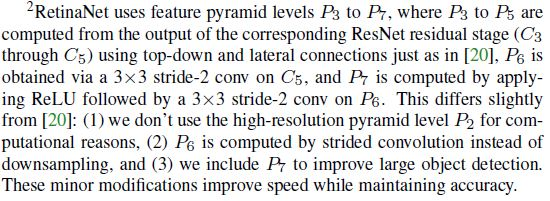

# Focal Loss for Dense Object Detection

Tsung-Yi Lin (Facebook AI Research (FAIR))

Priya Goyal (Facebook AI Research (FAIR))

Ross Girshick (Facebook AI Research (FAIR))

Kaiming He (Facebook AI Research (FAIR))

Piotr Doll´ar(Facebook AI Research (FAIR))

## Abstract

이 연구가 수행될 당시 가장 높은 정확도를 보이는 Object Detector는 R-CNN에 의해서 유명해진 Two-stage Detector이다. Two-stage Detector의 경우 이미지 안의 Object가 있을법한 위치의 후보 지역을 추려서 Classifier로 프로세스를 수행한다. 이와 반대로 One-stage Detector는 가능한 모든 지역을 꼼꼼하게 살펴보기 때문에 더 빠르고 정확하지만 Two-stage에 비해 정확도가 높지 않았다. 저자들은 이 연구에서 그 이유를 분석했다. 그래서 발견한 주요 이유는 One-stage Detector는 가능한 모든 지역을 살펴보기 때문에 훈련 과정 중에 Foreground-Background간에 클래스 불균형을 피할수 없기 때문이었다. 저자들은 이런 클래스 불균형 문제를 해결하기 위해서 표준 크로스 엔트로피 손실 계산 방법을 바꿔서 이미 잘 분류된 예제들(높은 확률로 Background라고 분류된 대부분의 Negative sample들)이 손실 계산에서 차지하는 비중을 줄일 수 있도록 했다. 즉, Background라고 분류하기 어려운 Negative들에 더 비중을 두고 많은 수를 차지하는 대부분의 쉬운 Negative가 손실에서 다른 손실을 압도하는 것을 막는다. 이 손실 방법을 검증하기 위해서 저자들은 간단한 Dense Detector를 디자인 하고 훈련시켰는데 저자들이 이 Dense Detector를 RetinaNet이라고 부른다. RetinaNet을 Focal Loss로 훈련시키면 One-stage의 속도를 보이면서 기존의 Two-stage Detector들의 정확도를 훨씬 상회한다고 한다. 

## Introduction

Two-stage Detector에서 첫번째 단계에서는 이미지 내에 객체가 있르법한 지역 후보를 추린다. 그리고 두 번째 단계에서는 CNN으로 각 지역 후보가 Foreground 클래스 중 하나인지 Background 클래스인지를 예측한다. Two-stage Detector가 COCO benchmark에서 SOTA를 차지 했었지만 저자들은 이와 반대로 One-stage Detector가 이와 비슷한 정확도를 가질 수 없는지 생각했다. One stage Detector들은 다양한 스케일과 종횡비를 가지는 객체의 각 위치에 적용되었다. 결론적으로 저자들은 One-stage Object Detector면서 FPN, Mask R-CNN, Faster R-CNN 계열의 알고리즘의 COCO AP 수준을 보이는 Detector를 만들어냈다고 주장한다.  저자들이 주목한 난제는 훈련 간에 One stage Detector에 내재되어 있는 클래스 불균형 문제이다. 

Two-stage Detector에서는 클래스 불균형 문제를 Two-stage Cascade와 Sampling Heuristics로 해결하려고 한다. 지역 후보 생성시에는 Selective Search, EdgeBoxes, DeepMask, RPN과 같은 방법을 적용하여 많은 지역 후보를 빠르게 적은 수로 줄인다. 이 과정에서 대부분의 Background Sample들은 거른다. 그 다음 분류 단계에서는 Foreground와 Background의 비율을 1:3으로 하는 등의 Sampling Heuristics나 Online Hard Example Mining(OHEM)이 Foreground와 Background 사이의 균형을 유지하기 위해서 수행된다. 

반대로 One-stage Detector들은 전 이미지에 걸쳐서 객체 후보가 될만한 지역을 처리한다. 실제로는 다양한 스케일과 종횡비를 고려해야 하기 때문에 100k의 지역을 처리해야 하기도 한다. Sampling Heuristics가 적용될 수는 있으나 쉬운 Background 샘플에 압도되어 비효율적이다. 이런 비효율성은 Bootstrapping이나 Hard Example Mining 같은 기술로 처리되기도 한다. 

 

이 연구에서는 새로운 손실 함수를 정의해서 기존과 다른 방식으로 클래스 불균형 문제를 해결하고자 했다. Figure 1을 보면 쉽게 Background로 판단되는 Example들의 확률이 높아질수록 Scaling Factor가 0으로 수렴하여 결국 손실이 거의 0이 되는 것을 확인할 수 있다(γ = 2일때 Well-classified example들의 Loss가 거의 0이 되는 것을 확인할 수 있다). 이렇게 Scaling Factor로 인해 자연스럽게 Background로 판단하기 어려운 Example들에 비중을 더 두게 된다. 저자들이 말하길 저자들이 정의한 Focal Loss가 꼭 위와 같을 필요는 없다고 한다. 

저자들은 Focal Loss의 효율성을 입증하기 위해서 RetinaNet이라고 하는 간단한 One Stage Object Detector를 디자인했는데 네트워크 안에서 Feature Pyramid를 적용했고 Anchor Box 개념을 도입했다. ResNet-101-FPN Backbone을 사용한 RetinaNet 모델은 COCO test-dev 셋에서 AP 39.1, 5 Fps의 성능을 달성했다고 한다. 

 

## Related Work

### Classic Object Detectors

이미지 격자에 촘촘하게 분류기를 적용하는 Sliding-window 방식은 꽤 오랫동안 연구가 수행되었다. 

- LeCun 등은 숫자 필기체를 인식하기 위해서 CNN을 적용했다.
  - Y. LeCun, B. Boser, J. S. Denker, D. Henderson, R. E. Howard, W. Hubbard, and L. D. Jackel. Backpropagation applied to handwritten zip code recognition. Neural computation 1989
  - R. Vaillant, C. Monrocq, and Y. LeCun. Original approach for the localisation of objects in images. IEE Proc. on Vision, Image, and Signal Processing, 1994
- Viola 와 Jones는 사람의 얼굴을 탐지하는데 Boosted Object Detector를 사용했다. 
  - P. Viola and M. Jones. Rapid object detection using a boosted cascade of simple features. In CVPR, 2001
- HOG와 Integral Channel Features는 보행자 탐지 영역에 효율적인 방법이 되었다. 
  - N. Dalal and B. Triggs. Histograms of oriented gradients for human detection. In CVPR, 2005
  - P. Doll´ar, Z. Tu, P. Perona, and S. Belongie. Integral channel features. In BMVC, 2009
- DPMs는 Dense Detector를 좀 더 광범위하게 Object 카테고리를 탐지할 수 있도록 했고 PASCAL에서 오랫동안 좋은 성능을 보였다.
  - P. F. Felzenszwalb, R. B. Girshick, and D. McAllester. Cascade object detection with deformable part models. In CVPR, 2010
  - M. Everingham, L. Van Gool, C. K. Williams, J. Winn, and A. Zisserman. The PASCAL Visual Object Classes (VOC) Challenge. IJCV, 2010

딥 러닝 붐이 다시 일어나기 시작하면서 Sliding-window 방식이 고전적인  컴퓨터 비전의 탐지 분야를 이끌다시피 했다. 

### Two-stage Detectors

당시에 주된 Object Detector 방법은 Two-stage Detection 방법이었다. 

- 첫 번째 단계에서 Selective Search와 같은 방법을 이용해서 객체가 포함되어 있을 법한 지역 후보를 생성하고 대다수의 Negative 샘플을 필터링한다. 그리고 나서 두 번째 단계에서 각 지역을 Foreground class나 Background로 분류한다. 

  - J. R. Uijlings, K. E. van de Sande, T. Gevers, and A. W. Smeulders. Selective search for object recognition. IJCV, 2013

- R-CNN은 두 번째 단계에서 분류기를 Convolution Network로 구성해서 큰 정확도를 얻었다. 

  - R. Girshick, J. Donahue, T. Darrell, and J. Malik. Rich feature hierarchies for accurate object detection and semantic segmentation. In CVPR, 2014

- R-CNN은 속도적인 측면에서 다음의 연구를 통해서 업그레이드되었다.

  - K. He, X. Zhang, S. Ren, and J. Sun. Spatial pyramid pooling in deep convolutional networks for visual recognition. In ECCV. 2014
  - R. Girshick. Fast R-CNN. In ICCV, 2015

- 또 R-CNN은 다음과 같이 객체 후보 생성에서도 학습이 가능한 방법을 적용해서 이점을 얻었다. 

  - D. Erhan, C. Szegedy, A. Toshev, and D. Anguelov. Scalable object detection using deep neural networks. In CVPR, 2014
  - P. O. Pinheiro, R. Collobert, and P. Dollar. Learning to segment object candidates. In NIPS, 2015
  - S. Ren, K. He, R. Girshick, and J. Sun. Faster R-CNN: Towards real-time object detection with region proposal networks. In NIPS, 2015

  특히 RPN은 지역 후보 생성 과정을 두 번째 분류기에 통합시켜서 Faster R-CNN Framework를 구성했다. 

- Faster R-CNN framework를 업그레이드 할 수 있도록 후속 연구들이 제안되었다. 

  - T.-Y. Lin, P. Doll´ar, R. Girshick, K. He, B. Hariharan, and S. Belongie. Feature pyramid networks for object detection. In CVPR, 2017
  - A. Shrivastava, A. Gupta, and R. Girshick. Training region based object detectors with online hard example mining. In CVPR, 2016
  - A. Shrivastava, R. Sukthankar, J. Malik, and A. Gupta. Beyond skip connections: Top-down modulation for object detection. arXiv:1612.06851, 2016
  - K. He, X. Zhang, S. Ren, and J. Sun. Deep residual learning for image recognition. In CVPR, 2016
  - K. He, G. Gkioxari, P. Doll´ar, and R. Girshick. Mask RCNN. In ICCV, 2017

### One-stage Detectors

- OverFeat은 딥러닝 네트워크에 기반한 초기 One-stage Object Detector 중 하나이다. 
  - P. Sermanet, D. Eigen, X. Zhang, M. Mathieu, R. Fergus, and Y. LeCun. Overfeat: Integrated recognition, localization and detection using convolutional networks. In ICLR, 2014
- SSD, YOLO는 속도에서는 강점을 보이지만 정확도는 Two-stage Detector를 따라가는 실정이다. 
  - W. Liu, D. Anguelov, D. Erhan, C. Szegedy, and S. Reed. SSD: Single shot multibox detector. In ECCV, 2016
  - C.-Y. Fu,W. Liu, A. Ranga, A. Tyagi, and A. C. Berg. DSSD: Deconvolutional single shot detector. arXiv:1701.06659, 2016
  - J. Redmon, S. Divvala, R. Girshick, and A. Farhadi. You only look once: Unified, real-time object detection. In CVPR, 2016
  - J. Redmon and A. Farhadi. YOLO9000: Better, faster, stronger. In CVPR, 2017
- Two-stage Detector의 입력 이미지 해상도를 줄이고 지역 후보 숫자를 줄이면 단순히 빠르게 만들 수는 있는데 반해 One-stage Detector는 훨씬 많은 Computing budget에도 불구하고 정확도 면에서 Two-stage를 따라가는 형국이라고 한다. 
  - J. Huang, V. Rathod, C. Sun, M. Zhu, A. Korattikara, A. Fathi, I. Fischer, Z. Wojna, Y. Song, S. Guadarrama, and K. Murphy. Speed/accuracy trade-offs for modern convolutional object detectors. In CVPR, 2017
- RetinaNet 디자인의 경우 기존의 Dense Detector의 특징과 유사하게 진행했다. 
  - RPN의 Anchor 개념 도입 : S. Ren, K. He, R. Girshick, and J. Sun. Faster R-CNN: Towards real-time object detection with region proposal networks. In NIPS, 2015
  - SSD와 같이 Feature Pyramids 적용: W. Liu, D. Anguelov, D. Erhan, C. Szegedy, and S. Reed. SSD: Single shot multibox detector. In ECCV, 2016
  - FPN: T.-Y. Lin, P. Doll´ar, R. Girshick, K. He, B. Hariharan, and S. Belongie. Feature pyramid networks for object detection. In CVPR, 2017

### Class Imabalance

Boosted Detector, DPMs, SSD 같은 One-stage Object Detection 방법들은 훈련 간에 큰 클래스 불균형 문제에 직면할 수 밖에 없다. 이런 탐지 방법들은 이미지 당 10^4-10^5개의 지역 후보를 검증하는데 그 중 소수만이 실제로 객체를 포함하고 있다. 이런 불균형은 두 가지 문제를 일으킨다. 

- 대부분의 Easy Negatives들은 학습에 그다지 도움이 되지 않음에도 불구하고 지역 후보의 상당 비중을 차지하기 때문에 훈련 방식이 비효율적이다. 
- Easy Negatives들이 손실에서 다른 손실을 압도해버리기 때문에 오히려 모델 성능을 떨어뜨린다. 

보통 해결 방법은 훈련 과정 중에 Hard Negative Mining을 수행하거나

- K.-K. Sung and T. Poggio. Learning and Example Selection for Object and Pattern Detection. In MIT A.I. Memo No. 1521, 1994
- P. Viola and M. Jones. Rapid object detection using a boosted cascade of simple features. In CVPR, 2001
- P. F. Felzenszwalb, R. B. Girshick, and D. McAllester. Cascade object detection with deformable part models. In CVPR, 2010
- A. Shrivastava, A. Gupta, and R. Girshick. Training regionbased object detectors with online hard example mining. In CVPR, 2016
- W. Liu, D. Anguelov, D. Erhan, C. Szegedy, and S. Reed. SSD: Single shot multibox detector. In ECCV, 2016

더 복잡한 Sampling/Reweighing 방법을 적용하는 것이다.

- S. R. Bulo, G. Neuhold, and P. Kontschieder. Loss maxpooling for semantic image segmentation. In CVPR, 2017

저자들은 이런 문제를 해결하면서 위와 같이 별도의 방법을 적용하는 것이 아니라 손실을 계산하는 방식을 바꿔서 클래스 불균형 문제를 해결하고자 했다.

### Robust Estimation

이상치가 손실에서 큰 비중을 차지 않도록 하는 Robust Loss Function을 제시한 연구도 있었다. 

- T. Hastie, R. Tibshirani, and J. Friedman. The elements of statistical learning. Springer series in statistics Springer, Berlin, 2008

그러나 이 연구에서는 이상치가 아니라 수는 많지만 쓸모 없는 Inliers가 손실에서 차지하는 비중을 줄이는 방식에 초점을 두었다. 

## Focal Loss

위의 Binary Cross Entropy Loss Function에서 y는 1, -1의 값을 갖는데 1은 Ground-truth class, -1은 그 밖의 class를 나타낸다. p는 0과 1사이의 값을 갖는데 y=1일때(즉, Ground-truth class일때) 모델이 측정한 그 클래스일 것 같은 확률을 나타낸다. 저자들은 위의 식은 표기 상의 편의를 위해서 아래와 같이 Pt를 정의하고 CE의 표기를 바꿨다. 

표준 CE Loss는 Figure 1에서 가장 위의 파란색 곡선으로 볼 수 있다. 이 표준 CE Loss의 한가지 특징은 Easy Sample(Pt > 0.5)이라도 무시할수 없는 규모의 손실을 일으킨다는 것이다. 이 작은 규모의 손실을 전체 Easy Sample의 갯수만큼 곱한다면 상대적으로 Rare Sample에 대한 손실을 압도해버릴 것이다. 

### Balanced Cross Entropy

클래스 불균형 문제를 처리하는 한 가지 방법은 class 1에 대해서 0과 1 사이의 값을 갖는 α라는 Weighting Factor를 도입하는 것이다(class -1에 대해서는 1 - α). 실제로 적용할 때 α는 클래스 객체 출현 빈도와 반대로 설정하거나 Cross validation에 의해 결정되는 Hyperparameter로서 설정할 수 있다. 저자들은 α-Balanced CE Loss를 다음과 같이 정의했다. 

### Focal Loss Definition

α가 Positive/Negative Example 사이의 중요도 밸런스를 조절할 수 있기는 하지만 Easy/Hard Example를 구분할 수는 없다. 그래서 저자즐은 Modulating Factor를 추가해서 Focal Loss를 정의했다. 

여기서 γ는 0보다 크거나 같다. Figure 1에 γ값이 0과 5 사이에 있을때 Focal Loss가 나타나 있다. 저자들은 Focal Loss의 두 가지 특성을 발견했다. 

- Example이 잘못 분류되었고 Pt가 작을때, Modulating Factor는 거의 1이 되기 때문에 Loss는 이 요소에 거의 영향을 받지 않는다. Pt가 1로 갈수록 Factor는 거의 0이 되기 떄문에 이미 잘 분류된 Sample에 대한 Loss는 Down-weighted된다. 
- Focusing Parameter γ는 Easy Sample이 Down-weighted될때 비율을 부드럽게 조정한다. γ=0일 때는 FL의 CE와 같다. γ가 증가할수록 Modulating Factor의 효과가 증가한다. 저자들은 γ=2일때 실험에서 가장 좋은 결과를 얻었다고 한다.

γ=2일 때 Pt=0.9로 분류된 Example은 CE와 비교해서 거의 100배 낮은 손실을 일으키고 거의 0.968일 때는 1000배 낮은 손실을 일으킨다. 

저자들은 다음과 같은 α-Balanced variant of the Focal Loss를 사용했다고 한다. 

a-Balanced가 그렇지 않을때보다 정확도가 약간 더 개선되었다고 한다. 그런데 Focal Loss의 정확한 형태는 그다지 중요한 것은 아니라고 한다. 

### Class Imbalance and Model Initialization

이진 분류 모델은 기본적으로 y가 -1 혹은 1이 되도록 출력하는 확률을 동일하도록 초기화된다. 이런 초기화 셋팅에서, 클래스 불균형이 존재할 경우 더 많은 클래스에 의한 손실이 전체 손실에서 비중을 많이 차지하기 때문에 초기 훈련 과정이 불안정하다. 그래서 저자들은 훈련 초기에 상대적으로 드물게 존재하는 Foreground 클래스에 대해 모델이 측정하는 p value에 대해서 Prior라는 개념을 도입했다고 한다. Prior를 π로 표시하고 모델이 측정한, Rare class Example를 위한 p를 낮게 한다(예를 들어 0.01정도). 이것은 손실 함수가 아니라 모델 초기화 설정에서의 변화이다. 저자들은 아주 심한 클래스 불균형이 있을때 Focal Loss나 Cross Entropy에 대한 훈련 안정성을 개선시켰다고 한다. 

### Class Imbalance and Two-stage Detectors

Two-stage Detector에서는 a-Balancing이나 Focal Loss가 없는 Cross Entropy Loss로 모델을 훈련시킨다. 대신에 클래스 불균형 문제를 두가지 방법으로 해결한다. 

- Two-stage cascade: First cascade stage에서는 거의 무한한 객체 후보 영역을 1~2k정도로 줄인다. 이때 선택되는 영역은 랜덤하게 선택되는 것이 아니라 정말로 객체가 있를법한 지역이 선택되는데 이때 대부분의 Easy Negative들이 필터링된다. 
- Biased minibatch sampling: Second Stage에서는 예를 들어 1:3의 비율로 Positive와 Negative Sample이 하나의 Minibatch를 형성하도록 Biased Sampling이 수행된다. 이것은 암시적으로 Sampling으로 구현된 α-Balancing Factor라고 볼 수 있다. 

저자들의 손실 함수는 One-stage Detection System에서 직접적으로 이런 매커니즘을 다루는 것이라고 한다. 

## RetinaNet Detector

RetinaNet은 단일의 통합된 네트워크이고 Backbone, Two Task-specific Subnetworks로 구성되어 있다. Backbone은 전체 이미지에서 Feature map을 계산하며 전체가 컨볼루션 네트워크이다. First Subnet은 Backbone의 출력 값에서 Object Classification을 수행한다. Second Subnet은 Backbone의 출력 값에서 Bounding Box Regression을 수행한다. 저자들은 두 Subnetworks를 One-stage, Dense Detection 방식으로 수행하기 위해서 최대한 간단하게 디자인했다고 한다(Two-stage Detector의 경우 여러가지 컴포넌트로 구성되어 있고 훈련도 복잡). 실험에서 보여준 것처럼 어떤 예측 값을 뽑아낼때 Design Parameter에는 그렇게 예민하지는 않다고 한다. 

### Feature Pyramid Network Backbone

저자들은 Backbone에 Feature Pyramid Network를 도입했다(Figure 3 a-b). FPN을 이용하면 단일 해상도 이미지에서, Top-down Pathway + Lateral Connection으로 Rich Semantics, Multi-scale Features를 얻을 수 있다. FPN에서 각 Stage는 다른 크기의 객체를 탐지하는 책임을 맡게 된다. FPN은 Fully Convolutional Networks이고 Multi-scale Prediction을 수행한다. 

저자들은 FPN을 ResNet 아키텍처에 적용했는데 P3부터 P7까지 Pyramid를 만들었다고 한다(각 Stage Pl은 입력 대비 2^l만큼 낮은 해상도를 갖는다). 모든 Pyramid Stage의 채널은 256이고 나머지 기존 FPN과의 차이점은 다음을 참고한다. 

 

저자들은 ResNet의 마지막 계층의 출력 값으로도 실험을 해봤는데 AP가 낮았다고 한다. 

### Anchors

저자들은 Translation-invariant Anchor box를 도입했다. Anchors는 P3부터 P7에서 32^2에서512^2의  크기를 갖는다. 각 Stage에서는 세 개의 종횡비를 고려한다({1:2, 1:1, 2:1}). 저자들은 여기에, 원래의 FPN보다 더 Denser Scale Coverage를 위해서 세 개의 종횡비 옵션에 각 Stage의 Anchors의 스케일과 관련되 옵션({2^0, 2^(1/3), 2^(2/3)} 배)을 추가했다. 그래서 각 Stage 마다 9개의 Anchors가 존재하고 입력 이미지에 대해서 총 32 - 813 pixels 범위를 커버한다. 

각 Anchor에는 K개의 Classification과 관련된 One-hot vector와 Box Regression과 관련된 4-Vector가 할당된다(여기서 K개는 클래스 숫자). 기본적으로 RPN에서의 Assignment Rule을 적용했지만 Multi-class Detection에 대해서는 Threshold를 조정했다. Ground-truth box와 IoU 0.5이상인 박스들을 그 객체 GT Box에 할당했고 0이상 0.4미만일 경우에는 Background로 할당했다. 각 Anchor는 최대 1개의 GT Box에 할당했고 K Label Vector에서 할당된 Label은 1 나머지는 0으로 설정했다. 만약에 Anchor가 0.4이상 0.5 미만이라 어디에도 할당되지 않는다면 그 Anchor는 훈련 간에 무시한다. Box regression은 각 Anchor와 할당된 Object Box 사이의 Offset을 계산하고 할당되지 않으면 무시한다.  

### Classification Subnet

Classification subnet은 K Object class에 대해서 각 Spatial position의 A Anchor 옵션을 고려하여 객체 존재 여부의 확률을 예측한다(각 Anchor box마다 K class의 객체가 있는지 없는지). Fully Convolutional Network이며 FPN의 각 Stage에 연결되어 있다. 모든 Stage는 이 Subnet을 공유한다. 각 Pyramid Stage에서 C Channel의 Feature map을 입력으로 받아서 3x3xC의 필터를 가지는 Convolution 계층을 통과시킨다. 이때 각 Convolution 계층에는 ReLU 비선형성이 추가된다. 마지막에는 3x3xKA의 필터를 가지는 Convolution 계층에서 연산을 수행하고 각 위치마다 K A의 binary prediction이 Sigmoid Activation을 통해서 수행된다.  저자들은 모든 실험에서 C=256, A=9를 적용했다고 한다. 

RPN과는 대조적으로 Object classification subnet이 더 깊고 3x3짜리 필터만 사용하며 Box regression subnet과 가중치를 공유하지 않는다. 

### Box Regression Subnet

Classification subnet과 병렬적으로 FPN의 각 Stage에는 FCN으로 구성되어 있는 Box regression subnet이 달려있다. 여기에서는 각 Anchor box에 GT box가 할당되어 있다면 Anchor box와 GT box 사이의 4가지 Offset에 대한 Regression을 수행한다. 구조는 Classification subnet과 상당히 유사한데 마지막에 Spatial location당 4A Linear output이 출력된다는 것만 다르다. 저자들은 다른 연구와는 다르게 Class-agnostic(클래스를 상관하지 않는) Bounding box regressor를 사용했는데 더 적은 파라미터를 가지면서 그렇지 않은 regressor와 동일하게 효과가 있다고 주장한다. 

### Interface and Training

#### Inference

RetinaNet은 Figure 3와 같이 하나의 단일한 FCN으로 구성되어 있다. 그렇기 때문에 추론시에는 단순히 이미지를 Forwading 하기만 하면 된다. 속도를 개선하기 위해서 이때는 Detector Confidence Threshold 0.05를 기준으로 각 FPN Stage에서 가장 점수가 높은 1k의 box prediction만 수행했다. 이 Prediction들을 모아서 NMS Threshod 0.5를 수행해서 최종 탐지 결과를 도출한다. 

#### Focal Loss

저자들은 Focal Loss를 Classification subnet의 출력의 Loss로서 적용했다. γ=2일때 제일 성능이 좋지만 0.5이상 5이하일때도 준수한 성능을 보인다. RetinaNet을 훈련시킬때 각 샘플 이미지당 100k에서 모든 Anchor에 Focal Loss가 적용되는데 이는 기존의 Heuristic Sampling이나 Hard Example Mining이 각 MiniBtach마다 Anchor를 선택한 것과는 대조적이다. 이미지 당 총 Focal Loss는 Anchor 박스의 모든 Loss를 합한다음 GT box가 할당된 Anchor 박스 숫자로 정규화한다. 총 Anchor 박스 숫자로 정규화하지 않는 이유는 여기서 발생되는 Loss는 보잘것 없는 Loss이기 때문이다(Easy Sample). Rare class의 비중을 위한 α의 경우 γ를 고려하여 선택해야 한다(Table 1 a, b 참조).  γ가 증가하면 α는 약간 감소하는 형태가 좋다(γ = 2, α = 0.25가 베스트).

#### Initialization

저자들은 실험을 진행할때 ResNet50-FPN과 ResNet101-FPN backbone을 사용했다. 각 backbone은 ImageNet 1k에서 미리 훈련된 모델을 사용했다. FPN을 위해서 새롭게 추가된 계층은 오리지널 FPN 연구에서와 같이 초기화 되었다. RetinaNet의 Subnet에서 마지막 계층을 제외하고 나머지 계층은 bias b = 0, Gaussian weight σ = 0.01의 분포를 따르는 값으로 초기화 되었다. Classification subnet의 마지막 계층의 bias b는 다음과 같은 식으로 최기화 되었다.

 

여기서 π는, 훈련을 시작할 때, 모든 Anchor가 Foreground class에 대한 Confidence ~π로 레이블링 되어야 하는데 이때 쓰는 값이다. 저자들은 실험에서 π = 0.01로 설정했다.  이런 초기화 방법이 훈련을 시작할때 훈련을 불안정하게 만드는 많은 Background Anchor에 의한 큰 손실 값을 억제한다. 

#### Optimization

RetinaNet을 훈련시킬때 Synchronized SGD로 훈련시켰는데 8대의 GPU에 대해 GPU당 이미지 2장을 해서 미니배치당 총 16장의 이미지를 훈련시켰다. 특별히 언급하지 않는 이상 모든 모델은 Learning Rate 0.01에서 시작해서 90k iteration만큼 훈련이 진행되는데 60k에서 10으로 나눠지고 80k에서 다시 한번 나눠진다. Horizontal flipping을 데이터 어그멘테이션을 위해 적용했다. Weight decay는 0.0001, momentum은 0.9를 적용했다. Box regression의 손실 계산에서는 Focal Loss와 Standard Smooth L1 Loss의 합을 이용했다. 훈련 시간은 10\~35시간 정도 걸린다.

## Experiments

저자들은 COCO benchmark로 Bounding box detection의 실험 결과를 제시했다. 훈련 과정에서는 COCO trainval35k(80k의 train + 40k 중 35k의 랜덤 부분 집합의 val)를 사용했고 검증에는 minval(val의 남아있는 5k)를 사용했으며 최종 결과를 도출할떄는 test-dev를 사용했다. 

### Training Dense Detection

 저자들은 여러 Optimization strategies와 Focal Loss 간의 상관 관계에 대한 실험을 진행했다. 모든 실험에는 ResNet50 or ResNet101에 FPN을 적용한 Backbone을 사용했고 훈련과 테스트 시에 600 pixels의 이미지를 사용했다. 

#### Network Initialization

저자들이 했던 첫 번쨰 실험은 Standard Cross Entropy(CE)만 적용하고 다른 전략은 사용하지 않는 것이었다. 이렇게 했더니 훈련 간에 빠르게 성능이 분화하면서 실패했다. 그러나 단순히 네트워크의 마지막 계층을 초기화 해서 object를 탐지하는 선행 확률 (모든 Anchor가 Foreground class에 대한 Confidence ~π로 레이블링 되어야 하는데 이때 쓰는 값이다.) π = 0.01로 하기만 해도 비교적 효과적인 학습이 가능했다고 한다. ResNet-50을 쓴 RestinaNet의 이 방법에서는 COCO 30.2 AP의 성능을 보였고 π에 성능이 민감하지 않았으므로 저자들은 모든 실험에서 π = 0.01를 적용한다. 

#### Balanced Cross Entropy

다음으로 저자들은 α-balanced CE Loss를 적용한 실험을 했는데 각 α에 대한 결과는 Table 1 a에 나와 있다. α = 0.75가 AP를 0.9 올려줘서 가장 좋은 성능 향상을 보였다고 한다. 

#### Focal Loss

Focal Loss를 사용한 결과는 Table 1 b에 나와 있다. γ는 Modulating term의 강도를 조절하는데 0이 되면 CE Loss와 같아진다.  Figure 1에 나와 있는 것처럼 γ가 증가할수록 Easy example의 Loss가 더 적어지게 된다. 저자들은 γ = 2일때 α-balanced CE Loss에 비해 2.9 AP 향상됨을 확인했다. 

Table 1 b에 각 γ에 대해서 가장 좋은 α 값이 무엇인지 나와 있다. 저자들은 높은 γ에 대해서 낮은 α가 어울리는 것을 확인했다(Easy sample들의 비중이 적어질수록 Positive 샘플에 대한 강조를 덜 할 필요가 있음). 전체적으로 γ가 변하는 정도에 따른 이점이 훨씬 큰 것을 확인했다. α 값을 0.01이상 0.999이하에서 테스트했을때 0.25이상 0.75이하의 범위의 성능이 준수했다. 저자들은 모든 실험에서 γ = 2.0에 α = 0.25로 실험을 진행했다. 

#### Analysis of the Focal Loss

Focal Loss를 더 상세히 분석하기 위해서 저자들은 성능이 수렴한 모델을 대상으로 이 모델의 손실에 대한 Empirical Distribution을 분석했다. 이를 위해서 ResNet-101 600-pixel 모델을 γ = 2로 훈련시켰다(36.0 AP). 많은 수의 랜덤 이미지에 대해서 10^7까지의 Negative windows와 10^5까지의 Positive windows에 대한 예측 확률들을 샘플링했다. 그리고 나서 각각 이 샘플들에 대한 Focal Loss를 계산하고 합이 1이 되도록 정규화 했다. 정규화된 손실에 대해서는 각기 다른 γ에 대해서(비록 2로 훈련시키기는 했어도) Postive, Negative에 대한 Loss를 오름차순으로 정렬하여 누적 분포 함수를 그렸다. 누적 분포 함수는 아래와 같다. 

Positive sample의 경우 γ 값의 따른 변화가 그리 크지 않음을 확인할 수 있다. 예를 들어서 대락 20%의 Hardest positive sample들이 Positive Loss의 거의 절반을 차지하는데  γ가 증가할수록 이 20%에 Loss가 더 집중되기는 하지만 효과는 미미하다. 

그러나 Negative sample에 대한 γ 값의 효과는 확연히 다르다. γ = 0일떄는 Positive일때와 비슷하지만 γ가 증가할수록 Hard negative example들이 확연히 많은 비중을 차지한다. γ = 2일때(기본 셋팅) 많은 손실이 전체 샘플의 적은 부분에서 기인한다. 이를 통해서 알 수 있는 점은 Focal Loss가 Easy Negative의 효과를 줄이고 Hard Negative에 초점을 두게 한다는 것이다. 

#### Online Hard Example Mining (OHEM)

OHEM은 Two-stage Detector를 훈련시키는 방식을 개선하기 위해서 제안되었는데 High-loss example들로 미니배치를 구성한다. OHEM은 각 샘플들을 손실에 따라 점수를 부과하고 NMS을 적용한다. 그러면 미니배치는 High-loss의 샘플들로 구성되게 된다. NMS Threshold와 배치 사이즈는 조정가능한 매개변수이다. Focal Loss와 비슷하게 OHEM도 Misclassified Example를 좀 더 강조하지만 차이점이 있다. OHEM은 Easy Sample들을 그냥 버린다. 저자들은 SSD에서 OHEM의 변형체를 구현했다. NMS를 적용한 뒤에 Positive와 Negative의 비율을 1:3이 되도록 미니배치를 구성했다. 

저자들은 원래의 OHEM과 OHEM의 변형체를 저자들의 One-stage detection 셋팅에도 적용했는데 큰 클래스 불균형을 보였다. 이 두 전략에 대해서 배치 사이즈와 NMS Threshold 값의 변화에 대한 결과는 Table 1 d에 나와 있다. ResNet 101에서 실험을 진행했는데 Focal Loss로 진행했을때는 36.0 AP를 보였고 가장 좋은 성능의 OHEM(1:3 비율 없이, 배치 사이즈 128, NMS 0.5)은 32.8 AP를 보였다. 저자들이 주장하길 이는 Focal Loss가 OHEM보다 Dense Detector를 훈련시키는데는 더 효율적임을 입증하는 것이라고 한다. 

#### Hinge Loss

마지막으로 저자들은 실험 초기에 pt에 대해서 Hinge Loss를 적용하여 실험을 시도했다. 이는 pt의 특정 값 이상에는 Loss를 0으로 만드는 것이다. 그러나 저자들이 말하길 이 방식은 훈련 과정이 불안정하고 의미 있는 결과를 얻지 못했다고 한다. 

### Model Architecture Design

#### Anchor Density

One-stage detection 시스템에서 중요하게 생각해봐야할 점은 어떻게 가능한 이미지 공간을 촘촘하게 다루를 것인가이다. Two-stage detector들은 Region Pooling Operation을 통해서 이미지 내 임의의 위치의 다양한 크기와 종횡비에서의 상자를 분류할 수 있다. 반대로, One-stage detector들은 고정된 숫자의 샘플링 격자를 사용하기 때문에 이를 위해서 여러 Anchor 박스를 사용하는 접근법을 쓴다. 

저자들은 FPN의 각 Stage의 이미지의 각 위치에서 사용되는 Anchor의 크기와 종횡비의 옵션 숫자를 살펴봤다.  각위치에서 단일 옵션을 사용할 때와 4개의 스케일과 3개의 종횡비를 사용하여 총 12개의 옵션을 사용했을때의 경우를 살펴봤다. ResNet50을 사용한 결과가 Table 1 c에 나와 있다. 단일 옵션도 좋은 성능을 내지만 3개의 스케일과 3개의 종횡비를 사용할때 4 point 정도 성능이 개선되었다. 저자들은 모든 실험에서 이 옵션 방법을 적용했다고 한다.  

6-9개 이상의 Anchor 박스를 사용하는 것은 큰 효과를 보지 못했다. 

#### Speed versus Accuracy

큰 Backbone은 더 높은 정확도를 보이지만 추론 속도가 더 느리다. 입력 이미지 크기도 마찬가지이다. Table 1에 앞의 두 요소에 대한 실험 결과가 나와 있다. Figure 2를 보면 RetinaNet과 Focal Loss가 당시 현존하는 모든 방법보다 성능이 좋은 것을 학인할 수 있다. 저자들은 더 큰 스케일을 사용해도 RetinaNet이 모든 Two-stage 방식을 정확도에서 압도하고 속도도 빠르다고 주장했다. 

### Comparison to State of the Art

COCO dataset의 test-dev 셋으로 실험한 결과는 RetinaNet-101-800 모델(Scale jittering 적용)의 경우 Table 2에나와 있고 1.5배 정도 더 긴 모델은 Table 1 e에 나와 있다.  

## Conclusion

저자들은 One-stage Detection 방법에서 클래스 불균형 문제가 성능을 내는데 큰 문제임을 확인했다. 이 문제를 해결하기 위해서 Hard Negative 샘플들에 집중하기 위한, CE Loss에 Modulating Term을 적용해서 저자들이 새롭게 고안해낸 Focal Loss를 제인했다. 저자들이 이 개념의 효율성을 증명하기 위해서 FCN으로 되어 있는 One-stage detector를 디자인하고 여러 실험을 실시했다. 

