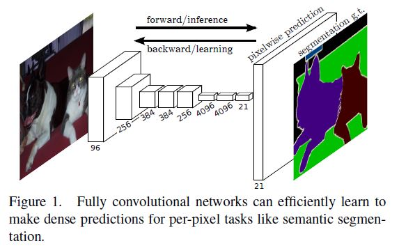
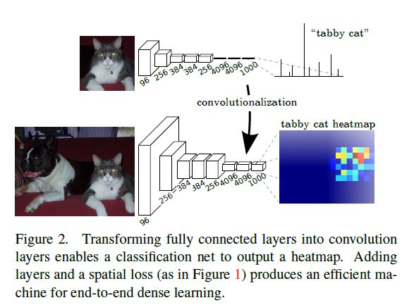
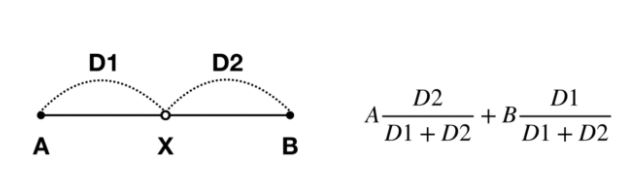
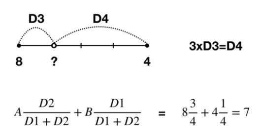
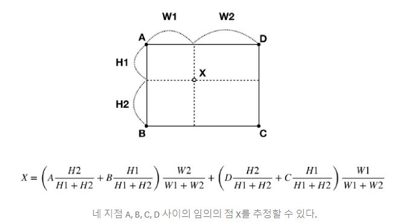
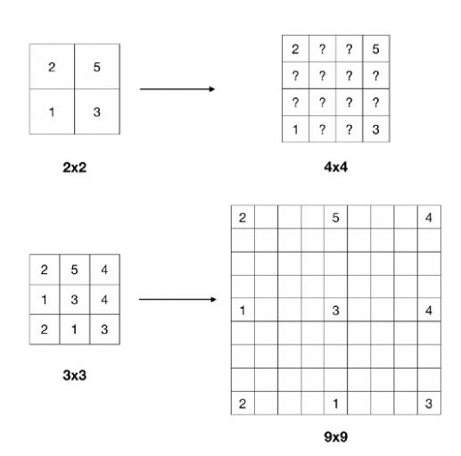
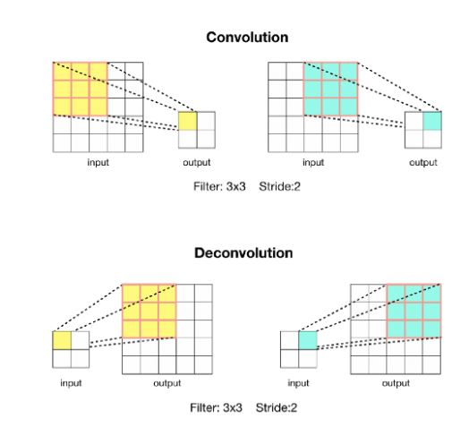
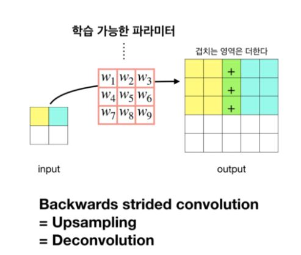
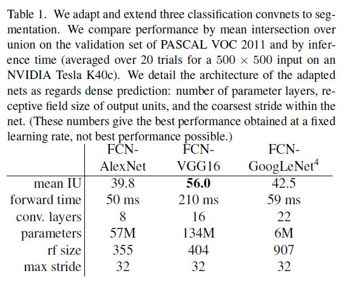

# Fully Convolutional Networks for Semantic Segmentation

Jonathan Long, Evan Shelhamer, Trevor Darrell(UC Berkeley)

저자들의 목적은 종단간의 훈련이 가능한, 픽셀을 입력으로 받아 픽셀을 예측하는 Semantic segmentation의 방법론을 제안함. 이때 입력으로 받는 이미지는 임의의 사이즈이고 출력도 그에 해당하는 사이즈임. 특징 추출을 위한 CNN 아키텍처로 AlexNet, VGGnet, GoogLeNet을 사용하고 SS하기 위한 Fine-tuning을 진행함. 그리고 얕은 층의 미세한 정보와 깊은 층의 컨텍스트 정보를 결합하여 정확도를 더 올리고자 했음.  이를 위해서 네트워크 안의 공간 정보를 없애는 완전 연결 계층을 컨볼루션 계층으로 대체하고 사이즈를 줄이면서 특징을 추출하는 Down-sampling 대신 해상도를 다시 키우는 Up-sampling을 수행함. Up-sampling에서 나온 출력 크기에 해당하는 Down-sampling 계층에서의 결과를 요소별 덧셈으로 더하는 Skip-connection을 적용함.  

R-CNN과 같이 네트워크를 역할별로 파트를 나눠서 따로 따로 훈련을 진행하기보다는 분류 작업을 수행하는 아키텍처를 직접적으로 픽셀에 대한 예측값으로 출력할 수 있도록 아키텍처를 변경했다고 함.

앞에서 언급한대로 공간 정보를 잃어버리고, 입력의 크기가 정해지게 되는 완전 연결 계층 대신에 컨볼루션 계층을 사용하면 입력 데이터의 어떤 부분에 대한 특징 맵을 출력하는, 공간 정보도 유지하면서 임의의 입력 이미지를 입력으로 받을 수 있는 네트워크를 구축할 수 있음. 

Input shifting과 output interlacing은 보간법 없이 Coarse한 Information에서 원래 입력 크기만큼의 예측을 만들어 낼 수 있는 트릭이다. 이에 대해서는 다음을 참고.

- P. Sermanet, D. Eigen, X. Zhang, M. Mathieu, R. Fergus, and Y. LeCun. Overfeat: Integrated recognition, localization and detection using convolutional networks. In ICLR, 2014.

FCN에서 Coarse한 특징 맵에서 Dense prediction을 생성해내기 위해서 Bilinear interpolation, Backwards convolution 두 가지 개념을 사용했다고 한다. 

[FCN 논문 리뷰 — Fully Convolutional Networks for Semantic Segmentation-강준영]( https://medium.com/@msmapark2/fcn-%EB%85%BC%EB%AC%B8-%EB%A6%AC%EB%B7%B0-fully-convolutional-networks-for-semantic-segmentation-81f016d76204)

위 사이트에서의 Bilinear Interpolation에 관한 일부 내용

| 1차원의 Linear interpolation                                 |                                                              |
| ------------------------------------------------------------ | ------------------------------------------------------------ |
|  |  |

| 2차원의 Bilinear interpolation                               |                                                              |
| ------------------------------------------------------------ | ------------------------------------------------------------ |
|  |  |

Backwards convolution에 관한 내용

|  |
| ------------------------------------------------------------ |
|  |

저자들은 다음과 같이 ILSVRC Classifier들을 FCN에 맞게 변경했다. 

